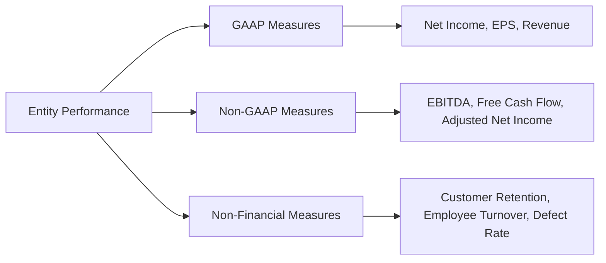
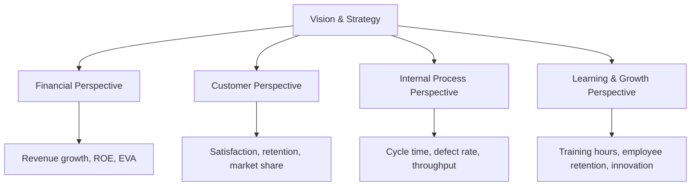
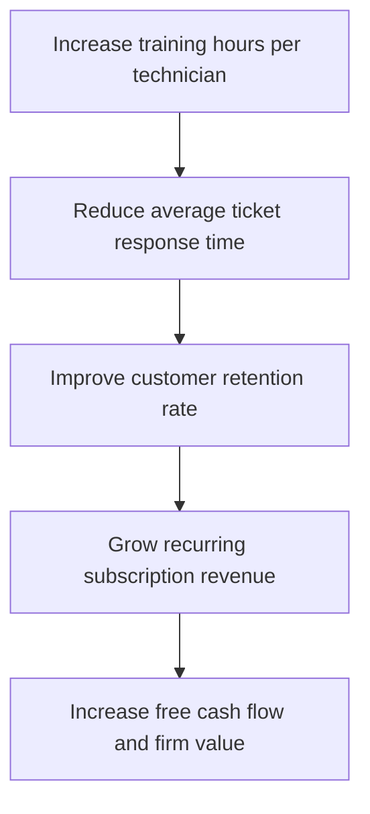

# Non-Financial and Non-GAAP Measures of Performance

GAAP financial statements provide a standardized view of an entity's economic activity, but they do not capture every dimension of performance. Non-GAAP financial measures and non-financial metrics fill critical gaps—revealing cash-generation capacity, operational efficiency, customer loyalty, and strategic progress that traditional statements may obscure.

:::info[Why This Matters]

The BAR section expects you to **identify, calculate, and interpret** non-financial and non-GAAP measures. You must also understand their limitations, know when benchmarking is appropriate, and be able to construct a balanced scorecard that ties financial outcomes to the operational drivers behind them.

:::

---

## Why Non-Financial and Non-GAAP Measures Matter

Financial statements prepared under GAAP are governed by recognition and measurement rules that can mask underlying performance. For example:

- **Depreciation methods** affect reported income but not cash flow.
- **One-time charges** (restructuring, litigation) distort period-over-period comparisons.
- **Intangible drivers**—brand strength, employee expertise, process quality—never appear on the balance sheet.

Non-GAAP and non-financial measures address these gaps by giving analysts, investors, and management a more complete picture of an entity's performance, risk profile, and strategic health.

---

## Non-GAAP Financial Measures

Non-GAAP measures adjust GAAP results to highlight recurring operating performance or cash-generating ability. The most common measures tested on the CPA exam are summarized below.

| Measure | Starting Point | Key Adjustments |
|---|---|---|
| EBITDA | Net Income | + Interest + Taxes + Depreciation + Amortization |
| Adjusted EBITDA | EBITDA | ± Non-recurring items (restructuring, litigation, stock-based comp) |
| Free Cash Flow (FCF) | Operating Cash Flow | − Capital Expenditures |
| Core Earnings | Net Income | − Non-recurring gains + Non-recurring losses |
| Adjusted Net Income | Net Income | ± Non-recurring items (after-tax) |
| Same-Store Sales | Prior-period revenue of comparable locations | Change in revenue for stores open in both periods |

### EBITDA

EBITDA strips out financing decisions (interest), tax jurisdictions (taxes), and non-cash allocation methods (depreciation and amortization) to approximate **operating cash-generating capacity**.

$$
\text{EBITDA} = \text{Net Income} + \text{Interest Expense} + \text{Income Tax Expense} + \text{Depreciation} + \text{Amortization}
$$

**Example — Bear Co.:**

| Item | Amount |
|---|---|
| Net Income | $240,000 |
| Interest Expense | $30,000 |
| Income Tax Expense | $60,000 |
| Depreciation | $45,000 |
| Amortization | $15,000 |
| **EBITDA** | **$390,000** |

:::tip[Exam Tip]

EBITDA is **not** a GAAP measure and is **not** a substitute for operating cash flow. It ignores working-capital changes, capital expenditures, and debt repayments. Always reconcile back to the nearest GAAP measure when presented with EBITDA data.

:::

### Adjusted EBITDA

Management often presents "Adjusted EBITDA" that further removes items it considers non-representative—such as stock-based compensation, restructuring charges, or acquisition-related costs.

**Example — Bear Co.:**

| Item | Amount |
|---|---|
| EBITDA | $390,000 |
| Add: Restructuring charges | $50,000 |
| Add: Stock-based compensation | $25,000 |
| **Adjusted EBITDA** | **$465,000** |

:::warning

Adjusted EBITDA gives management significant discretion over what to exclude. Analysts must scrutinize the reconciliation to determine whether excluded items are truly non-recurring or whether they represent ongoing costs repackaged as one-time events.

:::

### Free Cash Flow (FCF)

Free cash flow measures the cash available to debt and equity holders after the entity has maintained or expanded its asset base.

$$
\text{FCF} = \text{Cash Flow from Operations} - \text{Capital Expenditures}
$$

**Example — Polar Inc.:**

| Item | Amount |
|---|---|
| Cash Flow from Operations | $520,000 |
| Capital Expenditures | $(180,000) |
| **Free Cash Flow** | **$340,000** |

FCF is widely used in valuation models (DCF analysis) and dividend sustainability assessments.

### Core Earnings and Adjusted Net Income

- **Core earnings** remove gains and losses that are non-recurring—such as asset sale gains, impairment charges, and litigation settlements—to reveal the entity's sustainable earning power.
- **Adjusted net income** similarly backs out non-recurring items on an **after-tax** basis, providing a normalized bottom-line figure.

**Example — BIF Partners:**

| Item | Amount |
|---|---|
| GAAP Net Income | $180,000 |
| Less: Gain on sale of subsidiary (after tax) | $(45,000) |
| Add: Restructuring charge (after tax) | $20,000 |
| **Adjusted Net Income** | **$155,000** |

### Same-Store Sales (Comparable-Store Sales)

Same-store sales measure revenue growth only for locations open during **both** the current and prior periods. This metric isolates organic growth from growth achieved by opening new locations.

$$
\text{Same-Store Sales Growth} = \frac{\text{Current Period Comparable Revenue} - \text{Prior Period Comparable Revenue}}{\text{Prior Period Comparable Revenue}} \times 100
$$

---

## SEC Regulations on Non-GAAP Measures

Public companies that present non-GAAP measures must comply with **Regulation G** and **Item 10(e) of Regulation S-K**.

| Requirement | Description |
|---|---|
| **Reconciliation** | A quantitative reconciliation from the non-GAAP measure to the most directly comparable GAAP measure must be provided. |
| **Equal or Greater Prominence** | The GAAP measure must be presented with equal or greater prominence than the non-GAAP measure. |
| **No Misleading Adjustments** | Companies may not exclude charges or liabilities that require cash settlement, or adjust revenue recognition beyond GAAP. |
| **Labeling** | Non-GAAP measures must not use titles that could be confused with GAAP measures. |

:::info

The SEC does **not** prohibit non-GAAP measures. Instead, it requires transparency so that investors can evaluate the adjustments management has made and form their own conclusions.

:::

---

## Non-Financial Measures of Performance

Non-financial measures capture operational, customer, and human-capital dimensions that financial data alone cannot reflect. These leading indicators often predict future financial performance.

### Common Non-Financial Measures

| Category | Measure | Formula / Description |
|---|---|---|
| **Customer** | Customer Retention Rate | $((\text{End Customers} - \text{New Customers}) \div \text{Start Customers}) \times 100$ |
| **Customer** | Net Promoter Score (NPS) | % Promoters − % Detractors (scale 0–10 survey) |
| **Employee** | Employee Turnover Rate | $\text{Separations} \div \text{Average Headcount} \times 100$ |
| **Productivity** | Labor Productivity Rate | $\text{Output (units or revenue)} \div \text{Labor Hours}$ |
| **Service** | Ticket Response Time | Average time from customer inquiry to first response |
| **Quality** | Defect Rate | $\text{Defective Units} \div \text{Total Units Produced} \times 100$ |

### Worked Example — Kingfisher Industries

Kingfisher Industries tracks the following metrics for Q1:

| Metric | Value |
|---|---|
| Customers at start of Q1 | 2,000 |
| New customers acquired in Q1 | 350 |
| Customers at end of Q1 | 2,150 |
| Employee separations in Q1 | 18 |
| Average headcount in Q1 | 200 |
| Units produced in Q1 | 50,000 |
| Labor hours in Q1 | 25,000 |
| Defective units in Q1 | 750 |

**Customer Retention Rate:**

$$
\text{Retention Rate} = \frac{2{,}150 - 350}{2{,}000} \times 100 = \frac{1{,}800}{2{,}000} \times 100 = 90\%
$$

**Employee Turnover Rate:**

$$
\text{Turnover Rate} = \frac{18}{200} \times 100 = 9\%
$$

**Labor Productivity Rate:**

$$
\text{Productivity} = \frac{50{,}000}{25{,}000} = 2.0 \text{ units per labor hour}
$$

**Defect Rate:**

$$
\text{Defect Rate} = \frac{750}{50{,}000} \times 100 = 1.5\%
$$

:::note

A declining retention rate or rising turnover rate often foreshadows declining revenue and rising recruitment costs—making these metrics valuable **leading indicators** of future financial performance.

:::

---

## The Balanced Scorecard

The **Balanced Scorecard** (BSC), developed by Kaplan and Norton, translates an organization's strategy into measurable objectives across **four perspectives**. It prevents management from focusing on financial results to the exclusion of the operational drivers that produce those results.

### The Four Perspectives

| Perspective | Key Question | Example Objectives | Example Measures |
|---|---|---|---|
| **Financial** | How do we look to shareholders? | Increase profitability; improve capital efficiency | ROE, EBITDA margin, FCF growth |
| **Customer** | How do customers see us? | Improve satisfaction; grow market share | NPS, retention rate, on-time delivery % |
| **Internal Process** | What must we excel at? | Reduce defects; shorten cycle times | Defect rate, order fulfillment time, process cost |
| **Learning & Growth** | Can we continue to improve and create value? | Develop talent; foster innovation | Training hours per employee, turnover rate, patents filed |

### Balanced Scorecard Example — Illini Entertainment

Illini Entertainment sets the following strategic targets for the year:

| Perspective | Objective | Measure | Target | Actual | Status |
|---|---|---|---|---|---|
| Financial | Grow revenue | Revenue growth % | 12% | 14% | ✅ Met |
| Financial | Improve cash generation | Free cash flow | $2.0M | $1.8M | ❌ Missed |
| Customer | Raise loyalty | Customer retention rate | 92% | 90% | ❌ Missed |
| Customer | Improve responsiveness | Avg. ticket response time | < 4 hrs | 3.5 hrs | ✅ Met |
| Internal Process | Reduce errors | Defect rate | < 1.0% | 0.8% | ✅ Met |
| Learning & Growth | Develop employees | Training hours per employee | 40 hrs | 35 hrs | ❌ Missed |

Although Illini Entertainment **exceeded** its revenue target, the scorecard reveals underlying weaknesses: missed FCF, declining retention, and underinvestment in employee development. Without the balanced scorecard, management might have focused only on the strong revenue headline.

:::tip[Exam Tip]

When a question presents a balanced scorecard, look for **conflicting signals** across perspectives. The exam often tests whether you can identify that strong financial results may mask deteriorating customer or process metrics.

:::

---

## Benchmarking

Benchmarking is the systematic comparison of an entity's performance metrics against a reference point—either its own historical results or those of external peers.

### Types of Benchmarking

| Type | Description | Example |
|---|---|---|
| **Internal Benchmarking** | Compares performance across divisions, locations, or time periods within the same entity. | Illini Security compares ticket response times across its East, Central, and West regions. |
| **External (Competitive) Benchmarking** | Compares the entity's metrics to those of direct competitors or industry averages. | Bear Co. compares its EBITDA margin to the industry median of 22%. |
| **Functional Benchmarking** | Compares a specific function or process to best-in-class performers, even outside the entity's industry. | Polar Inc. studies Amazon's warehouse fulfillment processes to improve its own logistics. |

### Competitor Analysis Process

**Example — Bear Co. vs. Industry:**

| Metric | Bear Co. | Industry Median | Gap |
|---|---|---|---|
| EBITDA Margin | 19.5% | 22.0% | −2.5 pp |
| Customer Retention | 88% | 91% | −3.0 pp |
| Employee Turnover | 14% | 10% | +4.0 pp |
| Defect Rate | 2.1% | 1.4% | +0.7 pp |

Bear Co. underperforms the industry across all four metrics. The elevated turnover rate likely contributes to both the higher defect rate (less experienced workforce) and lower retention (inconsistent service quality). Management should prioritize workforce-stability initiatives before expecting improvements in other areas.

:::note

When benchmarking externally, ensure that **accounting policies**, **business models**, and **geographic mix** are sufficiently comparable. A difference in depreciation methods or revenue recognition timing can make a profitable company appear weaker than its peers—or vice versa.

:::

---

## Integrating Non-Financial and Non-GAAP Measures into Decision-Making

The greatest value of these measures emerges when they are **linked together** in a cause-and-effect chain. The balanced scorecard provides the framework, and benchmarking provides the external context.

**Example cause-and-effect chain — Illini Security:**

By tracing from learning and growth through internal processes and customer outcomes to financial results, management can identify **which operational levers** have the highest strategic impact and allocate resources accordingly.

| Decision Context | Useful Measures |
|---|---|
| Evaluate acquisition target | EBITDA, Adjusted EBITDA, FCF, customer retention |
| Assess operational efficiency | Labor productivity, defect rate, cycle time |
| Monitor strategic execution | Balanced scorecard with targets vs. actuals |
| Compare to peers | Benchmarked EBITDA margins, turnover rates, NPS |
| Evaluate dividend sustainability | FCF relative to dividend payments |

---

## Limitations and Risks of Non-GAAP Measures

While valuable, non-GAAP measures carry significant risks that analysts and exam candidates must understand.

| Limitation | Explanation |
|---|---|
| **Lack of standardization** | There is no single definition of EBITDA or adjusted net income—each company defines its own adjustments, making comparisons difficult. |
| **Management bias** | Companies may cherry-pick which items to exclude, painting an overly favorable picture of performance. |
| **Exclusion of real costs** | Stock-based compensation and restructuring charges consume real economic resources, even if management labels them "non-recurring." |
| **Ignoring capital intensity** | EBITDA ignores depreciation, which represents the real economic cost of asset consumption. Capital-intensive businesses may appear far more profitable on an EBITDA basis than their cash flows support. |
| **Not audited** | Non-GAAP measures are not subject to the same audit scrutiny as GAAP financial statements. |
| **Distraction from GAAP results** | Over-reliance on non-GAAP measures may cause stakeholders to overlook deteriorating GAAP performance. |

:::caution

If a company's GAAP net income is declining while its adjusted EBITDA is rising, always investigate the **nature and frequency** of the excluded items. Recurring "non-recurring" adjustments are a red flag that management may be using non-GAAP measures to mask deteriorating fundamentals.

:::

---

## Exam Tips

:::tip[CPA Exam Strategy]

1. **Know the formulas.** Be prepared to calculate EBITDA, FCF, retention rate, turnover rate, labor productivity, and defect rate from raw data.
2. **Reconcile back to GAAP.** When given a non-GAAP figure, always identify the nearest GAAP measure and trace the adjustments.
3. **Read the scorecard holistically.** Don't stop at the financial perspective—look for warning signs in customer, process, and learning metrics.
4. **Question "adjusted" figures.** Ask whether excluded items are truly one-time or whether they recur each period.
5. **Match the measure to the decision.** FCF is ideal for valuation and dividend analysis; EBITDA is useful for comparing operating performance across entities with different capital structures.
6. **Normalize before benchmarking.** Ensure comparability by adjusting for differences in accounting policies, size, and business mix.

:::
