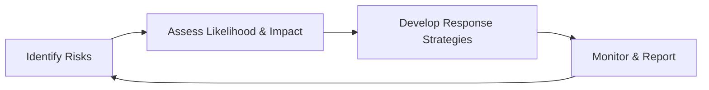
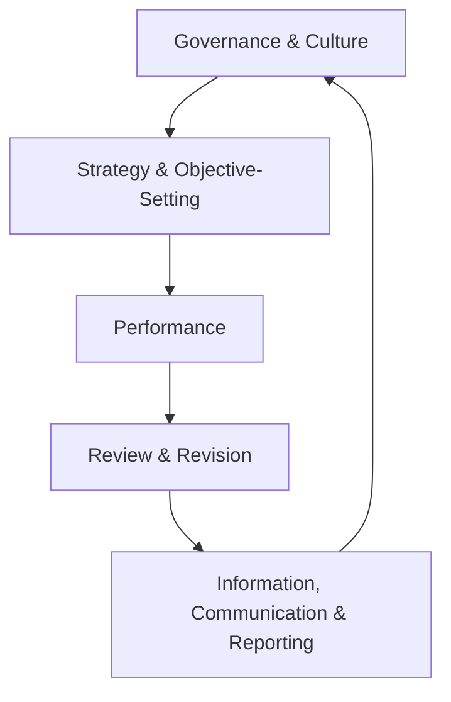
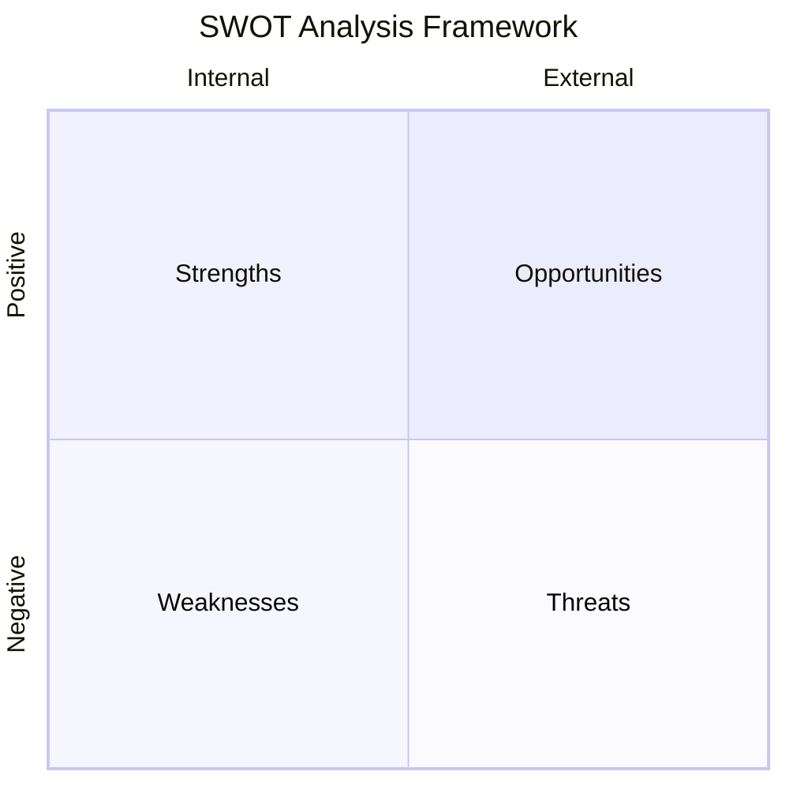

# Risk Management

Risk management is the process of identifying, assessing, and responding to events that could affect an entity's ability to achieve its objectives. Every business faces a spectrum of risks—from operational disruptions and financial market volatility to emerging environmental and social threats. On the BAR section of the CPA exam, you must understand the COSO Enterprise Risk Management (ERM) framework, apply strategies to mitigate financial risks, manage working capital, and use analytical tools like SWOT analysis to evaluate strategic options.

:::info[Blueprint Coverage]

This topic maps to **Area I, Group B, Topic 4** of the 2026 CPA Exam Blueprints. You should be prepared to recall the purpose and objectives of the COSO ERM framework, apply it to identify risk scenarios (including ESG-related risks), use strategies to mitigate financial risks, compare working capital management approaches, derive transaction impacts on key performance measures, and interpret SWOT analyses.

:::

---

## Overview of Risk Management

Risk is the possibility that an event will occur and adversely (or favorably) affect the achievement of objectives. Effective risk management does not aim to eliminate all risk—it aims to bring risk within an acceptable range so that the entity can pursue its strategy with confidence.

| Concept | Definition |
|---|---|
| **Inherent Risk** | The risk to an entity in the absence of any actions to alter its likelihood or impact |
| **Residual Risk** | The risk remaining after management's response has been applied |
| **Risk Appetite** | The broad level of risk an entity is willing to accept in pursuit of value |
| **Risk Tolerance** | The acceptable variation in outcomes relative to a specific objective |

:::tip[Exam Tip]

Do not confuse **risk appetite** (board-level, strategic) with **risk tolerance** (operational, measurable). Risk appetite sets the overall tone; risk tolerance translates that tone into specific, quantifiable thresholds.

:::

---

## COSO ERM Framework (2017)

The Committee of Sponsoring Organizations (COSO) published *Enterprise Risk Management—Integrating with Strategy and Performance* in 2017. The framework helps entities manage risk in the context of strategy and performance, not as a standalone compliance exercise.

### Five Interrelated Components

| Component | Focus | Key Question |
|---|---|---|
| **Governance & Culture** | Board oversight, operating structures, ethical values | *Who is responsible for risk?* |
| **Strategy & Objective-Setting** | Aligning risk appetite with strategy and business objectives | *How much risk are we willing to take?* |
| **Performance** | Identifying risks, assessing severity, selecting responses, developing a portfolio view | *What could go wrong—or right?* |
| **Review & Revision** | Monitoring entity performance and revising when substantial change occurs | *Is our approach still working?* |
| **Information, Communication & Reporting** | Leveraging information systems, communicating risk to stakeholders | *Are we sharing the right data?* |

### The 20 Principles (Overview)

The COSO ERM framework organizes its guidance into 20 principles distributed across the five components. You do not need to memorize every principle verbatim, but you should understand their grouping and purpose.

| Component | Principles | Summary |
|---|---|---|
| Governance & Culture | 1–5 | Board risk oversight, operating structures, desired culture, commitment to core values, attracting and retaining capable individuals |
| Strategy & Objective-Setting | 6–9 | Analyzing the business context, defining risk appetite, evaluating alternative strategies, formulating business objectives |
| Performance | 10–14 | Identifying risk, assessing severity of risk, prioritizing risks, implementing risk responses, developing a portfolio view |
| Review & Revision | 15–17 | Assessing substantial change, reviewing risk and performance, pursuing improvement in ERM |
| Information, Communication & Reporting | 18–20 | Leveraging information and technology, communicating risk information, reporting on risk, culture, and performance |

### Risk Appetite and Risk Tolerance

**Risk appetite** is set by the board and reflects the entity's willingness to accept risk in pursuit of its mission. It guides how the entity allocates resources and prioritizes strategies.

**Risk tolerance** is more granular. It defines the acceptable range of outcomes around a specific objective.

**Example — Bear Co.:** Bear Co.'s board sets a risk appetite statement: "We accept moderate financial risk to pursue organic revenue growth of 8–12% annually." The CFO then translates this into a risk tolerance for currency exposure: "Net foreign-currency-denominated receivables shall not exceed 15% of total receivables."

### Risk Identification and Assessment

Risk identification involves cataloging events that could affect the entity's objectives. Common techniques include brainstorming sessions, scenario analysis, process flow analysis, and industry benchmarking.

After identifying risks, management assesses each risk on two dimensions:

1. **Likelihood** — the probability that the event will occur
2. **Impact** — the effect on the entity if the event does occur

A **risk heat map** plots these two dimensions to prioritize management's attention:

| | Low Impact | Medium Impact | High Impact |
|---|---|---|---|
| **High Likelihood** | Monitor | Significant | Critical |
| **Medium Likelihood** | Low | Monitor | Significant |
| **Low Likelihood** | Low | Low | Monitor |

### Risk Response Strategies

Once risks are assessed, management selects one of four response strategies:

| Strategy | Description | Example |
|---|---|---|
| **Accept** | Acknowledge the risk and take no action; the risk falls within tolerance | Bear Co. accepts minor commodity price fluctuations on office supplies |
| **Avoid** | Exit the activity that gives rise to the risk | Bear Co. exits an unprofitable foreign market to avoid currency risk |
| **Reduce (Mitigate)** | Take action to reduce the likelihood or impact | Polar Inc. implements internal controls over financial reporting to reduce fraud risk |
| **Share (Transfer)** | Shift a portion of the risk to a third party | BIF Partners purchases property insurance to transfer catastrophic loss risk |

:::note

On the exam, **sharing** risk typically involves insurance or hedging. The risk is not eliminated—it is transferred to a counterparty willing to bear it for a fee or premium.

:::

---

## ESG Risk Management

The COSO ERM framework can be applied directly to **Environmental, Social, and Governance (ESG)** risks. In 2018, COSO and the World Business Council for Sustainable Development (WBCSD) published guidance on applying ERM to ESG-related risks, reinforcing that ESG risks should be managed through the same five components—not in a separate silo.

### Categories of ESG Risk

| Category | Examples | Potential Impact |
|---|---|---|
| **Environmental** | Carbon emissions, water scarcity, waste management, climate-related physical risks | Regulatory fines, asset impairment, supply chain disruption |
| **Social** | Labor practices, data privacy, community relations, diversity and inclusion | Litigation, reputational damage, talent attrition |
| **Governance** | Board independence, executive compensation, anti-corruption policies, lobbying transparency | Shareholder activism, regulatory sanctions, loss of investor confidence |

### Applying COSO ERM to ESG

1. **Governance & Culture** — The board establishes oversight responsibility for ESG risks and sets the tone for sustainable practices.
2. **Strategy & Objective-Setting** — Management incorporates ESG factors into the entity's risk appetite and strategic planning.
3. **Performance** — ESG risks are identified, assessed for severity (likelihood and impact), and responses are selected (reduce carbon emissions, diversify supply chains, strengthen data privacy controls).
4. **Review & Revision** — ESG risk exposures are monitored against targets (e.g., emissions reduction goals) and revised as regulations evolve.
5. **Information, Communication & Reporting** — ESG metrics are reported to stakeholders through frameworks such as GRI, SASB, and TCFD (now consolidated under the ISSB standards).

:::warning[Emerging Area]

ESG reporting and regulation are evolving rapidly. For the CPA exam, focus on the **conceptual application** of the COSO ERM framework to ESG risks rather than memorizing specific reporting standards.

:::

---

## Financial Risk Mitigation

Financial risks arise from an entity's exposure to movements in market prices, interest rates, exchange rates, and liquidity constraints. The goal is not to eliminate exposure entirely but to reduce it to a level consistent with the entity's risk appetite.

### Market Risk

Market risk is the risk of loss from adverse changes in market prices (equity prices, commodity prices). **Hedging with derivatives** is a common mitigation strategy.

**Example — Kingfisher Industries:** Kingfisher Industries uses 50,000 barrels of crude oil per quarter. To protect against price increases, it enters into a futures contract to purchase oil at $75 per barrel. If the spot price rises to $85, Kingfisher saves $10 per barrel, or $500,000 total. If the price falls to $70, Kingfisher pays $5 above market, but has achieved price certainty.

### Interest Rate Risk

Interest rate risk is the risk that changes in market interest rates will affect the entity's borrowing costs or the fair value of its debt instruments.

| Strategy | Description | When to Use |
|---|---|---|
| **Fixed-rate borrowing** | Locks in a known interest cost | When rates are expected to rise |
| **Variable-rate borrowing** | Interest cost fluctuates with market | When rates are expected to fall |
| **Interest rate swap** | Exchange fixed payments for variable (or vice versa) | To convert existing exposure without refinancing |

**Example — Bear Co.:** Bear Co. has a $10,000,000 variable-rate loan at SOFR + 2%. Concerned about rising rates, Bear enters into a pay-fixed, receive-variable interest rate swap at 5%. If SOFR rises to 4%, Bear pays 5% fixed and receives 6% (SOFR + 2%) from the counterparty—netting an effective rate of 5%.

### Currency Risk

Currency risk arises when an entity has assets, liabilities, or cash flows denominated in a foreign currency.

| Strategy | Description |
|---|---|
| **Forward contracts** | Lock in an exchange rate for a future date; eliminates uncertainty |
| **Currency options** | Provide the right (not obligation) to exchange at a set rate; offer downside protection with upside potential |
| **Natural hedges** | Match foreign-currency revenues with foreign-currency expenses in the same currency to offset exposure |

**Example — Polar Inc.:** Polar Inc. expects to receive €2,000,000 from a European customer in 90 days. The current spot rate is $1.10/€. Polar enters into a 90-day forward contract at $1.09/€, locking in proceeds of $2,180,000 regardless of future rate movements.

### Liquidity Risk

Liquidity risk is the risk that an entity will be unable to meet its short-term obligations as they come due.

| Strategy | Description |
|---|---|
| **Cash reserves** | Maintain a buffer of liquid assets |
| **Revolving credit facility** | Pre-arranged borrowing capacity from a bank |
| **Cash flow forecasting** | Project inflows and outflows to anticipate shortfalls |
| **Asset diversification** | Hold assets that can be liquidated quickly without significant loss |

:::tip[Exam Tip]

When a question describes a company facing liquidity pressure, look for whether the entity has access to a credit facility, can accelerate receivable collections, or can restructure payables—these are the typical exam-tested solutions.

:::

---

## Working Capital Management

Working capital equals current assets minus current liabilities. Effective management ensures the entity has sufficient liquidity to operate while minimizing idle cash.

$$
\text{Working Capital} = \text{Current Assets} - \text{Current Liabilities}
$$

### Cash Conversion Cycle (CCC)

The cash conversion cycle measures the time (in days) between paying for inventory and collecting cash from sales. A shorter CCC means the entity recovers its cash investment more quickly.

$$
\text{CCC} = \text{DSO} + \text{DIO} - \text{DPO}
$$

Where:
- DSO = Days Sales Outstanding (receivables collection period)
- DIO = Days Inventory Outstanding (inventory holding period)
- DPO = Days Payable Outstanding (payables payment period)

**Example — Illini Entertainment:**

| Metric | Calculation | Days |
|---|---|---|
| DSO | (Accounts Receivable / Revenue) × 365 = ($400,000 / $6,000,000) × 365 | 24.3 |
| DIO | (Inventory / COGS) × 365 = ($500,000 / $3,600,000) × 365 | 50.7 |
| DPO | (Accounts Payable / COGS) × 365 = ($300,000 / $3,600,000) × 365 | 30.4 |
| **CCC** | 24.3 + 50.7 − 30.4 | **44.6** |

Illini Entertainment's cash is tied up for approximately 45 days between paying suppliers and collecting from customers.

### Receivables Management

| Approach | Description | Trade-Off |
|---|---|---|
| **Tightening credit policy** | Stricter credit standards, shorter payment terms | Reduces bad debts but may reduce sales volume |
| **Loosening credit policy** | More lenient terms to attract customers | Increases sales but raises bad debt expense and DSO |
| **Factoring** | Selling receivables to a third party at a discount | Immediate cash but at a cost (the discount) |
| **Offering early payment discounts** | Terms like 2/10, net 30 | Accelerates collections but reduces revenue per dollar collected |

### Inventory Management

| Strategy | Description | Best For |
|---|---|---|
| **Economic Order Quantity (EOQ)** | Calculates the order size that minimizes total ordering and holding costs | Stable demand environments |
| **Just-in-Time (JIT)** | Inventory arrives precisely when needed in production; minimal stock on hand | Companies with reliable suppliers and predictable demand |
| **Safety stock** | Extra inventory held as a buffer against demand or supply uncertainty | Volatile demand or unreliable supply chains |

The EOQ formula:

$$
EOQ = \sqrt{\frac{2DS}{H}}
$$

Where $D$ is annual demand, $S$ is the ordering cost per order, and $H$ is the holding cost per unit per year.

### Payables Management

Stretching payables (delaying payment) improves the entity's cash position but can damage supplier relationships and result in lost early-payment discounts.

**Example — BIF Partners:** BIF Partners receives terms of 2/10, net 30 from a supplier. By paying within 10 days, BIF saves 2%. The annualized cost of forgoing the discount is:

$$
\text{Annualized Cost} = \frac{\text{Discount}}{1 - \text{Discount}} \times \frac{365}{\text{Full Period} - \text{Discount Period}} = \frac{0.02}{0.98} \times \frac{365}{20} \approx 37.2\%
$$

At an annualized cost of approximately 37.2%, forgoing the discount is expensive. BIF Partners should take the discount if it has sufficient cash or can borrow at a rate below 37.2%.

:::caution

Stretching payables beyond agreed-upon terms is **not** a sustainable working capital strategy. It damages supplier trust, may trigger penalties, and can disrupt the supply chain.

:::

---

## SWOT Analysis

A **SWOT analysis** evaluates an entity's **Strengths, Weaknesses, Opportunities, and Threats** to inform strategic decision-making. Strengths and weaknesses are **internal** factors; opportunities and threats are **external** factors.

| Factor | Source | Nature | Examples |
|---|---|---|---|
| **Strengths** | Internal | Positive | Strong brand, proprietary technology, low-cost production |
| **Weaknesses** | Internal | Negative | High employee turnover, aging equipment, limited product line |
| **Opportunities** | External | Positive | Expanding market, favorable regulation, emerging technology |
| **Threats** | External | Negative | New competitors, economic downturn, changing consumer preferences |

### Worked Example — Illini Security SWOT

Illini Security is a mid-size cybersecurity firm evaluating whether to expand into the government contracts market.

| | Favorable | Unfavorable |
|---|---|---|
| **Internal** | **Strengths:** Experienced engineering team; strong client retention rate (95%); proprietary threat-detection algorithm | **Weaknesses:** Limited experience with government procurement; small sales team; high dependence on three key engineers |
| **External** | **Opportunities:** Government cybersecurity spending projected to grow 12% annually; few competitors with FedRAMP authorization | **Threats:** Large defense contractors entering the cybersecurity space; complex compliance requirements (NIST, CMMC) |

**Strategic Interpretation:** Illini Security should leverage its proprietary technology (strength) to pursue the growing government market (opportunity), but must address its limited procurement experience (weakness) through strategic hiring or partnerships before competitors (threats) capture market share.

:::info[Using SWOT on the Exam]

On the BAR exam, you may be given a scenario and asked to classify factors as S, W, O, or T, or to recommend a strategy based on the analysis. Always connect your recommendation back to specific SWOT factors.

:::

---

## Impact of Transactions on Key Performance Measures

A common exam task is to evaluate how a proposed transaction affects key performance measures (KPMs) such as the current ratio, debt-to-equity ratio, return on assets, or earnings per share.

### Approach

1. **Identify the KPM** — Determine which ratio or measure is being tested.
2. **Establish the baseline** — Calculate the KPM before the transaction.
3. **Apply the transaction** — Adjust the affected accounts.
4. **Recalculate** — Compute the KPM after the transaction.
5. **Interpret** — Determine whether the change is favorable or unfavorable.

### Worked Example — Bear Co. Debt Issuance

Bear Co. has the following pre-transaction balances:

| Item | Amount |
|---|---|
| Total Assets | $5,000,000 |
| Total Liabilities | $2,000,000 |
| Total Equity | $3,000,000 |
| Net Income | $450,000 |

**Proposed transaction:** Bear Co. issues $1,000,000 in long-term bonds at par and uses the proceeds to repurchase common stock.

**Before the transaction:**

$$
\text{Debt-to-Equity} = \frac{2{,}000{,}000}{3{,}000{,}000} = 0.67
$$

$$
\text{ROA} = \frac{450{,}000}{5{,}000{,}000} = 9.0\%
$$

**After the transaction:** Total assets remain $5,000,000 (cash in, stock out). Liabilities increase to $3,000,000. Equity decreases to $2,000,000.

$$
\text{Debt-to-Equity} = \frac{3{,}000{,}000}{2{,}000{,}000} = 1.50
$$

$$
\text{ROA} = \frac{450{,}000}{5{,}000{,}000} = 9.0\%
$$

The debt-to-equity ratio increased significantly from 0.67 to 1.50, indicating higher financial leverage. ROA is unchanged because total assets did not change (ignoring interest expense effects). However, if we account for after-tax interest expense on the new debt, net income would decrease, causing ROA to decline.

:::warning

When analyzing transaction impacts, consider **all affected accounts**. A stock repurchase funded by debt affects liabilities, equity, and potentially net income (through interest expense). Always trace the full impact before selecting an answer.

:::

---

## Exam Tips

:::tip[Key Takeaways for the BAR Exam]

1. **COSO ERM is strategy-driven** — The 2017 framework integrates risk management with strategy and performance. It is not just an internal control framework.
2. **Risk responses are not one-size-fits-all** — Know when to accept, avoid, reduce, or share risk, and be able to justify the choice.
3. **ESG fits within existing ERM** — COSO ERM applies to ESG risks using the same five components. Treat ESG risks like any other enterprise risk.
4. **Financial risk mitigation = hedging** — Understand derivatives (forwards, futures, swaps, options) conceptually and know which instrument addresses which risk.
5. **Working capital is a balancing act** — Aggressive strategies maximize returns but increase liquidity risk. Conservative strategies ensure liquidity but may sacrifice profitability.
6. **Cash conversion cycle** — Memorize the formula (DSO + DIO − DPO) and know how each component can be improved.
7. **SWOT is internal vs. external** — Strengths and weaknesses are internal; opportunities and threats are external. Always classify correctly.
8. **Transaction impact analysis** — Trace every debit and credit. Identify which ratios are affected and in which direction before choosing your answer.

:::
