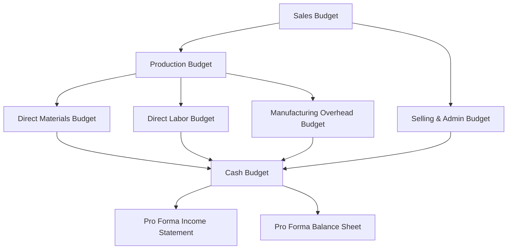

# Budgeting, Forecasting, and Projection

Budgeting, forecasting, and projection are the planning tools that translate an organization's strategy into quantified financial expectations. A **budget** sets performance targets for a defined future period, a **forecast** estimates future outcomes using historical data and statistical methods, and a **projection** models results under one or more hypothetical ("what-if") scenarios. The BAR section of the CPA exam tests your ability to prepare budgets with supportable assumptions, apply forecasting techniques, and interpret the results through ratio analysis and variance explanations.

:::info[Why This Matters]

The 2026 BAR blueprints require you to **prepare** budgets, **use** forecasting and projection techniques to model revenue growth and profitability, **prepare and interpret** planning analyses (cost-benefit, sensitivity, breakeven, and predictive analytics), and **analyze** forecasted results using ratio analysis and correlations to key financial indices.

:::

---

## Data Transformation for Budgeting

Before any budget or forecast can be built, the underlying data must be reliable. Organizations collect both **structured data** (general ledger balances, ERP tables, sales databases) and **unstructured data** (emails, contracts, customer feedback). Transforming this raw data into decision-useful information involves several steps.

| Step | Description | Example |
|---|---|---|
| **Collecting** | Gathering data from internal and external sources | Exporting 36 months of sales from the ERP system |
| **Cleaning** | Removing duplicates, correcting errors, standardizing formats | Eliminating duplicate invoice records |
| **Scrubbing** | Validating data against business rules and resolving anomalies | Flagging negative unit quantities for review |
| **Structuring** | Organizing data into a consistent, analyzable format | Converting free-text dates to YYYY-MM-DD |
| **Enriching** | Supplementing internal data with external benchmarks or indices | Appending CPI data for inflation-adjusted projections |

:::warning

Garbage in, garbage out. A budget built on uncleaned data—duplicate transactions, miscoded accounts, or stale prices—will produce misleading targets and unreliable variance analysis. Always validate source data before modeling.

:::

---

## Budgeting Overview

### Purpose of Budgeting

A budget serves four key management functions:

1. **Planning** — Forces management to quantify goals and allocate resources.
2. **Coordination** — Aligns departments toward common objectives (e.g., the sales forecast drives the production plan).
3. **Control** — Provides a benchmark against which actual performance is measured.
4. **Performance evaluation** — Enables variance analysis to assess managerial effectiveness.

### Types of Budgets

| Budget Type | Scope |
|---|---|
| **Operating budget** | Revenue, production, and operating expense plans for the upcoming period |
| **Financial budget** | Cash budget, budgeted balance sheet, and budgeted statement of cash flows |
| **Capital budget** | Long-term investment decisions for plant, equipment, and other capital assets |

---

## The Master Budget

The master budget is the comprehensive financial plan for an organization. It links individual budgets in a logical sequence, beginning with the sales forecast and culminating in pro forma financial statements.

### Sales Budget

The starting point. Estimated unit sales multiplied by the expected selling price per unit.

### Production Budget

$$
\text{Required Production} = \text{Budgeted Sales (units)} + \text{Desired Ending Inventory} - \text{Beginning Inventory}
$$

### Direct Materials Budget

$$
\text{Materials to Purchase} = \text{Production Needs} + \text{Desired Ending Materials} - \text{Beginning Materials}
$$

### Direct Labor Budget

$$
\text{Budgeted Labor Cost} = \text{Units to Produce} \times \text{Labor Hours per Unit} \times \text{Wage Rate per Hour}
$$

### Manufacturing Overhead, Selling & Administrative Budgets

These budgets separate fixed and variable components so that flexible budget analysis can be performed later.

### Cash Budget

The cash budget projects cash inflows and outflows to ensure the organization maintains adequate liquidity. It is the primary tool for short-term cash management.

---

## Budget Approaches

Different budgeting methodologies serve different organizational needs. The CPA exam expects you to identify, compare, and apply each approach.

| Approach | Description | Advantage | Disadvantage |
|---|---|---|---|
| **Static budget** | Prepared for a single activity level | Simple to prepare | Not useful when actual volume differs from plan |
| **Flexible budget** | Adjusts budgeted amounts to the actual activity level achieved | Enables meaningful variance analysis | Requires reliable cost behavior estimates |
| **Rolling (continuous)** | Continuously adds a new period as the current period expires | Always covers a full planning horizon | More administrative effort |
| **Zero-based** | Every expense must be justified from zero each period | Eliminates budgetary slack | Time-intensive and labor-heavy |
| **Incremental** | Uses the prior-period budget as a starting point and adjusts | Quick and easy | Perpetuates inefficiencies |
| **Activity-based** | Budgets costs based on expected activities and their cost drivers | More accurate for overhead-heavy organizations | Requires detailed activity analysis |

:::tip[Exam Tip]

When a question describes a budget that "adjusts for the actual number of units produced," it is describing a **flexible budget**. A static budget stays fixed at the originally planned volume.

:::

---

## Forecasting Techniques

Forecasting uses historical data and statistical methods to estimate future financial outcomes. These techniques support revenue growth modeling, cost estimation, and profitability analysis.

### Trend Analysis

Trend analysis extends historical patterns into the future. If Bear Co. revenue grew 8%, 9%, and 10% over the past three years, a simple trend projection might assume 10–11% growth next year.

### Moving Averages

A moving average smooths short-term fluctuations to reveal the underlying trend. A three-period moving average for period 4 is:

$$
\text{MA}_4 = \frac{\text{Period 1} + \text{Period 2} + \text{Period 3}}{3}
$$

### Exponential Smoothing

Exponential smoothing assigns greater weight to more recent observations. The smoothing constant $\alpha$ (between 0 and 1) controls responsiveness:

$$
F_{t+1} = \alpha \times A_t + (1 - \alpha) \times F_t
$$

Where $F$ is the forecast, $A$ is the actual result, and $\alpha$ closer to 1 means the model reacts more quickly to recent changes.

### Regression Analysis

Regression fits a line to historical data to quantify the relationship between a dependent variable (e.g., total cost) and one or more independent variables (e.g., units produced).

$$
Y = a + bX
$$

Where $Y$ is the predicted value, $a$ is the y-intercept, $b$ is the slope (variable rate), and $X$ is the activity level.

:::note

Regression analysis assumes a **linear relationship** between variables. Always examine a scatter plot before relying on regression output—if the data shows a curve, a linear model may produce misleading forecasts.

:::

---

## Projection Techniques — Pro Forma Financial Statements

Pro forma statements project future financial results under a specific set of assumptions. They answer the question: *If our assumptions hold, what will the financial statements look like?*

Key steps to build pro forma statements:

1. **Start with the sales forecast** — Apply a supportable growth rate to historical revenue.
2. **Model cost behavior** — Use cost-volume relationships to project COGS and operating expenses.
3. **Project the balance sheet** — Estimate receivables, inventory, payables, and capital expenditures using turnover ratios or percentage-of-sales methods.
4. **Prepare the cash flow projection** — Derive operating, investing, and financing cash flows from the projected income statement and balance sheet changes.

---

## Planning Techniques

### Cost-Benefit Analysis

Cost-benefit analysis compares the total expected costs of a decision against its total expected benefits. A project is accepted when benefits exceed costs, or equivalently, when the net benefit is positive.

$$
\text{Net Benefit} = \text{Total Benefits} - \text{Total Costs}
$$

**Example — MAS Inc.** is evaluating a new inventory management system costing \$150,000 to implement. The system is expected to reduce carrying costs by \$45,000 per year over five years.

$$
\text{Total Benefit} = 45{,}000 \times 5 = 225{,}000
$$

$$
\text{Net Benefit} = 225{,}000 - 150{,}000 = 75{,}000
$$

The net benefit is positive, so the investment is financially justified on an undiscounted basis.

### Sensitivity Analysis

Sensitivity analysis tests how changes in a **single input variable** affect the output. It answers: *How sensitive is our projected net income to a change in selling price, volume, or cost?*

**Example — Gies Co.** projects net income of \$200,000 based on 10,000 units sold at \$50 each with variable costs of \$30 per unit and fixed costs of \$100,000. If the selling price drops by 10%:

$$
\text{Revised Revenue} = 10{,}000 \times 45 = 450{,}000
$$

$$
\text{Revised Net Income} = 450{,}000 - (10{,}000 \times 30) - 100{,}000 = 50{,}000
$$

A 10% price decrease causes a **75% decline** in net income (from \$200,000 to \$50,000), demonstrating high sensitivity to price.

### What-If Scenarios

What-if analysis extends sensitivity analysis by changing **multiple variables simultaneously**. Management might model a best case, most likely case, and worst case scenario.

| Scenario | Units Sold | Price | Variable Cost | Fixed Cost | Net Income |
|---|---|---|---|---|---|
| **Best case** | 12,000 | $52 | $29 | $100,000 | $176,000 |
| **Most likely** | 10,000 | $50 | $30 | $100,000 | $100,000 |
| **Worst case** | 8,000 | $47 | $32 | $105,000 | $15,000 |

### Breakeven Analysis

Breakeven analysis determines the sales volume at which total revenue equals total costs—the point of zero profit.

$$
\text{Breakeven Units} = \frac{\text{Total Fixed Costs}}{\text{Selling Price per Unit} - \text{Variable Cost per Unit}}
$$

$$
\text{Breakeven Dollars} = \frac{\text{Total Fixed Costs}}{\text{Contribution Margin Ratio}}
$$

**Example — Kingfisher Industries** has fixed costs of \$180,000, a selling price of \$60 per unit, and variable costs of \$36 per unit.

$$
\text{Contribution Margin per Unit} = 60 - 36 = 24
$$

$$
\text{Breakeven Units} = \frac{180{,}000}{24} = 7{,}500 \text{ units}
$$

$$
\text{Contribution Margin Ratio} = \frac{24}{60} = 0.40
$$

$$
\text{Breakeven Dollars} = \frac{180{,}000}{0.40} = \$450{,}000
$$

Kingfisher must sell 7,500 units (or \$450,000 in revenue) before earning any profit.

:::tip[Exam Tip]

To find the units needed to achieve a **target profit**, add the target profit to fixed costs in the numerator: $(Fixed Costs + Target Profit) \div Contribution Margin per Unit$.

:::

### Predictive Analytics

Predictive analytics applies statistical and machine-learning techniques to historical data to predict future outcomes. Common applications include:

- **Customer churn prediction** — Identifying clients likely to discontinue service.
- **Revenue forecasting** — Using multiple regression with economic indicators as predictors.
- **Credit risk scoring** — Estimating the probability of default on receivables.

Predictive models are evaluated on **accuracy** (how often the model is correct) and **precision** (how well it avoids false positives). Model outputs should always be reviewed with professional judgment.

---

## Analyzing Forecasts and Projections

Once a forecast or projection is prepared, analysts evaluate its reasonableness by applying ratio analysis to the projected statements and comparing results to key financial indices.

### Ratio Analysis on Projected Statements

Apply the same ratios used in historical analysis—current ratio, gross margin, ROA, ROE, debt-to-equity—to the **projected** financial statements. Compare projected ratios to:

- Historical ratios (trend consistency)
- Industry benchmarks (competitive positioning)
- Debt covenant thresholds (compliance risk)

### Correlations and Variations from Financial Indices

Projected results should be evaluated against macroeconomic and industry indices:

| Index / Benchmark | Use in Analysis |
|---|---|
| **GDP growth rate** | Is the projected revenue growth rate reasonable given expected economic conditions? |
| **Consumer Price Index (CPI)** | Are projected cost increases consistent with expected inflation? |
| **Industry revenue growth** | Is the company projected to gain or lose market share? |
| **Prime rate / SOFR** | Are projected interest costs consistent with expected borrowing rates? |

If BIF Partners projects 15% revenue growth while the industry benchmark is 4%, the analyst must identify a supportable explanation—such as a new product launch or acquisition—or revise the assumption downward.

---

## Worked Example — Bear Co. Cash Budget

Bear Co. is preparing a cash budget for Q2 (April–June). The following assumptions are given:

- **Sales forecast:** April \$200,000; May \$240,000; June \$260,000.
- **Collections pattern:** 60% collected in the month of sale, 35% in the following month, 5% uncollectible.
- **March sales (for April collections):** \$180,000.
- **Purchases:** 50% of next month's sales, paid in the month of purchase.
- **Monthly fixed operating expenses:** \$40,000 (includes \$5,000 depreciation, paid in cash net of depreciation = \$35,000).
- **Beginning cash balance (April 1):** \$25,000.
- **Minimum required cash balance:** \$20,000.
- **Borrowing available** in \$1,000 increments at the start of any month.

**Step 1 — Cash Collections:**

| Source | April | May | June |
|---|---|---|---|
| Current month sales (60%) | $120,000 | $144,000 | $156,000 |
| Prior month sales (35%) | $63,000 | $70,000 | $84,000 |
| **Total collections** | **$183,000** | **$214,000** | **$240,000** |

**Step 2 — Cash Disbursements:**

| Item | April | May | June |
|---|---|---|---|
| Purchases (50% of next month's sales) | $120,000 | $130,000 | $130,000 |
| Fixed operating expenses (cash) | $35,000 | $35,000 | $35,000 |
| **Total disbursements** | **$155,000** | **$165,000** | **$165,000** |

:::note

June purchases are assumed at 50% of July projected sales. If July sales are not given, the exam may state the amount or use June sales as a proxy. Here we assume July sales of \$260,000, making June purchases \$130,000.

:::

**Step 3 — Cash Budget Summary:**

| Line | April | May | June |
|---|---|---|---|
| Beginning cash balance | $25,000 | $53,000 | $102,000 |
| Add: Total collections | $183,000 | $214,000 | $240,000 |
| Less: Total disbursements | ($155,000) | ($165,000) | ($165,000) |
| **Ending cash balance before borrowing** | **$53,000** | **$102,000** | **$177,000** |
| Borrowing needed | $0 | $0 | $0 |
| **Ending cash balance** | **$53,000** | **$102,000** | **$177,000** |

Bear Co. maintains a cash balance above the \$20,000 minimum in every month without borrowing. The rising ending balance suggests the company may have excess cash available for short-term investment or debt repayment in June.

---

## Common Pitfalls and Exam Strategies

:::caution[Common Pitfalls]

- **Confusing static and flexible budgets** — A static budget is fixed at one activity level. A flexible budget adjusts to actual volume. Variance analysis using a static budget conflates volume effects with efficiency effects.
- **Ignoring the collections lag** — Cash budgets require careful attention to the timing of collections. Revenue recognized in one month may not be collected for 30–60 days.
- **Omitting non-cash items** — Depreciation is an expense on the income statement but **not** a cash outflow. Always exclude it from cash disbursements in the cash budget.
- **Using unsupportable assumptions** — Every assumption in a budget or projection must be traceable to historical data, contractual terms, or a documented management decision. "Revenue will double" without support is not a valid budget assumption.
- **Forgetting the breakeven denominator** — Breakeven uses **contribution margin** (not gross margin) per unit. Contribution margin excludes fixed costs; gross margin may include fixed manufacturing overhead under absorption costing.

:::

:::tip[Exam Strategy]

1. **Follow the master budget sequence** — Sales budget first, then production, materials, labor, overhead, selling and admin, cash budget, and finally pro forma statements.
2. **Label your formulas** — On constructed-response questions, clearly show each formula and plug in the numbers. Partial credit is awarded for correct methodology even if arithmetic is off.
3. **Check reasonableness** — If your breakeven calculation yields 2 units for a company with \$500,000 in fixed costs, recheck your work.
4. **Know the forecasting methods** — Be able to distinguish trend analysis, moving averages, exponential smoothing, and regression by their key characteristics and when each is most appropriate.
5. **Connect projections to ratios** — When analyzing pro forma statements, compute the same ratios used in historical analysis and explain any significant changes.

:::
