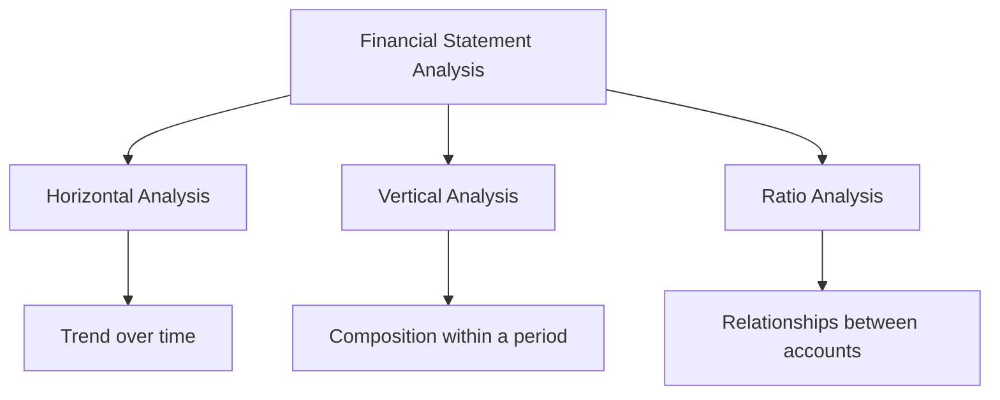
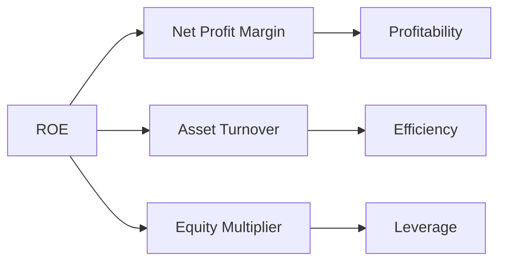
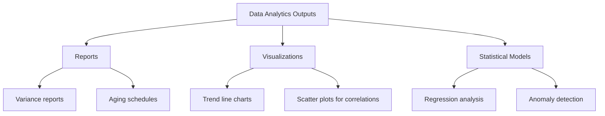

import Tabs from '@theme/Tabs';
import TabItem from '@theme/TabItem';

# Financial Statement Analysis

Financial statement analysis is the process of evaluating a company's financial statements to make informed decisions about its performance, position, and future prospects. On the CPA exam, you must be able to select the right data, apply analytical techniques, and interpret the results—all within the context of GAAP and the FASB Conceptual Framework.

:::info[Why This Matters]

The BAR section tests your ability to go beyond preparing financial statements. You need to **analyze** them—identifying trends, diagnosing problems, and communicating findings using ratios, visualizations, and variance analysis.

:::

---

## Analytical Methods

Three foundational methods form the backbone of financial statement analysis. Each method answers a different question about the entity's financial data.



### Horizontal Analysis (Trend Analysis)

Horizontal analysis compares financial statement line items **across multiple periods**. It answers the question: *How have results changed over time?*

$$
\text{Dollar Change} = \text{Current Period} - \text{Prior Period}
$$

$$
\text{Percentage Change} = \frac{\text{Current Period} - \text{Prior Period}}{\text{Prior Period}} \times 100
$$

**Example — Bear Co. Revenue Trend:**

| Year | Revenue | Dollar Change | % Change |
|---|---|---|---|
| 20X1 | $800,000 | — | — |
| 20X2 | $920,000 | $120,000 | 15.0% |
| 20X3 | $1,012,000 | $92,000 | 10.0% |

Bear Co.'s revenue grew each year, but the **rate of growth decelerated** from 15% to 10%. An analyst should investigate whether this slowdown reflects market saturation, pricing pressure, or a deliberate shift in strategy.

:::tip[Exam Tip]

When a question asks you to "explain variances," always provide **both** the direction (increase or decrease) and a plausible cause. Simply stating "revenue went up" is not sufficient—connect the change to an underlying driver.

:::

### Vertical Analysis (Common-Size Statements)

Vertical analysis expresses every line item as a **percentage of a base amount** within a single period. For the income statement, the base is net revenue; for the balance sheet, the base is total assets.

$$
\text{Common-Size \%} = \frac{\text{Line Item}}{\text{Base Amount}} \times 100
$$

**Example — Gies Co. Common-Size Income Statement:**

| Line Item | Amount | % of Revenue |
|---|---|---|
| Net Revenue | $500,000 | 100.0% |
| Cost of Goods Sold | $300,000 | 60.0% |
| Gross Profit | $200,000 | 40.0% |
| Operating Expenses | $120,000 | 24.0% |
| Operating Income | $80,000 | 16.0% |
| Net Income | $55,000 | 11.0% |

Common-size statements are especially useful for **comparing companies of different sizes** within the same industry or benchmarking against industry averages.

---

## Key Financial Ratios

Ratios condense complex financial data into single metrics that are easy to compare across periods and entities. The CPA exam organizes ratios into four categories: **liquidity, profitability, solvency, and activity/efficiency**.

### Liquidity Ratios

Liquidity ratios measure a company's ability to meet **short-term obligations** as they come due.

| Ratio | Formula | Interpretation |
|---|---|---|
| **Current Ratio** | Current Assets ÷ Current Liabilities | Broad measure of short-term liquidity |
| **Quick Ratio** | (Cash + Short-Term Investments + Net Receivables) ÷ Current Liabilities | Excludes inventory and prepaid items |
| **Cash Ratio** | (Cash + Cash Equivalents) ÷ Current Liabilities | Most conservative liquidity measure |

**Example — MAS Inc.:**

MAS Inc. reports current assets of $240,000 (including $60,000 cash, $80,000 receivables, $70,000 inventory, and $30,000 prepaids) and current liabilities of $150,000.

$$
\text{Current Ratio} = \frac{240{,}000}{150{,}000} = 1.60
$$

$$
\text{Quick Ratio} = \frac{60{,}000 + 80{,}000}{150{,}000} = 0.93
$$

$$
\text{Cash Ratio} = \frac{60{,}000}{150{,}000} = 0.40
$$

:::warning

A current ratio above 1.0 does **not** guarantee the entity can pay its bills. If current assets are dominated by slow-moving inventory or disputed receivables, liquidity may be overstated. Always examine the **composition** of current assets.

:::

### Profitability Ratios

Profitability ratios evaluate how effectively a company generates earnings relative to revenue, assets, or equity.

| Ratio | Formula |
|---|---|
| **Gross Margin** | Gross Profit ÷ Net Revenue |
| **Operating Margin** | Operating Income ÷ Net Revenue |
| **Net Profit Margin** | Net Income ÷ Net Revenue |
| **Return on Assets (ROA)** | Net Income ÷ Average Total Assets |
| **Return on Equity (ROE)** | Net Income ÷ Average Stockholders' Equity |

**Example — Bear Co. Profitability (20X3):**

Bear Co. reports net revenue of $1,012,000, gross profit of $405,000, operating income of $162,000, net income of $101,200, average total assets of $880,000, and average stockholders' equity of $520,000.

$$
\text{Gross Margin} = \frac{405{,}000}{1{,}012{,}000} = 40.0\%
$$

$$
\text{ROA} = \frac{101{,}200}{880{,}000} = 11.5\%
$$

$$
\text{ROE} = \frac{101{,}200}{520{,}000} = 19.5\%
$$

### Solvency Ratios

Solvency ratios assess an entity's ability to meet **long-term obligations** and its overall capital structure.

| Ratio | Formula | Interpretation |
|---|---|---|
| **Debt-to-Equity** | Total Liabilities ÷ Total Stockholders' Equity | Higher = more leveraged |
| **Debt-to-Assets** | Total Liabilities ÷ Total Assets | Portion of assets financed by debt |
| **Times Interest Earned** | EBIT ÷ Interest Expense | Ability to cover interest payments |

**Example — Kingfisher Industries:**

Kingfisher Industries reports total liabilities of $600,000, total equity of $400,000, total assets of $1,000,000, EBIT of $180,000, and interest expense of $45,000.

$$
\text{Debt-to-Equity} = \frac{600{,}000}{400{,}000} = 1.50
$$

$$
\text{Times Interest Earned} = \frac{180{,}000}{45{,}000} = 4.0\text{x}
$$

A times interest earned ratio of 4.0x means Kingfisher earns four dollars of operating income for every dollar of interest expense—a comfortable margin, though some debt covenants require a minimum of 3.0x or higher.

### Activity and Efficiency Ratios

Activity ratios measure how effectively a company uses its assets to generate revenue.

| Ratio | Formula | Result |
|---|---|---|
| **Receivables Turnover** | Net Credit Sales ÷ Average Net Receivables | Times per year |
| **Days Sales Outstanding** | 365 ÷ Receivables Turnover | Days to collect |
| **Inventory Turnover** | COGS ÷ Average Inventory | Times per year |
| **Days in Inventory** | 365 ÷ Inventory Turnover | Days to sell |
| **Total Asset Turnover** | Net Revenue ÷ Average Total Assets | Revenue per dollar of assets |

**Example — Illini Entertainment:**

Illini Entertainment reports net credit sales of $750,000 with average receivables of $62,500 and COGS of $450,000 with average inventory of $90,000.

$$
\text{Receivables Turnover} = \frac{750{,}000}{62{,}500} = 12.0\text{x}
$$

$$
\text{Days Sales Outstanding} = \frac{365}{12.0} \approx 30 \text{ days}
$$

$$
\text{Inventory Turnover} = \frac{450{,}000}{90{,}000} = 5.0\text{x}
$$

$$
\text{Days in Inventory} = \frac{365}{5.0} = 73 \text{ days}
$$

:::tip[Exam Tip]

Turnover ratios use **averages** of balance sheet accounts in the denominator because the income statement covers an entire period while the balance sheet is a point-in-time snapshot. If only ending balances are given, use those—but note the limitation.

:::

---

## DuPont Analysis

DuPont analysis decomposes **Return on Equity (ROE)** into component drivers, revealing *why* ROE changed rather than just *that* it changed.

### Three-Component DuPont Model

$$
\text{ROE} = \underbrace{\frac{\text{Net Income}}{\text{Revenue}}}_{\text{Net Profit Margin}} \times \underbrace{\frac{\text{Revenue}}{\text{Avg Total Assets}}}_{\text{Asset Turnover}} \times \underbrace{\frac{\text{Avg Total Assets}}{\text{Avg Equity}}}_{\text{Equity Multiplier}}
$$



### Five-Component DuPont Model

The five-component model further separates the effects of **operating performance**, **tax burden**, and **interest burden**:

$$
\text{ROE} = \frac{\text{Net Income}}{\text{EBT}} \times \frac{\text{EBT}}{\text{EBIT}} \times \frac{\text{EBIT}}{\text{Revenue}} \times \frac{\text{Revenue}}{\text{Avg Assets}} \times \frac{\text{Avg Assets}}{\text{Avg Equity}}
$$

| Component | Measures |
|---|---|
| Net Income ÷ EBT | Tax burden |
| EBT ÷ EBIT | Interest burden |
| EBIT ÷ Revenue | Operating margin |
| Revenue ÷ Avg Assets | Asset turnover |
| Avg Assets ÷ Avg Equity | Financial leverage |

**Example — BIF Partners DuPont Decomposition:**

<Tabs>
<TabItem value="y1" label="20X2" default>

| Component | Value |
|---|---|
| Net Profit Margin | 8.0% |
| Asset Turnover | 1.20x |
| Equity Multiplier | 2.00x |
| **ROE** | **19.2%** |

</TabItem>
<TabItem value="y2" label="20X3">

| Component | Value |
|---|---|
| Net Profit Margin | 10.0% |
| Asset Turnover | 1.10x |
| Equity Multiplier | 2.00x |
| **ROE** | **22.0%** |

BIF Partners' ROE increased from 19.2% to 22.0%. The improvement came from **higher profitability** (margin up from 8% to 10%), which more than offset a slight decline in asset efficiency (turnover down from 1.20x to 1.10x). Leverage remained unchanged.

</TabItem>
</Tabs>

---

## Comparing Actual Results to Budget

A core BAR skill is comparing current-period results to **prior periods** or to **budgeted expectations** and explaining the variances.

### Variance Analysis Framework

$$
\text{Variance} = \text{Actual Result} - \text{Budgeted Amount}
$$

A **favorable** variance increases income (higher revenue or lower expense). An **unfavorable** variance decreases income.

**Example — Illini Security Budget vs. Actual:**

| Line Item | Budget | Actual | Variance | F / U |
|---|---|---|---|---|
| Service Revenue | $400,000 | $425,000 | $25,000 | Favorable |
| Labor Costs | $200,000 | $215,000 | ($15,000) | Unfavorable |
| Supplies Expense | $30,000 | $28,000 | $2,000 | Favorable |
| Rent Expense | $48,000 | $48,000 | $0 | — |
| **Operating Income** | **$122,000** | **$134,000** | **$12,000** | **Favorable** |

Illini Security exceeded its operating income budget by $12,000. Revenue outperformed the plan, driven by a new corporate client acquired in Q3. Labor costs ran over budget due to overtime needed to service that client. Management should evaluate whether the incremental revenue justifies the added labor cost.

:::note

When analyzing variances, consider **materiality**. A $500 variance on a $2,000,000 line item is immaterial. Focus your analysis on the variances that are large enough—in both dollar and percentage terms—to affect decision-making.

:::

---

## Impact of Transactions on Financial Statements

The CPA exam frequently tests whether you can trace a transaction through all affected financial statements and related note disclosures.

### Transaction Analysis Framework

For any transaction, ask:

1. **Which accounts are affected?** (Assets, liabilities, equity, revenue, expense)
2. **What is the direction?** (Increase or decrease)
3. **What is the net effect on each financial statement?**
4. **Are note disclosures required?** (Contingencies, related parties, subsequent events)

**Example — Bear Co. Issues Bonds at a Discount:**

Bear Co. issues $500,000 of 5-year bonds at 97 (i.e., for $485,000). The discount of $15,000 is amortized using the effective interest method over the bond term (ASC 835-30).

| Financial Statement | Effect |
|---|---|
| **Balance Sheet** | Cash increases $485,000; Bonds Payable recorded at $500,000 less unamortized discount of $15,000 |
| **Income Statement** | Interest expense each period exceeds the cash coupon payment by the discount amortization |
| **Cash Flow Statement** | Issuance proceeds of $485,000 reported as a financing inflow |
| **Notes** | Disclose face amount, interest rate, maturity, and effective rate per ASC 835-30 |

```journal
Dr. Cash[a] 485,000
Dr. Discount on Bonds Payable[ca] 15,000
    Cr. Bonds Payable[l] 500,000
```

---

## Data Analytics in Financial Statement Analysis

Modern financial analysis increasingly relies on data analytics to process large datasets, identify patterns, and visualize results. The BAR section expects you to understand how these tools enhance traditional analysis.

### Data Attributes and Sources

Before performing analysis, determine the **structure, format, and sources** of the data you need:

| Attribute | Description | Example |
|---|---|---|
| **Structure** | How data is organized (tables, hierarchies, time series) | Monthly revenue by product line |
| **Format** | Data types and encoding (numeric, text, date) | Currency values in USD, dates in YYYY-MM-DD |
| **Source** | Where data originates (ERP, GL, external feeds) | General ledger trial balance export |

### Analytical Outputs

Data analytics techniques produce outputs that help explain an entity's financial results:



:::info[Key Concept]

Data analytics does not replace professional judgment—it **augments** it. A visualization may reveal that revenue spikes every December, but the analyst must determine whether that reflects seasonality, channel stuffing, or a one-time event.

:::

---

## Common Pitfalls and Exam Strategies

:::caution[Common Pitfalls]

- **Mixing up turnover formulas** — Receivables turnover uses *net credit sales*, not total revenue. Inventory turnover uses *COGS*, not revenue.
- **Forgetting to average** — ROA, ROE, and turnover ratios should use average balances when both beginning and ending amounts are available.
- **Ignoring the equity multiplier** — A rising ROE may come from increased leverage (more debt), not improved operations. Always decompose with DuPont.
- **Labeling variances incorrectly** — A favorable variance means favorable to *income*. Higher revenue = favorable; higher expense = unfavorable.
- **Overlooking note disclosures** — Transaction analysis questions often ask about the *notes*, not just the face of the statements.

:::

:::tip[Exam Strategy]

1. **Memorize the ratio formulas** — You will not have a formula sheet. Know the numerator and denominator for every key ratio.
2. **Practice DuPont decomposition** — If a question says ROE changed, break it into margin, turnover, and leverage to find the driver.
3. **Read the requirement first** — Determine whether the question asks for a ratio calculation, a trend interpretation, or a variance explanation before diving into the data.
4. **Use reasonableness checks** — If your current ratio calculation yields 15.0, re-examine your inputs. Most real-world current ratios fall between 1.0 and 3.0.
5. **Connect transactions to all four statements** — Balance sheet, income statement, cash flow statement, and notes.

:::
