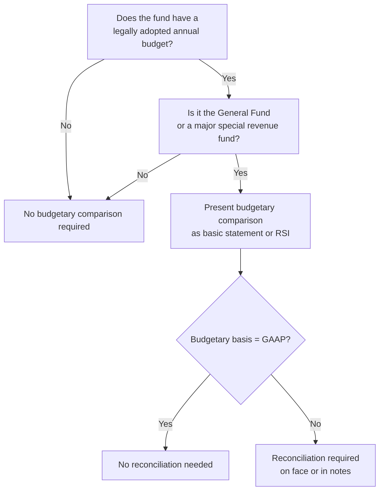

# Budgetary Comparison Reporting

State and local governments are required to present **budgetary comparison information** for the general fund and each major special revenue fund that has a **legally adopted annual budget**. This reporting allows financial statement users to evaluate whether the government operated within its legal spending authority and highlights variances between **planned** and **actual** results on the **budgetary basis** of accounting.

:::info[Blueprint Coverage]

This section maps to **BAR Area III, Group A, Topic 7 – Budgetary Comparison Reporting**. Representative tasks:

1. **Recall** the objectives and components of budgetary comparison reporting in the annual comprehensive financial report for state and local governments.

:::

---

## Purpose and Objectives

Budgetary comparison reporting serves several critical functions:

| Objective | Description |
|---|---|
| **Legal compliance** | Demonstrates that the government did not exceed legally authorized appropriations |
| **Accountability** | Shows citizens how actual results compared to the approved budget |
| **Transparency** | Reveals mid-year budget amendments and their cumulative impact |
| **Performance evaluation** | Highlights favorable and unfavorable variances for management review |

:::tip[Exam Tip]

The primary objective tested on the CPA exam is **demonstrating legal compliance** — did the government stay within its appropriation authority? This is why the actual column must be presented on the **budgetary basis**, not necessarily the GAAP basis.

:::

---

## GASB Statement No. 34 Requirements

GASB 34 requires budgetary comparison information for:

- The **general fund**
- Each **major special revenue fund** with a legally adopted annual (or biennial) budget

### Presentation Options

Governments may present budgetary comparison information in one of two ways:

| Option | Location | Classification |
|---|---|---|
| **Option A** | As a **basic financial statement** | Part of the fund financial statements |
| **Option B** | As **Required Supplementary Information (RSI)** | Presented immediately after the notes to the financial statements |

:::warning[Key Distinction]

Regardless of where presented, the budgetary comparison must include **at minimum** the original budget, the final (amended) budget, and actual results on the budgetary basis. If presented as a basic financial statement, it is subject to audit. If presented as RSI, it receives limited procedures (not a full audit).

:::

---

## Required Columns

The budgetary comparison schedule or statement must contain at least three data columns:


| Column | Description |
|---|---|
| **Original budget** | The first complete appropriated budget adopted by the legislative body |
| **Final budget** | The original budget adjusted for all legally authorized amendments, transfers, and revisions |
| **Actual (budgetary basis)** | Actual inflows and outflows measured using the same basis as the budget |
| **Variance** | Difference between final budget and actual (optional but commonly presented) |

:::tip[Exam Tip]

The variance column is **not required** by GASB 34 but is almost always presented in practice. When included, favorable variances for revenues mean actual exceeded budget; favorable variances for expenditures mean actual was less than budget.

:::

---

## Budgetary Basis vs. GAAP Basis

Many governments prepare budgets on a basis that differs from GAAP. Common differences include:

| Item | Budgetary Basis Treatment | GAAP Basis Treatment |
|---|---|---|
| **Encumbrances** | Treated as expenditures (charged against appropriation) | Not expenditures; disclosed in fund balance |
| **Transfers** | May be included with revenues/expenditures | Reported as Other Financing Sources/Uses |
| **Timing** | Cash or near-cash basis common | Modified accrual basis |
| **Inventory** | Purchases method (expensed when purchased) | May use consumption method under GAAP |
| **Perspective** | May include only legally budgeted items | Includes all fund activity |

When the budgetary basis differs from GAAP, a **reconciliation** between budgetary actual amounts and GAAP actual amounts is required either on the face of the statement or in the notes.

---

## Which Funds Require Budgetary Comparison

Not all funds require budgetary comparison reporting:

| Fund Type | Required? | Condition |
|---|---|---|
| **General fund** | Yes | Always required |
| **Major special revenue funds** | Yes | Only if a legally adopted annual budget exists |
| **Non-major special revenue funds** | No | May be presented voluntarily |
| **Capital projects fund** | No | Typically has project-length budgets, not annual |
| **Debt service fund** | No | Usually not legally budgeted annually |
| **Proprietary funds** | No | Not part of budgetary comparison RSI |
| **Fiduciary funds** | No | Not part of budgetary comparison RSI |

:::warning[Common Pitfall]

A special revenue fund that does **not** have a legally adopted annual budget is **not** required to present budgetary comparison information — even if it is a major fund.

:::

---

## Example Budgetary Comparison Schedule

**Bear City — General Fund Budgetary Comparison Schedule**
**For the Fiscal Year Ended June 30, 20X5**

| | Original Budget | Final Budget | Actual (Budgetary Basis) | Variance Favorable (Unfavorable) |
|---|---|---|---|---|
| **Revenues:** | | | | |
| Property taxes | \$8,000,000 | \$8,000,000 | \$8,150,000 | \$150,000 |
| Sales taxes | 3,500,000 | 3,700,000 | 3,620,000 | (80,000) |
| Intergovernmental | 1,200,000 | 1,200,000 | 1,250,000 | 50,000 |
| Charges for services | 800,000 | 850,000 | 870,000 | 20,000 |
| **Total revenues** | **13,500,000** | **13,750,000** | **13,890,000** | **140,000** |
| **Expenditures:** | | | | |
| General government | 2,800,000 | 2,900,000 | 2,870,000 | 30,000 |
| Public safety | 5,200,000 | 5,400,000 | 5,380,000 | 20,000 |
| Public works | 2,500,000 | 2,500,000 | 2,550,000 | (50,000) |
| Culture and recreation | 1,100,000 | 1,050,000 | 1,020,000 | 30,000 |
| **Total expenditures** | **11,600,000** | **11,850,000** | **11,820,000** | **30,000** |
| **Excess of revenues over expenditures** | **1,900,000** | **1,900,000** | **2,070,000** | **170,000** |
| Other financing sources (uses) | (400,000) | (400,000) | (400,000) | — |
| **Net change in fund balance** | **\$1,500,000** | **\$1,500,000** | **\$1,670,000** | **\$170,000** |

:::tip[Exam Tip]

Variance columns show favorable amounts as positive and unfavorable amounts in parentheses. For **revenues**, actual > budget is favorable. For **expenditures**, actual < budget is favorable.

:::

---

## Reconciliation from Budgetary Basis to GAAP Basis

When the budgetary basis differs from GAAP, a reconciliation is required. Common reconciling items:

### Example Reconciliation

| Item | Amount |
|---|---|
| Net change in fund balance — budgetary basis | \$1,670,000 |
| **Adjustments:** | |
| Add: Encumbrances outstanding at end of year (not GAAP expenditures) | 95,000 |
| Less: Encumbrances outstanding at beginning of year (GAAP expenditures in prior year) | (72,000) |
| Add: Inventory adjustment (consumption vs. purchases method) | 15,000 |
| Less: Transfers reclassified from expenditures to other financing uses | — |
| **Net change in fund balance — GAAP basis** | **\$1,708,000** |

The journal entry to convert encumbrance activity at the government-wide level is conceptual, but at the fund level the reconciliation is a schedule (not a posted entry). However, for understanding:

```journal
Dr. Expenditures 72,000
    Cr. Fund Balance[e] 72,000
```

```journal
Dr. Fund Balance[e] 95,000
    Cr. Expenditures 95,000
```

These represent the conceptual effect of removing current-year encumbrances from budgetary expenditures and adding prior-year encumbrances that became GAAP expenditures.

---

## Budgetary Comparison Flowchart



---

## Summary

| Concept | Key Point |
|---|---|
| **Required for** | General fund + major special revenue funds with legally adopted budgets |
| **Minimum columns** | Original budget, final budget, actual (budgetary basis) |
| **Variance column** | Optional but commonly presented |
| **Presentation** | Basic financial statement OR Required Supplementary Information |
| **Basis** | Actual column uses **budgetary basis** (may differ from GAAP) |
| **Reconciliation** | Required when budgetary basis ≠ GAAP basis |
| **GASB guidance** | GASB Statement No. 34, paragraphs 130–131 |
| **Audit status** | Audited if basic statement; limited procedures if RSI |

:::tip[Exam Tip]

Remember the three "must-haves" for a budgetary comparison: (1) original budget, (2) final budget, and (3) actual on the budgetary basis. The variance column is the most common "extra" but is never required. Always check whether the question asks for the budgetary basis or GAAP basis — they are not the same if encumbrances are involved.

:::
