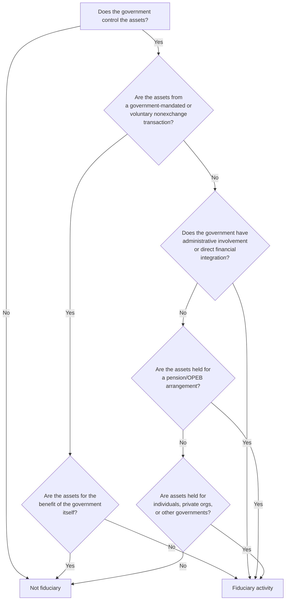

# Fiduciary Funds Financial Statements

**Fiduciary funds** account for resources held by a government in a **trustee** or **custodial** capacity for individuals, private organizations, or other governments. Because these resources cannot be used to support the government's own programs, fiduciary funds are excluded from the government-wide financial statements. Understanding the types of fiduciary funds, their measurement focus, and the two required financial statements is critical for the CPA exam.

:::info[Blueprint Coverage]

This section maps to **BAR Area III, Group A, Topic 4 – Fiduciary Funds Financial Statements**. Representative tasks:

1. **Identify and recall** basic concepts and principles associated with fiduciary fund financial statements (e.g., required funds, financial statements, financial statement components).
2. **Prepare** the statement of changes in fiduciary net position for the fiduciary funds of a state or local government from trial balances and supporting documentation.
3. **Prepare** the statement of net position for the fiduciary funds of a state or local government from trial balances and supporting documentation.

:::

---

## Types of Fiduciary Funds

GASB identifies four types of fiduciary funds:

| Fund Type | Purpose | Examples |
|---|---|---|
| **Pension (and other employee benefit) trust funds** | Account for resources held in trust for pension plans and OPEB | Defined benefit pension plans, retiree health plans |
| **Investment trust funds** | Account for the external portion of investment pools operated by the government | County treasurer pools funds for school districts |
| **Private-purpose trust funds** | Account for trust arrangements benefiting individuals or private organizations | Scholarship trust, escheat property |
| **Custodial funds** | Account for resources held temporarily in a custodial capacity | Tax collections on behalf of other governments, special assessments held for developers |

:::tip[Exam Tip]

Prior to GASB 84, custodial funds were called "agency funds." If you see either term, they refer to the same concept. GASB 84 (effective 2020) replaced the agency fund category with custodial funds and requires them to report a statement of changes in fiduciary net position — agency funds previously did not.

:::

---

## GASB Statement 84 — Fiduciary Activities

GASB 84 establishes criteria for determining when a government has a **fiduciary activity**:



**Key exclusion:** Assets held for the government's own programs are **not** fiduciary — they belong in governmental or proprietary funds.

---

## Measurement Focus and Basis of Accounting

All fiduciary funds use:

| Attribute | Requirement |
|---|---|
| **Measurement focus** | Economic resources |
| **Basis of accounting** | Accrual |

This means fiduciary funds recognize revenues when earned and expenses when incurred — similar to proprietary funds and the government-wide statements.

:::warning[Critical Point]

Fiduciary funds are **NOT** included in the government-wide financial statements. They appear only in the fiduciary fund financial statements, which are presented as a separate section of the basic financial statements.

:::

---

## Required Financial Statements

Fiduciary funds require exactly **two** financial statements:

| Statement | What It Shows |
|---|---|
| **Statement of Fiduciary Net Position** | Assets, liabilities, and net position at a point in time (balance sheet equivalent) |
| **Statement of Changes in Fiduciary Net Position** | Additions to and deductions from net position during the period (income statement equivalent) |

### Statement of Fiduciary Net Position — Components

| Section | Typical Line Items |
|---|---|
| **Assets** | Cash, investments (at fair value), receivables (contributions, interest), capital assets (if any) |
| **Liabilities** | Accounts payable, benefits payable, refunds payable |
| **Net Position** | Restricted for pensions, restricted for other purposes, or held in trust |

### Statement of Changes in Fiduciary Net Position — Components

| Section | Typical Line Items |
|---|---|
| **Additions** | Employer contributions, employee contributions, investment income (net of fees), other additions |
| **Deductions** | Benefit payments, refunds, administrative expenses |
| **Change in net position** | Additions – Deductions |
| **Net position — beginning** | Prior year balance |
| **Net position — ending** | Beginning + Change |

---

## Example — Pension Trust Fund

### Trial Balance

**Bear City Employees' Pension Trust Fund — Trial Balance at June 30, 20X5:**

| Account | Debit | Credit |
|---|---|---|
| Cash | \$2,500,000 | |
| Investments (fair value) | \$48,000,000 | |
| Accrued Interest Receivable | \$350,000 | |
| Contributions Receivable – Employer | \$800,000 | |
| Accounts Payable | | \$120,000 |
| Benefits Payable | | \$430,000 |
| Net Position – Restricted for Pensions (beginning) | | \$44,000,000 |
| Employer Contributions | | \$3,600,000 |
| Employee Contributions | | \$1,800,000 |
| Net Investment Income | | \$4,200,000 |
| Benefit Payments | \$2,900,000 | |
| Refunds to Terminated Employees | \$200,000 | |
| Administrative Expenses | \$300,000 | |
| **Totals** | **\$55,050,000** | **\$55,050,000** |

### Preparing the Statement of Fiduciary Net Position

**Bear City Employees' Pension Trust Fund**
**Statement of Fiduciary Net Position — June 30, 20X5**

| | Amount |
|---|---|
| **Assets** | |
| Cash | \$2,500,000 |
| Investments, at fair value | 48,000,000 |
| Accrued interest receivable | 350,000 |
| Contributions receivable – employer | 800,000 |
| **Total assets** | **\$51,650,000** |
| **Liabilities** | |
| Accounts payable | \$120,000 |
| Benefits payable | 430,000 |
| **Total liabilities** | **\$550,000** |
| **Net position – restricted for pensions** | **\$51,100,000** |

### Preparing the Statement of Changes in Fiduciary Net Position

**Bear City Employees' Pension Trust Fund**
**Statement of Changes in Fiduciary Net Position — Year Ended June 30, 20X5**

| | Amount |
|---|---|
| **Additions:** | |
| Employer contributions | \$3,600,000 |
| Employee contributions | 1,800,000 |
| Net investment income | 4,200,000 |
| **Total additions** | **\$9,600,000** |
| **Deductions:** | |
| Benefit payments | \$2,900,000 |
| Refunds to terminated employees | 200,000 |
| Administrative expenses | 300,000 |
| **Total deductions** | **\$3,400,000** |
| **Change in net position** | **\$6,200,000** |
| Net position — beginning | 44,000,000 |
| Unrounded check: \$44,000,000 + \$6,200,000 | |
| **Net position — ending** | **\$50,200,000** |

:::warning[Reconciliation Note]

The ending net position from the Statement of Changes (\$50,200,000) should equal the net position on the Statement of Fiduciary Net Position. In our example, the Statement of Net Position shows \$51,100,000 because it reflects the balance sheet date amounts. The difference arises because the "beginning" net position in the trial balance (\$44,000,000) plus changes should net to the ending figure. Let's verify: \$44,000,000 + \$9,600,000 − \$3,400,000 = \$50,200,000. The Statement of Net Position is computed as Assets − Liabilities = \$51,650,000 − \$550,000 = \$51,100,000. This discrepancy means we must adjust: the correct beginning net position is \$44,900,000 (i.e., \$51,100,000 − \$6,200,000). Always verify that the two statements reconcile.

:::

---

## Journal Entries for Fiduciary Fund Transactions

### Receiving Employer and Employee Contributions

```journal
Dr. Cash[a] 5,400,000
    Cr. Employer Contributions 3,600,000
    Cr. Employee Contributions 1,800,000
```

### Recording Investment Income

```journal
Dr. Cash[a] 4,200,000
    Cr. Net Investment Income 4,200,000
```

### Paying Benefits to Retirees

```journal
Dr. Benefit Payments 2,900,000
    Cr. Cash[a] 2,900,000
```

### Refunds to Terminated Employees

```journal
Dr. Refunds to Terminated Employees 200,000
    Cr. Cash[a] 200,000
```

### Administrative Expenses

```journal
Dr. Administrative Expenses 300,000
    Cr. Accounts Payable[l] 300,000
```

---

## Custodial Fund Example

**Bear County** collects property taxes on behalf of three school districts. During the year, the county collects \$12,000,000 and distributes \$11,500,000 to the districts.

**Record collection:**

```journal
Dr. Cash[a] 12,000,000
    Cr. Additions – Property Tax Collections for Other Governments 12,000,000
```

**Record distribution to school districts:**

```journal
Dr. Deductions – Distributions to School Districts 11,500,000
    Cr. Cash[a] 11,500,000
```

At year-end, the custodial fund reports net position of \$500,000 (cash held pending distribution).

:::tip[Exam Tip]

Under GASB 84, custodial funds now report additions and deductions (similar to trust funds). Previously, agency funds only reported assets = liabilities with no net position. If the exam references pre-GASB 84 agency funds, remember they had **no** net position and **no** operating statement.

:::

---

## What Is NOT Included in Fiduciary Funds

| Item | Correct Fund/Reporting |
|---|---|
| Government's own pension contributions (employer side) | Expenditure in governmental fund; expense in government-wide |
| Internal service fund assets | Proprietary funds |
| Taxes collected for own use | General Fund |
| Pass-through grants controlled by government | Special Revenue Fund |
| Assets held in trust for government's own programs | Special Revenue or Capital Projects Fund |

---

## Summary

| Characteristic | Pension Trust | Investment Trust | Private-Purpose Trust | Custodial |
|---|---|---|---|---|
| **Beneficiary** | Employees | External pool participants | Private individuals/orgs | Other governments/individuals |
| **Measurement focus** | Economic resources | Economic resources | Economic resources | Economic resources |
| **Basis of accounting** | Accrual | Accrual | Accrual | Accrual |
| **In government-wide statements?** | No | No | No | No |
| **Reports net position?** | Yes | Yes | Yes | Yes (GASB 84) |
| **Reports changes in net position?** | Yes | Yes | Yes | Yes (GASB 84) |

:::tip[Exam Tip]

Remember the key rule: **Fiduciary funds are NEVER included in government-wide financial statements.** If a question asks about the Statement of Net Position or Statement of Activities at the government-wide level, fiduciary fund balances are excluded entirely.

:::
