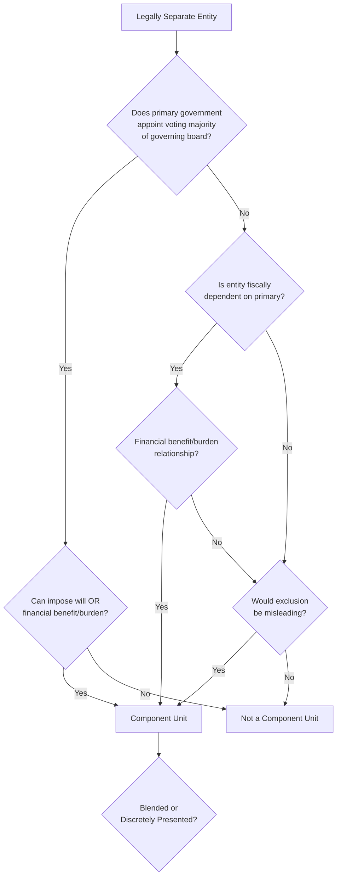
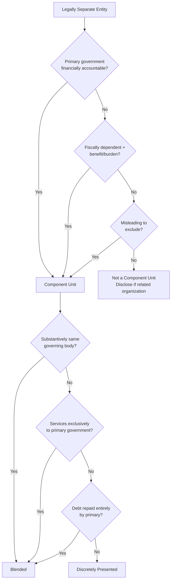

# Financial Reporting Entity

The **financial reporting entity** consists of the **primary government** together with its **component units** — legally separate organizations for which the primary government is financially accountable. Determining which entities to include and how to present them (blended vs. discretely presented) is a critical skill tested on the CPA exam. The rules are governed primarily by **GASB Statement 14** as amended by GASB 39, 61, 80, and 97.

:::info[Blueprint Coverage]

This section maps to **BAR Area III, Group A, Topic 9 – Financial Reporting Entity, including blended and discrete component units**. Representative tasks:

1. **Recall** the criteria for classifying an entity as a component unit of a state or local government and the financial statement presentation requirements (discrete or blended).

:::

---

## Defining the Financial Reporting Entity

The financial reporting entity includes:

1. **The primary government** — the state, county, city, town, or special-purpose government that has a separately elected governing body, is legally separate, and is fiscally independent.
2. **Component units** — legally separate organizations that meet specific criteria for inclusion.

The goal is to present a **complete picture** of the government's financial position — including entities it controls or for which it is financially accountable — so users are not misled.

---

## Primary Government

A primary government is any state government **or** a general-purpose local government (city, county, town, village) **or** a special-purpose government that meets **all three** of the following criteria:

| Criterion | Description |
|---|---|
| Separately elected governing body | Has a governing body elected by citizens |
| Legally separate | Is a body corporate or has corporate powers |
| Fiscally independent | Can set its own budget, levy taxes, and issue debt without approval from another government |

:::tip[Exam Tip]

If a special-purpose government (e.g., a school district) does **not** have a separately elected governing body or is **not** fiscally independent, it is likely a component unit of another government rather than a primary government itself.

:::

---

## Component Unit Criteria

A legally separate entity is a **component unit** of a primary government if any one of the following is met:

### 1. Financial Accountability — Appointing Authority + Fiscal Dependency or Financial Benefit/Burden

The primary government is financially accountable if:

**(a)** It appoints a **voting majority** of the organization's governing board, **AND**

**(b)** Either:
- It can impose its **will** on the organization (e.g., can remove board members at will, modify or approve budgets, veto decisions), **OR**
- There is a **financial benefit/burden** relationship (e.g., the primary government is legally entitled to the entity's resources or is obligated for its debts)

### 2. Fiscal Dependency

The organization is **fiscally dependent** on the primary government — it cannot adopt its budget, levy taxes, or issue debt without the primary government's approval — **AND** there is a financial benefit/burden relationship.

### 3. Misleading to Exclude

The nature and significance of the organization's relationship with the primary government is such that **exclusion would cause the reporting entity's financial statements to be misleading** (GASB 39 criterion).

---

## Blended Component Units

A component unit should be **blended** (reported as if it were part of the primary government) when **any one** of the following criteria is met:

| Criterion | Description |
|---|---|
| **Substantively the same governing body** | The component unit's governing body is substantively the same as the primary government's (GASB 61) |
| **Exclusively benefits the primary** | The component unit provides services entirely or almost entirely to the primary government (not to the public) |
| **Debt issuance** | The component unit's total debt outstanding is expected to be repaid entirely with resources of the primary government |
| **SB identical & financial benefit/burden** | The component unit's governing body is substantively the same AND there is a financial benefit/burden relationship (GASB 61) |

### How Blended Units Are Presented

- Their funds are reported as if they were the primary government's own funds
- Typically reported as special revenue funds, debt service funds, or enterprise funds of the primary government
- Only **one** fund of a blended component unit may be reported as part of the General Fund — and only if it meets specific criteria

**Example:** A city creates a **Building Authority** whose sole purpose is to issue debt to construct facilities for the city. The city council serves as the Authority's board. This entity is blended because it has substantively the same governing body and its debt will be repaid by the city.

---

## Discretely Presented Component Units

Component units that do **not** meet blending criteria are reported as **discretely presented** — shown in one or more **separate columns** in the government-wide financial statements.

### How Discrete Units Are Presented

| Statement | Presentation |
|---|---|
| Government-wide Statement of Net Position | Separate column to the right of the primary government totals |
| Government-wide Statement of Activities | Separate column or separate rows |
| Fund financial statements | Not included (unless blended) |
| Notes | Major component unit disclosures |

**Example:** A city's **Housing Authority** has a board appointed by the mayor, and the city guarantees its bonds (financial burden). The Authority provides services directly to the public (not exclusively to the city). This entity is a discretely presented component unit.

:::warning[Common Exam Trap]

Discrete component units are shown on the **government-wide** statements only. They do **not** appear in the governmental or proprietary fund financial statements. Blended component units appear in **both** fund statements and government-wide statements because they are treated as part of the primary government.

:::

---

## Presentation Summary

| Type | Government-Wide Statements | Fund Statements | Column Treatment |
|---|---|---|---|
| **Primary government** | Included | Included | Primary columns |
| **Blended component unit** | Merged with primary | Merged with primary's funds | Combined with primary |
| **Discretely presented component unit** | Separate column | Not included | Separate column |

---

## Related Organizations, Joint Ventures, and Jointly Governed Organizations

Not every related entity qualifies as a component unit:

| Category | Description | Reporting |
|---|---|---|
| **Related organization** | Primary government appoints governing board but is NOT financially accountable | Disclosure only (no inclusion) |
| **Joint venture** | Jointly controlled by two or more governments; participants retain ongoing financial interest | Equity method or disclosure |
| **Jointly governed organization** | Jointly controlled but NO ongoing financial interest or equity | Disclosure only |

:::tip[Exam Tip]

A **related organization** is often tested as a distractor. The key difference: the primary government appoints the board but **cannot** impose its will and there is **no** financial benefit/burden relationship. These are disclosed in the notes but not reported as component units.

:::

---

## GASB Pronouncements Summary

| GASB Statement | Key Provision |
|---|---|
| **GASB 14** (1991) | Original standard defining the financial reporting entity |
| **GASB 39** (2002) | Added "misleading to exclude" criterion for certain affiliated organizations |
| **GASB 61** (2010) | Clarified blending criteria; substantively same governing body + benefit/burden |
| **GASB 80** (2015) | Certain Section 457 deferred compensation plans are blended |
| **GASB 97** (2020) | Certain defined contribution pension/OPEB plans and Section 457 plans |

---

## Decision Flowchart — Complete Classification

---

## Numerical Example

**Metro City** has relationships with the following entities:

| Entity | Board Appointed by City? | Impose Will / Benefit-Burden? | Services To | Debt Repaid By |
|---|---|---|---|---|
| Metro Transit Authority | Yes (7 of 9 members) | City guarantees debt | Public | City revenues |
| Metro Parking Garage Corp | Yes (all 5 members) | Same council members serve | City only | City revenues |
| Metro Arts Foundation | Yes (4 of 7 members) | No financial benefit/burden | Public | Own revenues |
| County Library District | No | N/A | Public | Own levy |

**Classification:**

| Entity | Component Unit? | Presentation |
|---|---|---|
| Metro Transit Authority | Yes (appoints majority + financial burden) | **Discretely presented** (serves public) |
| Metro Parking Garage Corp | Yes (same governing body + serves city exclusively) | **Blended** (exclusively benefits primary) |
| Metro Arts Foundation | No (appoints majority but no impose will/benefit-burden) | **Related organization** — note disclosure only |
| County Library District | No (city does not appoint board) | Not part of reporting entity |

:::tip[Exam Tip]

When analyzing component unit questions, follow this sequence: (1) Is the entity legally separate? (2) Is the primary government financially accountable? (3) If yes — does it meet blending criteria or is it discretely presented? Work through each criterion systematically.

:::
