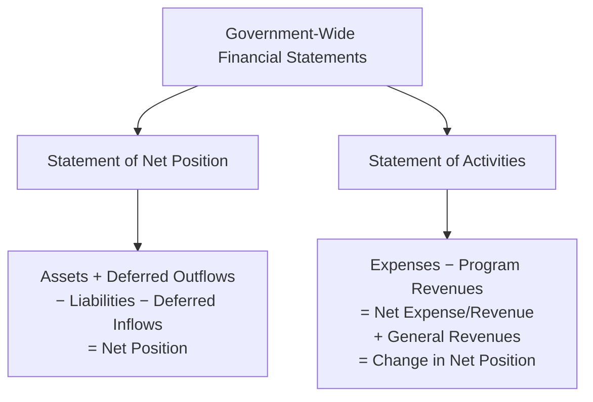
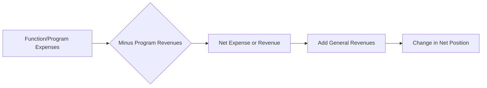

# Government-Wide Financial Statements

Government-wide financial statements present the **entire** state or local government's financial position and results of operations using the **full accrual basis of accounting** and the **economic resources measurement focus**. Required by GASB Statement No. 34, these statements provide a broad, consolidated view of the government similar to private-sector financial reporting — in contrast to the fund-level statements that emphasize fiscal accountability.

:::info[Blueprint Coverage]

This section maps to **BAR Area III, Group A, Topic 1 – Government-wide financial statements**. Representative tasks:

1. **Identify and recall** basic concepts and principles associated with government-wide financial statements (e.g., required activities, financial statements, financial statement components).
2. **Prepare** the government-wide statement of net position for a state or local government from trial balances and supporting documentation.
3. **Prepare** the government-wide statement of activities for a state or local government from trial balances and supporting documentation.

:::

---

## Overview and Purpose

Government-wide financial statements shift the reporting perspective from individual funds to the government as a whole. They answer a fundamentally different question than fund statements: **Is the government better or worse off as a result of this year's operations?**

| Feature | Government-Wide Statements | Governmental Fund Statements |
|---|---|---|
| Measurement focus | Economic resources | Current financial resources |
| Basis of accounting | Full accrual | Modified accrual |
| Capital assets | Reported and depreciated | Not reported |
| Long-term liabilities | Reported | Not reported |
| Scope | All non-fiduciary activities | Individual funds |

### Two Required Statements

| Statement | Purpose |
|---|---|
| **Statement of Net Position** | Reports assets, deferred outflows, liabilities, deferred inflows, and net position at a point in time |
| **Statement of Activities** | Reports expenses and program revenues to show the net cost of each function/program |



---

## Activities Reported

Government-wide statements organize reporting into **columns** by activity type. Fiduciary activities are excluded entirely.

| Column | Description | Fund Types Included |
|---|---|---|
| **Governmental activities** | Financed mainly by taxes, intergovernmental revenues, and other nonexchange revenues | General Fund, Special Revenue, Debt Service, Capital Projects, Permanent Funds |
| **Business-type activities** | Financed primarily by user charges to external customers | Enterprise Funds |
| **Discretely presented component units** | Legally separate entities reported in a separate column | Varies |
| **Total** | Combined column (optional presentation) | All of the above |

:::tip[Exam Tip]

**Internal service funds** are reported with **governmental activities** because they primarily serve other governmental funds. Their balances and activities are consolidated (blended) into the governmental activities column during the conversion from fund statements to government-wide statements.

:::

### What Is Excluded

**Fiduciary activities** (pension trust funds, investment trust funds, private-purpose trust funds, and custodial funds) are **never** reported in government-wide financial statements because the resources are held for parties outside the government and cannot be used to support the government's own programs.

---

## Measurement Focus and Basis of Accounting

Government-wide statements use:

- **Economic resources measurement focus** — all economic resources (both current and long-term) are reported
- **Full accrual basis of accounting** — revenues are recognized when earned; expenses are recognized when incurred

This means:

| Item | Government-Wide Treatment | Fund-Level (Governmental Funds) Treatment |
|---|---|---|
| Capital asset purchase | Capitalize and depreciate | Report as expenditure |
| Bond issuance | Record liability | Report as other financing source |
| Bond principal payment | Reduce liability | Report as expenditure |
| Accrued interest payable | Report as liability | Not reported (unless due) |
| Pension obligations | Report long-term liability | Not reported |

:::warning[Key Distinction]

The biggest exam trap is confusing modified accrual (fund level) with full accrual (government-wide). When a question asks about **government-wide** statements, think full accrual — capitalize assets, record depreciation, report all long-term debt, and accrue revenues when earned regardless of availability.

:::

---

## Statement of Net Position

### Format

The statement of net position presents:

$$
\text{Assets} + \text{Deferred Outflows of Resources} - \text{Liabilities} - \text{Deferred Inflows of Resources} = \text{Net Position}
$$

Governments may use either a **classified format** (current vs. noncurrent) or a **liquidity-based** format that lists assets in order of liquidity. The classified format is most common.

### Components of Net Position

| Component | Definition | Example |
|---|---|---|
| **Net investment in capital assets** | Capital assets, net of depreciation, less outstanding debt related to those assets (adjusted for unspent debt proceeds) | Infrastructure, buildings, equipment minus bonds payable used to acquire them |
| **Restricted** | Subject to externally imposed constraints (creditors, grantors, laws) or constitutional provisions | Debt service reserve, grant-restricted funds |
| **Unrestricted** | All other net position; may be designated but not restricted | Available for any lawful purpose |

$$
\text{Net Investment in Capital Assets} = \text{Capital Assets (net)} - \text{Related Debt} + \text{Unspent Proceeds}
$$

:::tip[Exam Tip]

If bond proceeds have **not yet been spent** on capital assets, they are added back when calculating net investment in capital assets. Only the portion of debt whose proceeds have been spent on capital assets reduces the net investment component.

:::

### Example — Statement of Net Position for Bear City

| | Governmental Activities | Business-Type Activities | Total |
|---|---:|---:|---:|
| **Assets** | | | |
| Cash and investments | \$12,500,000 | \$4,200,000 | \$16,700,000 |
| Receivables (net) | 3,800,000 | 1,600,000 | 5,400,000 |
| Internal balances | 500,000 | (500,000) | — |
| Capital assets (net of depreciation) | 85,000,000 | 32,000,000 | 117,000,000 |
| **Total assets** | **101,800,000** | **37,300,000** | **139,100,000** |
| **Deferred outflows of resources** | 2,200,000 | 400,000 | 2,600,000 |
| **Liabilities** | | | |
| Accounts payable | 2,100,000 | 900,000 | 3,000,000 |
| Accrued liabilities | 1,400,000 | 300,000 | 1,700,000 |
| Long-term liabilities: | | | |
| &emsp;Due within one year | 4,500,000 | 1,200,000 | 5,700,000 |
| &emsp;Due in more than one year | 38,000,000 | 14,000,000 | 52,000,000 |
| **Total liabilities** | **46,000,000** | **16,400,000** | **62,400,000** |
| **Deferred inflows of resources** | 3,000,000 | 200,000 | 3,200,000 |
| **Net position** | | | |
| Net investment in capital assets | 42,500,000 | 16,800,000 | 59,300,000 |
| Restricted | 5,500,000 | 1,200,000 | 6,700,000 |
| Unrestricted | 7,000,000 | 3,100,000 | 10,100,000 |
| **Total net position** | **\$55,000,000** | **\$21,100,000** | **\$76,100,000** |

:::info[Internal Balances]

Interfund receivables and payables between governmental activities and business-type activities are reported as **internal balances** and eliminate to zero in the Total column. Interfund balances within the same activity type (e.g., between two governmental funds) are eliminated entirely and do not appear.

:::

---

## Statement of Activities

### Net (Expense) Revenue Format

The statement of activities uses a unique format that shows the **net cost** of each government function — that is, how much each program must be subsidized by general revenues (primarily taxes).



### Program Revenues vs. General Revenues

| Category | Definition | Examples |
|---|---|---|
| **Charges for services** | Revenues from exchange transactions directly related to a function | Water utility fees, building permits, park admission |
| **Operating grants and contributions** | Restricted to operating purposes of a function | Federal education grant, state highway maintenance grant |
| **Capital grants and contributions** | Restricted to capital purposes of a function | Federal grant for bridge construction |
| **General revenues** | Not directly linked to a specific program | Property taxes, sales taxes, unrestricted state aid, investment earnings |

:::tip[Exam Tip]

**Taxes are always general revenues** — even if they are levied for a specific purpose (e.g., a gasoline tax earmarked for roads). The only exception is taxes levied by and restricted to a specific **component unit**, which would be program revenue of that component unit.

:::

### Example — Statement of Activities for Bear City

| Functions/Programs | Expenses | Charges for Services | Operating Grants | Capital Grants | Net (Expense) Revenue |
|---|---:|---:|---:|---:|---:|
| **Governmental activities:** | | | | | |
| General government | \$4,200,000 | \$800,000 | \$100,000 | — | (\$3,300,000) |
| Public safety | 8,500,000 | 1,200,000 | 500,000 | — | (6,800,000) |
| Public works | 6,000,000 | 400,000 | 1,000,000 | \$2,500,000 | (2,100,000) |
| Culture and recreation | 2,800,000 | 600,000 | 200,000 | — | (2,000,000) |
| Interest on long-term debt | 1,500,000 | — | — | — | (1,500,000) |
| **Total governmental activities** | **23,000,000** | **3,000,000** | **1,800,000** | **2,500,000** | **(15,700,000)** |
| **Business-type activities:** | | | | | |
| Water utility | 3,800,000 | 4,500,000 | — | 1,000,000 | 1,700,000 |
| Parking facilities | 1,200,000 | 1,400,000 | — | — | 200,000 |
| **Total business-type activities** | **5,000,000** | **5,900,000** | **—** | **1,000,000** | **1,900,000** |
| **Total government** | **\$28,000,000** | **\$8,900,000** | **\$1,800,000** | **\$3,500,000** | **(\$13,800,000)** |

| | Governmental Activities | Business-Type Activities | Total |
|---|---:|---:|---:|
| **General revenues:** | | | |
| Property taxes | \$10,000,000 | — | \$10,000,000 |
| Sales taxes | 4,500,000 | — | 4,500,000 |
| Unrestricted investment earnings | 800,000 | \$200,000 | 1,000,000 |
| Transfers | (500,000) | 500,000 | — |
| **Total general revenues and transfers** | **14,800,000** | **700,000** | **15,500,000** |
| **Change in net position** | **(900,000)** | **2,600,000** | **1,700,000** |
| Net position — beginning | 55,900,000 | 18,500,000 | 74,400,000 |
| **Net position — ending** | **\$55,000,000** | **\$21,100,000** | **\$76,100,000** |

:::warning[Common Pitfall]

Negative amounts in the net (expense) revenue column mean the program **costs more than it earns** — the deficit must be covered by general revenues. A positive amount means the program is self-supporting. Most governmental activities show net expenses (negative); business-type activities often show net revenues (positive).

:::

---

## Interfund Eliminations

When preparing government-wide statements, certain interfund transactions must be eliminated:

| Transaction Type | Treatment in Government-Wide Statements |
|---|---|
| Interfund payables/receivables within same activity type | Eliminated completely |
| Interfund payables/receivables between activity types | Reported as "internal balances" |
| Interfund transfers within same activity type | Eliminated |
| Interfund transfers between activity types | Reported as a single line "Transfers" |
| Interfund services provided and used | **Not eliminated** (reported as revenues/expenses) |
| Internal service fund activities | Consolidated into governmental activities |

---

## Example — Preparing Government-Wide Statements from Trial Balances

### Pine County Trial Balance Data

Pine County has the following adjusted trial balance data for its governmental funds and enterprise fund at year-end:

**Governmental Funds (Combined):**

| Account | Debit | Credit |
|---|---:|---:|
| Cash | \$6,000,000 | |
| Taxes receivable (net) | 2,400,000 | |
| Expenditures — general government | 3,500,000 | |
| Expenditures — public safety | 5,000,000 | |
| Capital outlay | 8,000,000 | |
| Debt service — principal | 2,000,000 | |
| Debt service — interest | 900,000 | |
| Revenues — property taxes | | \$14,000,000 |
| Revenues — charges for services | | 1,800,000 |
| Revenues — operating grants | | 1,200,000 |
| Revenues — capital grants | | 3,000,000 |
| Other financing sources — bond proceeds | | 5,000,000 |
| Fund balance — beginning | | 2,800,000 |

**Additional Information for Government-Wide Conversion:**

- Capital assets at beginning of year: \$40,000,000 (net of \$12,000,000 accumulated depreciation)
- Current year depreciation: \$3,200,000
- Capital outlay of \$8,000,000 should be capitalized
- Bonds payable at beginning of year: \$20,000,000
- New bonds issued: \$5,000,000
- Principal repaid: \$2,000,000
- Accrued interest payable at year-end: \$150,000

### Step 1 — Convert to Full Accrual

The key adjustments when moving from governmental fund data to government-wide statements:

```journal
Conversion — Capitalize capital outlay
Dr. Capital Assets[a] 8,000,000
    Cr. Expenditures — Capital Outlay 8,000,000
```

```journal
Conversion — Record depreciation
Dr. Depreciation Expense 3,200,000
    Cr. Accumulated Depreciation[ca] 3,200,000
```

```journal
Conversion — Remove bond proceeds (not revenue under full accrual)
Dr. Other Financing Sources — Bond Proceeds 5,000,000
    Cr. Bonds Payable[l] 5,000,000
```

```journal
Conversion — Remove debt principal payment (not expense under full accrual)
Dr. Bonds Payable[l] 2,000,000
    Cr. Expenditures — Debt Service Principal 2,000,000
```

```journal
Conversion — Accrue interest payable
Dr. Interest Expense 150,000
    Cr. Accrued Interest Payable[l] 150,000
```

### Step 2 — Calculate Net Position

After conversion, the government-wide balances for Pine County governmental activities:

| Item | Amount |
|---|---|
| Capital assets (net): \$40,000,000 + \$8,000,000 − \$3,200,000 | \$44,800,000 |
| Bonds payable: \$20,000,000 + \$5,000,000 − \$2,000,000 | \$23,000,000 |
| Net investment in capital assets: \$44,800,000 − \$23,000,000 | \$21,800,000 |

### Step 3 — Determine Expenses for Statement of Activities

| Function | Original Expenditure | Remove Capital Outlay | Add Depreciation | Adjusted Expense |
|---|---:|---:|---:|---:|
| General government | \$3,500,000 | — | \$1,200,000 | \$4,700,000 |
| Public safety | 5,000,000 | — | 2,000,000 | 7,000,000 |
| Interest | 900,000 | — | — | 1,050,000* |

*\*Interest adjusted for \$150,000 accrual*

:::tip[Exam Tip]

When converting fund-level expenditures to government-wide expenses, remember these adjustments:
1. **Remove** capital outlay (capitalize instead)
2. **Add** depreciation expense (allocated to functions)
3. **Remove** debt principal payments (liability reduction, not expense)
4. **Adjust** interest for accruals
5. **Remove** bond proceeds (they create a liability, not revenue)

:::

---

## Summary of Key Differences

| Feature | Statement of Net Position | Statement of Activities |
|---|---|---|
| **Time dimension** | Point in time (balance sheet) | Period of time (operating statement) |
| **Unique format** | Assets + DO − Liabilities − DI = Net Position | Net (expense) revenue format |
| **Key insight** | Overall financial position | Which programs are self-supporting |
| **Columns** | Governmental, Business-type, Component Units | Same column structure |
| **Bottom line** | Net position (three components) | Change in net position |

---

## Comprehensive Exam Tips

:::tip[Exam Tip]

**High-yield government-wide statement concepts for the BAR exam:**

1. Government-wide = **full accrual** + **economic resources**. Always capitalize assets and report all long-term debt.
2. **Fiduciary funds are excluded** — they never appear on government-wide statements.
3. **Internal service funds** are consolidated into governmental activities (not business-type).
4. **Program revenues** must be directly associated with a specific function. If a revenue cannot be tied to a function, it is a **general revenue**.
5. **Taxes are always general revenues** even when restricted to a purpose — unless they belong to a specific component unit.
6. **Internal balances** appear when interfund receivables/payables exist between governmental and business-type activities — they net to zero in the Total column.
7. On the statement of activities, **net (expense) revenue** shows the burden each function places on taxpayers. Negative = tax-supported; positive = self-supporting.
8. **Transfers** between activity types are reported as a separate line below general revenues and net to zero in the Total column.
9. When preparing from trial balances: capitalize assets, add depreciation, remove bond proceeds, remove principal payments, and accrue expenses.

:::
