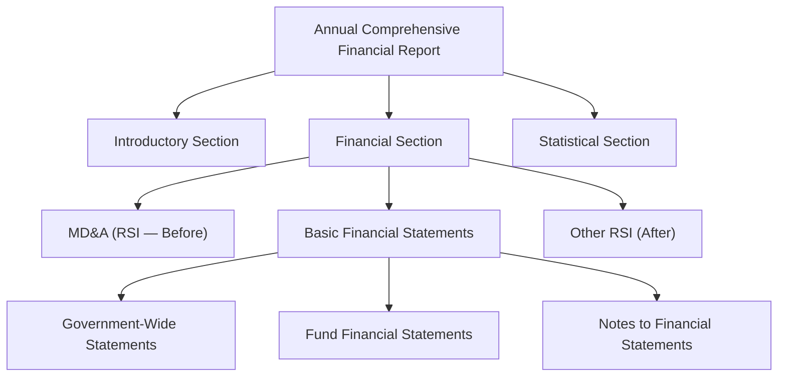

# Management's Discussion and Analysis

Management's Discussion and Analysis (MD&A) is **required supplementary information (RSI)** that precedes the basic financial statements in a state or local government's Annual Comprehensive Financial Report (ACFR). Required by GASB Statement No. 34, MD&A presents a narrative overview and analysis of the government's financial activities based on currently known facts, decisions, or conditions — written by management to help readers understand the financial statements.

:::info[Blueprint Coverage]

This section maps to **BAR Area III, Group A, Topic 6 – Management's discussion and analysis**. Representative tasks:

1. **Recall** the objectives and components of management's discussion and analysis in the annual comprehensive financial report for state and local governments.

:::

---

## Purpose and Nature of MD&A

MD&A serves as an **introductory narrative** that provides government management the opportunity to present both a short-term and long-term analysis of the government's financial activities. It is designed to help users of the financial report assess whether the government's financial position improved or deteriorated during the year.

| Characteristic | Description |
|---|---|
| **Authoritative source** | GASB Statement No. 34, paragraphs 8–11 |
| **Classification** | Required Supplementary Information (RSI) |
| **Placement** | Immediately before the basic financial statements |
| **Responsibility** | Government's management |
| **Basis** | Currently known facts, decisions, or conditions |
| **Perspective** | Objective, factual analysis (not promotional material) |

:::tip[Exam Tip]

MD&A is **required** — it is not optional. However, it is classified as RSI, not as part of the basic financial statements. This distinction matters for auditing: the auditor applies **limited procedures** to RSI rather than auditing it as part of the basic financial statements.

:::

---

## Where MD&A Fits in the ACFR

The ACFR follows a specific ordering. MD&A occupies a unique position as the only RSI that appears **before** the basic financial statements.

| Component | Position | Classification |
|---|---|---|
| **MD&A** | Before basic financial statements | RSI |
| Government-wide financial statements | Basic financial statements | Audited |
| Fund financial statements | Basic financial statements | Audited |
| Notes to financial statements | Basic financial statements | Audited |
| Budgetary comparison schedules | After basic financial statements | RSI |
| Pension/OPEB schedules | After basic financial statements | RSI |

:::warning[Common Misconception]

Do not confuse MD&A with the transmittal letter. The **transmittal letter** is in the introductory section and is unaudited supplementary information. **MD&A** is in the financial section, is RSI, and is subject to limited auditor procedures. The transmittal letter may be more promotional in tone; MD&A must be factual and analytical.

:::

---

## Required Components of MD&A

GASB 34 specifies **eight required topics** that must be addressed in the MD&A. Governments should confine their discussion to these topics.

| # | Required Component | Focus |
|---|---|---|
| 1 | Brief discussion of the basic financial statements | Explain what they show and the relationships between them |
| 2 | Condensed comparative financial data | Current and prior year data from government-wide statements |
| 3 | Overall financial position and results of operations | Analysis of changes in net position and activities |
| 4 | Individual fund analysis | Significant changes in balances and transactions of individual funds |
| 5 | Budget variances | Significant variations between original budget, final budget, and actual results for the General Fund |
| 6 | Capital asset and long-term debt activity | Significant activity during the year |
| 7 | Infrastructure condition (if modified approach) | Condition assessments and maintenance/preservation levels |
| 8 | Currently known facts, decisions, or conditions | Events expected to significantly affect future financial position or operations |

:::tip[Exam Tip]

A helpful mnemonic for the eight MD&A components: **"Big Cities Build Infrastructures For Better Future Growth"** — Basic financial statements discussion, Condensed comparative data, Budget variances, Infrastructure (modified approach), Fund analysis, capital asset/debt (Balance sheet long-term items), Future known facts, Government-wide overall analysis.

:::

---

## Condensed Comparative Financial Data

One of the most important MD&A components is the presentation of **condensed comparative financial data** derived from the government-wide statements. This includes both the Statement of Net Position and the Statement of Activities, comparing the current year to the prior year.

### Condensed Statement of Net Position (Example)

| | Governmental Activities | | Business-Type Activities | |
|---|---:|---:|---:|---:|
| | **Current Year** | **Prior Year** | **Current Year** | **Prior Year** |
| Current and other assets | \$18,300,000 | \$17,100,000 | \$5,800,000 | \$5,500,000 |
| Capital assets (net) | 85,000,000 | 82,000,000 | 32,000,000 | 30,500,000 |
| **Total assets** | **103,300,000** | **99,100,000** | **37,800,000** | **36,000,000** |
| Deferred outflows of resources | 2,200,000 | 1,900,000 | 400,000 | 350,000 |
| Current liabilities | 3,500,000 | 3,200,000 | 1,200,000 | 1,100,000 |
| Long-term liabilities | 42,500,000 | 40,000,000 | 15,200,000 | 14,500,000 |
| **Total liabilities** | **46,000,000** | **43,200,000** | **16,400,000** | **15,600,000** |
| Deferred inflows of resources | 3,000,000 | 2,800,000 | 200,000 | 150,000 |
| Net investment in capital assets | 42,500,000 | 41,000,000 | 16,800,000 | 16,000,000 |
| Restricted | 5,500,000 | 5,200,000 | 1,200,000 | 1,100,000 |
| Unrestricted | 8,500,000 | 8,800,000 | 3,600,000 | 3,500,000 |
| **Total net position** | **\$56,500,000** | **\$55,000,000** | **\$21,600,000** | **\$20,600,000** |

### Condensed Statement of Activities (Example)

| | Governmental Activities | | Business-Type Activities | |
|---|---:|---:|---:|---:|
| | **Current Year** | **Prior Year** | **Current Year** | **Prior Year** |
| Program revenues: | | | | |
| &emsp;Charges for services | \$3,200,000 | \$3,000,000 | \$5,900,000 | \$5,600,000 |
| &emsp;Operating grants | 1,800,000 | 1,700,000 | — | — |
| &emsp;Capital grants | 2,500,000 | 2,000,000 | 1,000,000 | 800,000 |
| General revenues: | | | | |
| &emsp;Property taxes | 10,500,000 | 10,000,000 | — | — |
| &emsp;Sales taxes | 4,800,000 | 4,500,000 | — | — |
| &emsp;Other | 900,000 | 850,000 | 200,000 | 180,000 |
| **Total revenues** | **23,700,000** | **22,050,000** | **7,100,000** | **6,580,000** |
| Total expenses | 22,200,000 | 21,500,000 | 6,100,000 | 5,900,000 |
| Transfers | (500,000) | (400,000) | 500,000 | 400,000 |
| **Change in net position** | **\$1,000,000** | **\$150,000** | **\$1,500,000** | **\$1,080,000** |

---

## Analysis of Overall Financial Position

After presenting the condensed data, MD&A must include **narrative analysis** explaining the reasons for significant changes. The analysis should address both the Statement of Net Position and the Statement of Activities.

### Example Analysis Paragraph

> *"The net position of the City's governmental activities increased by \$1,000,000 (1.8%) during the current fiscal year, compared to an increase of \$150,000 in the prior year. The improvement is primarily attributable to a \$500,000 increase in property tax revenues resulting from new construction and a \$500,000 increase in capital grant funding for the Main Street bridge project. These increases were partially offset by a \$700,000 increase in public safety expenses due to new collective bargaining agreements effective July 1."*

:::info[Analysis Best Practices]

Effective MD&A analysis should:

- Explain **why** changes occurred, not merely restate the numbers
- Identify specific causes of significant fluctuations
- Discuss the implications of changes for the government's financial health
- Use dollar amounts and percentages to quantify changes

:::

---

## Individual Fund Analysis

MD&A must discuss significant changes in balances and transactions for individual major funds. This section bridges the government-wide perspective with the fund-level detail.

| Fund | Key Items to Discuss |
|---|---|
| **General Fund** | Changes in fund balance, revenue trends, expenditure changes |
| **Major special revenue funds** | Significant grant activity, restricted revenue changes |
| **Major capital projects funds** | Project status, bond proceeds received and spent |
| **Major enterprise funds** | Operating income changes, rate increases, capital investment |

---

## Budget Variance Analysis

MD&A must analyze **significant variances** between:

1. **Original budget** and **final budget** (explains amendments during the year)
2. **Final budget** and **actual results** (explains performance vs. plan)

This requirement applies to the General Fund and, at the government's option, other major governmental funds with legally adopted annual budgets.

### Example Budget Variance Discussion

| General Fund | Original Budget | Final Budget | Actual | Variance (Final vs. Actual) |
|---|---:|---:|---:|---:|
| Total revenues | \$14,000,000 | \$14,200,000 | \$14,500,000 | \$300,000 favorable |
| Total expenditures | 13,800,000 | 14,100,000 | 13,900,000 | 200,000 favorable |
| Net change in fund balance | \$200,000 | \$100,000 | \$600,000 | \$500,000 favorable |

> *"The original budget was amended during the year to appropriate \$300,000 from fund balance for emergency road repairs following the March storm. Actual revenues exceeded the final budget by \$300,000 primarily due to higher-than-anticipated sales tax collections in the fourth quarter. Actual expenditures were \$200,000 below the final budget because the emergency road repairs cost less than originally estimated."*

:::tip[Exam Tip]

Remember that budget variance analysis in MD&A focuses on **why** the variances occurred. The budgetary comparison schedule (separate RSI) presents the numbers; MD&A provides the narrative explanation of significant deviations.

:::

---

## Capital Asset and Long-Term Debt Activity

MD&A must describe significant capital asset and long-term debt activity during the year.

### Capital Asset Activity Example

| Capital Assets (Net) | Governmental Activities | Business-Type Activities |
|---|---:|---:|
| Beginning balance | \$82,000,000 | \$30,500,000 |
| Additions | 6,500,000 | 3,200,000 |
| Retirements | (300,000) | (100,000) |
| Depreciation | (3,200,000) | (1,600,000) |
| **Ending balance** | **\$85,000,000** | **\$32,000,000** |

### Long-Term Debt Activity Example

| Outstanding Debt | Governmental Activities | Business-Type Activities |
|---|---:|---:|
| Beginning balance | \$40,000,000 | \$14,500,000 |
| New issuances | 5,000,000 | 2,000,000 |
| Retirements | (2,500,000) | (1,300,000) |
| **Ending balance** | **\$42,500,000** | **\$15,200,000** |

---

## Infrastructure Condition (Modified Approach)

If a government uses the **modified approach** for reporting infrastructure assets (preserving them at a target condition level rather than depreciating), MD&A must discuss:

| Required Disclosure | Description |
|---|---|
| Condition assessment results | Most recent assessment vs. condition level established by government |
| Comparison of estimated vs. actual maintenance | Whether actual preservation spending met estimated needs |
| Significant changes | Any changes in condition levels or estimated maintenance |

:::info[Modified Approach Reminder]

Under the modified approach, infrastructure assets are **not depreciated**. Instead, the government commits to maintaining them at a condition level established by the government. All maintenance and preservation costs are expensed. This approach is only available for infrastructure assets that are part of a network or subsystem managed as such.

:::

---

## Currently Known Facts, Decisions, or Conditions

The final required component addresses **forward-looking information** — but only information based on facts that are **currently known** as of the report date. This is not a forecast or projection section.

Examples of items to discuss:

- Approved but not-yet-issued debt
- Pending litigation with probable outcomes
- Planned facility closures or program eliminations
- Enacted tax rate changes effective in future periods
- Known grant awards for future periods
- Natural disaster impacts not yet fully reflected

---

## Limitations on MD&A Content

GASB 34 explicitly limits what may be included in MD&A:

| Permitted | Not Permitted |
|---|---|
| Discussion of the eight required topics | Information GASB does not require or authorize |
| Objective, factual analysis | Subjective opinions without factual basis |
| Currently known facts | Speculation about future events |
| Comparative data from government-wide statements | Fund-level comparative data not required by GASB 34 |
| References to other sections of the ACFR | Promotional or marketing content |

:::warning[Exam Alert]

A government **cannot** use MD&A to present information that GASB does not specifically require or authorize for MD&A. This is a common exam point — if a question asks whether a particular item belongs in MD&A, check whether it falls within one of the eight required topics.

:::

---

## Comprehensive Exam Tips

:::tip[Exam Tip]

**High-yield MD&A concepts for the BAR exam:**

1. MD&A is **RSI** — not part of the basic financial statements, but it is **required** (not optional).
2. MD&A is placed **before** the basic financial statements — it is the only RSI with this placement.
3. MD&A must include **condensed comparative data** from the government-wide statements (current vs. prior year).
4. The **eight required components** are specifically enumerated by GASB 34 — governments should confine their discussion to these topics.
5. Budget variance analysis covers **original vs. final budget** and **final budget vs. actual** for the General Fund.
6. MD&A is based on **currently known facts** — it is not a forecast or promotional document.
7. **Management** is responsible for preparing MD&A — not the auditor.
8. If the government uses the **modified approach** for infrastructure, MD&A must discuss condition assessments and maintenance levels.
9. The auditor applies **limited procedures** to MD&A (it is RSI, not audited financial statements).

:::
