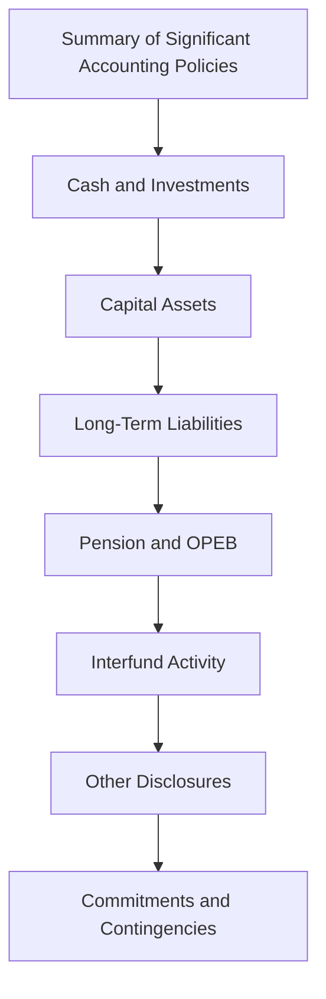
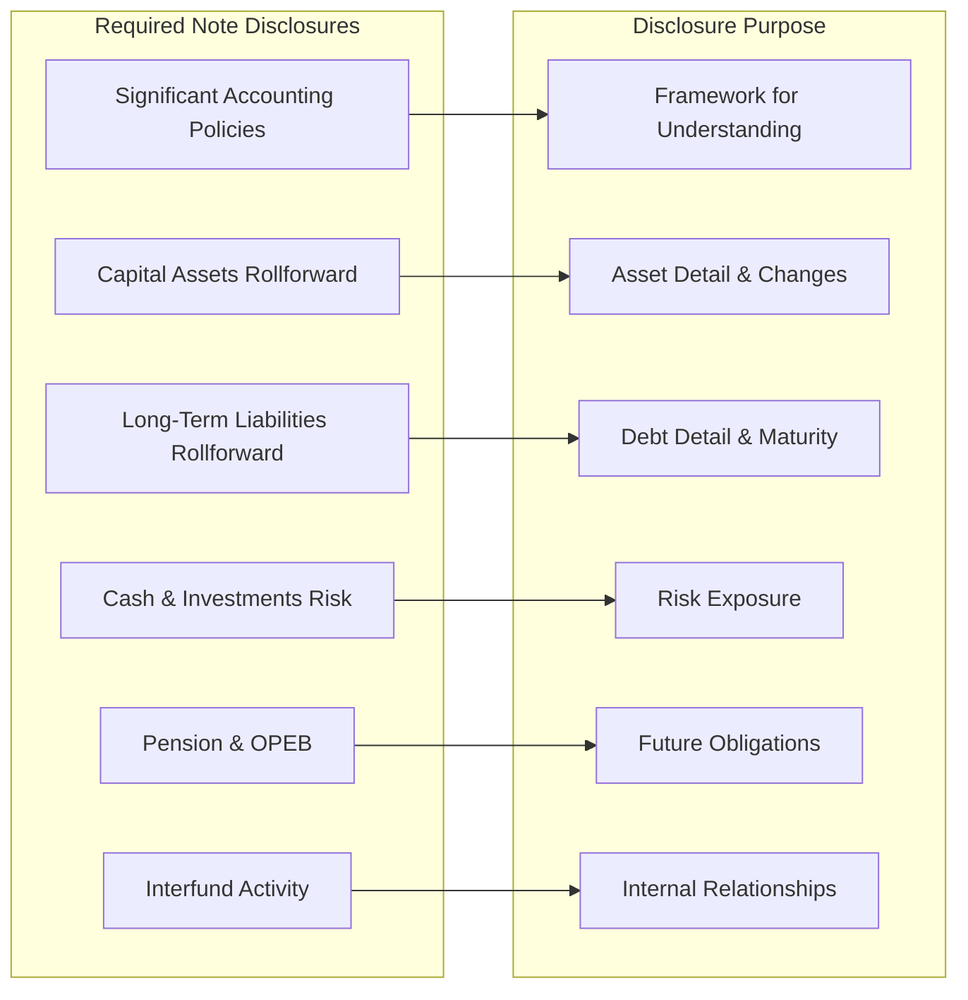

# Notes to Financial Statements

Notes to the financial statements are an integral part of the basic financial statements of state and local governments. They provide essential disclosures and additional information that cannot be presented on the face of the financial statements but are necessary for a fair presentation in conformity with GAAP. GASB standards require specific note disclosures covering accounting policies, capital assets, long-term liabilities, and numerous other topics.

:::info[Blueprint Coverage]

**BAR Area III, Group A, Topic 5 – Notes to financial statements**

Representative tasks:
- **Recall** the disclosure requirements for significant accounting policies, infrastructure and capital assets, and long-term liabilities in the notes to the basic financial statements of state and local governments.

:::

---

## Purpose and Role of the Notes

The notes to the financial statements serve several critical functions in governmental financial reporting:

| Function | Description |
|----------|-------------|
| Integral component | Notes are not supplementary — they are part of the basic financial statements |
| Essential disclosures | Provide information necessary for fair presentation that cannot appear on the face of the statements |
| Context and detail | Explain accounting policies, significant balances, and commitments |
| GASB compliance | Required by GASB Statement No. 38 and other pronouncements |

:::tip[Exam Tip]

Remember that notes are part of the **basic financial statements**, not Required Supplementary Information (RSI). The basic financial statements include: (1) government-wide statements, (2) fund financial statements, and (3) notes to the financial statements.

:::

---

## Organization of the Notes

Notes are typically presented in a logical order that helps users understand the financial statements:

The summary of significant accounting policies is almost always presented as the **first note** in the financial statements.

---

## Required Disclosures — Summary of Significant Accounting Policies

The first note typically discloses the government's significant accounting policies and provides the framework for understanding the financial statements.

### Key Policy Disclosures

| Policy Area | Required Disclosure |
|-------------|-------------------|
| Reporting entity | Description of the government and its component units |
| Government-wide statements | Basis of presentation, elimination of internal activity |
| Fund financial statements | Major fund criteria, fund types used |
| Measurement focus | Economic resources (government-wide, proprietary) vs. current financial resources (governmental funds) |
| Basis of accounting | Accrual (government-wide, proprietary) vs. modified accrual (governmental funds) |
| Revenue recognition | Availability period used for modified accrual (typically 60 days) |
| Operating vs. nonoperating | Policy for classifying revenues/expenses in proprietary funds |
| Capital assets | Capitalization thresholds, depreciation methods, estimated useful lives |
| Fund balance | Policies for classifying fund balance (nonspendable, restricted, committed, assigned, unassigned) |
| Net position | Components and policies |

### Measurement Focus and Basis of Accounting

| Statement Type | Measurement Focus | Basis of Accounting |
|---------------|-------------------|-------------------|
| Government-wide | Economic resources | Accrual |
| Governmental funds | Current financial resources | Modified accrual |
| Proprietary funds | Economic resources | Accrual |
| Fiduciary funds | Economic resources | Accrual |

:::warning[Common Exam Trap]

The availability period for modified accrual revenue recognition is a policy choice disclosed in the notes. Most governments use 60 days after year-end, but this is not a GAAP requirement — it is a policy decision that must be disclosed.

:::

---

## Required Disclosures — Capital Assets and Infrastructure

GASB requires detailed disclosures about capital assets, including a rollforward schedule showing beginning balances, additions, disposals, and ending balances.

### Required Capital Asset Disclosures

| Disclosure Element | Description |
|-------------------|-------------|
| Beginning and ending balances | By major class of capital asset |
| Acquisitions | Additions during the period |
| Sales/disposals | Retirements during the period |
| Depreciation expense | Current period amount, by function if allocated |
| Capitalization policy | Threshold amounts and useful lives |
| Construction in progress | Amounts and significant commitments |

### Major Classes of Capital Assets

- Land (not depreciated)
- Buildings and improvements
- Equipment and vehicles
- Infrastructure (roads, bridges, water/sewer systems)
- Construction in progress (not depreciated)

### Modified Approach for Infrastructure

Governments may elect to use the **modified approach** for eligible infrastructure assets instead of depreciation:

| Requirement | Description |
|-------------|-------------|
| Asset management system | Must maintain an up-to-date inventory and perform condition assessments at least every three years |
| Condition level | Must document that assets are being preserved at or above a condition level established by the government |
| Disclosure | Must disclose assessed condition, target condition, and comparison of estimated vs. actual maintenance/preservation spending for the past five years |

:::tip[Exam Tip]

Under the modified approach, infrastructure assets are **not depreciated**. Instead, maintenance and preservation costs are expensed in the period incurred. Only additions and improvements that increase capacity or efficiency are capitalized.

:::

### Example Capital Asset Note Disclosure

A typical capital asset rollforward schedule appears as follows:

| Capital Asset Category | Beginning Balance | Additions | Disposals | Ending Balance |
|----------------------|:-:|:-:|:-:|:-:|
| **Non-depreciable:** | | | | |
| Land | \$5,000,000 | \$200,000 | \$0 | \$5,200,000 |
| Construction in progress | \$3,500,000 | \$2,100,000 | (\$1,800,000) | \$3,800,000 |
| **Depreciable:** | | | | |
| Buildings | \$45,000,000 | \$1,800,000 | (\$500,000) | \$46,300,000 |
| Equipment | \$12,000,000 | \$1,500,000 | (\$800,000) | \$12,700,000 |
| Infrastructure | \$80,000,000 | \$4,000,000 | (\$200,000) | \$83,800,000 |
| **Less: Accumulated depreciation** | (\$52,000,000) | (\$4,200,000) | \$1,100,000 | (\$55,100,000) |
| **Capital assets, net** | **\$93,500,000** | **\$5,400,000** | **(\$2,200,000)** | **\$96,700,000** |

---

## Required Disclosures — Long-Term Liabilities

Governments must disclose detailed information about all long-term obligations, including a rollforward schedule and debt service requirements.

### Required Long-Term Liability Disclosures

| Disclosure Element | Description |
|-------------------|-------------|
| Beginning and ending balances | For each type of long-term liability |
| Increases | New debt issued or obligations incurred |
| Decreases | Principal payments, refundings, or other reductions |
| Due within one year | Current portion for each liability type |
| Debt service requirements | Annual principal and interest payments to maturity |
| Terms and conditions | Interest rates, maturity dates, security/collateral |
| Debt limitations | Legal or constitutional debt limits and available margin |

### Types of Long-Term Liabilities Disclosed

| Liability Type | Common Details Disclosed |
|---------------|------------------------|
| General obligation bonds | Purpose, interest rates, maturity schedule, voted authorization |
| Revenue bonds | Pledged revenue source, coverage ratios, rate covenants |
| Notes payable | Terms, interest rates, repayment schedule |
| Capital leases / Financing arrangements | Lease terms, future minimum payments |
| Compensated absences | Policy for accumulation and payout |
| Net pension liability | Plan details, assumptions, sensitivity |
| Net OPEB liability | Plan details, assumptions, sensitivity |
| Claims and judgments | Nature, estimated settlement amounts |

### Example Long-Term Liability Note Disclosure

A typical long-term liability rollforward schedule:

| Liability Type | Beginning Balance | Increases | Decreases | Ending Balance | Due Within One Year |
|---------------|:-:|:-:|:-:|:-:|:-:|
| G.O. bonds | \$50,000,000 | \$10,000,000 | (\$5,000,000) | \$55,000,000 | \$5,500,000 |
| Revenue bonds | \$30,000,000 | \$0 | (\$3,000,000) | \$27,000,000 | \$3,100,000 |
| Notes payable | \$4,000,000 | \$1,000,000 | (\$800,000) | \$4,200,000 | \$850,000 |
| Capital leases | \$6,500,000 | \$2,000,000 | (\$1,200,000) | \$7,300,000 | \$1,400,000 |
| Compensated absences | \$3,200,000 | \$2,800,000 | (\$2,600,000) | \$3,400,000 | \$680,000 |
| Net pension liability | \$25,000,000 | \$4,500,000 | (\$2,000,000) | \$27,500,000 | \$0 |
| Net OPEB liability | \$18,000,000 | \$3,200,000 | (\$1,500,000) | \$19,700,000 | \$0 |
| **Total** | **\$136,700,000** | **\$23,500,000** | **(\$16,100,000)** | **\$144,100,000** | **\$11,530,000** |

### Debt Service Requirements to Maturity

Governments must also disclose future debt service requirements, typically in a table format:

| Fiscal Year | Principal | Interest | Total |
|-------------|:-:|:-:|:-:|
| 2026 | \$8,600,000 | \$4,100,000 | \$12,700,000 |
| 2027 | \$8,900,000 | \$3,750,000 | \$12,650,000 |
| 2028 | \$9,200,000 | \$3,380,000 | \$12,580,000 |
| 2029 | \$9,500,000 | \$2,990,000 | \$12,490,000 |
| 2030 | \$9,800,000 | \$2,580,000 | \$12,380,000 |
| 2031–2035 | \$36,000,000 | \$7,200,000 | \$43,200,000 |
| **Total** | **\$82,000,000** | **\$24,000,000** | **\$106,000,000** |

:::tip[Exam Tip]

The "due within one year" column in the long-term liability rollforward identifies the **current portion** of each liability. Net pension liability and net OPEB liability typically show \$0 due within one year because they are measured as a single long-term amount.

:::

---

## Other Common Note Disclosures

### Cash and Investments

| Disclosure Area | Required Information |
|----------------|---------------------|
| Deposit policies | Types of deposits, custodial credit risk exposure |
| Investment policies | Authorized investment types, concentration limits |
| Custodial credit risk | Amounts uninsured and uncollateralized |
| Credit risk | Credit quality ratings of investments |
| Interest rate risk | Segmented time distribution or duration |
| Fair value measurements | Hierarchy levels (Level 1, 2, 3) |

### Pension and OPEB Plans

| Disclosure Area | Required Information |
|----------------|---------------------|
| Plan description | Type of plan, benefits provided, membership |
| Funding policy | Contribution requirements, actuarial methods |
| Net pension/OPEB liability | Components (total liability less plan fiduciary net position) |
| Actuarial assumptions | Discount rate, inflation, salary growth, mortality tables |
| Sensitivity analysis | Impact of 1% change in discount rate |
| Deferred inflows/outflows | Related to pensions and OPEB |

### Risk Management

| Disclosure Area | Required Information |
|----------------|---------------------|
| Types of risk | Property, liability, workers' compensation, health |
| Risk financing | Commercial insurance, self-insurance, risk pools |
| Claims liability | Basis for estimating, rollforward of claims |
| Significant reductions | Changes in coverage from prior year |

### Interfund Balances and Transfers

| Disclosure Area | Required Information |
|----------------|---------------------|
| Interfund receivables/payables | Purpose, repayment terms |
| Interfund transfers | Purpose, amounts by fund, unusual transfers |
| Internal service fund activity | Elimination in government-wide statements |

### Commitments and Contingencies

| Disclosure Area | Required Information |
|----------------|---------------------|
| Construction commitments | Remaining contract amounts, funding sources |
| Litigation | Nature of claims, estimated liability if probable |
| Grant contingencies | Amounts subject to audit and potential repayment |
| Encumbrances | Outstanding purchase orders and contracts |

### Component Unit Information

| Disclosure Area | Required Information |
|----------------|---------------------|
| Blended units | Criteria for blending, nature of relationship |
| Discretely presented units | Criteria for inclusion, nature of relationship |
| Related party transactions | Significant transactions with component units |

### Property Tax Calendar and Revenue Recognition

| Disclosure Area | Required Information |
|----------------|---------------------|
| Levy date | When taxes are assessed |
| Lien date | When government has legal claim |
| Due dates | Payment due dates |
| Collection period | Period used for revenue recognition under modified accrual |

---

## Summary of Key Note Disclosure Requirements

:::warning[Key Distinction]

Do not confuse **notes to the financial statements** (part of basic financial statements) with **Required Supplementary Information (RSI)**. RSI includes budgetary comparisons, pension/OPEB schedules, and infrastructure condition data under the modified approach. RSI is presented immediately after the notes but is not part of the basic financial statements.

:::

---

## Exam Focus Summary

| Topic | Key Points to Remember |
|-------|----------------------|
| Accounting policies note | Always the first note; describes measurement focus, basis of accounting, fund balance policies |
| Capital assets | Rollforward schedule by major class; modified approach as alternative to depreciation for infrastructure |
| Long-term liabilities | Rollforward with due-within-one-year column; debt service to maturity; terms and security |
| Cash and investments | Custodial credit risk, credit risk, interest rate risk, fair value hierarchy |
| Pension/OPEB | Net liability components, actuarial assumptions, discount rate sensitivity |
| Notes vs. RSI | Notes = basic financial statements; RSI = required but not part of basic statements |
