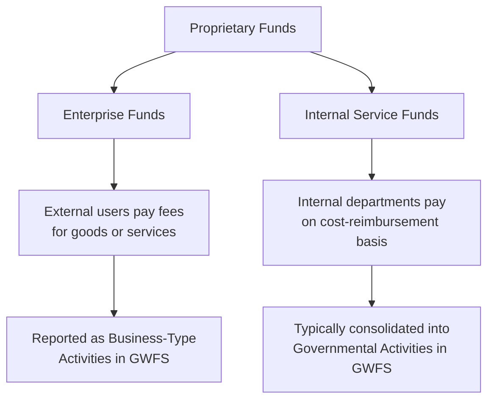
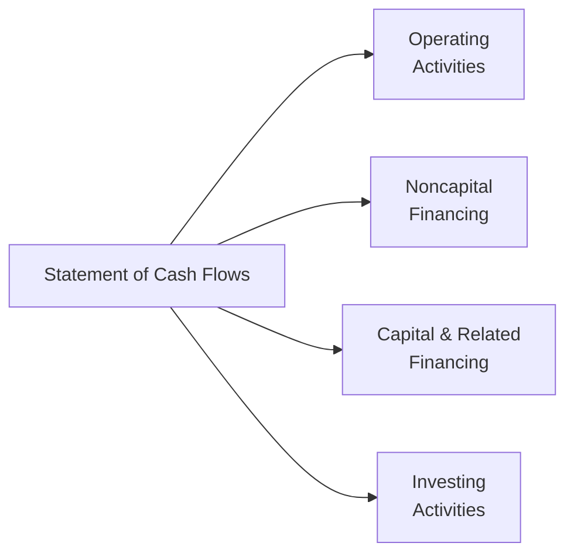
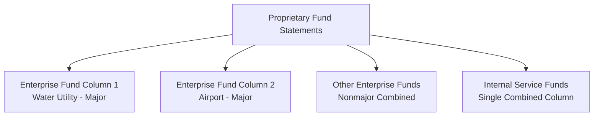

# Proprietary Funds Financial Statements

Proprietary funds account for government activities that operate similarly to private-sector businesses, providing goods or services to external customers or to other departments on a fee-for-service basis. They use the **economic resources measurement focus** and **full accrual basis** of accounting — the same model as commercial enterprises — and report capital assets, long-term liabilities, and depreciation directly on their fund-level statements.

:::info[Blueprint Coverage]

This section maps to **BAR Area III, Group A, Topic 3 – Proprietary funds financial statements**. Representative tasks:

1. **Identify and recall** basic concepts and principles associated with proprietary fund financial statements (e.g., required funds, financial statements, financial statement components).
2. **Prepare** the statement of revenues, expenses, and changes in fund net position for the proprietary funds of a state or local government from trial balances and supporting documentation.
3. **Prepare** the statement of net position for the proprietary funds of a state or local government from trial balances and supporting documentation.
4. **Prepare** the statement of cash flows for the proprietary funds of a state or local government.

:::

---

## Two Types of Proprietary Funds

Proprietary funds are divided into two categories based on **who** they serve:

| Fund Type | Serves | Examples |
|---|---|---|
| **Enterprise Funds** | External users (the public) | Water/sewer utility, airport, parking garage, transit authority, municipal golf course |
| **Internal Service Funds** | Other departments or governments | Motor pool, IT services, central printing, self-insurance, central purchasing |



### Enterprise Funds — When Required

An enterprise fund **must** be used when one or more of the following criteria are met:

1. The activity is financed with **debt backed solely by a pledge of the net revenues** from fees and charges of the activity.
2. **Laws or regulations** require that the activity's costs (including capital costs such as depreciation) be recovered with fees and charges rather than taxes.
3. **Management's pricing policy** is designed to recover the costs of providing services, including capital costs such as depreciation.

:::tip[Exam Tip]

Remember the "debt, law, pricing" mnemonic for mandatory enterprise fund usage. If a question says bonds are secured solely by utility revenues, that activity **must** be in an enterprise fund.

:::

### Internal Service Funds — Key Characteristics

- Used when one government department sells goods/services to another department on a **cost-reimbursement** basis.
- Never required — always a **management choice**.
- If the internal service fund predominantly serves **governmental** activities, its assets and liabilities are typically reported within governmental activities in the government-wide statements.

---

## Measurement Focus and Basis of Accounting

Because proprietary funds mirror commercial accounting, they differ significantly from governmental funds:

| Feature | Proprietary Funds | Governmental Funds |
|---|---|---|
| **Measurement focus** | Economic resources | Current financial resources |
| **Basis of accounting** | Full accrual | Modified accrual |
| **Reports capital assets?** | Yes (with depreciation) | No |
| **Reports long-term liabilities?** | Yes | No |
| **Revenue recognition** | When earned | When measurable and available |
| **Expense vs. expenditure** | Reports expenses | Reports expenditures |
| **Bottom line** | Net position | Fund balance |

:::warning[Critical Distinction]

Proprietary funds report **expenses** (including depreciation and amortization), not expenditures. When you see "expenditures" on a proprietary fund statement, it is always wrong.

:::

---

## Three Required Financial Statements

Proprietary funds must present three fund-level financial statements:

| # | Statement | Purpose |
|---|---|---|
| 1 | **Statement of Net Position** | Reports assets, deferred outflows, liabilities, deferred inflows, and net position at a point in time |
| 2 | **Statement of Revenues, Expenses, and Changes in Fund Net Position** | Reports operating and nonoperating results for the period |
| 3 | **Statement of Cash Flows** | Reports cash inflows and outflows in four categories using the **direct method** |

---

## Statement of Net Position

The statement of net position may be presented in either a **classified** (current/noncurrent) format or an unclassified **liquidity** format. Most governments use the classified balance-sheet format.

### Net Position Categories

$$
\text{Net Position} = \text{Assets} + \text{Deferred Outflows} - \text{Liabilities} - \text{Deferred Inflows}
$$

Net position is divided into three components:

| Component | Definition |
|---|---|
| **Net investment in capital assets** | Capital assets, net of accumulated depreciation, minus outstanding debt related to those assets (plus unspent bond proceeds) |
| **Restricted** | Resources with externally imposed constraints (creditors, grantors, laws) or constitutional provisions |
| **Unrestricted** | All remaining net position — may include board designations, but these are **not** restrictions |

### Example — Statement of Net Position

**Bear City Water Utility Fund — Statement of Net Position — December 31, 20X5**

| | Amount |
|---|---|
| **Assets** | |
| Current assets: | |
| &emsp;Cash and cash equivalents | \$2,450,000 |
| &emsp;Accounts receivable (net) | 1,380,000 |
| &emsp;Inventories | 210,000 |
| &emsp;**Total current assets** | **4,040,000** |
| Noncurrent assets: | |
| &emsp;Capital assets (net of depreciation) | 18,600,000 |
| &emsp;**Total assets** | **22,640,000** |
| **Deferred Outflows of Resources** | 320,000 |
| **Liabilities** | |
| Current liabilities: | |
| &emsp;Accounts payable | 680,000 |
| &emsp;Accrued salaries | 140,000 |
| &emsp;Current portion of revenue bonds | 500,000 |
| &emsp;**Total current liabilities** | **1,320,000** |
| Noncurrent liabilities: | |
| &emsp;Revenue bonds payable | 7,500,000 |
| &emsp;**Total liabilities** | **8,820,000** |
| **Deferred Inflows of Resources** | 180,000 |
| **Net Position** | |
| &emsp;Net investment in capital assets | 10,600,000 |
| &emsp;Restricted for debt service | 850,000 |
| &emsp;Unrestricted | 2,510,000 |
| &emsp;**Total net position** | **\$13,960,000** |

---

## Statement of Revenues, Expenses, and Changes in Fund Net Position

This statement distinguishes **operating** from **nonoperating** items:

### Operating vs. Nonoperating Classification

| Category | Examples |
|---|---|
| **Operating revenues** | Charges for services, water usage fees, sewer connection fees, parking fees |
| **Operating expenses** | Salaries, utilities, supplies, depreciation, repairs, contractual services |
| **Nonoperating revenues** | Interest income, grants not restricted to capital, gain on sale of assets |
| **Nonoperating expenses** | Interest expense, loss on sale of assets |

Below the nonoperating section, report:
- Capital contributions (tap fees, developer contributions, capital grants)
- Transfers in/out
- Special and extraordinary items (if applicable)

:::tip[Exam Tip]

**Interest expense** on revenue bonds is always classified as **nonoperating** — even though the bonds finance the core operations of the enterprise fund. The GASB considers interest a financing cost, not an operating cost.

:::

### Example — Statement of Revenues, Expenses, and Changes in Fund Net Position

**Bear City Water Utility Fund — Year Ended December 31, 20X5**

| | Amount |
|---|---|
| **Operating revenues:** | |
| &emsp;Charges for services | \$8,200,000 |
| &emsp;Connection fees | 340,000 |
| &emsp;**Total operating revenues** | **8,540,000** |
| **Operating expenses:** | |
| &emsp;Personnel services | 2,800,000 |
| &emsp;Purchased water | 1,950,000 |
| &emsp;Utilities | 420,000 |
| &emsp;Supplies and materials | 310,000 |
| &emsp;Depreciation | 1,400,000 |
| &emsp;Repairs and maintenance | 280,000 |
| &emsp;**Total operating expenses** | **7,160,000** |
| **Operating income** | **1,380,000** |
| **Nonoperating revenues (expenses):** | |
| &emsp;Interest income | 85,000 |
| &emsp;Interest expense | (525,000) |
| &emsp;**Total nonoperating expenses** | **(440,000)** |
| **Income before contributions and transfers** | **940,000** |
| Capital contributions | 600,000 |
| Transfers out | (150,000) |
| **Change in net position** | **1,390,000** |
| Net position — beginning of year | 12,570,000 |
| **Net position — end of year** | **\$13,960,000** |

---

## Statement of Cash Flows

The proprietary fund statement of cash flows has two **unique features** compared to FASB standards:

1. **Direct method is required** (FASB allows either direct or indirect).
2. Cash flows are classified into **four** categories (FASB uses three).

### Four Categories of Cash Flows



| Category | Description | Examples |
|---|---|---|
| **Operating Activities** | Cash from providing services and paying for operations | Cash received from customers, cash paid to employees, cash paid to suppliers |
| **Noncapital Financing Activities** | Borrowings/grants for operating purposes, interfund transfers | Operating grants received, transfers to/from other funds, short-term borrowings not related to capital |
| **Capital and Related Financing Activities** | Acquisition of capital assets and related debt | Purchase of capital assets, bond proceeds for capital, principal and interest payments on capital debt, capital contributions received |
| **Investing Activities** | Purchase/sale of investments and returns thereon | Purchase of investments, proceeds from sale of investments, interest and dividends received |

:::warning[GASB vs. FASB Difference]

The GASB splits FASB's single "financing activities" category into two: **noncapital financing** and **capital and related financing**. Interest and dividends received go to **investing activities** under GASB (not operating). This is a frequent exam question.

:::

### Interest and Dividends Classification

| Item | GASB Classification | FASB Classification |
|---|---|---|
| Interest received | Investing activities | Operating activities |
| Dividends received | Investing activities | Operating activities |
| Interest paid on capital debt | Capital and related financing | Financing activities |
| Interest paid on noncapital debt | Noncapital financing | Financing activities |

### Example — Statement of Cash Flows

**Bear City Water Utility Fund — Year Ended December 31, 20X5**

| | Amount |
|---|---|
| **Cash flows from operating activities:** | |
| &emsp;Cash received from customers | \$8,320,000 |
| &emsp;Cash paid to employees | (2,760,000) |
| &emsp;Cash paid to suppliers | (2,890,000) |
| &emsp;**Net cash provided by operating activities** | **2,670,000** |
| **Cash flows from noncapital financing activities:** | |
| &emsp;Transfers to other funds | (150,000) |
| &emsp;**Net cash used by noncapital financing activities** | **(150,000)** |
| **Cash flows from capital and related financing activities:** | |
| &emsp;Capital contributions received | 600,000 |
| &emsp;Acquisition of capital assets | (2,100,000) |
| &emsp;Proceeds from revenue bonds | 1,000,000 |
| &emsp;Principal paid on revenue bonds | (500,000) |
| &emsp;Interest paid on revenue bonds | (525,000) |
| &emsp;**Net cash used by capital and related financing activities** | **(1,525,000)** |
| **Cash flows from investing activities:** | |
| &emsp;Interest received | 85,000 |
| &emsp;**Net cash provided by investing activities** | **85,000** |
| **Net increase in cash and cash equivalents** | **1,080,000** |
| Cash and cash equivalents — beginning of year | 1,370,000 |
| **Cash and cash equivalents — end of year** | **\$2,450,000** |

### Required Reconciliation Schedule

A reconciliation of **operating income to net cash provided by operating activities** (similar to the indirect method) is presented as a schedule at the bottom of the statement:

| | Amount |
|---|---|
| Operating income | \$1,380,000 |
| Adjustments to reconcile: | |
| &emsp;Depreciation | 1,400,000 |
| &emsp;Increase in accounts receivable | (220,000) |
| &emsp;Decrease in inventories | 30,000 |
| &emsp;Increase in accounts payable | 40,000 |
| &emsp;Increase in accrued salaries | 40,000 |
| **Net cash provided by operating activities** | **\$2,670,000** |

:::tip[Exam Tip]

Even though the statement uses the **direct method**, GASB still requires the reconciliation schedule. Think of it as getting **both** methods — direct in the body, indirect as a supplementary schedule.

:::

---

## Enterprise Fund vs. Internal Service Fund Reporting

| Feature | Enterprise Funds | Internal Service Funds |
|---|---|---|
| **Presented in** | Proprietary fund statements | Proprietary fund statements |
| **Column presentation** | May be reported as **major funds** (separate columns) | Always combined in a **single column** |
| **Government-wide consolidation** | Business-type activities | Usually governmental activities (if predominantly serving governmental funds) |
| **Pricing basis** | Market rates or cost recovery | Cost-reimbursement to internal users |
| **Major fund determination** | Apply 10%/5% test | Not subject to major fund criteria |



### Internal Service Fund Consolidation

When converting to government-wide statements:
- Internal service fund assets and liabilities are **added to governmental activities** (assuming the fund predominantly serves governmental departments).
- Any **profit markup** charged to governmental funds is **eliminated** to avoid double-counting.
- The internal service fund's revenue from billings to governmental funds is eliminated against the corresponding expense in those funds.

---

## Journal Entry Examples

### Recording Enterprise Fund Revenues

Bear City Water Utility bills customers \$680,000 for water usage in December:

```journal
Dec 31
Dr. Accounts Receivable[a] 680,000
    Cr. Charges for Services 680,000
```

### Recording Depreciation

Bear City records annual depreciation of \$1,400,000 on water treatment plant and equipment:

```journal
Dec 31
Dr. Depreciation Expense 1,400,000
    Cr. Accumulated Depreciation[ca] 1,400,000
```

### Capital Asset Acquisition

Pine County Airport Fund purchases baggage handling equipment for \$850,000:

```journal
Dr. Equipment[a] 850,000
    Cr. Cash[a] 850,000
```

### Revenue Bond Issuance

Bear City Water Utility issues \$1,000,000 in revenue bonds to finance a new pumping station:

```journal
Dr. Cash[a] 1,000,000
    Cr. Revenue Bonds Payable[l] 1,000,000
```

### Internal Service Fund — Billing Other Departments

Illini Township motor pool bills the police department \$45,000 for vehicle maintenance:

```journal
Dr. Due from General Fund[a] 45,000
    Cr. Charges for Services 45,000
```

---

## Summary of Key Differences

| Topic | Proprietary Funds | Governmental Funds | Government-Wide |
|---|---|---|---|
| Measurement focus | Economic resources | Current financial resources | Economic resources |
| Basis of accounting | Full accrual | Modified accrual | Full accrual |
| Capital assets | Reported with depreciation | Not reported | Reported with depreciation |
| Long-term debt | Reported | Not reported | Reported |
| Cash flow method | Direct (required) | Not applicable | Not applicable |
| Cash flow categories | 4 categories | N/A | N/A |
| Bottom line | Net position | Fund balance | Net position |

:::tip[Exam Tip]

The statement of cash flows is **only** required for proprietary funds — not governmental funds and not government-wide statements. If an exam question asks which statement uses the direct method, the answer is always the **proprietary fund statement of cash flows**.

:::

---

## Practice Checkpoint

Use these questions to test your understanding:

1. What three criteria trigger **mandatory** use of an enterprise fund?
2. Name the four categories in a governmental proprietary fund statement of cash flows.
3. Where is interest received classified in a GASB statement of cash flows? How does this differ from FASB?
4. If an internal service fund primarily serves governmental departments, into which column does it consolidate in the government-wide statements?
5. Why does a proprietary fund report depreciation expense but a governmental fund does not?

:::info[Answers]

1. (a) Debt backed solely by fees, (b) legal/regulatory requirement for cost recovery, (c) management pricing policy designed to recover costs including capital costs.
2. Operating, noncapital financing, capital and related financing, and investing.
3. GASB: investing activities. FASB: operating activities.
4. Governmental activities column.
5. Proprietary funds use the economic resources measurement focus (full accrual), which requires recognition of long-lived asset consumption. Governmental funds use the current financial resources focus, recording capital outlays as expenditures at purchase.

:::
