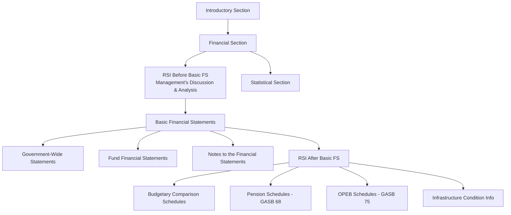
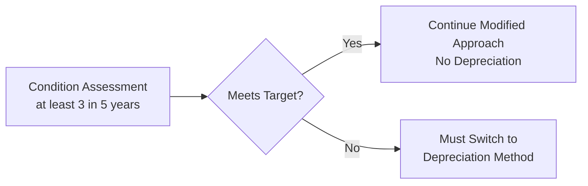
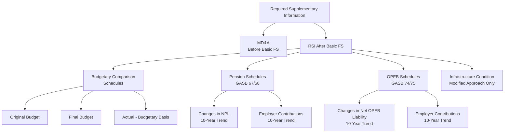

# Required Supplementary Information

Required supplementary information (RSI) is information that GASB has determined is essential for placing the basic financial statements in an appropriate operational, economic, or historical context. RSI accompanies—but is not part of—the basic financial statements and is subject to limited audit procedures rather than a full audit opinion.

:::info[Blueprint Coverage]

**BAR Area III, Group A, Topic 8** – Required supplementary information (RSI) other than management's discussion and analysis. Representative task: Recall the objectives and components of RSI other than MD&A in the annual comprehensive financial report (ACFR) for state and local governments.

:::

---

## Where RSI Fits in the ACFR Structure

The Annual Comprehensive Financial Report (ACFR) follows a specific ordering that determines where RSI appears relative to the basic financial statements.

| Position | Content | Status |
|----------|---------|--------|
| Before basic FS | Management's Discussion & Analysis (MD&A) | RSI |
| Basic FS | Government-wide, fund statements, notes | Audited |
| After basic FS | Budgetary comparisons, pension/OPEB schedules, infrastructure condition | RSI |

:::tip[Exam Tip]

Remember the mnemonic **"MD&A before, everything else after."** MD&A is the only RSI that precedes the basic financial statements. All other RSI follows the notes.

:::

---

## RSI Other Than MD&A – Key Categories

| Category | Governing Standard | When Required |
|----------|-------------------|---------------|
| Budgetary Comparison Schedules | GASB 34 | General Fund and major special revenue funds with legally adopted budgets |
| Pension Schedules | GASB 67/68 | All governments with defined benefit pension plans |
| OPEB Schedules | GASB 74/75 | All governments with defined benefit OPEB plans |
| Infrastructure Condition Information | GASB 34 | Only when the modified approach is used for infrastructure |

---

## Budgetary Comparison Schedules

### Purpose and Scope

Budgetary comparison schedules demonstrate the government's compliance with its legally adopted budget. They are required for:

- The **General Fund**
- Each **major special revenue fund** with a legally adopted annual budget

:::info[Presentation Option]

Governments may present budgetary comparisons either as RSI or as a basic financial statement. If presented as a basic statement, it is covered by the audit opinion.

:::

### Required Columns

| Column | Description |
|--------|-------------|
| Original Budget | Budget as initially adopted by the legislative body |
| Final Budget | Original budget adjusted for all legally authorized amendments and transfers |
| Actual (Budgetary Basis) | Results reported on the same basis used for budgeting |
| Variance (optional) | Difference between final budget and actual; encouraged but not required |

### Key Requirements

- Actual amounts must be reported on the **budgetary basis of accounting**
- If the budgetary basis differs from GAAP, a **reconciliation** to GAAP must be provided (either on the face of the schedule or in a separate schedule/notes)
- The schedule should present revenues and expenditures at the **legal level of budgetary control**

:::warning[Common Exam Trap]

The variance column is **encouraged but not required** by GASB. Do not select an answer that states variance columns are mandatory.

:::

---

## Pension RSI Schedules (GASB 67/68)

GASB 68 requires employer governments to present two 10-year trend schedules as RSI.

### Schedule of Changes in Net Pension Liability and Related Ratios

This schedule tracks the components of the net pension liability (NPL) over time.

| Component | Description |
|-----------|-------------|
| Beginning Total Pension Liability (TPL) | Opening balance |
| + Service cost | Present value of benefits earned during the period |
| + Interest on TPL | Growth in liability due to passage of time |
| + Changes in benefit terms | Plan amendments increasing or decreasing benefits |
| + Experience (gains)/losses | Differences between expected and actual experience |
| + Changes in assumptions | Effect of updated actuarial assumptions |
| − Benefit payments | Benefits paid to retirees |
| = Ending TPL | Closing balance |
| Beginning Plan Fiduciary Net Position | Opening plan assets |
| + Employer contributions | Amounts contributed by the employer |
| + Employee contributions | Amounts contributed by employees |
| + Net investment income | Return on plan assets |
| − Benefit payments | Benefits paid from plan assets |
| − Administrative expenses | Plan operating costs |
| = Ending Plan Fiduciary Net Position | Closing plan assets |
| **Net Pension Liability (NPL)** | **TPL − Plan Fiduciary Net Position** |

### Key Ratios Presented

| Ratio | Formula |
|-------|---------|
| Plan fiduciary net position as % of TPL | Plan Net Position ÷ TPL |
| NPL as % of covered payroll | NPL ÷ Covered Employee Payroll |

### Schedule of Employer Contributions

| Column | Description |
|--------|-------------|
| Actuarially Determined Contribution (ADC) | Amount the actuary calculates is needed |
| Actual Contribution | Amount the employer actually contributed |
| Contribution Deficiency/(Excess) | ADC − Actual Contribution |
| Covered Employee Payroll | Payroll of employees in the plan |
| Actual Contribution as % of Covered Payroll | Actual ÷ Covered Payroll |

### 10-Year Requirement

- Governments must build up to 10 years of data **prospectively** from the effective date of GASB 68
- If 10 years are not yet available, present as many years as exist
- Prior-period data is not restated retroactively

:::tip[Exam Tip]

The 10-year build-up rule is frequently tested. If a government adopted GASB 68 three years ago, it presents only three years of data—not ten.

:::

---

## OPEB RSI Schedules (GASB 74/75)

OPEB (Other Postemployment Benefits) RSI follows a **parallel structure** to pension RSI.

### Required Schedules

| Schedule | Content |
|----------|---------|
| Schedule of Changes in Net OPEB Liability and Related Ratios | Mirrors the pension NPL schedule; shows TPL, plan net position, and net OPEB liability over time |
| Schedule of Employer Contributions | Compares actuarially determined contribution to actual contribution |

### Key Differences from Pension RSI

| Factor | Pension (GASB 68) | OPEB (GASB 75) |
|--------|-------------------|-----------------|
| Healthcare trend rates | N/A | Must disclose assumptions about healthcare cost trends |
| Discount rate sensitivity | Presented in notes | Presented in notes |
| 10-year requirement | Yes | Yes |
| Build-up approach | Prospective | Prospective |

:::info[Remember]

Both pension and OPEB schedules require 10 years of data built up prospectively. The schedules are structurally identical—only the type of benefit differs.

:::

---

## Infrastructure Modified Approach RSI

### When Required

This RSI is required **only** when a government elects the modified approach for reporting infrastructure assets under GASB 34. Under the modified approach, infrastructure assets are not depreciated; instead, the government commits to maintaining them at or above an established condition level.

### Required Disclosures

| Disclosure | Details |
|------------|---------|
| Condition assessment results | Assessed condition compared to the government's established condition target |
| Estimated vs. actual preservation costs | Comparison of amounts estimated to maintain assets vs. amounts actually spent over the last five fiscal years |

### Condition Assessment Requirements

- At least **three complete condition assessments** within the last **five fiscal years**
- Assessments must be performed using a consistent methodology
- Results must demonstrate the government is maintaining infrastructure at or above its established condition level

:::warning[Exam Alert]

If a government fails to meet condition assessment requirements or falls below its target, it must **revert to the depreciation method** for those infrastructure assets.

:::

---

## Auditor's Responsibility for RSI

RSI occupies a unique position—it is required by GASB but is **not audited** at the same level as the basic financial statements.

### Level of Assurance

| Component | Level of Assurance |
|-----------|-------------------|
| Basic Financial Statements | Reasonable assurance (full audit) |
| RSI | Limited procedures (no opinion expressed) |
| Other Supplementary Information | In-relation-to opinion or disclaimer |

### Procedures Applied to RSI

The auditor applies **certain limited procedures** to RSI, including:

1. Inquiries of management about methods of preparing RSI
2. Comparison of RSI for consistency with the basic financial statements
3. Comparison of RSI with relevant audit evidence obtained during the audit

### Reporting on RSI

The auditor's report includes a **separate RSI section** (typically an "Other Matters" paragraph or a dedicated RSI section) that:

- Identifies the RSI
- States that RSI is required by GAAP (GASB standards)
- States that the auditor applied certain limited procedures
- Explicitly states **no opinion or assurance** is expressed on the RSI

### Departures Requiring Modification

| Situation | Auditor's Action |
|-----------|-----------------|
| RSI is omitted entirely | Add a paragraph noting the omission |
| RSI departs materially from GASB guidelines | Describe the departure in the RSI section |
| Auditor is unable to complete limited procedures | State that fact in the RSI section |
| RSI is present and conforms to guidelines | Standard unmodified RSI language |

:::tip[Exam Tip]

Omission of RSI does **not** result in a qualified or adverse opinion on the basic financial statements. It only affects the RSI section of the auditor's report.

:::

---

## Example: Pension RSI Schedule

### Schedule of Changes in Net Pension Liability (Illustrative – 3-Year Build-Up)

| | Year 3 | Year 2 | Year 1 |
|---|---|---|---|
| **Total Pension Liability (TPL)** | | | |
| Service cost | \$2,400,000 | \$2,300,000 | \$2,200,000 |
| Interest | \$3,600,000 | \$3,400,000 | \$3,200,000 |
| Benefit changes | \$0 | \$0 | \$500,000 |
| Experience (gains)/losses | (\$150,000) | \$200,000 | (\$100,000) |
| Assumption changes | \$0 | \$800,000 | \$0 |
| Benefit payments | (\$2,800,000) | (\$2,600,000) | (\$2,400,000) |
| **Net change in TPL** | **\$3,050,000** | **\$4,100,000** | **\$3,400,000** |
| Beginning TPL | \$48,100,000 | \$44,000,000 | \$40,600,000 |
| **Ending TPL** | **\$51,150,000** | **\$48,100,000** | **\$44,000,000** |
| | | | |
| **Plan Fiduciary Net Position** | | | |
| Employer contributions | \$2,000,000 | \$1,900,000 | \$1,800,000 |
| Employee contributions | \$800,000 | \$750,000 | \$700,000 |
| Net investment income | \$2,500,000 | \$2,100,000 | \$1,900,000 |
| Benefit payments | (\$2,800,000) | (\$2,600,000) | (\$2,400,000) |
| Administrative expenses | (\$50,000) | (\$45,000) | (\$40,000) |
| **Net change in plan position** | **\$2,450,000** | **\$2,105,000** | **\$1,960,000** |
| Beginning plan net position | \$34,065,000 | \$31,960,000 | \$30,000,000 |
| **Ending plan net position** | **\$36,515,000** | **\$34,065,000** | **\$31,960,000** |
| | | | |
| **Net Pension Liability (NPL)** | **\$14,635,000** | **\$14,035,000** | **\$12,040,000** |
| Plan net position as % of TPL | 71.4% | 70.8% | 72.6% |
| Covered payroll | \$16,000,000 | \$15,200,000 | \$14,500,000 |
| NPL as % of covered payroll | 91.5% | 92.3% | 83.0% |

---

## Summary of RSI Components

---

## Key Takeaways for the Exam

| Concept | Remember |
|---------|----------|
| RSI vs. basic FS | RSI is **not** part of the basic financial statements |
| Audit level | Limited procedures only—no opinion expressed |
| Budgetary comparison | General Fund + major special revenue funds with adopted budgets |
| Pension/OPEB trend | 10 years, built up prospectively |
| Infrastructure condition | Required only under the modified approach |
| Omission of RSI | Does not affect the opinion on basic FS |
| Variance column | Encouraged, not required |
| Budgetary basis ≠ GAAP | Reconciliation required when bases differ |
