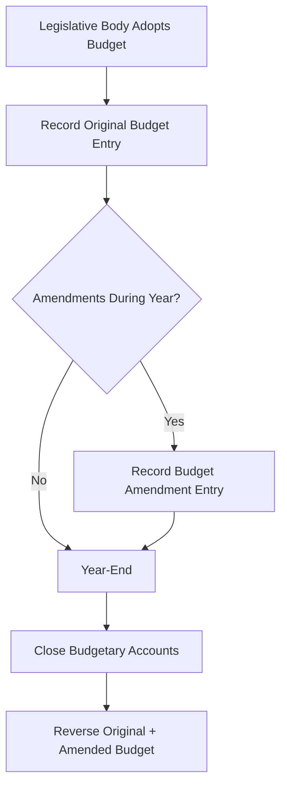

# Budgetary Accounting and Encumbrances

State and local governments use **budgetary accounting** to formally integrate the legally adopted budget into the accounting records of governmental funds. Unlike the private sector, government budgets carry the force of law — **appropriations** represent legal spending authority, and **encumbrances** track outstanding commitments against those appropriations. Together, these mechanisms ensure that governments do not overspend their authorized resources.

:::info[Blueprint Coverage]

This section maps to **BAR Area III, Group C, Topic 8 – Budgetary Accounting and Encumbrances**. Representative tasks:

1. **Recall and explain** the types of budgets used by state and local governments.
2. **Prepare** journal entries to record budgets (original and final) of state and local governments.
3. **Prepare** journal entries to record encumbrances of state and local governments.

:::

---

## Types of Budgets

State and local governments adopt several types of budgets, each serving a different planning and control purpose:

| Budget Type | Description | Time Horizon |
|---|---|---|
| **Annual operating budget** | Covers one fiscal year of general operations; most common | 1 year |
| **Biennial operating budget** | Covers a two-year period; used by some states | 2 years |
| **Capital budget** | Authorizes long-term capital project spending | Multi-year |
| **Flexible budget** | Adjusts authorized spending based on activity levels (rare in government) | Variable |
| **Cash budget** | Projects cash inflows and outflows for liquidity planning | Short-term |

:::tip[Exam Tip]

The **annual (or biennial) operating budget** is the one formally recorded in the accounting system using budgetary journal entries. Capital budgets and flexible budgets are used for planning but are not always formally integrated into the general ledger.

:::

### Legal Level of Budgetary Control

The **appropriation** is the legal authorization to spend. The level at which spending cannot be exceeded without legislative approval is called the **legal level of budgetary control** — often at the department or fund level. Spending beyond the appropriated amount is an **overexpenditure** and may be illegal.

---

## The Budgetary Equation

The fundamental budgetary equation for governmental funds is:

$$
\text{Estimated Revenues} - \text{Appropriations} = \text{Budgetary Fund Balance}
$$

- If Estimated Revenues > Appropriations → **credit** to Budgetary Fund Balance (planned surplus)
- If Estimated Revenues < Appropriations → **debit** to Budgetary Fund Balance (planned deficit)



---

## Recording the Original Budget

When the budget is formally adopted, the government records **budgetary accounts** in the general ledger. These accounts are temporary and use different names than actual operating accounts to distinguish planned from actual amounts.

| Budgetary Account | Normal Balance | Represents |
|---|---|---|
| Estimated Revenues | Debit | Expected inflows for the year |
| Estimated Other Financing Sources | Debit | Expected transfers in |
| Appropriations | Credit | Authorized spending ceiling |
| Estimated Other Financing Uses | Credit | Authorized transfers out |
| Budgetary Fund Balance | Debit or Credit | Plug figure (surplus or deficit) |

### Example — Recording the Original Budget

**Bear City** adopts its General Fund budget for the fiscal year with estimated revenues of \$5,000,000 and appropriations of \$4,800,000.

Since Estimated Revenues (\$5,000,000) > Appropriations (\$4,800,000), there is a planned surplus of \$200,000. Budgetary Fund Balance is **credited**.

```journal
Dr. Estimated Revenues 5,000,000
    Cr. Appropriations 4,800,000
    Cr. Budgetary Fund Balance 200,000
```

:::warning[Common Pitfall]

Budgetary accounts are **not** the same as actual revenue and expenditure accounts. Estimated Revenues is a budgetary control account — it does not record actual cash received. Keep budgetary entries separate from actual transaction entries.

:::

### Example — Budget with a Planned Deficit

**Illini Township** adopts a budget with estimated revenues of \$3,200,000 and appropriations of \$3,500,000. The planned deficit is \$300,000.

```journal
Dr. Estimated Revenues 3,200,000
Dr. Budgetary Fund Balance 300,000
    Cr. Appropriations 3,500,000
```

---

## Budget Amendments

During the fiscal year, the legislative body may amend the budget to reflect changing circumstances. Amendments are recorded as adjustments to the original budgetary entry — only the **net change** is recorded.

### Example — Budget Amendment

Midway through the year, Bear City's council amends the budget:
- Estimated revenues are increased by \$150,000 (new total: \$5,150,000)
- Appropriations are increased by \$200,000 (new total: \$5,000,000)

Net effect on Budgetary Fund Balance: the planned surplus decreases by \$50,000 (from \$200,000 to \$150,000).

```journal
Dr. Estimated Revenues 150,000
    Cr. Appropriations 200,000
    Cr. Budgetary Fund Balance 50,000
```

Wait — in this case Estimated Revenues increases by \$150,000 (debit) and Appropriations increases by \$200,000 (credit), so the difference of \$50,000 must be a **debit** to Budgetary Fund Balance (reducing the planned surplus):

```journal
Dr. Estimated Revenues 150,000
Dr. Budgetary Fund Balance 50,000
    Cr. Appropriations 200,000
```

:::tip[Exam Tip]

On the exam, the **final (amended) budget** equals the original budget plus all amendments. When asked to "record the final budget," you may need to combine the original entry and all amendments into one net entry — or show them separately. Read the question carefully.

:::

---

## Closing Budgetary Accounts at Year-End

At the end of the fiscal year, all budgetary accounts are closed by **reversing the original and amended budget entries**. This removes the budgetary accounts from the ledger.

### Example — Closing Entry

Continuing Bear City (after amendment): Estimated Revenues = \$5,150,000, Appropriations = \$5,000,000, Budgetary Fund Balance = \$150,000 (credit).

The closing entry is the mirror image of the combined budget entries:

```journal
Dr. Appropriations 5,000,000
Dr. Budgetary Fund Balance 150,000
    Cr. Estimated Revenues 5,150,000
```

After this entry, all budgetary accounts have zero balances.

---

## Encumbrance Accounting

**Encumbrances** represent commitments related to outstanding purchase orders and contracts that have not yet been fulfilled. They are used to prevent overspending by reserving a portion of the available appropriation.

:::info[Key Concept]

Encumbrances are **not expenditures** and are **not liabilities**. They are budgetary control devices that track the amount of appropriations already committed but not yet spent. Think of them as "earmarks" against the remaining budget.

:::

### The Encumbrance Lifecycle


| Stage | Debit | Credit |
|---|---|---|
| Issue purchase order | Encumbrances | Budgetary Fund Balance – Reserve for Encumbrances |
| Receive goods/services | Budgetary Fund Balance – Reserve for Encumbrances | Encumbrances |
| Record actual cost | Expenditures | Vouchers Payable (or Cash) |

---

## Recording Encumbrances

When a purchase order is issued, the government records the **estimated** cost as an encumbrance:

### Example — Purchase Order Issued

Bear City issues a purchase order for \$75,000 of supplies.

```journal
Dr. Encumbrances 75,000
    Cr. Budgetary Fund Balance – Reserve for Encumbrances 75,000
```

This entry does **not** record an expenditure or a liability. It simply reserves \$75,000 of the available appropriation so that it cannot be committed elsewhere.

---

## Reversing Encumbrances and Recording Expenditures

When goods or services are received, the process involves **two entries**:

1. **Reverse** the encumbrance at the **originally estimated** amount
2. **Record** the actual expenditure at the **actual** amount

### Example — Goods Received at Estimated Cost

The \$75,000 of supplies ordered by Bear City arrive, and the invoice is exactly \$75,000.

**Entry 1 — Reverse the encumbrance:**

```journal
Dr. Budgetary Fund Balance – Reserve for Encumbrances 75,000
    Cr. Encumbrances 75,000
```

**Entry 2 — Record the actual expenditure:**

```journal
Dr. Expenditures 75,000
    Cr. Vouchers Payable[l] 75,000
```

### Example — Goods Received at Different Cost

Bear City issued a purchase order for office furniture estimated at \$40,000. The actual invoice arrives at \$42,500.

**Entry 1 — Reverse the encumbrance at the original estimated amount (\$40,000):**

```journal
Dr. Budgetary Fund Balance – Reserve for Encumbrances 40,000
    Cr. Encumbrances 40,000
```

**Entry 2 — Record the actual expenditure at the actual invoice amount (\$42,500):**

```journal
Dr. Expenditures 42,500
    Cr. Vouchers Payable[l] 42,500
```

:::warning[Important]

Always reverse encumbrances at the **original estimated amount** — not the actual cost. The expenditure is always recorded at the **actual amount**. Any difference between estimated and actual does not require an adjustment to the encumbrance entry.

:::

---

## Outstanding Encumbrances at Year-End

At fiscal year-end, some purchase orders may still be outstanding (goods not yet received). The treatment depends on whether the appropriation **lapses** or **carries over**:

### If Appropriations Lapse (Most Common)

Outstanding encumbrances are closed at year-end and reported as a **restriction or commitment of fund balance** rather than as expenditures.

**Year-end closing of outstanding encumbrances:**

Assume Bear City has \$25,000 in outstanding encumbrances at year-end.

```journal
Dr. Budgetary Fund Balance – Reserve for Encumbrances 25,000
    Cr. Encumbrances 25,000
```

The fund balance is then reclassified to show the commitment:

```journal
Dr. Fund Balance – Unassigned[e] 25,000
    Cr. Fund Balance – Committed[e] 25,000
```

:::tip[Exam Tip]

Under GASB 54, outstanding encumbrances at year-end are reported as **committed** or **assigned** fund balance — never as expenditures or liabilities. The specific classification depends on the government's policy and whether the commitment was made by the highest level of decision-making authority.

:::

### If Appropriations Do Not Lapse

Some governments allow appropriations to carry over into the next fiscal year. In this case, the encumbrance remains open and is not closed. No fund balance reclassification is needed — the encumbrance continues to reserve the appropriation in the next period.

---

## Fund Balance Classifications and Encumbrances

Under GASB Statement No. 54, fund balance is classified in a hierarchy:

| Classification | Description | Encumbrance Treatment |
|---|---|---|
| **Nonspendable** | Not in spendable form (e.g., inventory, prepaid) | N/A |
| **Restricted** | Externally imposed constraints | N/A |
| **Committed** | Constraints imposed by highest decision-making authority | Outstanding encumbrances (if committed by governing body) |
| **Assigned** | Intended use established by governing body or designee | Outstanding encumbrances (if assigned by management) |
| **Unassigned** | Residual — available for any purpose | Reduced by amount reclassified |

---

## Complete Worked Example

**Grizzly County General Fund — Fiscal Year 20X5**

### Step 1: Record the Original Budget

The county adopts a budget with estimated revenues of \$10,000,000 and appropriations of \$9,600,000.

```journal
Dr. Estimated Revenues 10,000,000
    Cr. Appropriations 9,600,000
    Cr. Budgetary Fund Balance 400,000
```

### Step 2: Record a Budget Amendment

Midyear, the county increases appropriations by \$250,000 with no change in estimated revenues.

```journal
Dr. Budgetary Fund Balance 250,000
    Cr. Appropriations 250,000
```

Final budget: Estimated Revenues = \$10,000,000; Appropriations = \$9,850,000; Budgetary Fund Balance = \$150,000 (credit).

### Step 3: Issue a Purchase Order

The county issues a purchase order for a new vehicle fleet estimated at \$320,000.

```journal
Dr. Encumbrances 320,000
    Cr. Budgetary Fund Balance – Reserve for Encumbrances 320,000
```

### Step 4: Receive the Vehicles

The vehicles are delivered and the actual invoice is \$318,500.

**Reverse the encumbrance:**

```journal
Dr. Budgetary Fund Balance – Reserve for Encumbrances 320,000
    Cr. Encumbrances 320,000
```

**Record the expenditure:**

```journal
Dr. Expenditures 318,500
    Cr. Vouchers Payable[l] 318,500
```

### Step 5: Outstanding Encumbrance at Year-End

The county has one remaining purchase order for computer equipment, estimated at \$45,000, that has not been received by year-end.

**Close the outstanding encumbrance:**

```journal
Dr. Budgetary Fund Balance – Reserve for Encumbrances 45,000
    Cr. Encumbrances 45,000
```

**Reclassify fund balance:**

```journal
Dr. Fund Balance – Unassigned[e] 45,000
    Cr. Fund Balance – Committed[e] 45,000
```

### Step 6: Close Budgetary Accounts

Close all budgetary accounts (reverse the original + amended budget):

```journal
Dr. Appropriations 9,850,000
Dr. Budgetary Fund Balance 150,000
    Cr. Estimated Revenues 10,000,000
```

### Step 7: Next Year — Re-establish the Encumbrance

When the new fiscal year begins and the appropriation is re-authorized, the encumbrance is re-established:

```journal
Dr. Encumbrances 45,000
    Cr. Budgetary Fund Balance – Reserve for Encumbrances 45,000
```

---

## Encumbrances vs. Expenditures — Key Distinctions

| | Encumbrances | Expenditures |
|---|---|---|
| **What it represents** | Estimated commitment | Actual cost incurred |
| **When recorded** | Purchase order issued | Goods/services received |
| **Is it a liability?** | No | Paired with a payable (yes) |
| **Normal balance** | Debit | Debit |
| **Effect on fund balance** | Reserve (committed/assigned) | Reduces unassigned fund balance |
| **Reported on financial statements** | Note disclosure or fund balance classification | Operating statement (expenditures line) |
| **GAAP basis?** | Budgetary control only | Yes — recognized under modified accrual |

:::warning[Exam Alert]

A common exam trap: Encumbrances do **not** appear as expenditures on the GAAP-basis Statement of Revenues, Expenditures, and Changes in Fund Balance. They only appear in budgetary comparison schedules or as fund balance classifications.

:::

---

## Summary of Journal Entries

| Event | Debit | Credit |
|---|---|---|
| Adopt original budget (surplus) | Estimated Revenues | Appropriations; Budgetary Fund Balance |
| Adopt original budget (deficit) | Estimated Revenues; Budgetary Fund Balance | Appropriations |
| Amend budget (increase appropriations) | Budgetary Fund Balance | Appropriations |
| Issue purchase order | Encumbrances | Reserve for Encumbrances |
| Receive goods (reverse encumbrance) | Reserve for Encumbrances | Encumbrances |
| Record actual expenditure | Expenditures | Vouchers Payable |
| Close outstanding encumbrances | Reserve for Encumbrances | Encumbrances |
| Reclassify fund balance | Fund Balance – Unassigned | Fund Balance – Committed |
| Close budgetary accounts at year-end | Appropriations; Budgetary Fund Balance | Estimated Revenues |

:::tip[Exam Tip]

When working budget and encumbrance problems, always ask:
1. **Is this a budgetary entry or an actual entry?** (Budgetary accounts have unique names.)
2. **What is the estimated vs. actual amount?** (Encumbrances use estimates; expenditures use actuals.)
3. **Is the appropriation lapsing?** (Determines year-end encumbrance treatment.)

:::
