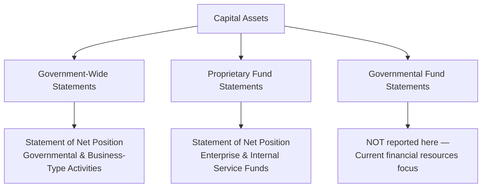

# Capital Assets and Infrastructure Assets

State and local governments report **capital assets** — including land, buildings, improvements, machinery, equipment, **infrastructure**, leases, and construction in progress — in the **government-wide financial statements** and **proprietary fund** statements. Unlike governmental fund statements (which use the current financial resources measurement focus), the government-wide statements capitalize and depreciate long-lived assets under the **economic resources measurement focus** and **accrual basis** of accounting.

:::info[Blueprint Coverage]

This section maps to **BAR Area III, Group C, Topic 3 – Capital Assets and Infrastructure Assets**. Representative tasks:

1. **Identify** capital assets reported in the government-wide financial statements of state and local governments.
2. **Calculate** the net capital assets balance (e.g., including land, buildings and improvements, machinery and equipment, leases) for state and local governments and prepare journal entries (initial measurement and subsequent depreciation and amortization).

:::

---

## Types of Capital Assets

| Category | Examples | Depreciable? |
|---|---|---|
| **Land** | Parcels, right-of-way easements | No |
| **Buildings** | City hall, fire stations, libraries | Yes |
| **Improvements other than buildings** | Parking lots, fencing, landscaping | Yes |
| **Machinery and equipment** | Vehicles, computers, furniture | Yes |
| **Infrastructure** | Roads, bridges, tunnels, water/sewer systems | Yes (unless modified approach) |
| **Leased assets (right-of-use)** | Leased buildings, leased equipment | Yes (amortized over lease term) |
| **Construction in progress (CIP)** | Partially completed capital projects | No (until placed in service) |
| **Intangible assets** | Software, water rights, patents | Yes (if finite-lived) |

:::tip[Exam Tip]

**Land** and **CIP** are never depreciated. Land has an indefinite useful life, and CIP has not yet been placed in service. Once CIP is complete, it is reclassified to the appropriate depreciable category.

:::

---

## Where Capital Assets Are Reported

Capital assets appear in different places depending on the reporting level:



| Reporting Level | Capital Assets Reported? | Depreciation Reported? |
|---|---|---|
| Government-wide statements | Yes | Yes |
| Proprietary fund statements | Yes | Yes |
| Governmental fund statements | **No** | **No** |
| Fiduciary fund statements | Depends on fund type | If applicable |

:::warning[Key Point]

When a governmental fund (e.g., General Fund or Capital Projects Fund) purchases a capital asset, the fund records an **expenditure** — not an asset. The capital asset is then recorded in the government-wide statements through the conversion/reconciliation process.

:::

---

## Initial Measurement

Capital assets are measured at **historical cost** or, if donated or obtained in a nonexchange transaction, at **acquisition value** (entry price) at the date of acquisition.

| Acquisition Method | Measurement Basis |
|---|---|
| Purchased | Historical cost (including ancillary charges) |
| Constructed | All costs of construction (materials, labor, overhead, interest during construction) |
| Donated | Acquisition value at date of donation |
| Nonexchange transaction | Acquisition value at date of receipt |
| Leased (right-of-use) | Present value of lease payments + initial direct costs |

### Example — Purchased Capital Asset (Government-Wide Entry)

Bear City purchases a new fire truck for \$650,000 cash. At the government-wide level:

```journal
Dr. Machinery and Equipment[a] 650,000
    Cr. Cash[a] 650,000
```

At the governmental fund level (General Fund), this would instead be recorded as:

```journal
Dr. Expenditures – Capital Outlay 650,000
    Cr. Cash[a] 650,000
```

### Example — Donated Capital Asset

A local developer donates land with an acquisition value of \$1,200,000 to the city for a new park. Government-wide entry:

```journal
Dr. Land[a] 1,200,000
    Cr. Program Revenues – Contributions 1,200,000
```

---

## Depreciation

All capital assets with finite useful lives must be depreciated (or amortized for intangibles and leased assets) in the government-wide and proprietary fund statements.

### Common Useful Lives

| Asset Category | Typical Useful Life |
|---|---|
| Buildings | 25–50 years |
| Improvements other than buildings | 10–25 years |
| Machinery and equipment | 5–15 years |
| Vehicles | 5–10 years |
| Infrastructure (roads, bridges) | 20–50 years |
| Leased assets | Shorter of useful life or lease term |

### Depreciation Calculation

$$
\text{Annual Depreciation (Straight-Line)} = \frac{\text{Cost} - \text{Salvage Value}}{\text{Useful Life}}
$$

### Example — Annual Depreciation

Bear City's fire truck cost \$650,000 with a salvage value of \$50,000 and a useful life of 10 years.

$$
\text{Depreciation} = \frac{\$650{,}000 - \$50{,}000}{10} = \$60{,}000 \text{ per year}
$$

Government-wide journal entry for annual depreciation:

```journal
Dr. Depreciation Expense – Public Safety 60,000
    Cr. Accumulated Depreciation – Machinery and Equipment[a] 60,000
```

:::tip[Exam Tip]

Depreciation expense in government-wide statements is allocated to the **function** that uses the asset (e.g., Public Safety, Public Works). If an asset serves multiple functions and cannot be specifically identified, it may be reported as **unallocated depreciation** in a separate line.

:::

---

## Net Capital Assets Calculation

The net capital assets balance reported on the Statement of Net Position is:

$$
\text{Net Capital Assets} = \text{Historical Cost} - \text{Accumulated Depreciation}
$$

### Comprehensive Example

**Pine County — Governmental Activities Capital Assets, June 30, 20X5:**

| Category | Cost | Accumulated Depreciation | Net Value |
|---|---|---|---|
| Land | \$4,500,000 | — | \$4,500,000 |
| Buildings | 28,000,000 | (\$8,400,000) | 19,600,000 |
| Improvements | 6,200,000 | (2,480,000) | 3,720,000 |
| Machinery & equipment | 9,800,000 | (5,880,000) | 3,920,000 |
| Infrastructure | 52,000,000 | (15,600,000) | 36,400,000 |
| Construction in progress | 3,100,000 | — | 3,100,000 |
| **Total** | **\$103,600,000** | **(\$32,360,000)** | **\$71,240,000** |

---

## Infrastructure Assets and the Modified Approach

GASB 34 provides an alternative to depreciation for **infrastructure assets** (roads, bridges, dams, tunnels) called the **modified approach**.

### Requirements for the Modified Approach

To use the modified approach, the government must:

1. Maintain an **asset management system** that includes an up-to-date inventory
2. Perform **condition assessments** at least every three years and summarize results using a measurement scale
3. Estimate annually the amount needed to **preserve** the infrastructure at the condition level established by the government

### Modified Approach Treatment

| Item | Treatment |
|---|---|
| **Preservation costs** (maintenance) | Expensed in the period incurred |
| **Additions and improvements** | Capitalized |
| **Depreciation** | Not recorded |

:::warning[Important]

Under the modified approach, infrastructure assets are reported at historical cost but are **not depreciated**. Preservation expenditures replace depreciation as the mechanism for matching cost to periods. If the government fails to meet the condition assessment requirements, it must revert to standard depreciation.

:::

---

## Capital Asset Impairment

GASB Statement No. 42 addresses impairment of capital assets. Impairment occurs when there is a **significant, unexpected decline** in the service utility of a capital asset.

### Indicators of Impairment

- Physical damage (fire, flood)
- Enactment of laws or regulations (environmental contamination)
- Technological changes or obsolescence
- Change in manner or expected duration of use

### Measurement of Impairment

| Method | When Used |
|---|---|
| Restoration cost approach | Physical damage |
| Service units approach | Change in manner/duration of use |
| Deflated depreciated replacement cost | Technological obsolescence |

### Example — Impairment Entry

A flood damages a county bridge with a carrying value of \$8,000,000. Restoration cost is estimated at \$2,500,000.

```journal
Dr. Loss on Impairment – Public Works 2,500,000
    Cr. Accumulated Depreciation – Infrastructure[a] 2,500,000
```

---

## Construction in Progress

Costs incurred on capital projects that are not yet complete are accumulated in **Construction in Progress (CIP)**. Once the project is substantially complete, CIP is reclassified.

### Example — CIP and Capitalization

Bear City begins constructing a new library. During the year, \$4,200,000 is spent:

```journal
Dr. Construction in Progress[a] 4,200,000
    Cr. Cash[a] 4,200,000
```

The following year, the library is completed with an additional \$1,800,000 spent (total cost: \$6,000,000):

```journal
Dr. Construction in Progress[a] 1,800,000
    Cr. Cash[a] 1,800,000
```

Upon completion and placement in service:

```journal
Dr. Buildings[a] 6,000,000
    Cr. Construction in Progress[a] 6,000,000
```

---

## Leased Capital Assets (Right-of-Use)

Under GASB 87, governments recognize a **right-of-use (ROU) asset** and a corresponding **lease liability** at the commencement of the lease.

### Example — Lease Capitalization

Bear City enters a 5-year lease for office space. The present value of lease payments is \$420,000:

```journal
Dr. Right-of-Use Asset – Building[a] 420,000
    Cr. Lease Liability[l] 420,000
```

Annual amortization (\$420,000 ÷ 5 years = \$84,000):

```journal
Dr. Amortization Expense – General Government 84,000
    Cr. Accumulated Amortization – ROU Asset[a] 84,000
```

---

## Summary of Capital Asset Journal Entries

| Transaction | Debit | Credit |
|---|---|---|
| Purchase capital asset (government-wide) | Capital Asset [specific category] | Cash |
| Record donation | Capital Asset | Program Revenue – Contributions |
| Annual depreciation | Depreciation Expense – [Function] | Accumulated Depreciation |
| Impairment loss | Loss on Impairment | Accumulated Depreciation (or asset directly) |
| Accumulate CIP | Construction in Progress | Cash/Contracts Payable |
| Complete CIP | Capital Asset [category] | Construction in Progress |
| Record ROU asset | Right-of-Use Asset | Lease Liability |
| Amortize ROU asset | Amortization Expense | Accumulated Amortization |

:::tip[Exam Tip]

When calculating net capital assets for the exam: (1) start with total historical cost, (2) subtract accumulated depreciation, (3) remember that land and CIP have zero accumulated depreciation. A common trap is forgetting to include CIP or excluding infrastructure from the total.

:::
