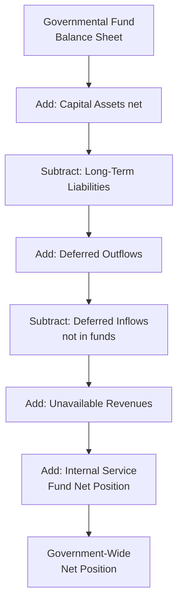

# Deriving Government-Wide Financial Statements and Reconciliation

The **government-wide financial statements** are prepared using the **economic resources measurement focus** and **accrual basis** of accounting, while governmental fund financial statements use the **current financial resources measurement focus** and **modified accrual basis**. Converting from one to the other requires systematic adjustments for **capital assets**, **long-term liabilities**, **deferred inflows/outflows**, and other items not recognized at the fund level. GASB 34 requires a **reconciliation** between the fund-level and government-wide amounts.

:::info[Blueprint Coverage]

This section maps to **BAR Area III, Group B – Deriving Government-Wide Financial Statements and Reconciliation Requirements**. Representative tasks:

1. **Prepare** worksheets to convert the governmental fund financial statements to the governmental activities reported in the government-wide financial statements.
2. **Prepare** the schedule to reconcile the total fund balances and the net change in fund balances reported in the governmental fund financial statements to the net position and change in net position reported in the government-wide financial statements.

:::

---

## Why Conversion Is Needed

Governmental funds and government-wide statements use fundamentally different accounting frameworks:

| Feature | Governmental Fund Statements | Government-Wide Statements |
|---|---|---|
| **Measurement focus** | Current financial resources | Economic resources |
| **Basis of accounting** | Modified accrual | Full accrual |
| **Capital assets** | Not reported (expenditure when acquired) | Capitalized and depreciated |
| **Long-term debt** | Not reported (Other Financing Source when issued) | Reported as liability |
| **Accrued interest** | Not reported (until due) | Accrued as incurred |
| **Deferred items** | Limited recognition | Full recognition |


---

## Key Conversion Adjustments

The following categories of adjustments transform fund-level data into government-wide data:

### 1. Capital Assets

| Fund-Level Treatment | Government-Wide Adjustment |
|---|---|
| Capital outlay recorded as expenditure | Capitalize the asset; remove expenditure |
| No depreciation recorded | Add depreciation expense |
| Proceeds from sale recorded as Other Financing Source | Remove OFS; record gain/loss on disposal |

### 2. Long-Term Liabilities

| Fund-Level Treatment | Government-Wide Adjustment |
|---|---|
| Bond proceeds recorded as Other Financing Source | Remove OFS; add bonds payable liability |
| Principal payments recorded as expenditure | Remove expenditure; reduce bonds payable |
| No accrued interest (until maturity) | Accrue interest expense |
| Issuance premiums/discounts recorded in full | Amortize over bond life |

### 3. Other Accruals and Deferrals

| Fund-Level Treatment | Government-Wide Adjustment |
|---|---|
| Revenues not available (deferred inflows) | Recognize revenue when earned |
| Compensated absences not due | Accrue long-term liability |
| Pension/OPEB not due | Recognize net pension liability and expense |

---

## Balance Sheet Reconciliation (Fund Balance → Net Position)

GASB 34 requires a reconciliation from **total governmental fund balances** to **net position of governmental activities**. This is presented either on the face of the balance sheet or in an accompanying schedule.

### Common Reconciling Items

| Reconciling Item | Effect on Net Position |
|---|---|
| Capital assets (net of depreciation) | **Add** — assets not in fund statements |
| Long-term liabilities (bonds, notes, leases) | **Subtract** — liabilities not in fund statements |
| Accrued interest payable | **Subtract** — not recognized until due in funds |
| Deferred inflows for unavailable revenues | **Add** — revenue earned but not available |
| Internal service fund net position | **Add** — typically combined with governmental activities |
| Deferred outflows/inflows (pensions, OPEB) | **Add/Subtract** — not in fund statements |
| Compensated absences (long-term portion) | **Subtract** — not due and payable from current resources |
| Bond premiums/discounts (unamortized) | **Subtract/Add** — reported with long-term debt |

### Numerical Example — Balance Sheet Reconciliation

**Cedar Township — Reconciliation of Governmental Fund Balance to Net Position**
**June 30, 20X5**

| Item | Amount |
|---|---|
| Total governmental fund balances | \$12,400,000 |
| **Adjustments:** | |
| Capital assets used in governmental activities | \$85,000,000 | |
| Less: Accumulated depreciation | (32,000,000) |
| Net capital assets | **+53,000,000** |
| Deferred outflows of resources (pensions) | **+2,100,000** |
| Deferred inflows – unavailable revenue (property taxes not yet available) | **+860,000** |
| Bonds payable | (28,000,000) |
| Unamortized bond premium | (1,200,000) |
| Accrued interest payable | (540,000) |
| Compensated absences (long-term) | (1,850,000) |
| Net pension liability | (8,400,000) |
| Deferred inflows of resources (pensions) | (3,600,000) |
| Total long-term items | **(43,590,000)** |
| Internal service fund net position | **+1,230,000** |
| **Net position of governmental activities** | **\$26,000,000** |

---

## Operating Statement Reconciliation (Change in Fund Balances → Change in Net Position)

A parallel reconciliation converts the **net change in fund balances** to the **change in net position** for governmental activities.

### Common Reconciling Items

| Reconciling Item | Effect on Change in Net Position |
|---|---|
| Capital outlay expenditures (capitalized) | **Add** — not an expense in accrual |
| Depreciation expense | **Subtract** — not recognized in funds |
| Bond/note proceeds (Other Financing Sources) | **Subtract** — not revenue in accrual |
| Principal payments on debt (expenditures) | **Add** — not an expense in accrual |
| Change in accrued interest | **Subtract** (if increased) |
| Change in compensated absences | **Subtract** (if liability increased) |
| Change in unavailable revenue | **Add** (if revenues became earned) |
| Loss on disposal of capital assets | **Subtract** |
| Amortization of bond premium | **Subtract** (reduces interest expense) |
| Internal service fund change in net position | **Add/Subtract** |

### Numerical Example — Operating Statement Reconciliation

**Cedar Township — Reconciliation of Change in Fund Balances to Change in Net Position**
**For the Year Ended June 30, 20X5**

| Item | Amount |
|---|---|
| Net change in fund balances — total governmental funds | \$1,800,000 |
| **Adjustments:** | |
| Capital outlay reported as expenditures in the funds | +6,200,000 |
| Depreciation expense not reported in the funds | (3,400,000) |
| Net book value of capital assets disposed | (250,000) |
| Bond proceeds reported as financing source in the funds | (4,000,000) |
| Principal repayments reported as expenditures in the funds | +2,800,000 |
| Amortization of bond premium | (120,000) |
| Change in accrued interest payable | (45,000) |
| Change in compensated absences liability | (180,000) |
| Change in net pension liability and related deferrals | (620,000) |
| Revenues in government-wide not meeting availability criteria in funds | +315,000 |
| Internal service fund change in net position | +150,000 |
| **Change in net position of governmental activities** | **\$2,650,000** |

---

## Worksheet Approach to Conversion

Many governments use a **conversion worksheet** to systematically transform fund-level data. The worksheet starts with fund statement amounts and applies adjusting entries in journal-entry form.

### Worksheet Structure

| Column | Content |
|---|---|
| **A** | Fund financial statement amounts |
| **B** | Capital asset adjustments |
| **C** | Long-term debt adjustments |
| **D** | Other accrual adjustments |
| **E** | Internal service fund adjustments |
| **F** | Government-wide statement amounts (A+B+C+D+E) |

### Worksheet Adjustment Entries

Below are the journal-entry-style adjustments that appear on the conversion worksheet:

**Adjustment 1 — Capitalize current-year capital outlay:**

```journal
Dr. Capital Assets[a] 6,200,000
    Cr. Capital Outlay Expenditures 6,200,000
```

**Adjustment 2 — Record depreciation expense:**

```journal
Dr. Depreciation Expense 3,400,000
    Cr. Accumulated Depreciation[a] 3,400,000
```

**Adjustment 3 — Remove bond proceeds (Other Financing Source):**

```journal
Dr. Other Financing Sources – Bond Proceeds 4,000,000
    Cr. Bonds Payable[l] 4,000,000
```

**Adjustment 4 — Remove debt principal expenditure:**

```journal
Dr. Bonds Payable[l] 2,800,000
    Cr. Debt Service Expenditures – Principal 2,800,000
```

**Adjustment 5 — Accrue interest expense:**

```journal
Dr. Interest Expense 45,000
    Cr. Accrued Interest Payable[l] 45,000
```

**Adjustment 6 — Amortize bond premium:**

```journal
Dr. Premium on Bonds Payable[l] 120,000
    Cr. Interest Expense 120,000
```

**Adjustment 7 — Recognize unavailable revenue:**

```journal
Dr. Deferred Inflows – Unavailable Revenue[l] 315,000
    Cr. Revenues – Property Taxes 315,000
```

**Adjustment 8 — Accrue compensated absences:**

```journal
Dr. Compensated Absences Expense 180,000
    Cr. Compensated Absences Payable[l] 180,000
```

**Adjustment 9 — Remove capital asset disposal:**

```journal
Dr. Accumulated Depreciation[a] 400,000
Dr. Loss on Disposal 250,000
    Cr. Capital Assets[a] 650,000
```

:::tip[Exam Tip]

On the exam, worksheet adjustments are often tested in isolation. Remember: if a transaction **increased** an expenditure in the funds but is **not** an expense at the government-wide level, you reverse the expenditure. If a transaction is an expense at government-wide but was **not** recorded in the funds, you add the expense.

:::

---

## Internal Service Fund Adjustments

**Internal service funds** (a type of proprietary fund) are reported with governmental activities in the government-wide statements because they primarily serve governmental departments. The adjustment involves:

1. **Eliminating** interfund charges (to avoid double-counting)
2. **Adding** the internal service fund's net position to governmental activities
3. **Adding** the internal service fund's change in net position to the change in net position of governmental activities

:::warning[Common Pitfall]

Internal service fund activity must be combined with governmental activities at the government-wide level. If an internal service fund charges governmental funds for services, those charges are expenditures in the fund statements but are eliminated at the government-wide level to avoid overstating expenses. Only the actual costs incurred by the internal service fund (depreciation, salaries, etc.) remain.

:::

---

## Complete Reconciliation Flowchart



---

## Summary of Reconciling Items

| Direction | Balance Sheet Reconciliation | Operating Statement Reconciliation |
|---|---|---|
| **Add to fund amounts** | Net capital assets; Deferred outflows; Unavailable revenues; ISF net position | Capital outlay; Debt principal payments; Revenue recognized in accrual; ISF change |
| **Subtract from fund amounts** | Long-term liabilities; Deferred inflows; Accrued interest; Compensated absences; Net pension liability | Depreciation; Bond proceeds; Accrued interest increase; Compensated absences increase; Pension expense; Loss on disposal; Premium amortization |

:::tip[Exam Tip]

A quick memory device: items that make the **fund balance look smaller** than net position are **added** in the reconciliation (capital assets, deferred outflows). Items that make the fund balance look **larger** than net position are **subtracted** (long-term debt, accrued liabilities). The same logic applies in reverse for the operating statement.

:::
