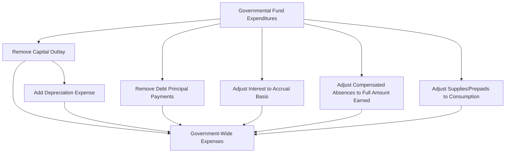

# Expenditures and Expenses

Understanding the distinction between **expenditures** and **expenses** is fundamental to governmental accounting. Governmental funds use the **modified accrual basis** and report **expenditures** — measures of current financial resources consumed. Government-wide statements and proprietary funds use the **accrual basis** and report **expenses** — measures of economic resources consumed. Mastering when and how each is recognized is essential for the CPA exam.

:::info[Blueprint Coverage]

This section maps to **BAR Area III, Group C, Topic 7 – Expenditures and Expenses**. Representative tasks:

1. **Calculate** expenditures to be recognized under the modified accrual basis of accounting (paid from available fund financial resources) for state and local governments and prepare journal entries.
2. **Calculate** expenses to be recognized under the accrual basis of accounting for state and local governments and prepare journal entries.

:::

---

## Expenditures vs. Expenses — Fundamental Distinction

| | Expenditures | Expenses |
|---|---|---|
| **Used in** | Governmental fund statements (modified accrual) | Government-wide & proprietary fund statements (accrual) |
| **Measurement focus** | Current financial resources | Economic resources |
| **Recognition** | When a fund liability is incurred and payable from current resources | When the economic benefit is consumed |
| **Capital assets** | Entire cost recorded when acquired | Depreciation/amortization over useful life |
| **Long-term debt principal** | Recorded as expenditure when due | Not an expense (reduction of liability) |

:::tip[Exam Tip]

A quick test: if the question says "governmental fund" or "General Fund," think **expenditures** (modified accrual). If it says "government-wide," "proprietary fund," or "Statement of Activities," think **expenses** (full accrual).

:::

---

## Modified Accrual Basis — Governmental Funds

Under the modified accrual basis, expenditures are generally recognized when the related **fund liability is incurred**, provided the liability will be paid from **currently available financial resources**. The key exceptions involve items not normally expected to be liquidated with expendable available resources.

### General Recognition Rule

$$
\text{Expenditure recognized} = \text{Fund liability incurred} \cap \text{Payable from current resources}
$$

### Classification by Character

| Character | Description | Examples |
|---|---|---|
| **Current** | Day-to-day operating costs | Salaries, supplies, contractual services |
| **Capital outlay** | Acquisition of capital assets | Equipment, buildings, vehicles |
| **Debt service** | Principal and interest on long-term debt | Bond principal payments, interest payments |
| **Intergovernmental** | Payments to other governments | Grants to subrecipients, shared revenues |

### Classification by Function

| Function | Examples |
|---|---|
| General government | Legislative, executive, finance |
| Public safety | Police, fire, corrections |
| Public works | Streets, sanitation, utilities |
| Health and welfare | Social services, health department |
| Culture and recreation | Parks, libraries, museums |
| Education | School districts (if applicable) |

---

## Specific Recognition Rules

### Supplies — Purchase Method vs. Consumption Method

Governments may account for supplies (inventory) under either method:

| Method | At Purchase | At Consumption | Year-End Reporting |
|---|---|---|---|
| **Purchase method** | Debit Expenditures | No entry | Nonspendable fund balance for remaining inventory |
| **Consumption method** | Debit Inventory | Debit Expenditures, Credit Inventory | Inventory on balance sheet; nonspendable fund balance |

**Example — Purchase Method:** Bear City buys \$60,000 of supplies. At year-end, \$8,000 remains on hand.

```journal
Dr. Expenditures 60,000
    Cr. Cash[a] 60,000
```

Year-end adjustment to report nonspendable fund balance:

```journal
Dr. Inventory of Supplies[a] 8,000
    Cr. Fund Balance – Nonspendable[e] 8,000
```

**Example — Consumption Method:** Same facts.

At purchase:

```journal
Dr. Inventory of Supplies[a] 60,000
    Cr. Cash[a] 60,000
```

At year-end (record consumption of \$52,000):

```journal
Dr. Expenditures 52,000
    Cr. Inventory of Supplies[a] 52,000
```

:::warning[Common Pitfall]

Under both methods, the fund balance sheet reports inventory as an asset with an offsetting nonspendable fund balance. The difference is **when** the expenditure hits the operating statement — at purchase or at consumption.

:::

### Prepaid Items

Prepaid items follow the same two methods as supplies. Under the purchase method, the full amount is expended when paid. Under the consumption method, the prepaid asset is reduced as benefits are consumed.

### Debt Service Expenditures

Principal and interest on general long-term debt are recognized as expenditures in the **debt service fund** when they are **due** (maturity date):

```journal
Dr. Expenditures – Principal 500,000
Dr. Expenditures – Interest 75,000
    Cr. Cash[a] 575,000
```

:::tip[Exam Tip]

Interest on long-term debt is recognized as an expenditure when **legally due** — not when accrued over time. This is a major difference from accrual accounting. However, if resources have been accumulated in a debt service fund for payment early in the next year, governments may accrue the expenditure at year-end.

:::

### Compensated Absences

Under modified accrual, compensated absences (vacation, sick leave) are recognized as expenditures only to the extent they are expected to be **liquidated with expendable available financial resources** — typically the amount that employees have used but not yet been paid for at year-end. The long-term portion is reported only in the government-wide statements.

---

## Accrual Basis — Government-Wide and Proprietary Funds

Under full accrual, expenses are recognized when the **economic benefit is consumed**, regardless of when cash is paid.

| Item | Expenditure (Modified Accrual) | Expense (Full Accrual) |
|---|---|---|
| Capital asset purchased for \$500,000, 10-year life | \$500,000 in year of purchase | \$50,000/year depreciation |
| Bond principal payment of \$200,000 | \$200,000 when due | Not an expense (reduces liability) |
| Supplies purchased \$80,000; used \$65,000 | \$80,000 (purchase method) or \$65,000 (consumption method) | \$65,000 |
| Compensated absences earned \$120,000; paid \$90,000 | \$90,000 (amount currently due) | \$120,000 (full amount earned) |

### Capital Asset Depreciation

In government-wide statements, capital assets are depreciated:

```journal
Dr. Depreciation Expense 50,000
    Cr. Accumulated Depreciation[ca] 50,000
```

:::warning[Remember]

Governmental fund statements never report depreciation. Depreciation only appears in government-wide and proprietary fund statements.

:::

### Compensated Absences (Full Accrual)

```journal
Dr. Compensated Absences Expense 120,000
    Cr. Compensated Absences Payable[l] 120,000
```

---

## Conversion from Fund Statements to Government-Wide Statements

When preparing government-wide statements, governments must convert governmental fund expenditures to accrual-basis expenses. Key adjustments:



### Conversion Example

Bear City's General Fund reports the following expenditures:

| Item | Fund Expenditure |
|---|---|
| Salaries | \$2,000,000 |
| Supplies (purchase method) | \$300,000 |
| Capital outlay (equipment) | \$400,000 |
| Debt service – principal | \$250,000 |
| Debt service – interest | \$100,000 |
| **Total expenditures** | **\$3,050,000** |

Additional information for conversion:
- Supplies on hand at year-end: \$45,000 (beginning inventory was \$30,000)
- Equipment has a 10-year life, no salvage; full-year depreciation on existing assets = \$180,000
- Accrued interest payable increased by \$15,000 during the year
- Compensated absences earned but not yet due: \$60,000

**Conversion to government-wide expenses:**

| Adjustment | Amount |
|---|---|
| Fund expenditures | \$3,050,000 |
| Remove capital outlay | (400,000) |
| Add depreciation | +180,000 |
| Remove debt principal | (250,000) |
| Adjust supplies: reduce by inventory increase (\$45,000 – \$30,000) | (15,000) |
| Adjust interest: add accrued increase | +15,000 |
| Add compensated absences earned | +60,000 |
| **Government-wide expenses** | **\$2,640,000** |

---

## Journal Entries — Proprietary Fund (Full Accrual)

Proprietary funds (enterprise and internal service) use full accrual, recording expenses like a business:

**Purchase of equipment (\$400,000, 10-year life):**

```journal
Dr. Equipment[a] 400,000
    Cr. Cash[a] 400,000
```

**Annual depreciation:**

```journal
Dr. Depreciation Expense 40,000
    Cr. Accumulated Depreciation[ca] 40,000
```

**Record utility revenue earned and wages expense:**

```journal
Dr. Operating Expenses – Wages 150,000
    Cr. Accrued Wages Payable[l] 150,000
```

---

## Summary Comparison Table

| Transaction | Governmental Fund (Modified Accrual) | Government-Wide (Full Accrual) |
|---|---|---|
| Buy equipment \$100,000 | Expenditure \$100,000 | Capitalize asset; depreciate |
| Pay bond principal \$50,000 | Expenditure \$50,000 | Reduce Bonds Payable |
| Pay bond interest \$20,000 | Expenditure \$20,000 (when due) | Expense (accrued over time) |
| Employees earn leave \$30,000 | Expenditure only for current portion | Expense full \$30,000 |
| Buy supplies \$10,000; use \$7,000 | Expenditure \$10,000 (purchase) or \$7,000 (consumption) | Expense \$7,000 |
| Record depreciation | Not applicable | Expense each period |

:::tip[Exam Tip]

When you see a conversion or reconciliation question, remember the mnemonic **"DCALIPS"**: **D**epreciation added, **C**apital outlay removed, **A**ccrued liabilities adjusted, **L**ong-term debt principal removed, **I**nterest accrued, **P**repaids and **S**upplies adjusted.

:::
