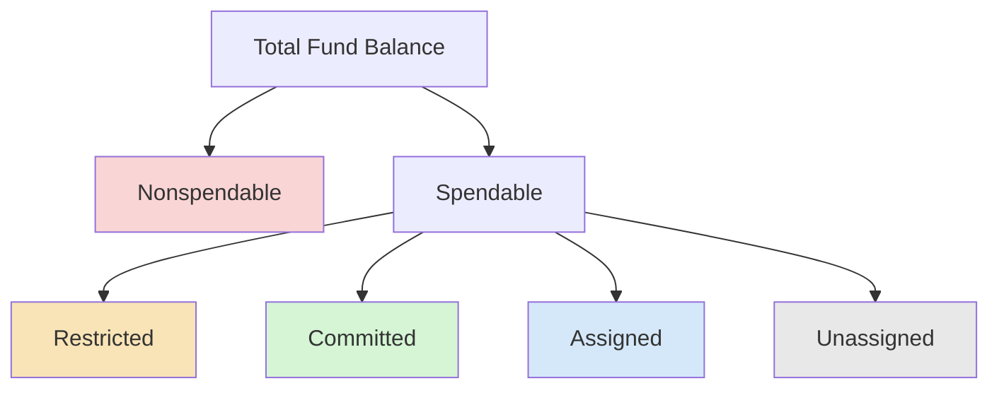

# Fund Balances and Components

**GASB Statement No. 54** (Fund Balance Reporting and Governmental Fund Type Definitions) established a **five-category hierarchy** for classifying fund balance in governmental funds. This framework replaced the older reserved/unreserved/designated system and provides financial statement users with clearer information about the constraints on how resources can be spent. Understanding the definitions, hierarchy, spending order, and journal entries for fund balance reclassification is essential for the CPA exam.

:::info[Blueprint Coverage]

This section maps to **BAR Area III, Group C, Topic 2 – Fund Balances and Components Thereof**. Representative tasks:

1. **Calculate** the fund balances (assigned, unassigned, nonspendable, committed and restricted) for state and local governments and prepare journal entries.

:::

---

## The Five Categories of Fund Balance

Fund balance is classified from **most constrained** to **least constrained**:

| Category | Constraint Source | Can Be Spent? | Examples |
|---|---|---|---|
| **Nonspendable** | Form of the resource | No (not in spendable form or must be maintained intact) | Inventory, prepaid items, long-term receivables, permanent fund principal |
| **Restricted** | External parties or legislation | Only for specified purpose | Federal grant requirements, state statute constraints, bond covenants |
| **Committed** | Government's highest decision-making authority | Only for specified purpose (requires formal action to remove) | Council resolution committing funds for future capital project |
| **Assigned** | Governing body or its designee | Intended for a specific purpose | City manager designates funds for technology upgrades |
| **Unassigned** | No constraint | Yes — available for any purpose | Residual balance in the General Fund |



---

## Detailed Definitions

### Nonspendable Fund Balance

Resources that are **not in spendable form** or are **legally or contractually required to be maintained intact**:

- Inventory and prepaid items (not in cash form)
- Long-term portion of loans receivable
- Principal of a permanent (endowment) fund
- Property held for resale (not yet converted to cash)

:::tip[Exam Tip]

Nonspendable does not mean the resources can never be spent — it means they are not **currently** available for spending. When inventory is sold or prepaids expire, the constraint no longer applies.

:::

### Restricted Fund Balance

Resources subject to externally enforceable constraints imposed by:

- **Creditors** (bond covenants requiring reserves)
- **Grantors** (federal grants restricted to specific programs)
- **Contributors** (donations with donor-imposed restrictions)
- **Laws or regulations of other governments** (state law requiring specific use)
- **Constitutional provisions or enabling legislation**

### Committed Fund Balance

Resources constrained by **formal action** of the government's **highest level of decision-making authority** (e.g., governing board, city council). The constraint can only be removed or changed by the same level of authority through the same formal process.

**Key requirements:**
- Action must be taken **before** year-end (even if the amount is determined after year-end)
- Commitment must be formalized by resolution, ordinance, or equivalent

### Assigned Fund Balance

Resources intended for a specific purpose by the **governing body** or a **body or official authorized by the governing body** (e.g., city manager, finance director). Less formal than committed — does not require a resolution.

### Unassigned Fund Balance

The **residual** classification for the General Fund — amounts not classified in any other category. Represents the most flexible resources available.

:::warning[Critical Rule]

Only the **General Fund** can report a **positive** unassigned fund balance. Other governmental funds (special revenue, capital projects, debt service, permanent) can only report a **negative** unassigned balance — which occurs when restricted or committed resources have been overspent.

:::

---

## Spending Order (Hierarchy)

When an expenditure is incurred for a purpose where multiple fund balance classifications are available, GASB 54 establishes a **default spending order**:

$$
\text{Restricted} \rightarrow \text{Committed} \rightarrow \text{Assigned} \rightarrow \text{Unassigned}
$$

The most constrained resources are spent **first** unless the government has formally adopted a different spending policy.

| Priority | Category Used First | Rationale |
|---|---|---|
| 1st | Restricted | External constraints satisfied first |
| 2nd | Committed | Highest internal authority constraint |
| 3rd | Assigned | Management intent |
| 4th | Unassigned | Residual / unrestricted |

:::tip[Exam Tip]

A government **may** establish a different spending policy (e.g., spend assigned before committed). If the question states a specific policy, follow it. If no policy is stated, apply the default order.

:::

---

## Fund Balance by Fund Type

| Fund Type | Typical Fund Balance Categories |
|---|---|
| **General Fund** | All five categories possible; only fund with positive unassigned |
| **Special Revenue Fund** | Restricted and/or committed (by definition, must have a restricted/committed revenue source) |
| **Capital Projects Fund** | Restricted, committed, or assigned |
| **Debt Service Fund** | Restricted (typically by bond covenant) |
| **Permanent Fund** | Nonspendable (principal) + restricted (spendable earnings) |

---

## Stabilization Arrangements

Governments may set aside resources for **stabilization** (rainy day funds). Classification depends on the constraint:

| Circumstance | Classification |
|---|---|
| Stabilization formally established by highest authority with specific conditions for use | **Committed** |
| Stabilization required by enabling legislation or constitutional provision | **Restricted** |
| Stabilization informally earmarked by management | **Assigned** |

Stabilization amounts should **not** be presented as unassigned unless no constraint exists.

---

## Journal Entries for Fund Balance Reclassification

Fund balance reclassifications do not involve revenues or expenditures — they are equity-to-equity entries.

### Committing Fund Balance

The city council passes a resolution committing \$500,000 for a future park renovation:

```journal
Dr. Fund Balance – Unassigned[e] 500,000
    Cr. Fund Balance – Committed[e] 500,000
```

### Assigning Fund Balance

The finance director designates \$200,000 for technology upgrades next year:

```journal
Dr. Fund Balance – Unassigned[e] 200,000
    Cr. Fund Balance – Assigned[e] 200,000
```

### Removing a Commitment

The council rescinds the park renovation commitment:

```journal
Dr. Fund Balance – Committed[e] 500,000
    Cr. Fund Balance – Unassigned[e] 500,000
```

### Recording Nonspendable Fund Balance for Inventory

At year-end, the government has \$75,000 of supplies inventory (consumption method):

```journal
Dr. Fund Balance – Unassigned[e] 75,000
    Cr. Fund Balance – Nonspendable[e] 75,000
```

:::warning[Important]

Fund balance reclassification entries are typically made at year-end as part of the closing process. They do **not** affect the total fund balance — they only change its composition among the five categories.

:::

---

## Comprehensive Numerical Example

**Maple Township General Fund — Fund Balance Classification at June 30, 20X5**

Given the following information, classify the total fund balance of \$4,200,000:

| Item | Amount | Source of Constraint |
|---|---|---|
| Inventory of supplies | \$90,000 | Not in spendable form |
| Prepaid insurance | \$35,000 | Not in spendable form |
| State grant for road maintenance (unspent) | \$600,000 | State law |
| Federal grant for homeless services | \$280,000 | Federal grantor |
| Council resolution for new fire station | \$1,000,000 | Governing body formal action |
| Manager's designation for IT systems | \$350,000 | Authorized official |
| Remaining balance | Residual | No constraint |

**Classification:**

| Category | Components | Amount |
|---|---|---|
| **Nonspendable** | Inventory (\$90,000) + Prepaid (\$35,000) | **\$125,000** |
| **Restricted** | State road grant (\$600,000) + Federal grant (\$280,000) | **\$880,000** |
| **Committed** | Council resolution – fire station | **\$1,000,000** |
| **Assigned** | Manager designation – IT systems | **\$350,000** |
| **Unassigned** | \$4,200,000 – \$125,000 – \$880,000 – \$1,000,000 – \$350,000 | **\$1,845,000** |
| **Total fund balance** | | **\$4,200,000** |

**Verification:**

$$
\$125{,}000 + \$880{,}000 + \$1{,}000{,}000 + \$350{,}000 + \$1{,}845{,}000 = \$4{,}200{,}000 \checkmark
$$

---

## Fund Balance vs. Net Position

Fund balance (governmental funds) and net position (government-wide) are **not** the same:

| | Fund Balance (Fund Statements) | Net Position (Government-Wide) |
|---|---|---|
| **Measurement focus** | Current financial resources | Economic resources |
| **Includes capital assets?** | No | Yes |
| **Includes long-term liabilities?** | No | Yes |
| **Categories** | Nonspendable, Restricted, Committed, Assigned, Unassigned | Net investment in capital assets, Restricted, Unrestricted |
| **Basis of accounting** | Modified accrual | Full accrual |

The reconciliation from total governmental fund balances to governmental activities net position is a required component of the basic financial statements.

---

## Summary Table

| Category | Who Constrains | How Removed | Positive in General Fund? | Positive in Other Funds? |
|---|---|---|---|---|
| **Nonspendable** | Nature of resource | Resource becomes spendable | Yes | Yes |
| **Restricted** | External parties / legislation | Constraint expires or is fulfilled | Yes | Yes |
| **Committed** | Highest decision-making authority | Same authority, same formal process | Yes | Yes |
| **Assigned** | Governing body or designee | Intent is removed | Yes | Yes |
| **Unassigned** | No one | N/A | Yes | **No** (only negative allowed) |

:::tip[Exam Tip]

A three-step approach for fund balance questions: (1) Identify the **total** fund balance. (2) Pull out **nonspendable** amounts first (not in spendable form). (3) Classify the remaining spendable amounts based on the source and strength of the constraint (restricted → committed → assigned → unassigned residual).

:::
