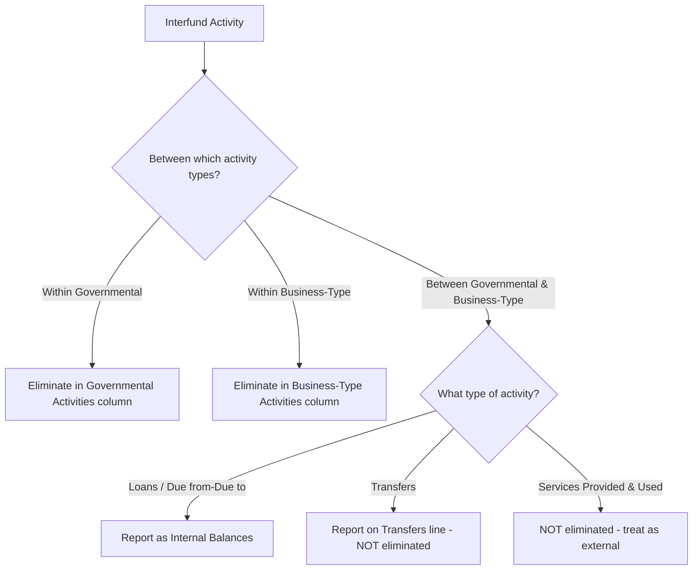

# Interfund Activity and Transfers

Interfund activity encompasses all transactions and flows of resources that occur between funds of the same governmental entity. GASB Statement No. 34 classifies these activities into four distinct categories, each with unique recognition, reporting, and elimination requirements. Understanding how to record interfund activity at the fund level and how to eliminate or reclassify it in the government-wide statements is essential for the CPA exam.

:::info[Blueprint Coverage]

**BAR Area III, Group C, Topic 5 – Interfund activity, including transfers.** Representative tasks: (1) Prepare eliminations of interfund activity in government-wide financial statements; (2) Prepare journal entries to recognize interfund activity within state and local governments.

:::

---

## Four Categories of Interfund Activity

GASB 34 establishes four categories of interfund activity. Each has distinct accounting treatment.

| Category | Description | Repayment Required? | Reported Separately? |
|----------|-------------|---------------------|---------------------|
| **Interfund Loans** | Amounts provided with a requirement for repayment | Yes | Yes – as Due from / Due to |
| **Interfund Services Provided and Used** | Sales of goods or services at approximate external exchange values | N/A (exchange) | Yes – as revenues and expenditures/expenses |
| **Interfund Transfers** | One-way flows of assets without equivalent return, authorized by budget or law | No | Yes – as Other Financing Sources/Uses |
| **Interfund Reimbursements** | Repayment to the fund that initially recorded the expenditure/expense on behalf of another fund | No | No – reduces original expenditure |

:::tip[Exam Tip]

The key distinction between a **transfer** and a **reimbursement** is timing: a reimbursement repays a fund for an expenditure it already recorded on behalf of another fund. A transfer is simply a one-way shift of resources authorized by the governing body.

:::

---

## Fund-Level Journal Entries

### Interfund Loans

When the General Fund lends \$200,000 to an Enterprise Fund:

**General Fund (lending fund):**

```journal
Dr. Due from Enterprise Fund[a] 200,000
Cr. Cash[a] 200,000
```

**Enterprise Fund (borrowing fund):**

```journal
Dr. Cash[a] 200,000
Cr. Due to General Fund[l] 200,000
```

When the loan is repaid, the entries reverse.

### Interfund Services Provided and Used

When the Internal Service Fund provides \$50,000 of printing services to the General Fund:

**Internal Service Fund (providing fund):**

```journal
Dr. Due from General Fund[a] 50,000
Cr. Charges for Services 50,000
```

**General Fund (receiving fund):**

```journal
Dr. Expenditures 50,000
Cr. Due to Internal Service Fund[l] 50,000
```

:::warning[Key Point]

Interfund services provided and used are treated like **external transactions**. They are recognized as revenues and expenditures/expenses and are **NOT eliminated** in the government-wide statements (unless between funds within the same activity column and the amounts are not at approximate external exchange prices).

:::

### Interfund Transfers

When the General Fund transfers \$500,000 to a Capital Projects Fund:

**General Fund (sending fund):**

```journal
Dr. Transfer Out to Capital Projects Fund 500,000
Cr. Cash[a] 500,000
```

**Capital Projects Fund (receiving fund):**

```journal
Dr. Cash[a] 500,000
Cr. Transfer In from General Fund 500,000
```

:::tip[Exam Tip]

Transfers In are classified as **Other Financing Sources** and Transfers Out as **Other Financing Uses**. They appear below the revenues/expenditures section on the fund operating statement but above the change in fund balance.

:::

### Interfund Reimbursements

The Parks Department (Special Revenue Fund) had \$30,000 of supplies initially paid by the General Fund. The Special Revenue Fund now reimburses the General Fund:

**General Fund (receiving reimbursement):**

```journal
Dr. Cash[a] 30,000
Cr. Expenditures 30,000
```

**Special Revenue Fund (making reimbursement):**

```journal
Dr. Expenditures 30,000
Cr. Cash[a] 30,000
```

The General Fund's original expenditure is reversed (credited), and the expenditure is now properly reported in the Special Revenue Fund. No "transfer" accounts are involved.

---

## Elimination Rules for Government-Wide Statements

This is a **critical exam topic**. The government-wide statements consolidate fund data into two columns: Governmental Activities and Business-Type Activities.



### Summary of Elimination Rules

| Interfund Activity Type | Within Same Activity Type | Between Activity Types |
|------------------------|--------------------------|----------------------|
| Interfund Loans (Due from/Due to) | Eliminate | Reclassify as "Internal Balances" |
| Interfund Transfers (Transfer In/Out) | Eliminate | Report as "Transfers" line item |
| Interfund Services Provided and Used | **Do NOT eliminate** | **Do NOT eliminate** |
| Interfund Reimbursements | Already netted at fund level | Already netted at fund level |

:::warning[Critical Elimination Rule]

**Interfund services provided and used are NEVER eliminated** in the government-wide statements because they approximate arm's-length transactions. This is the only category that survives consolidation regardless of which columns are involved.

:::

---

## Balance Sheet / Statement of Net Position Presentation

### Fund-Level Balance Sheet

| Line Item | Reporting |
|-----------|-----------|
| Due from Other Funds | Current asset |
| Due to Other Funds | Current liability |
| Advances to Other Funds | Non-current asset (with nonspendable fund balance) |
| Advances from Other Funds | Non-current liability |

### Government-Wide Statement of Net Position

| Situation | Presentation |
|-----------|-------------|
| Receivables/payables within governmental activities | Eliminated – not shown |
| Receivables/payables within business-type activities | Eliminated – not shown |
| Receivables/payables between governmental and business-type | Reported as **"Internal Balances"** |

---

## Operating Statement Presentation

### Fund-Level Statement of Revenues, Expenditures, and Changes in Fund Balance

```
  Revenues                          $X,XXX
- Expenditures                      (X,XXX)
= Excess (deficiency)               X,XXX
+ Other Financing Sources:
    Transfer In                      X,XXX
- Other Financing Uses:
    Transfer Out                    (X,XXX)
= Net Change in Fund Balance        $X,XXX
```

### Government-Wide Statement of Activities

Transfers between governmental and business-type activities appear as a separate line:

```
  Governmental Activities:
    Change in net position before transfers    $X,XXX
    Transfers                                  (X,XXX)
    Change in net position                     $X,XXX

  Business-Type Activities:
    Change in net position before transfers    $X,XXX
    Transfers                                   X,XXX
    Change in net position                     $X,XXX
```

---

## Comprehensive Example – Bear City

Bear City has the following interfund transactions during the fiscal year:

| # | Transaction | Amount | Funds Involved |
|---|-------------|--------|----------------|
| 1 | General Fund loans cash to Water Utility Fund | \$100,000 | GF → Enterprise |
| 2 | Internal Service Fund provides fleet maintenance to General Fund | \$75,000 | ISF → GF |
| 3 | General Fund transfers operating subsidy to Transit Fund (Enterprise) | \$300,000 | GF → Enterprise |
| 4 | General Fund transfers to Debt Service Fund | \$400,000 | GF → DSF |
| 5 | Special Revenue Fund reimburses General Fund for supplies | \$20,000 | SRF → GF |

### Step 1: Fund-Level Journal Entries

**Transaction 1 – Interfund Loan (GF to Enterprise):**

```journal
Dr. Due from Water Utility Fund[a] 100,000
Cr. Cash[a] 100,000
```

```journal
Dr. Cash[a] 100,000
Cr. Due to General Fund[l] 100,000
```

**Transaction 2 – Interfund Services (ISF to GF):**

```journal
Dr. Due from General Fund[a] 75,000
Cr. Charges for Services 75,000
```

```journal
Dr. Expenditures 75,000
Cr. Due to Internal Service Fund[l] 75,000
```

**Transaction 3 – Transfer (GF to Transit Enterprise Fund):**

```journal
Dr. Transfer Out to Transit Fund 300,000
Cr. Cash[a] 300,000
```

```journal
Dr. Cash[a] 300,000
Cr. Transfer In from General Fund 300,000
```

**Transaction 4 – Transfer (GF to Debt Service Fund):**

```journal
Dr. Transfer Out to Debt Service Fund 400,000
Cr. Cash[a] 400,000
```

```journal
Dr. Cash[a] 400,000
Cr. Transfer In from General Fund 400,000
```

**Transaction 5 – Reimbursement (SRF reimburses GF):**

```journal
Dr. Cash[a] 20,000
Cr. Expenditures 20,000
```

```journal
Dr. Expenditures 20,000
Cr. Cash[a] 20,000
```

### Step 2: Government-Wide Elimination Analysis

| # | Activity Classification | Elimination Treatment |
|---|------------------------|----------------------|
| 1 | Between Governmental (GF) and Business-Type (Enterprise) | Reclassify as **Internal Balances** |
| 2 | Within Governmental (ISF is typically governmental) | **Do NOT eliminate** – interfund services |
| 3 | Between Governmental (GF) and Business-Type (Enterprise) | Report as **Transfers** line – not eliminated |
| 4 | Within Governmental (GF and DSF both governmental) | **Eliminate** – transfer within same column |
| 5 | Within Governmental (GF and SRF) | Already netted – no action needed |

:::tip[Exam Tip]

Internal Service Funds are almost always reported in the **Governmental Activities** column of the government-wide statements because their predominant customers are governmental funds. Only if the predominant customer is a business-type activity would it be classified differently.

:::

### Step 3: Government-Wide Elimination Entries

**Elimination of Transaction 4 (Transfer within Governmental Activities):**

```journal
Dr. Transfer In from General Fund 400,000
Cr. Transfer Out to Debt Service Fund 400,000
```

**Reclassification of Transaction 1 (Loan between activity types):**

On the Statement of Net Position:
- Remove "Due from Water Utility Fund" from Governmental Activities
- Remove "Due to General Fund" from Business-Type Activities
- Report as **Internal Balances**: Governmental Activities shows \$100,000 receivable; Business-Type Activities shows \$100,000 payable under the line item "Internal Balances"

**Transaction 3 (Transfer between activity types) – No elimination:**

Reported on the Statement of Activities:
- Governmental Activities: Transfers Out (\$300,000)
- Business-Type Activities: Transfers In \$300,000

### Step 4: Consolidation Worksheet

| Item | Governmental Activities | Business-Type Activities | Eliminations | Gov-Wide Total |
|------|------------------------|-------------------------|--------------|----------------|
| Due from Water Utility Fund | \$100,000 | — | (\$100,000) | — |
| Due to General Fund | — | \$100,000 | (\$100,000) | — |
| Internal Balances (asset) | — | — | \$100,000 | \$100,000 |
| Internal Balances (liability) | — | — | \$100,000 | \$100,000 |
| Transfer In (DSF from GF) | \$400,000 | — | (\$400,000) | — |
| Transfer Out (GF to DSF) | (\$400,000) | — | \$400,000 | — |
| Transfer Out (GF to Transit) | (\$300,000) | — | — | (\$300,000) |
| Transfer In (Transit from GF) | — | \$300,000 | — | \$300,000 |

---

## Common Exam Scenarios

### Scenario: Identifying the Correct Category

| Facts Given | Correct Category |
|-------------|-----------------|
| General Fund pays for a police car later reimbursed by a grant fund | Reimbursement |
| Water fund charges the General Fund for water at standard rates | Interfund services provided and used |
| Council authorizes annual subsidy from GF to transit system | Transfer |
| General Fund provides short-term cash to Capital Projects Fund, to be repaid in 6 months | Interfund loan |

### Scenario: What Survives Elimination?

:::info[Decision Framework]

Ask two questions: (1) Is this interfund services provided and used? If yes → never eliminate. (2) Is it between governmental and business-type activities? If yes → reclassify (loans become internal balances; transfers remain as a separate line). If no to both → eliminate entirely.

:::

---

## Key Formulas

The net effect of transfers on government-wide statements when between activity types:

$$
\text{Governmental Activities Net Position Change} = \text{Operating Result} - \text{Transfers Out to BTA} + \text{Transfers In from BTA}
$$

$$
\text{Business-Type Activities Net Position Change} = \text{Operating Result} + \text{Transfers In from GA} - \text{Transfers Out to GA}
$$

Total government-wide change in net position is unaffected by transfers (they net to zero in the total column).

---

## Summary

| Topic | Key Rule |
|-------|----------|
| Interfund Loans | Due from/Due to; eliminate within same type; internal balances between types |
| Interfund Services | Revenue/Expenditure; **NEVER** eliminated |
| Interfund Transfers | OFS/OFU; eliminate within same type; report as "Transfers" between types |
| Interfund Reimbursements | Reduce original expenditure; not reported separately |
| Internal Balances | Only arise between governmental and business-type activities |
| Government-wide total column | Transfers always net to zero; internal balances always net to zero |
