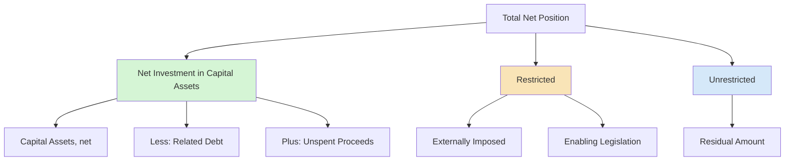

# Net Position and Components

**Net position** is the residual measure of a government's financial position on its government-wide financial statements and proprietary fund statements, reported under the **economic resources measurement focus** and **full accrual basis** of accounting. GASB Statement No. 34 requires that net position be displayed in three components: **net investment in capital assets**, **restricted**, and **unrestricted**.

:::info[Blueprint Coverage]

This section maps to **BAR Area III, Group C, Topic 1 – Net Position and Components Thereof**. Representative tasks:

1. **Calculate** the net position balances (unrestricted, restricted, and net investment in capital assets) for state and local governments and prepare journal entries.

:::

---

## Net Position vs. Fund Balance

Net position and fund balance are **not** the same concept. They appear on different financial statements and use different measurement focuses:

| | Net Position | Fund Balance |
|---|---|---|
| **Appears on** | Government-wide Statement of Net Position; Proprietary fund statements | Governmental fund balance sheets |
| **Measurement focus** | Economic resources | Current financial resources |
| **Basis of accounting** | Full accrual | Modified accrual |
| **Includes capital assets?** | Yes | No |
| **Includes long-term debt?** | Yes | No |
| **Components** | Net investment in capital assets, Restricted, Unrestricted | Nonspendable, Restricted, Committed, Assigned, Unassigned |

### The Net Position Equation

$$
\text{Net Position} = \text{Assets} + \text{Deferred Outflows of Resources} - \text{Liabilities} - \text{Deferred Inflows of Resources}
$$

:::tip[Exam Tip]

Remember that **deferred outflows** increase net position (they are like "future assets") and **deferred inflows** decrease net position (they are like "future liabilities"). These are distinct from assets and liabilities.

:::

---

## Three Components of Net Position



---

## Net Investment in Capital Assets

This component represents capital assets (net of accumulated depreciation/amortization) reduced by outstanding balances of debt attributable to the acquisition, construction, or improvement of those assets. Any **unspent debt proceeds** are added back because the resources remain available.

### Formula

$$
\text{Net Investment in Capital Assets} = \text{Capital Assets (net)} - \text{Related Debt Outstanding} + \text{Unspent Capital-Related Debt Proceeds}
$$

More precisely, deferred outflows and inflows related to debt refundings on capital-related debt are also included:

$$
\text{NICA} = \text{Capital Assets, net} - \text{Related Debt} + \text{Unspent Proceeds} + \text{Deferred Outflows (refundings)} - \text{Deferred Inflows (refundings)}
$$

### What Qualifies as "Related Debt"?

| Included in Related Debt | NOT Included |
|---|---|
| Bonds issued to build/acquire capital assets | General obligation bonds used for operating purposes |
| Capital leases / finance leases | Short-term construction loans already spent |
| Notes payable for equipment purchases | Debt where proceeds were fully spent on capital assets (no adjustment needed beyond net calculation) |
| Unamortized premium/discount on capital-related debt | Pension-related debt |

:::tip[Exam Tip]

Net investment in capital assets is typically the **largest** component for governmental activities because governments hold significant infrastructure (roads, bridges, buildings) with relatively low remaining debt.

:::

### Detailed Calculation Example

**Bear City** reports the following at year-end:

| Item | Amount |
|---|---|
| Capital assets (gross) | \$50,000,000 |
| Accumulated depreciation | \$18,000,000 |
| Bonds payable (issued for capital projects) | \$22,000,000 |
| Unamortized bond premium (capital-related) | \$400,000 |
| Unspent bond proceeds (restricted for construction) | \$3,500,000 |
| Deferred outflow – debt refunding (capital-related) | \$600,000 |

$$
\text{Capital Assets, net} = \$50{,}000{,}000 - \$18{,}000{,}000 = \$32{,}000{,}000
$$

$$
\text{Related Debt} = \$22{,}000{,}000 + \$400{,}000 = \$22{,}400{,}000
$$

$$
\text{NICA} = \$32{,}000{,}000 - \$22{,}400{,}000 + \$3{,}500{,}000 + \$600{,}000 = \$13{,}700{,}000
$$

---

## Restricted Net Position

Net position is **restricted** when constraints are placed on its use by either:

1. **External parties** — creditors, grantors, contributors, or laws/regulations of other governments
2. **Enabling legislation** — constitutional provisions or laws enacted by the government itself that require resources be used for a specific purpose

### Examples of Restricted Net Position

| Source of Restriction | Example |
|---|---|
| Creditors | Debt service reserve required by bond covenant |
| Grantors | Federal highway grant funds restricted for road construction |
| Other governments | State law requiring gas tax revenue be spent on transportation |
| Enabling legislation | City ordinance dedicating hotel tax for tourism promotion |
| Constitutional provision | State constitution requiring lottery proceeds fund education |

### Restricted vs. Unrestricted Spending Order

When both restricted and unrestricted resources are available for an expenditure, governments **spend restricted resources first** — unless legal requirements or the governing body has established a different policy.

:::warning[Key Distinction]

**Restricted net position** (government-wide) is narrower than **restricted fund balance** (governmental funds). Restricted net position only includes constraints from external parties or enabling legislation. Constraints imposed by the governing body (committed fund balance) do **not** qualify as restricted net position.

:::

---

## Unrestricted Net Position

The **unrestricted** component is the residual — the amount of net position that is neither invested in capital assets (net of related debt) nor restricted.

$$
\text{Unrestricted Net Position} = \text{Total Net Position} - \text{NICA} - \text{Restricted Net Position}
$$

### Key Points

- Can be **positive or negative**
- A negative unrestricted net position is **common** and does not mean insolvency
- Unrestricted does **not** mean "available for any purpose" — the governing body may have designated or committed resources for specific uses
- Unrestricted net position is simply the residual after the other two components are calculated

---

## Negative Unrestricted Net Position

Many governments report a **negative** unrestricted net position. The most common cause is the recognition of large long-term liabilities — particularly **net pension liabilities** and **OPEB (Other Post-Employment Benefits) liabilities** under GASB 68 and GASB 75.

### Why It Happens

| Cause | Explanation |
|---|---|
| Net pension liability | Unfunded pension obligations recognized on government-wide statements |
| Net OPEB liability | Retiree healthcare and other benefit obligations |
| Deferred maintenance | Capital assets depreciated without corresponding debt reduction |
| Large debt issuances | When debt exceeds capital asset values (common after major bond issues) |

### What It Means

- Does **not** indicate insolvency or inability to pay current obligations
- Does **not** violate any accounting standard
- Reflects the long-term nature of government obligations
- The government may still have positive fund balances in its governmental funds

:::tip[Exam Tip]

If a question asks whether a negative unrestricted net position indicates financial distress, the answer is **no** — it is common and reflects the timing of liability recognition. Governments have taxing authority and ongoing revenue streams to meet obligations.

:::

---

## Deferred Outflows and Inflows of Resources

Deferred outflows and inflows are reported **separately** from assets and liabilities and directly impact the net position equation.

| Category | Effect on Net Position | Common Examples |
|---|---|---|
| **Deferred Outflows** | Increase net position | Pension contributions after measurement date; loss on debt refunding; OPEB contributions after measurement date |
| **Deferred Inflows** | Decrease net position | Net difference in projected/actual pension earnings; gain on debt refunding; changes in assumptions (pension/OPEB) |

### Impact on Net Investment in Capital Assets

Only deferred outflows/inflows **related to capital-asset debt refundings** are included in the net investment in capital assets calculation. All other deferred outflows/inflows flow to unrestricted (or restricted, if applicable).

---

## Journal Entries Affecting Net Position

Net position is affected at the **government-wide level**. The following entries show how common transactions impact net position components.

### Capital Asset Purchase with Bond Proceeds

Pine County issues \$5,000,000 in bonds and uses \$4,200,000 to construct a new courthouse. The remaining \$800,000 is unspent at year-end.

Recording the bond issuance:

```journal
Dr. Cash[a] 5,000,000
    Cr. Bonds Payable[l] 5,000,000
```

Recording the capital asset construction:

```journal
Dr. Construction in Progress[a] 4,200,000
    Cr. Cash[a] 4,200,000
```

**Effect on net position components:**
- Net investment in capital assets = \$4,200,000 − \$5,000,000 + \$800,000 = **\$0**
- Restricted net position increases by \$800,000 (unspent proceeds restricted for construction)
- Unrestricted net position: no net change

### Receipt of Restricted Grant

Grizzly County receives a \$1,200,000 state grant restricted for bridge repairs:

```journal
Dr. Cash[a] 1,200,000
    Cr. Grant Revenue 1,200,000
```

**Effect:** Restricted net position increases by \$1,200,000.

When the grant is spent on the bridge:

```journal
Dr. Infrastructure – Bridges[a] 1,200,000
    Cr. Cash[a] 1,200,000
```

**Effect:** Resources move from restricted net position to net investment in capital assets.

### Annual Depreciation

Bear City records \$2,500,000 of depreciation on governmental activity capital assets:

```journal
Dr. Depreciation Expense 2,500,000
    Cr. Accumulated Depreciation[ca] 2,500,000
```

**Effect:** Reduces net investment in capital assets by \$2,500,000 and reduces total net position.

### Debt Principal Payment on Capital-Related Debt

Pine County makes a \$500,000 principal payment on the courthouse bonds:

```journal
Dr. Bonds Payable[l] 500,000
    Cr. Cash[a] 500,000
```

**Effect:** Net investment in capital assets **increases** by \$500,000 (related debt decreases). Unrestricted net position **decreases** by \$500,000 (cash used). Total net position is unchanged.

---

## Complete Worked Example

**Bear City — Statement of Net Position (Governmental Activities) at December 31, 20X4**

### Given Information

| Item | Amount |
|---|---|
| Capital assets (gross) | \$85,000,000 |
| Accumulated depreciation | \$32,000,000 |
| Other assets (cash, receivables, etc.) | \$14,500,000 |
| Deferred outflows – pensions | \$3,200,000 |
| Deferred outflows – debt refunding (capital-related) | \$750,000 |
| Revenue bonds payable (for capital assets) | \$38,000,000 |
| Unamortized premium on revenue bonds | \$1,100,000 |
| Net pension liability | \$21,000,000 |
| Other liabilities | \$4,600,000 |
| Deferred inflows – pensions | \$2,800,000 |
| Unspent bond proceeds (restricted for construction) | \$5,000,000 |
| Resources restricted by grantors | \$2,100,000 |
| Resources restricted by enabling legislation | \$900,000 |

### Step 1: Calculate Total Net Position

$$
\text{Total Assets} = \$85{,}000{,}000 - \$32{,}000{,}000 + \$14{,}500{,}000 = \$67{,}500{,}000
$$

$$
\text{Total Deferred Outflows} = \$3{,}200{,}000 + \$750{,}000 = \$3{,}950{,}000
$$

$$
\text{Total Liabilities} = \$38{,}000{,}000 + \$1{,}100{,}000 + \$21{,}000{,}000 + \$4{,}600{,}000 = \$64{,}700{,}000
$$

$$
\text{Total Deferred Inflows} = \$2{,}800{,}000
$$

$$
\text{Total Net Position} = \$67{,}500{,}000 + \$3{,}950{,}000 - \$64{,}700{,}000 - \$2{,}800{,}000 = \$3{,}950{,}000
$$

### Step 2: Net Investment in Capital Assets

$$
\text{Capital Assets, net} = \$85{,}000{,}000 - \$32{,}000{,}000 = \$53{,}000{,}000
$$

$$
\text{Related Debt} = \$38{,}000{,}000 + \$1{,}100{,}000 = \$39{,}100{,}000
$$

$$
\text{NICA} = \$53{,}000{,}000 - \$39{,}100{,}000 + \$5{,}000{,}000 + \$750{,}000 = \$19{,}650{,}000
$$

### Step 3: Restricted Net Position

The unspent bond proceeds are added back in the NICA calculation to prevent the related debt from reducing that component before the assets are constructed. Because those proceeds are already reflected in NICA, they are **not** separately included in restricted net position (to avoid double-counting). Restricted net position includes only the other externally restricted resources:

$$
\text{Restricted} = \$2{,}100{,}000 + \$900{,}000 = \$3{,}000{,}000
$$

:::warning[Watch Out]

Unspent capital-related debt proceeds are added back in the NICA formula **and** excluded from restricted net position. Do not count them in both components — that would overstate total net position.

:::

### Step 4: Unrestricted Net Position (Residual)

$$
\text{Unrestricted} = \$3{,}950{,}000 - \$19{,}650{,}000 - \$3{,}000{,}000 = -\$18{,}700{,}000
$$

### Summary

| Component | Amount |
|---|---|
| Net investment in capital assets | **\$19,650,000** |
| Restricted | **\$3,000,000** |
| Unrestricted | **(\$18,700,000)** |
| **Total net position** | **\$3,950,000** |

**Verification:**

$$
\$19{,}650{,}000 + \$3{,}000{,}000 + (-\$18{,}700{,}000) = \$3{,}950{,}000 \checkmark
$$

The negative unrestricted net position is primarily driven by the \$21,000,000 net pension liability — a common result under GASB 68.

---

## Summary of Key Rules

| Rule | Detail |
|---|---|
| Largest component (typically) | Net investment in capital assets |
| Residual component | Unrestricted |
| Spending order | Restricted resources spent before unrestricted (default) |
| Negative unrestricted | Common; not an indicator of insolvency |
| Deferred outflows/inflows in NICA | Only those related to capital-asset debt refundings |
| Unspent bond proceeds | Added back in NICA; not double-counted in restricted |
| Enabling legislation | Qualifies as restricted net position |
| Committed resources | Do NOT qualify as restricted net position (only restricted fund balance) |

:::tip[Exam Tip]

For calculation questions, always compute NICA first, then restricted, then unrestricted as the residual. This three-step approach prevents errors and ensures the components sum to total net position.

:::
