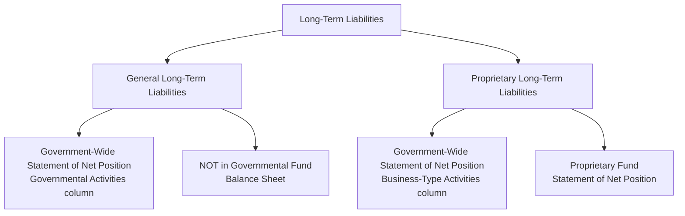

# General and Proprietary Long-Term Liabilities

State and local governments report **long-term liabilities** in the **government-wide financial statements** under the economic resources measurement focus and accrual basis of accounting. These liabilities fall into two categories — **general long-term liabilities** (related to governmental activities) and **proprietary long-term liabilities** (related to business-type activities) — each with distinct reporting requirements at the fund level versus the government-wide level.

:::info[Blueprint Coverage]

This section maps to **BAR Area III, Group C, Topic 4 – General and Proprietary Long-Term Liabilities**. Representative tasks:

1. **Identify** general and proprietary long-term liabilities reported in the government-wide financial statements of state and local governments.
2. **Recall** the recognition and measurement requirements for a net pension liability for a defined benefit pension plan for state and local governments.
3. **Recall** the recognition and measurement requirements for a net other post employment benefit (OPEB) liability for an OPEB plan for state and local governments.
4. **Calculate** the total indebtedness to be reported in the government-wide financial statements of a state or local government.
5. **Calculate** the net general long-term debt balance for state and local governments and prepare journal entries (e.g., debt issuance, interest payments, issue premiums, issue discounts).

:::

---

## General vs. Proprietary Long-Term Liabilities

| | General Long-Term Liabilities | Proprietary Long-Term Liabilities |
|---|---|---|
| **Related to** | Governmental activities | Business-type activities |
| **Backed by** | Full faith and credit (taxing power) | Revenue from enterprise operations |
| **Reported in government-wide?** | Yes | Yes |
| **Reported in fund statements?** | **No** — not in governmental fund balance sheet | Yes — in proprietary fund Statement of Net Position |
| **Examples** | GO bonds, compensated absences, net pension liability, net OPEB liability, claims & judgments | Revenue bonds, capital leases of enterprise funds |

:::warning[Critical Distinction]

General long-term liabilities are **never** reported in governmental fund financial statements. They appear **only** in the government-wide Statement of Net Position under governmental activities. This is because governmental funds use the current financial resources measurement focus — long-term obligations are not "current."

:::

---

## Where Long-Term Liabilities Are Reported



| Reporting Level | General LT Liabilities | Proprietary LT Liabilities |
|---|---|---|
| Government-wide Statement of Net Position | ✓ Reported | ✓ Reported |
| Governmental fund balance sheet | ✗ Not reported | N/A |
| Proprietary fund Statement of Net Position | N/A | ✓ Reported |
| Notes to financial statements | ✓ Disclosed | ✓ Disclosed |

---

## Types of Governmental Debt

| Debt Type | Description | Security/Backing |
|---|---|---|
| **General obligation (GO) bonds** | Backed by full faith, credit, and taxing power | Property taxes / general revenues |
| **Revenue bonds** | Repaid from specific revenue stream | User fees, tolls, utility charges |
| **Special assessment bonds** | Repaid from assessments on benefited properties | Special assessments levied on property owners |
| **Tax anticipation notes (TANs)** | Short-term borrowing against expected tax revenue | Anticipated tax collections |
| **Bond anticipation notes (BANs)** | Short-term borrowing pending long-term bond issuance | Proceeds of future bond issue |
| **Lease liabilities (GASB 87)** | Present value of future lease payments | Lease contract |
| **Compensated absences** | Accrued vacation/sick leave owed to employees | General revenues |
| **Claims and judgments** | Litigation settlements, self-insurance claims | General revenues |
| **Landfill closure/postclosure care** | Estimated future costs of closing a landfill | General revenues or enterprise fees |
| **Net pension liability (GASB 68)** | Unfunded portion of pension obligation | General revenues |
| **Net OPEB liability (GASB 75)** | Unfunded portion of OPEB obligation | General revenues |

:::tip[Exam Tip]

**GO bonds** are the most common general long-term liability tested. Remember: GO bonds are backed by taxing power, while revenue bonds are backed by a specific revenue source (e.g., water/sewer fees). Revenue bonds are typically proprietary long-term liabilities.

:::

---

## Bond Issuance Journal Entries — Government-Wide Level

At the government-wide level, bonds are recorded as long-term liabilities under full accrual accounting.

### Issuance at Par

Bear City issues \$5,000,000 of general obligation bonds at par (face value) on January 1:

```journal
Jan 1
Dr. Cash[a] 5,000,000
Cr. Bonds Payable[l] 5,000,000
```

### Issuance at a Premium

Bear City issues \$5,000,000 face value bonds at 102 (i.e., for \$5,100,000):

```journal
Jan 1
Dr. Cash[a] 5,100,000
Cr. Bonds Payable[l] 5,000,000
Cr. Premium on Bonds Payable[l] 100,000
```

### Issuance at a Discount

Bear City issues \$5,000,000 face value bonds at 98 (i.e., for \$4,900,000):

```journal
Jan 1
Dr. Cash[a] 4,900,000
Dr. Discount on Bonds Payable[ca] 100,000
Cr. Bonds Payable[l] 5,000,000
```

### Interest Payment

Bear City pays semiannual interest on its \$5,000,000, 6% GO bonds (coupon = \$150,000):

```journal
Jul 1
Dr. Interest Expense 150,000
Cr. Cash[a] 150,000
```

### Premium Amortization (Straight-Line)

Amortize \$100,000 premium over 20 semiannual periods (\$5,000 per period):

```journal
Jul 1
Dr. Premium on Bonds Payable[l] 5,000
Cr. Interest Expense 5,000
```

Net interest expense for the period = \$150,000 − \$5,000 = **\$145,000**.

### Discount Amortization (Straight-Line)

Amortize \$100,000 discount over 20 semiannual periods (\$5,000 per period):

```journal
Jul 1
Dr. Interest Expense 5,000
Cr. Discount on Bonds Payable[ca] 5,000
```

Net interest expense for the period = \$150,000 + \$5,000 = **\$155,000**.

---

## Fund-Level Treatment — Governmental Funds

At the governmental fund level, long-term debt is **not** recorded as a liability. Instead:

| Transaction | Governmental Fund Entry | Government-Wide Entry |
|---|---|---|
| Bond proceeds received | Other Financing Sources — Bond Proceeds | Bonds Payable (liability) |
| Principal payment | Expenditures — Debt Service (Principal) | Reduce Bonds Payable |
| Interest payment | Expenditures — Debt Service (Interest) | Interest Expense |
| Premium received | Other Financing Sources — Premium on Bonds | Premium on Bonds Payable (liability) |

### Example — Governmental Fund Entries for Bond Issuance at Premium

Bear City's General Fund records the same \$5,100,000 bond issuance:

```journal
Jan 1
Dr. Cash[a] 5,100,000
Cr. Other Financing Sources - Bond Proceeds 5,000,000
Cr. Other Financing Sources - Premium on Bonds 100,000
```

### Example — Debt Service Payment (Governmental Fund)

Bear City's Debt Service Fund pays \$250,000 principal and \$150,000 interest:

```journal
Jul 1
Dr. Expenditures - Debt Service (Principal) 250,000
Dr. Expenditures - Debt Service (Interest) 150,000
Cr. Cash[a] 400,000
```

:::warning[Key Difference]

At the governmental fund level, **no long-term liability is ever recorded**. Bond proceeds are "Other Financing Sources" and principal repayments are "Expenditures." At the government-wide level, the liability is established at issuance and reduced with each principal payment.

:::

---

## Net Pension Liability — GASB 68

GASB Statement No. 68 requires state and local governments to report a **net pension liability (NPL)** on the government-wide Statement of Net Position for defined benefit pension plans.

### Formula

$$
\text{Net Pension Liability (NPL)} = \text{Total Pension Liability (TPL)} - \text{Plan Fiduciary Net Position}
$$

| Component | Description |
|---|---|
| **Total Pension Liability (TPL)** | Present value of projected benefit payments attributable to past service (actuarial accrued liability) |
| **Plan Fiduciary Net Position** | Fair value of plan assets available to pay benefits |
| **Net Pension Liability** | The unfunded portion — what the government owes |

### Measurement Approach

| Element | Requirement |
|---|---|
| Actuarial cost method | Entry age normal |
| Discount rate | Blended rate — long-term expected rate of return on plan investments (to extent plan assets are projected to cover benefit payments), otherwise a municipal bond index rate |
| Attribution | Projected benefit payments attributed to periods of service using entry age normal |

### Pension Expense Components

$$
\text{Pension Expense} = \text{Service Cost} + \text{Interest on TPL} - \text{Expected Return on Plan Assets} \pm \text{Amortized Items}
$$

Amortized items include:
- Changes in assumptions
- Differences between expected and actual experience
- Differences between projected and actual earnings on plan assets

### Deferred Outflows and Inflows Related to Pensions

| Deferred Outflows (increase NPL expense over time) | Deferred Inflows (decrease NPL expense over time) |
|---|---|
| Net difference when actual earnings < projected | Net difference when actual earnings > projected |
| Changes in assumptions that increase TPL | Changes in assumptions that decrease TPL |
| Actual experience > expected (losses) | Actual experience < expected (gains) |
| Employer contributions after measurement date | — |

:::tip[Exam Tip]

**Contributions made after the measurement date** are always reported as a **deferred outflow of resources** — not a reduction of the net pension liability — until the next measurement date.

:::

---

## Net OPEB Liability — GASB 75

GASB Statement No. 75 mirrors GASB 68 for **other postemployment benefits (OPEB)** — benefits other than pensions provided to retired employees.

### What Qualifies as OPEB?

- Healthcare (medical, dental, vision)
- Life insurance
- Disability benefits
- Long-term care

### Formula

$$
\text{Net OPEB Liability} = \text{Total OPEB Liability} - \text{Plan Fiduciary Net Position}
$$

### Key Parallels to Pensions (GASB 68 vs. GASB 75)

| Element | GASB 68 (Pensions) | GASB 75 (OPEB) |
|---|---|---|
| Liability | Net Pension Liability | Net OPEB Liability |
| Actuarial cost method | Entry age normal | Entry age normal |
| Discount rate | Blended rate | Blended rate |
| Deferred outflows/inflows | Yes | Yes |
| Expense recognition | Service cost + interest ± amortizations | Service cost + interest ± amortizations |
| Measurement frequency | At least biennially | At least biennially |

:::info[OPEB vs. Pensions]

The primary conceptual difference is the benefit type — pensions provide retirement income, while OPEB provides other benefits (mainly healthcare). The accounting framework is virtually identical.

:::

---

## Compensated Absences

Governments must accrue liabilities for **compensated absences** (vacation and sick leave) that employees have earned but not yet used.

### Recognition Rules

| Leave Type | When to Accrue | Condition |
|---|---|---|
| **Vacation leave** | When earned | If rights vest or accumulate |
| **Sick leave** | Portion expected to be paid | Only if terminal payment or vesting policy exists |

### Government-Wide vs. Fund-Level

| Level | Treatment |
|---|---|
| **Government-wide** | Accrue the **full** liability for compensated absences |
| **Governmental funds** | Recognize expenditure only for amounts **due and payable** from currently available resources (typically the current portion) |
| **Proprietary funds** | Accrue the full liability (same as government-wide) |

### Example

Pine County employees have earned \$2,400,000 in unused vacation leave. Of this, \$600,000 is expected to be liquidated with current available resources.

**Government-wide entry:**

```journal
Dr. Compensated Absences Expense 2,400,000
Cr. Compensated Absences Payable[l] 2,400,000
```

**Governmental fund entry (only the current portion):**

```journal
Dr. Expenditures - Compensated Absences 600,000
Cr. Compensated Absences Payable[l] 600,000
```

---

## Calculating Total Indebtedness

The total indebtedness reported in the government-wide Statement of Net Position includes **all** long-term liabilities of both governmental and business-type activities.

### Example — MAS County Total Indebtedness

| Liability Category | Amount |
|---|---|
| General obligation bonds payable | \$45,000,000 |
| Less: Unamortized discount | (\$900,000) |
| Revenue bonds payable (enterprise fund) | \$18,000,000 |
| Plus: Unamortized premium | \$360,000 |
| Capital lease obligations | \$4,200,000 |
| Compensated absences | \$3,100,000 |
| Claims and judgments | \$1,800,000 |
| Net pension liability | \$12,500,000 |
| Net OPEB liability | \$8,400,000 |
| Landfill closure/postclosure care | \$2,600,000 |
| **Total indebtedness** | **\$95,060,000** |

$$
\text{Total} = 45{,}000{,}000 - 900{,}000 + 18{,}000{,}000 + 360{,}000 + 4{,}200{,}000 + 3{,}100{,}000 + 1{,}800{,}000 + 12{,}500{,}000 + 8{,}400{,}000 + 2{,}600{,}000 = \$95{,}060{,}000
$$

:::tip[Exam Tip]

When calculating total indebtedness, remember to **subtract** unamortized discounts and **add** unamortized premiums to the face value of bonds. The carrying value (net of premium/discount) is what appears on the Statement of Net Position.

:::

---

## Complete Worked Example — Bond Issuance and Debt Service

Bear City issues \$10,000,000 of 5%, 10-year general obligation serial bonds on July 1, Year 1, at 103 (total proceeds = \$10,300,000). Interest is paid semiannually on January 1 and July 1. The \$300,000 premium is amortized straight-line over 20 semiannual periods (\$15,000 per period). The first principal payment of \$1,000,000 is due July 1, Year 2.

### Government-Wide Entries (Full Accrual)

**July 1, Year 1 — Bond Issuance:**

```journal
Jul 1, Year 1
Dr. Cash[a] 10,300,000
Cr. Bonds Payable[l] 10,000,000
Cr. Premium on Bonds Payable[l] 300,000
```

**December 31, Year 1 — Accrue Interest at Year-End:**

Semiannual coupon = \$10,000,000 × 5% × ½ = \$250,000. Premium amortization = \$15,000.

```journal
Dec 31, Year 1
Dr. Interest Expense 235,000
Dr. Premium on Bonds Payable[l] 15,000
Cr. Interest Payable[l] 250,000
```

**January 1, Year 2 — Interest Payment:**

```journal
Jan 1, Year 2
Dr. Interest Payable[l] 250,000
Cr. Cash[a] 250,000
```

**July 1, Year 2 — Interest Payment + Premium Amortization:**

```journal
Jul 1, Year 2
Dr. Interest Expense 235,000
Dr. Premium on Bonds Payable[l] 15,000
Cr. Cash[a] 250,000
```

**July 1, Year 2 — Principal Payment:**

```journal
Jul 1, Year 2
Dr. Bonds Payable[l] 1,000,000
Cr. Cash[a] 1,000,000
```

### Governmental Fund Entries (Modified Accrual)

**July 1, Year 1 — Bond Issuance (Capital Projects Fund):**

```journal
Jul 1, Year 1
Dr. Cash[a] 10,300,000
Cr. Other Financing Sources - Bond Proceeds 10,000,000
Cr. Other Financing Sources - Premium on Bonds 300,000
```

**January 1, Year 2 — Interest Payment (Debt Service Fund):**

```journal
Jan 1, Year 2
Dr. Expenditures - Debt Service (Interest) 250,000
Cr. Cash[a] 250,000
```

**July 1, Year 2 — Interest + Principal Payment (Debt Service Fund):**

```journal
Jul 1, Year 2
Dr. Expenditures - Debt Service (Principal) 1,000,000
Dr. Expenditures - Debt Service (Interest) 250,000
Cr. Cash[a] 1,250,000
```

:::warning[Reconciliation Differences]

When preparing the reconciliation from governmental fund statements to government-wide statements, you must adjust for:
- Bond proceeds reported as Other Financing Sources (remove and add liability)
- Principal payments reported as expenditures (remove expenditure, reduce liability)
- Premium/discount amortization differences
- Accrued interest payable at year-end

:::

---

## Summary of Key Concepts

| Concept | Key Rule |
|---|---|
| General long-term liabilities | Reported only in government-wide statements — never in governmental funds |
| Proprietary long-term liabilities | Reported in both proprietary fund and government-wide statements |
| Bond proceeds (governmental fund) | Recorded as Other Financing Sources |
| Bond proceeds (government-wide) | Recorded as a liability |
| Net Pension Liability | TPL − Plan Fiduciary Net Position |
| Net OPEB Liability | Total OPEB Liability − Plan Fiduciary Net Position |
| Compensated absences (government-wide) | Full liability accrued |
| Compensated absences (governmental fund) | Only current portion recognized |
| Premium on bonds | Added to carrying value; amortized to reduce interest expense |
| Discount on bonds | Subtracted from carrying value; amortized to increase interest expense |
