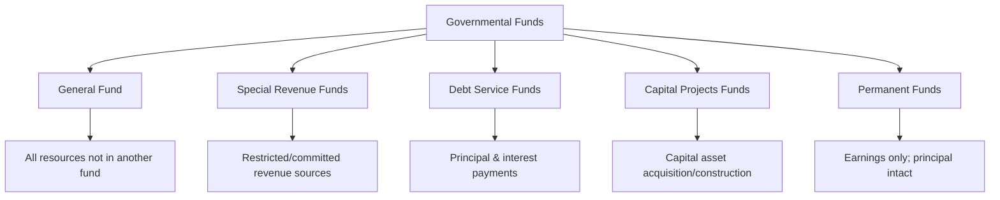
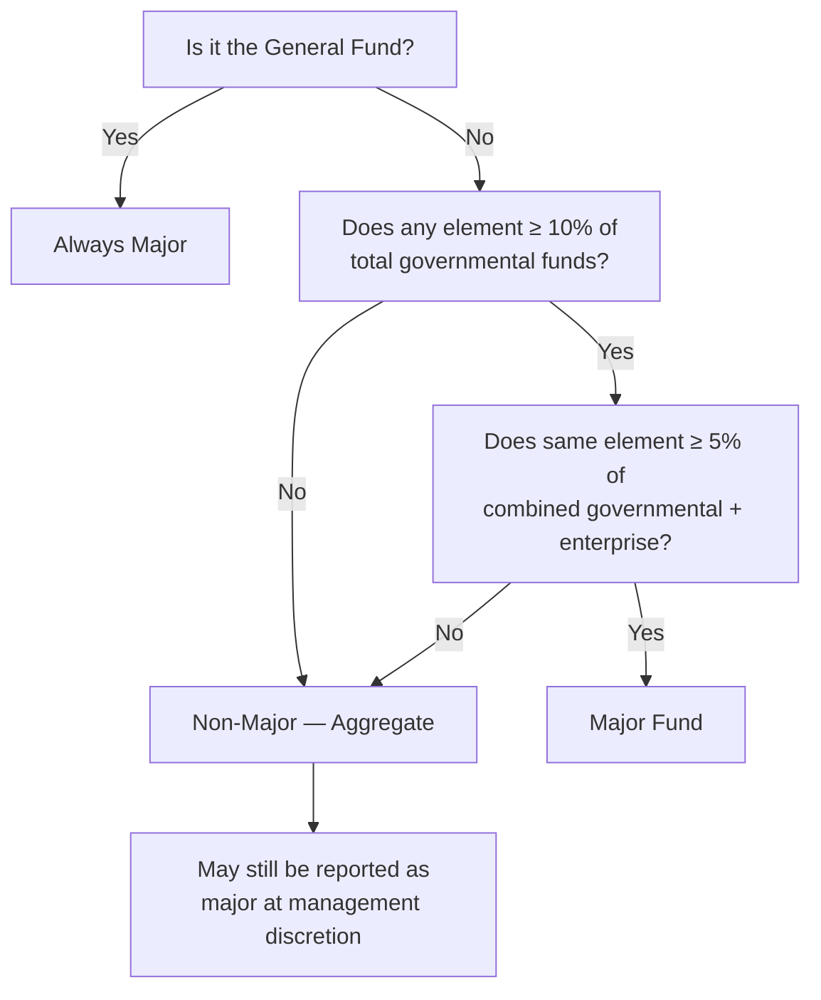

# Governmental Funds Financial Statements

Governmental funds financial statements report the **current financial resources** of a state or local government using the **modified accrual** basis of accounting. These fund-level statements emphasize **fiscal accountability** — showing whether resources obtained during the period were sufficient to cover current-period expenditures — and are the primary vehicle for demonstrating compliance with budgetary and legal requirements.

:::info[Blueprint Coverage]

This section maps to **BAR Area III, Group A, Topic 2 – Governmental funds financial statements**. Representative tasks:

1. **Identify and recall** basic concepts and principles associated with governmental fund financial statements (e.g., required funds, financial statements, financial statement components).
2. **Prepare** the statement of revenues, expenditures, and changes in fund balances for the governmental funds of a state or local government from trial balances and supporting documentation.
3. **Prepare** the balance sheet for the governmental funds of a state or local government from trial balances and supporting documentation.

:::

---

## The Five Governmental Fund Types

Every state or local government uses governmental funds to account for activities financed primarily through taxes, grants, and other nonexchange revenues.

| Fund | Purpose | Required? |
|---|---|---|
| **General Fund** | Accounts for all financial resources **not** accounted for in another fund | Yes — every government has exactly **one** |
| **Special Revenue Funds** | Accounts for revenues restricted or committed to specific purposes (other than debt service or capital projects) | Only when required by GAAP |
| **Debt Service Funds** | Accounts for accumulation of resources and payment of principal and interest on general long-term debt | Only when legally mandated or resources are being accumulated |
| **Capital Projects Funds** | Accounts for financial resources restricted or committed for acquisition or construction of major capital facilities | Only when required by GAAP |
| **Permanent Funds** | Accounts for resources legally restricted so that only **earnings** (not principal) may be used for the government's programs | Only when applicable |



:::tip[Exam Tip]

The General Fund is **always** reported as a major fund. It is the only fund that every government is required to maintain. If a question asks which fund type is mandatory, the answer is the General Fund.

:::

---

## Measurement Focus and Basis of Accounting

Governmental funds use a unique combination that differs from both private-sector GAAP and government-wide reporting:

| Feature | Governmental Funds | Government-Wide Statements |
|---|---|---|
| **Measurement focus** | Current financial resources | Economic resources |
| **Basis of accounting** | Modified accrual | Full accrual |
| **Reports capital assets?** | No | Yes |
| **Reports long-term debt?** | No | Yes |
| **Focus** | Fiscal accountability | Operational accountability |

### Current Financial Resources Measurement Focus

Only **current** assets and **current** liabilities are reported on the balance sheet. This means:

- Capital assets are **not** reported (purchases are expenditures)
- Long-term debt is **not** reported (proceeds are other financing sources)
- The net amount reported is **fund balance**, not net position

### Modified Accrual Basis — Revenue Recognition

Revenues are recognized when they are both:

1. **Measurable** — the amount can be reasonably estimated
2. **Available** — collectible within the current period or soon enough thereafter to pay current-period liabilities (typically **60 days** after year-end)

| Revenue Type | Recognition Rule |
|---|---|
| Property taxes | Recognized in period levied for, if collected within 60 days |
| Sales taxes | Recognized when underlying exchange occurs, if available |
| Income taxes | Recognized when measurable and available |
| Grants (expenditure-driven) | Recognized when qualifying expenditures are incurred |
| Grants (eligibility requirements) | Recognized when all eligibility requirements are met and available |

### Modified Accrual Basis — Expenditure Recognition

Expenditures are generally recognized when the **fund liability is incurred**, with key exceptions:

| Item | Recognition Rule |
|---|---|
| General operating costs | When liability is incurred |
| Debt service principal | When **due** (maturity date) |
| Debt service interest | When **due** (payment date) |
| Compensated absences | Only the amount due and payable (current portion) |
| Claims and judgments | Only the amount due and payable (current portion) |
| Pensions | Amount due for the current period |

:::warning[Key Exception — Debt Service]

Debt service principal and interest are recognized as expenditures when **due**, not when incurred. This is a major exception to the general rule that expenditures are recorded when the liability is incurred. However, if resources have been accumulated in a debt service fund for payment of principal and interest due early in the following year, the expenditure may be recognized in the current year (the "early recognition" option under GASB).

:::

---

## Required Financial Statements

Governmental funds require two financial statements plus reconciliations:

| Statement | Purpose |
|---|---|
| **Balance Sheet** | Reports current financial position (assets, deferred outflows, liabilities, deferred inflows, and fund balances) at a point in time |
| **Statement of Revenues, Expenditures, and Changes in Fund Balances** | Reports inflows, outflows, and net change in fund balance for a period of time |

Both statements must present individual columns for each **major** fund, with an aggregated column for all **non-major** funds.

---

## Balance Sheet — Format and Components

### Structure

$$
\text{Assets} + \text{Deferred Outflows of Resources} = \text{Liabilities} + \text{Deferred Inflows of Resources} + \text{Fund Balances}
$$

### Typical Balance Sheet Components

| Assets | Liabilities | Fund Balances |
|---|---|---|
| Cash and cash equivalents | Accounts payable | Nonspendable |
| Investments | Accrued liabilities | Restricted |
| Receivables (taxes, accounts) | Due to other funds | Committed |
| Due from other funds | Unearned revenue | Assigned |
| Inventories | Matured debt payable | Unassigned |
| Prepaid items | | |

:::warning[What Is NOT on the Balance Sheet]

Because governmental funds use the current financial resources measurement focus, the following items are **excluded** from the governmental funds balance sheet:
- Capital assets (land, buildings, equipment, infrastructure)
- Long-term debt (bonds payable, notes payable)
- Net pension liability
- Net OPEB liability
- Accrued interest on long-term debt (unless matured)

These items appear only on the **government-wide** statement of net position.

:::

### Fund Balance Classifications

Fund balances are classified in a five-tier hierarchy (per GASB 54):

| Classification | Constraint Level | Description |
|---|---|---|
| **Nonspendable** | Highest | Not in spendable form or must remain intact (e.g., inventory, prepaid items, permanent fund principal) |
| **Restricted** | High | Externally imposed constraints (grantors, creditors, laws) |
| **Committed** | Medium | Formal action by governing body's highest decision-making authority |
| **Assigned** | Low | Intended purpose expressed by governing body or designee |
| **Unassigned** | None | Residual balance in the General Fund only |

### Example — Balance Sheet for Bear City Governmental Funds

| | General Fund | Debt Service Fund | Capital Projects Fund | Non-Major Funds | Total |
|---|---:|---:|---:|---:|---:|
| **Assets** | | | | | |
| Cash and investments | \$4,800,000 | \$1,200,000 | \$3,500,000 | \$950,000 | \$10,450,000 |
| Property taxes receivable | 1,600,000 | 400,000 | — | 200,000 | 2,200,000 |
| Due from other funds | 300,000 | — | — | — | 300,000 |
| Inventories | 150,000 | — | — | — | 150,000 |
| **Total assets** | **\$6,850,000** | **\$1,600,000** | **\$3,500,000** | **\$1,150,000** | **\$13,100,000** |
| **Liabilities** | | | | | |
| Accounts payable | \$620,000 | — | \$800,000 | \$90,000 | \$1,510,000 |
| Due to other funds | — | — | — | 300,000 | 300,000 |
| Unearned revenue | 200,000 | — | — | 50,000 | 250,000 |
| **Total liabilities** | **820,000** | **—** | **800,000** | **440,000** | **2,060,000** |
| **Deferred inflows of resources** | | | | | |
| Unavailable revenue — property taxes | 400,000 | 100,000 | — | 50,000 | 550,000 |
| **Fund balances** | | | | | |
| Nonspendable | 150,000 | — | — | — | 150,000 |
| Restricted | — | 1,500,000 | 2,700,000 | 500,000 | 4,700,000 |
| Committed | 800,000 | — | — | 160,000 | 960,000 |
| Assigned | 500,000 | — | — | — | 500,000 |
| Unassigned | 4,180,000 | — | — | — | 4,180,000 |
| **Total fund balances** | **5,630,000** | **1,500,000** | **2,700,000** | **660,000** | **10,490,000** |
| **Total liabilities, deferred inflows, and fund balances** | **\$6,850,000** | **\$1,600,000** | **\$3,500,000** | **\$1,150,000** | **\$13,100,000** |

---

## Statement of Revenues, Expenditures, and Changes in Fund Balances

### Revenue Categories

Revenues are classified by **source**:

| Category | Examples |
|---|---|
| Taxes | Property taxes, sales taxes, income taxes |
| Licenses and permits | Business licenses, building permits, vehicle registrations |
| Intergovernmental | Federal and state grants, shared revenues |
| Charges for services | Recording fees, park fees, court costs |
| Fines and forfeitures | Traffic violations, code enforcement penalties |
| Investment earnings | Interest on deposits, gains on investments |
| Miscellaneous | Donations, sale of surplus property |

### Expenditure Classifications

Expenditures are classified by **function** (current operations), **debt service**, and **capital outlay**:

| Classification | Description | Examples |
|---|---|---|
| **Current — General government** | Legislative, executive, administrative | City council, mayor's office, finance department |
| **Current — Public safety** | Police, fire, corrections | Police department operations, fire equipment maintenance |
| **Current — Public works** | Streets, highways, sanitation | Road repair, snow removal, trash collection |
| **Current — Health and welfare** | Public health, social services | Clinic operations, welfare payments |
| **Current — Culture and recreation** | Parks, libraries, museums | Library staffing, park maintenance |
| **Current — Education** | Schools (if reported by the government) | Teacher salaries, textbooks |
| **Debt service — Principal** | Repayment of long-term debt principal | Bond principal payments |
| **Debt service — Interest** | Interest payments on long-term debt | Bond interest payments |
| **Capital outlay** | Acquisition or construction of capital assets | Building construction, equipment purchases |

### Other Financing Sources and Uses

Items that are **not** revenues or expenditures but affect fund balance:

| Item | Classification | Description |
|---|---|---|
| Transfers in | Other financing source | Resources received from another fund |
| Transfers out | Other financing use | Resources sent to another fund |
| Bond proceeds | Other financing source | Face amount of bonds issued |
| Premium on bonds issued | Other financing source | Amount received above par |
| Sale of capital assets | Other financing source (if material) | Proceeds from disposing of government property |
| Payment to refunding escrow agent | Other financing use | Resources used to defease debt |

### Example — Statement of Revenues, Expenditures, and Changes in Fund Balances for Bear City

| | General Fund | Debt Service Fund | Capital Projects Fund | Non-Major Funds | Total |
|---|---:|---:|---:|---:|---:|
| **Revenues:** | | | | | |
| Property taxes | \$8,200,000 | \$2,100,000 | — | \$600,000 | \$10,900,000 |
| Sales taxes | 3,400,000 | — | — | — | 3,400,000 |
| Licenses and permits | 450,000 | — | — | 80,000 | 530,000 |
| Intergovernmental | 1,800,000 | — | \$2,500,000 | 400,000 | 4,700,000 |
| Charges for services | 900,000 | — | — | 150,000 | 1,050,000 |
| Investment earnings | 180,000 | 50,000 | 120,000 | 30,000 | 380,000 |
| **Total revenues** | **14,930,000** | **2,150,000** | **2,620,000** | **1,260,000** | **20,960,000** |
| **Expenditures:** | | | | | |
| Current: | | | | | |
| &emsp;General government | 3,200,000 | — | — | 200,000 | 3,400,000 |
| &emsp;Public safety | 5,800,000 | — | — | 300,000 | 6,100,000 |
| &emsp;Public works | 2,400,000 | — | — | 500,000 | 2,900,000 |
| &emsp;Culture and recreation | 1,100,000 | — | — | 180,000 | 1,280,000 |
| Debt service: | | | | | |
| &emsp;Principal | — | 1,800,000 | — | — | 1,800,000 |
| &emsp;Interest | — | 950,000 | — | — | 950,000 |
| Capital outlay | 600,000 | — | 4,200,000 | — | 4,800,000 |
| **Total expenditures** | **13,100,000** | **2,750,000** | **4,200,000** | **1,180,000** | **21,230,000** |
| **Excess (deficiency) of revenues over expenditures** | **1,830,000** | **(600,000)** | **(1,580,000)** | **80,000** | **(270,000)** |
| **Other financing sources (uses):** | | | | | |
| Transfers in | — | 700,000 | 500,000 | — | 1,200,000 |
| Transfers out | (1,200,000) | — | — | — | (1,200,000) |
| Bond proceeds | — | — | 3,000,000 | — | 3,000,000 |
| **Total other financing sources (uses)** | **(1,200,000)** | **700,000** | **3,500,000** | **—** | **3,000,000** |
| **Net change in fund balances** | **630,000** | **100,000** | **1,920,000** | **80,000** | **2,730,000** |
| Fund balances — beginning | 5,000,000 | 1,400,000 | 780,000 | 580,000 | 7,760,000 |
| **Fund balances — ending** | **\$5,630,000** | **\$1,500,000** | **\$2,700,000** | **\$660,000** | **\$10,490,000** |

:::tip[Exam Tip]

Bond proceeds are **other financing sources**, not revenues. On the government-wide statements, bond proceeds create a liability — they are never reported as revenue at either level. Transfers also net to zero across all governmental funds when viewed in total.

:::

---

## Major Fund Reporting

### Definition of a Major Fund

Governments must separately present each **major** fund in a column on the financial statements.

| Rule | Requirement |
|---|---|
| **Always major** | The General Fund |
| **10% / 5% test** | Any governmental fund where a single element (assets + deferred outflows, liabilities + deferred inflows, revenues, or expenditures) meets **both**: |
| | (1) ≥ 10% of the corresponding **total for all governmental funds** |
| | (2) ≥ 5% of the corresponding total for **combined governmental and enterprise funds** |
| **Management discretion** | Any fund management believes is important to users may be reported as major |



### Presentation

| Column Type | Contents |
|---|---|
| Individual major fund columns | One column per major governmental fund |
| Non-major aggregate column | Single column combining all non-major governmental funds |
| Total column | Sum of all governmental funds |

:::warning[Non-Major Funds]

Non-major funds are presented in a **single aggregated column** labeled "Other Governmental Funds" or "Non-Major Governmental Funds." Individual fund detail for non-major funds is presented in **combining statements** included as supplementary information — not in the basic financial statements.

:::

---

## Reconciliation to Government-Wide Statements

A reconciliation is required either at the bottom of each governmental funds financial statement or on an accompanying schedule. These reconciliations explain why fund-level amounts differ from government-wide amounts.

### Balance Sheet Reconciliation (Fund Balance → Net Position)

| Reconciling Item | Effect |
|---|---|
| Capital assets used in governmental activities | **Add** (not reported in funds) |
| Accumulated depreciation | **Subtract** (not reported in funds) |
| Long-term liabilities (bonds, notes, compensated absences, pensions) | **Subtract** (not reported in funds) |
| Deferred inflows — unavailable revenues | **Add** (revenue recognized under full accrual) |
| Internal service fund net position | **Add** (consolidated into governmental activities) |
| Accrued interest on long-term debt | **Subtract** (not reported until due under modified accrual) |

### Example — Bear City Balance Sheet Reconciliation

| | Amount |
|---|---|
| Total fund balances — governmental funds | \$10,490,000 |
| Capital assets used in governmental activities | +68,000,000 |
| Accumulated depreciation | (22,000,000) |
| Long-term liabilities: | |
| &emsp;Bonds payable | (28,000,000) |
| &emsp;Compensated absences | (1,200,000) |
| &emsp;Net pension liability | (5,500,000) |
| Deferred outflows — pensions | +2,200,000 |
| Deferred inflows — pensions | (1,800,000) |
| Deferred inflows — unavailable revenue (now recognized) | +550,000 |
| Internal service fund net position | +1,260,000 |
| Accrued interest payable | (450,000) |
| **Net position of governmental activities** | **\$23,550,000** |

### Operating Statement Reconciliation (Change in Fund Balances → Change in Net Position)

| Reconciling Item | Effect |
|---|---|
| Capital outlay (expenditure in funds, capitalized at government-wide) | **Add** |
| Depreciation expense (not in funds, expensed at government-wide) | **Subtract** |
| Bond proceeds (OFS in funds, liability at government-wide) | **Subtract** |
| Debt principal payments (expenditure in funds, liability reduction at government-wide) | **Add** |
| Unavailable revenue changes (deferred in funds, recognized at government-wide) | **Add/Subtract** |
| Accrued interest changes | **Subtract** (if increase) |
| Internal service fund change in net position | **Add** |
| Pension and OPEB expense differences | **Add/Subtract** |

---

## Worked Example — MAS County Governmental Funds

### Trial Balance Data

MAS County has the following adjusted trial balance data at September 30, 20X5:

**General Fund:**

| Account | Debit | Credit |
|---|---:|---:|
| Cash | \$3,200,000 | |
| Property taxes receivable | 800,000 | |
| Due from Special Revenue Fund | 150,000 | |
| Inventories | 60,000 | |
| Accounts payable | | \$420,000 |
| Due to Capital Projects Fund | | 100,000 |
| Unearned revenue | | 90,000 |
| Deferred inflows — unavailable property taxes | | 180,000 |
| Fund balance — beginning | | 2,700,000 |
| Property tax revenue | | 7,500,000 |
| Sales tax revenue | | 2,800,000 |
| Charges for services | | 620,000 |
| Expenditures — general government | 2,100,000 | |
| Expenditures — public safety | 4,200,000 | |
| Expenditures — public works | 1,500,000 | |
| Expenditures — culture and recreation | 700,000 | |
| Capital outlay | 350,000 | |
| Transfer out to Debt Service Fund | 800,000 | |
| Transfer out to Capital Projects Fund | 550,000 | |

### Step 1 — Prepare the Balance Sheet

```journal
Sep 30, 20X5 — Closing entry (General Fund)
Dr. Property Tax Revenue 7,500,000
Dr. Sales Tax Revenue 2,800,000
Dr. Charges for Services 620,000
    Cr. Expenditures — General Government 2,100,000
    Cr. Expenditures — Public Safety 4,200,000
    Cr. Expenditures — Public Works 1,500,000
    Cr. Expenditures — Culture and Recreation 700,000
    Cr. Capital Outlay 350,000
    Cr. Transfer Out to Debt Service Fund 800,000
    Cr. Transfer Out to Capital Projects Fund 550,000
    Cr. Fund Balance — Unassigned[e] 720,000
```

**MAS County General Fund — Balance Sheet (September 30, 20X5):**

| Assets | Amount |
|---|---:|
| Cash | \$3,200,000 |
| Property taxes receivable | 800,000 |
| Due from Special Revenue Fund | 150,000 |
| Inventories | 60,000 |
| **Total assets** | **\$4,210,000** |

| Liabilities and Fund Balance | Amount |
|---|---:|
| Accounts payable | \$420,000 |
| Due to Capital Projects Fund | 100,000 |
| Unearned revenue | 90,000 |
| **Total liabilities** | **610,000** |
| Deferred inflows — unavailable property taxes | 180,000 |
| **Fund balances:** | |
| &emsp;Nonspendable (inventories) | 60,000 |
| &emsp;Unassigned | 3,360,000 |
| **Total fund balances** | **3,420,000** |
| **Total liabilities, deferred inflows, and fund balances** | **\$4,210,000** |

**Verification:**

$$
\$610{,}000 + \$180{,}000 + \$3{,}420{,}000 = \$4{,}210{,}000 \checkmark
$$

### Step 2 — Prepare the Operating Statement

**MAS County General Fund — Statement of Revenues, Expenditures, and Changes in Fund Balances:**

| | Amount |
|---|---:|
| **Revenues:** | |
| Property taxes | \$7,500,000 |
| Sales taxes | 2,800,000 |
| Charges for services | 620,000 |
| **Total revenues** | **10,920,000** |
| **Expenditures:** | |
| Current: | |
| &emsp;General government | 2,100,000 |
| &emsp;Public safety | 4,200,000 |
| &emsp;Public works | 1,500,000 |
| &emsp;Culture and recreation | 700,000 |
| Capital outlay | 350,000 |
| **Total expenditures** | **8,850,000** |
| **Excess of revenues over expenditures** | **2,070,000** |
| **Other financing sources (uses):** | |
| Transfer out to Debt Service Fund | (800,000) |
| Transfer out to Capital Projects Fund | (550,000) |
| **Total other financing uses** | **(1,350,000)** |
| **Net change in fund balance** | **720,000** |
| Fund balance — beginning | 2,700,000 |
| **Fund balance — ending** | **\$3,420,000** |

:::tip[Exam Tip]

Always verify that the **ending fund balance** on the operating statement ties to the **total fund balance** on the balance sheet. In this example, beginning fund balance (\$2,700,000) plus net change in fund balance (\$720,000) equals ending fund balance (\$3,420,000), which matches the balance sheet.

:::

---

## Comprehensive Exam Tips

:::tip[Exam Tip]

**High-yield governmental funds financial statement concepts for the BAR exam:**

1. **Modified accrual** = revenues when measurable and **available** (60-day rule); expenditures when **liability is incurred** (except debt service — when due).
2. **No capital assets** on the governmental funds balance sheet. Capital purchases are **expenditures** (capital outlay). No depreciation is recorded.
3. **No long-term debt** on the governmental funds balance sheet. Bond proceeds are **other financing sources**, not revenues.
4. **Five fund balance categories**: Nonspendable → Restricted → Committed → Assigned → Unassigned. Only the General Fund reports positive unassigned.
5. **Major fund reporting**: General Fund is always major. Other funds pass the **10%/5% test** (10% of governmental total AND 5% of combined governmental + enterprise total).
6. **Reconciliation** is required between fund balance and net position, and between change in fund balance and change in net position.
7. **Transfers** are other financing sources/uses — not revenues or expenditures. They net to zero across all funds.
8. **Unavailable revenue** (deferred inflow) occurs when revenue is earned but not collected within the availability period. It converts to revenue under full accrual on the government-wide statements.
9. Expenditure classification is by **function** (public safety, public works, etc.) for current operations, with separate categories for **debt service** and **capital outlay**.

:::
