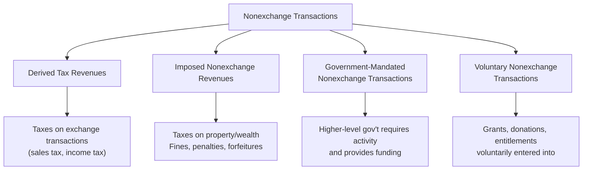
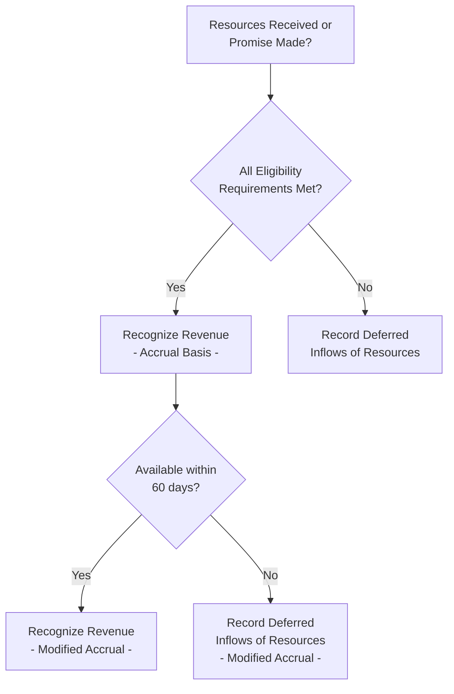

# Nonexchange Revenue Transactions

**Nonexchange transactions** are transactions in which a government either gives or receives value without directly giving or receiving equal value in return. Because taxes, grants, fines, and donations all fall into this category, the vast majority of governmental revenue is nonexchange revenue. GASB Statement No. 33 establishes the four classes of nonexchange transactions and prescribes when assets, liabilities, revenues, and expenses/expenditures should be recognized.

:::info[Blueprint Coverage]

This section maps to **BAR Area III, Group C, Topic 6 – Nonexchange Revenue Transactions**. Representative tasks:

1. **Calculate** the amount of nonexchange revenue to be recognized by state and local governments using the modified accrual basis of accounting and prepare journal entries.
2. **Calculate** the amount of nonexchange revenue to be recognized by state and local governments using the accrual basis of accounting and prepare journal entries.

:::

---

## Exchange vs. Nonexchange Transactions

| Characteristic | Exchange Transactions | Nonexchange Transactions |
|---|---|---|
| **Value exchanged** | Each party gives and receives approximately equal value | Government receives (or gives) value without directly giving (or receiving) equal value in return |
| **Examples** | Utility fees, service charges | Taxes, grants, fines, donations |
| **Revenue recognition** | When earned (service delivered) | Per GASB 33 class-specific rules |
| **Prevalence** | Proprietary funds primarily | Most governmental fund revenues |

:::tip[Exam Tip]

If a question describes a government collecting revenue where there is no direct exchange of comparable value (e.g., property taxes, federal grants), classify it as **nonexchange**. Only user charges and fees where specific services are rendered in return qualify as exchange transactions.

:::

---

## Four Classes of Nonexchange Transactions (GASB 33)



| Class | Examples | Asset Recognition | Revenue Recognition (Accrual) |
|---|---|---|---|
| **1. Derived Tax Revenues** | Sales tax, income tax, motor fuel tax | When underlying exchange occurs or resources received | When underlying exchange occurs |
| **2. Imposed Nonexchange Revenues** | Property tax, fines, penalties | Period for which levied (or when enforceable claim arises) | Period for which levied |
| **3. Government-Mandated Nonexchange** | Federal grants with mandated programs | When all eligibility requirements are met | When all eligibility requirements are met |
| **4. Voluntary Nonexchange** | Voluntary grants, donations, endowments | When all eligibility requirements are met | When all eligibility requirements are met |

---

## Recognition Rules — Accrual vs. Modified Accrual

| Class | Accrual Basis (Government-Wide) | Modified Accrual Basis (Governmental Funds) |
|---|---|---|
| **Derived Tax Revenues** | When underlying exchange occurs | When underlying exchange occurs **AND** available (collected within availability period) |
| **Imposed Nonexchange Revenues** | Period for which levied | Period for which levied **AND** available |
| **Government-Mandated** | When all eligibility requirements are met | When all eligibility requirements met **AND** available |
| **Voluntary Nonexchange** | When all eligibility requirements are met | When all eligibility requirements met **AND** available |

:::warning[Modified Accrual — The "Available" Constraint]

Under modified accrual, revenue is recognized only when it is both **measurable** and **available**. "Available" means collected within the current period or soon enough thereafter to pay current-period liabilities. The availability period is typically **60 days** after year-end (though a government may define a different period in its accounting policies).

:::

$$
\text{Modified Accrual Revenue} = \text{Earned (per accrual rules)} \cap \text{Available (collected within 60 days)}
$$

---

## Class 1: Derived Tax Revenues

Derived tax revenues are **imposed on exchange transactions** — the government taxes an underlying transaction between other parties.

| Tax Type | Underlying Exchange | Recognition Trigger |
|---|---|---|
| Sales tax | Sale of goods/services | When the sale occurs |
| Income tax | Earning of income | When the income is earned |
| Motor fuel tax | Purchase of fuel | When the fuel is purchased |

### Example — Sales Tax (Bear City)

Bear City imposes a 2% sales tax. During December 20X4, taxable sales in the city total \$15,000,000. The resulting \$300,000 in sales tax is remitted by retailers in January 20X5 (within 60 days of year-end).

**Government-wide statements (accrual basis)** — recognize when the sale occurs:

```journal
Dec 31, 20X4
Dr. Sales Tax Receivable[a] 300,000
Cr. Sales Tax Revenue 300,000
```

**General Fund (modified accrual basis)** — the tax is available because it is collected within 60 days:

```journal
Dec 31, 20X4
Dr. Sales Tax Receivable[a] 300,000
Cr. Sales Tax Revenue 300,000
```

If the \$300,000 were **not** collected within 60 days, the governmental fund would record:

```journal
Dec 31, 20X4
Dr. Sales Tax Receivable[a] 300,000
Cr. Deferred Inflows of Resources 300,000
```

---

## Class 2: Imposed Nonexchange Revenues

Imposed nonexchange revenues are assessments on **non-willing parties** — not derived from a specific exchange transaction. The most commonly tested topic is **property taxes**.

### Property Tax Recognition Timeline


### Property Tax Rules

| Event | Accrual Basis | Modified Accrual Basis |
|---|---|---|
| Taxes levied for the current period | Revenue | Revenue (if available) |
| Taxes levied but not yet available | Revenue | Deferred inflows of resources |
| Taxes collected in advance (for future period) | Deferred inflows | Deferred inflows |
| Estimated uncollectible amount | Offset via allowance | Offset via allowance |

:::tip[Exam Tip]

**Property taxes collected in advance** (before the period for which they are levied) are always **deferred inflows** — on both bases. This is a time requirement, not an availability issue.

:::

### Fines and Penalties

Fines and penalties are recognized as revenue when an **enforceable legal claim** arises (i.e., when the fine is imposed and the amount is determinable). Under modified accrual, they must also be available.

---

## Class 3 & 4: Government-Mandated and Voluntary Nonexchange Transactions

Both classes share the same recognition framework — revenue is recognized when **all eligibility requirements** are met.

### Eligibility Requirements (GASB 33)

| Requirement | Description | Example |
|---|---|---|
| **1. Required characteristics of recipients** | Recipient must possess specific traits | Only school districts with enrollment > 500 qualify |
| **2. Time requirements** | Resources cannot be used before a specified period | Grant funds are for FY 20X6 only |
| **3. Reimbursement (expenditure) requirements** | Recipient must incur allowable costs first | Cost-reimbursement grant — spend first, then claim |
| **4. Contingencies** | Specific actions must occur before resources are provided | Matching requirement — raise \$1 for every \$2 of grant |

### Recognition Logic



### Provider vs. Recipient Recognition

| | Provider (Grantor) | Recipient (Grantee) |
|---|---|---|
| **Before eligibility met** | Deferred outflows (or prepaid) | Deferred inflows |
| **When eligibility met** | Expense/expenditure | Revenue |
| **Accrual basis** | Expense when eligibility is met by recipient | Revenue when all requirements met |
| **Modified accrual** | Expenditure when eligibility met and payable | Revenue when eligibility met AND available |

:::warning[Time Requirements]

If a grant specifies that resources are for FY 20X6, the recipient **cannot** recognize revenue before FY 20X6 — even if cash is received in FY 20X5. The cash received early is reported as **deferred inflows of resources** by the recipient.

:::

---

## Property Tax Complete Example — Bear City

**Facts:** Bear City levies \$10,000,000 in property taxes for fiscal year 20X5 (July 1, 20X4 – June 30, 20X5).

- Estimated uncollectible: 2% (\$200,000)
- Collected during the fiscal year: \$9,200,000
- Collected July 1–August 29, 20X5 (within 60 days of year-end): \$500,000
- Collected after August 29, 20X5 (beyond 60 days): \$100,000

### Government-Wide Statements (Accrual Basis)

Under accrual, recognize the **full net levy** as revenue in the period for which levied:

```journal
Levy Date
Dr. Property Taxes Receivable[a] 10,000,000
Cr. Allowance for Uncollectible Taxes[ca] 200,000
Cr. Property Tax Revenue 9,800,000
```

As collections occur during the year:

```journal
During FY 20X5
Dr. Cash[a] 9,200,000
Cr. Property Taxes Receivable[a] 9,200,000
```

Collections after year-end (no additional revenue entry needed — already recognized):

```journal
After June 30, 20X5
Dr. Cash[a] 600,000
Cr. Property Taxes Receivable[a] 600,000
```

### General Fund (Modified Accrual Basis)

Under modified accrual, revenue is recognized only for amounts **available** — collected during the year or within 60 days after year-end.

| Component | Amount | Treatment |
|---|---|---|
| Collected during FY 20X5 | \$9,200,000 | Revenue |
| Collected within 60 days after year-end | \$500,000 | Revenue |
| Collected beyond 60 days | \$100,000 | Deferred inflows |
| Estimated uncollectible | \$200,000 | Allowance |
| **Total revenue recognized** | **\$9,700,000** | |

At the levy date:

```journal
Levy Date
Dr. Property Taxes Receivable[a] 10,000,000
Cr. Allowance for Uncollectible Taxes[ca] 200,000
Cr. Property Tax Revenue 9,700,000
Cr. Deferred Inflows of Resources 100,000
```

Collections during the year:

```journal
During FY 20X5
Dr. Cash[a] 9,200,000
Cr. Property Taxes Receivable[a] 9,200,000
```

Collections within 60 days (receivable already recorded, cash replaces it):

```journal
July–August 20X5
Dr. Cash[a] 500,000
Cr. Property Taxes Receivable[a] 500,000
```

When amounts are collected beyond 60 days, the deferred inflow is recognized as revenue in the **next** period:

```journal
Next Fiscal Year (when collected)
Dr. Cash[a] 100,000
Cr. Property Taxes Receivable[a] 100,000
Dr. Deferred Inflows of Resources 100,000
Cr. Property Tax Revenue 100,000
```

:::tip[Exam Tip]

**Modified accrual revenue formula for property taxes:**

$$
\text{Revenue} = \text{Levy} - \text{Uncollectible} - \text{Collected beyond 60 days}
$$

In this example: \$10,000,000 − \$200,000 − \$100,000 = **\$9,700,000**

:::

---

## Grant Revenue Example — Pine County

**Facts:** Pine County receives a \$2,000,000 federal reimbursement-type grant to build low-income housing (a voluntary nonexchange transaction). The grant has the following eligibility requirements:

- Pine County must be a qualifying municipality (met upon award)
- Funds are designated for FY 20X6 (time requirement)
- Pine County must incur eligible expenditures first, then request reimbursement (expenditure requirement)

### Year 1 (FY 20X5) — Grant Awarded, Cash Received in Advance

Pine County receives \$500,000 in advance before FY 20X6 begins. The time requirement has **not** been met.

**Accrual basis:**

```journal
FY 20X5
Dr. Cash[a] 500,000
Cr. Deferred Inflows of Resources 500,000
```

**Modified accrual basis (General Fund):**

```journal
FY 20X5
Dr. Cash[a] 500,000
Cr. Deferred Inflows of Resources 500,000
```

### Year 2 (FY 20X6) — Expenditures Incurred

During FY 20X6, Pine County incurs \$1,200,000 in eligible costs. Both the time requirement and expenditure requirement are now met for \$1,200,000.

**Accrual basis (government-wide):**

```journal
FY 20X6
Dr. Deferred Inflows of Resources 500,000
Cr. Grant Revenue 500,000
Dr. Intergovernmental Receivable[a] 700,000
Cr. Grant Revenue 700,000
```

**Modified accrual basis** — assume all \$1,200,000 is available (collected or collectible within 60 days):

```journal
FY 20X6
Dr. Deferred Inflows of Resources 500,000
Cr. Grant Revenue 500,000
Dr. Intergovernmental Receivable[a] 700,000
Cr. Grant Revenue 700,000
```

### Year 2 — Receipt of Reimbursement

When Pine County receives the \$700,000 reimbursement:

```journal
FY 20X6 (upon receipt)
Dr. Cash[a] 700,000
Cr. Intergovernmental Receivable[a] 700,000
```

---

## Summary Comparison Table

| Class | Asset Trigger | Revenue — Accrual | Revenue — Modified Accrual | Deferred Inflow Situations |
|---|---|---|---|---|
| **Derived Tax** | Underlying exchange or receipt of resources | When exchange occurs | Exchange occurs + available | Collected but not yet available |
| **Imposed** | Period for which levied | Period for which levied | Levied + available | Collected in advance; collected beyond 60 days |
| **Gov't-Mandated** | All eligibility requirements met | All requirements met | Requirements met + available | Resources received before eligibility met |
| **Voluntary** | All eligibility requirements met | All requirements met | Requirements met + available | Resources received before eligibility met |

---

## Common Exam Scenarios

| Scenario | Modified Accrual Treatment |
|---|---|
| Property taxes levied for current year, all collected | Full net levy = revenue |
| Property taxes collected 45 days after year-end | Revenue (within 60-day window) |
| Property taxes collected 90 days after year-end | Deferred inflows |
| Sales tax on December sales, received in January (within 60 days) | Revenue in the year of the sale |
| Federal grant — all requirements met, cash received in 30 days | Revenue |
| Federal grant — time requirement not yet met | Deferred inflows |
| State grant received in advance of allowable spending | Deferred inflows |
| Donation with no eligibility requirements | Revenue when received/promised |

:::tip[Exam Tip]

When solving nonexchange revenue problems on the CPA exam, follow this three-step approach:

1. **Classify** the transaction (derived, imposed, mandated, or voluntary).
2. **Apply class-specific rules** to determine when revenue is earned (accrual).
3. **Apply the availability test** if the question asks about modified accrual (governmental funds).

:::
