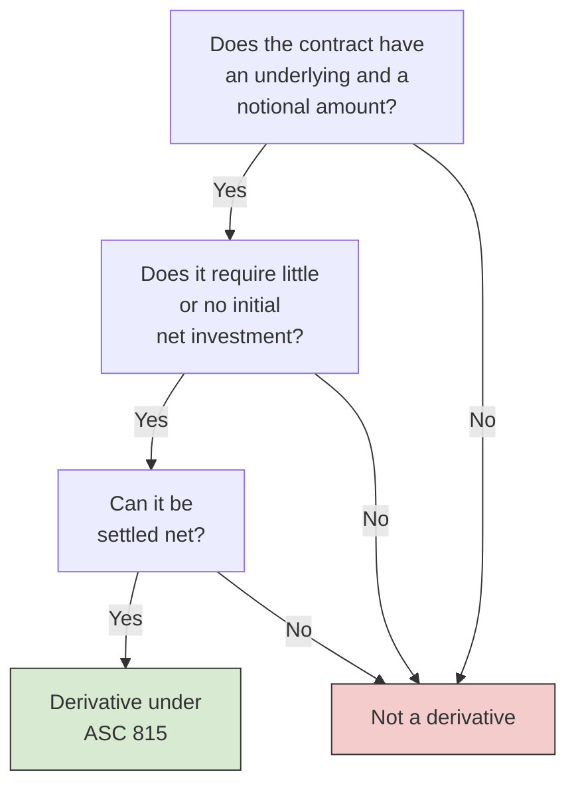
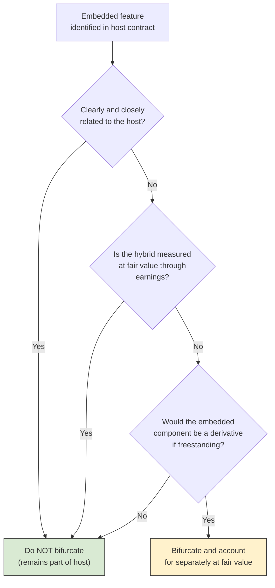
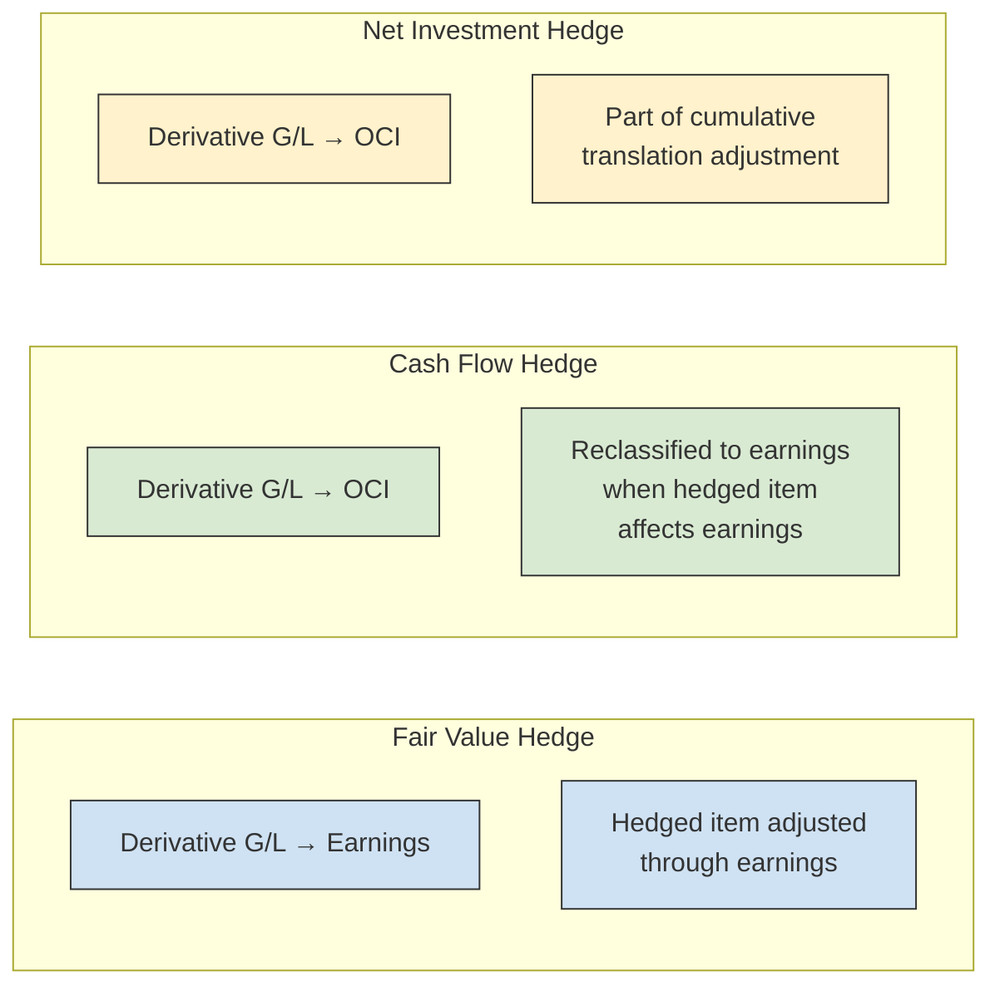
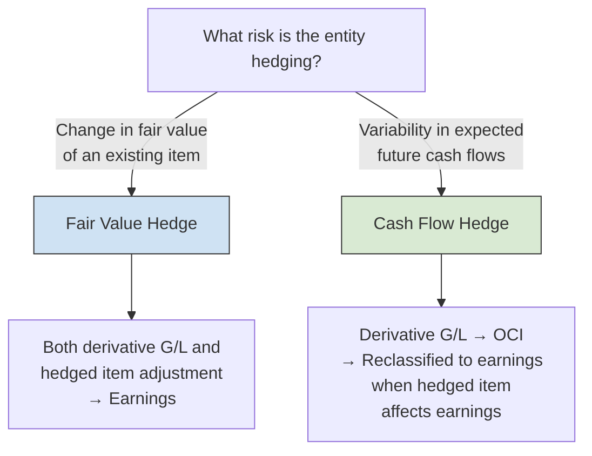
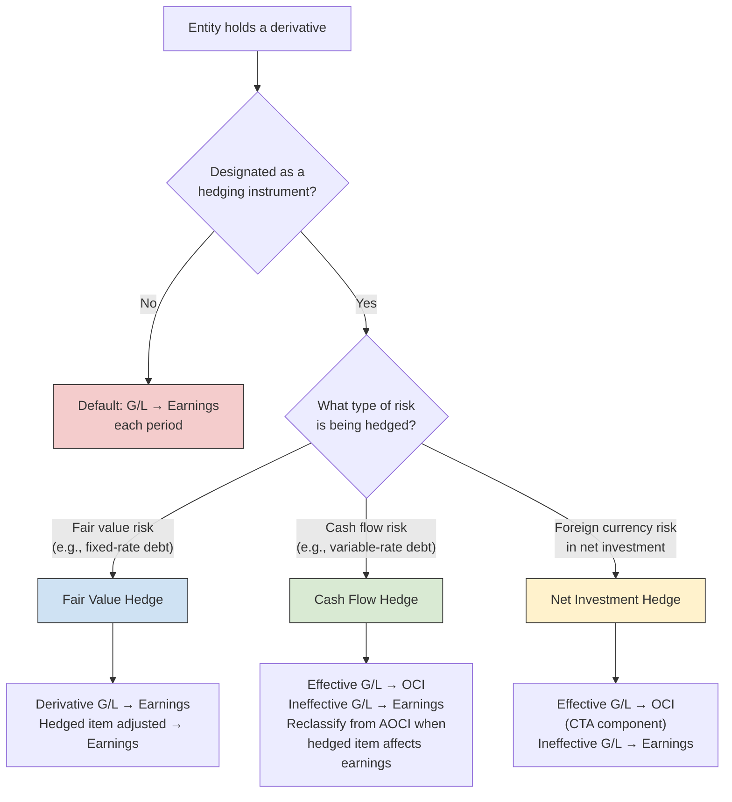

# Derivatives and Hedge Accounting

Derivative financial instruments — swaps, options, forwards, and futures — are contracts whose value is derived from an underlying variable such as an interest rate, commodity price, or foreign-exchange rate. Under **ASC 815** (_Derivatives and Hedging_), all derivatives must be recognized on the balance sheet at **fair value**. The BAR section tests your ability to identify derivative characteristics, distinguish freestanding from embedded derivatives, determine whether hedge accounting applies, and prepare journal entries for interest rate swaps designated as fair value or cash flow hedges.
:::info[Blueprint Coverage]
This topic maps to **Area II, Group H** of the 2026 CPA Exam Blueprints for **Business Analysis and Reporting (BAR)**. The blueprint expects candidates to:

- **Identify** the characteristics of a freestanding and/or embedded derivative financial instrument to be recognized in the financial statements.
- **Identify** the criteria necessary to qualify for hedge accounting.
- **Recall** the appropriate presentation of gains and losses on derivative financial instruments (swaps, options, and forwards) in the financial statements.
- **Use** given inputs (interest rates, notional amounts, fair value measurements) to prepare the journal entries to record the net settlements and changes in fair value for an interest rate swap that qualifies for hedge accounting (fair value hedge, cash flow hedge).
  :::

---

## What Is a Derivative?

ASC 815-10-15-83 defines a derivative as a financial instrument (or other contract) that has **all three** of the following characteristics:
| Characteristic | Description |
|---------------|-------------|
| **Underlying + Notional amount (or payment provision)** | The contract's value changes in response to an underlying variable (e.g., interest rate, stock price, commodity price) applied to a notional amount or payment provision |
| **Little or no initial net investment** | The contract requires no initial net investment, or an investment that is smaller than would be required for other contracts with a similar expected response to market changes |
| **Net settlement** | The contract can be settled net — in cash or by delivery of an asset readily convertible to cash — or contains a mechanism that, in effect, facilitates net settlement |



:::tip[Exam Tip]
Remember the three-part test with the mnemonic **"U-N-N"** — **U**nderlying + notional, **N**o (or little) initial net investment, **N**et settlement. If any one of the three is missing, the contract is **not** a derivative under ASC 815.
:::

---

## Common Types of Derivatives

| Instrument             | Description                                                                                                              | Typical Use                                             |
| ---------------------- | ------------------------------------------------------------------------------------------------------------------------ | ------------------------------------------------------- |
| **Forward contract**   | A customized, privately negotiated agreement to buy or sell an asset at a specified price on a future date               | Hedging foreign currency or commodity price risk        |
| **Futures contract**   | A standardized, exchange-traded version of a forward contract with daily margin settlement                               | Hedging commodity or interest rate risk                 |
| **Option**             | Gives the holder the **right, but not the obligation**, to buy (call) or sell (put) an asset at a specified strike price | Protecting against downside risk while retaining upside |
| **Interest rate swap** | An agreement to exchange fixed-rate and variable-rate interest payments on a notional principal amount                   | Converting variable-rate debt to fixed (or vice versa)  |

---

## Freestanding vs. Embedded Derivatives

ASC 815 distinguishes between derivatives that stand alone and those that are embedded within a host contract.

### Freestanding Derivatives

A **freestanding derivative** is a stand-alone contract — it is not part of another instrument. Examples include a purchased call option, a commodity forward, or an interest rate swap. Freestanding derivatives are **always** recognized on the balance sheet at fair value under ASC 815.

### Embedded Derivatives

An **embedded derivative** is a component within a larger host contract that causes some or all of the cash flows of the combined instrument to vary in a manner similar to a stand-alone derivative. A classic example is a convertible bond — the conversion feature is an embedded derivative within the debt host.
Under ASC 815-15, an embedded derivative must be **bifurcated** (separated) from the host and accounted for as a stand-alone derivative if **all three** of the following conditions are met:
| Condition | Explanation |
|-----------|-------------|
| **Not clearly and closely related** | The economic characteristics of the embedded derivative are not clearly and closely related to those of the host contract |
| **Hybrid instrument not at fair value** | The hybrid (combined) instrument is not remeasured at fair value through earnings each period |
| **Separate instrument would be a derivative** | A separate instrument with the same terms as the embedded component would meet the definition of a derivative |



:::warning
A common exam trap: if the hybrid instrument is **already measured at fair value through earnings** (e.g., a trading security), there is no need to bifurcate — the entire instrument already captures the derivative's fair value changes. Always check this condition before concluding that bifurcation is required.
:::

---

## Default Treatment — No Hedge Designation

When a derivative is **not** designated as a hedging instrument, gains and losses from changes in its fair value are recognized in **earnings (net income) immediately**. This is the default treatment under ASC 815.
| Event | Journal Entry Effect |
|-------|---------------------|
| Fair value increases | Dr. Derivative Asset / Cr. Gain — reported in earnings |
| Fair value decreases | Dr. Loss / Cr. Derivative Liability — reported in earnings |
This default treatment creates **earnings volatility** because the derivative's gains and losses hit the income statement each period, while the hedged item's offsetting gains and losses may be recognized in a different period or not at all.

---

## Hedge Accounting Overview

Hedge accounting is an **optional, elective** treatment that aligns the timing of gain/loss recognition for the derivative and the hedged item, reducing artificial earnings volatility. To qualify, an entity must meet specific criteria and formally document the hedging relationship.

### Criteria to Qualify for Hedge Accounting

ASC 815-20-25 requires **all** of the following:
| Criterion | Description |
|-----------|-------------|
| **Formal designation and documentation** | At inception, the entity must formally designate the derivative as a hedge and document the hedging relationship, risk management objective, and strategy |
| **Eligibility of the hedged item** | The hedged item must expose the entity to risk of changes in fair value or cash flows that could affect earnings |
| **Eligibility of the hedging instrument** | The hedging instrument must be a derivative (with limited exceptions for non-derivative instruments in foreign currency hedges) |
| **Hedge effectiveness** | The hedge must be expected to be **highly effective** in offsetting changes in fair value or cash flows attributable to the hedged risk, both at inception and on an ongoing basis |
:::tip[Exam Tip]
The BAR exam emphasizes that hedge accounting is **not automatic**. An entity must actively elect it, document the relationship at inception, and assess effectiveness. If the documentation is missing or the hedge ceases to be highly effective, the entity must **discontinue** hedge accounting prospectively.
:::

---

## Three Types of Hedges

ASC 815 recognizes three hedging relationships:
| Hedge Type | What Is Hedged | Derivative G/L Recognition | Hedged Item Adjustment |
|-----------|---------------|---------------------------|----------------------|
| **Fair value hedge** | Exposure to changes in the **fair value** of a recognized asset/liability or firm commitment | Earnings (current period) | Hedged item's carrying amount adjusted through earnings |
| **Cash flow hedge** | Exposure to variability in **expected future cash flows** of a recognized asset/liability or forecasted transaction | Other comprehensive income (OCI) → reclassified to earnings when hedged item affects earnings | No adjustment to carrying amount |
| **Net investment hedge** | Exposure to foreign currency risk in a **net investment in a foreign operation** | OCI (translation adjustment) | Part of cumulative translation adjustment |



---

## Fair Value Hedges — In Depth

A **fair value hedge** protects against changes in the fair value of a recognized asset, liability, or firm commitment due to a particular risk (e.g., interest rate risk on fixed-rate debt).

### Accounting Mechanics

1. The **derivative** is recorded at fair value, with changes in fair value recognized in **earnings**.
2. The **hedged item's** carrying amount is adjusted for the change in fair value attributable to the hedged risk, also through **earnings**.
3. Because both hit earnings in the same period, they **offset** each other — reducing net income volatility.
   $$
   \text{Net Earnings Impact} = \text{Gain (Loss) on Derivative} + \text{Loss (Gain) on Hedged Item} \approx 0
   $$

### Example — Bear Co. Fair Value Hedge (Interest Rate Swap)

On January 1, Year 1, Bear Co. issues a **\$1,000,000 fixed-rate note payable** at 5% annual interest, maturing in 3 years. To hedge the fair value exposure from interest rate changes, Bear Co. simultaneously enters into an **interest rate swap** — receiving 5% fixed and paying SOFR (currently 5%). The swap has a notional amount of \$1,000,000.
| Item | Details |
|------|---------|
| Hedged item | \$1,000,000 fixed-rate note payable |
| Hedging instrument | Receive-fixed / pay-variable interest rate swap |
| Notional amount | \$1,000,000 |
| Fixed rate (note and swap) | 5% |
| Variable rate (SOFR) at inception | 5% |
| Hedge designation | Fair value hedge |
**At inception (Jan 1, Year 1):** The swap has a fair value of \$0 (the fixed and variable rates are equal). No entry is required for the swap.
**At December 31, Year 1:** Market interest rates have risen to 6%. The fair value of Bear Co.'s fixed-rate note has **decreased** (it now pays below-market), and the swap has a **positive** fair value to Bear Co. because it receives 5% fixed and pays the now-higher SOFR. Assume the swap's fair value is \$18,000.
**Step 1 — Record the swap at fair value:**

```journal
Dec 31, Year 1
Dr. Interest Rate Swap[a] 18,000
    Cr. Gain on Hedge (Earnings) 18,000
```

**Step 2 — Adjust the hedged item (note payable) for the change in fair value attributable to the hedged risk:**

```journal
Dec 31, Year 1
Dr. Loss on Hedged Item (Earnings) 18,000
    Cr. Note Payable[l] 18,000
```

The note payable's carrying amount decreases from \$1,000,000 to \$982,000, reflecting the lower fair value. The \$18,000 gain on the swap and \$18,000 loss on the note offset in earnings.
**Net settlement of the swap (Dec 31, Year 1):**

$$
\text{Net Settlement} = (\text{SOFR} - \text{Fixed Rate}) \times \text{Notional} = (6\% - 5\%) \times \$1{,}000{,}000 = \$10{,}000
$$

Bear Co. pays \$10,000 net (because it pays the higher variable rate on the swap):

```journal
Dec 31, Year 1
Dr. Interest Expense 10,000
    Cr. Cash[a] 10,000
```

Bear Co. also records its regular interest on the note:

```journal
Dec 31, Year 1
Dr. Interest Expense 50,000
    Cr. Cash[a] 50,000
```

$$
\text{Total Interest Cost} = \$50{,}000 + \$10{,}000 = \$60{,}000
$$

The effective interest cost of \$60,000 equals the variable market rate of 6% × \$1,000,000 — exactly what Bear Co. intended by converting its fixed-rate exposure to a variable rate.
:::tip[Exam Tip]
In a **fair value hedge**, both the derivative gain/loss and the offsetting hedged-item adjustment flow through **earnings in the same period**. The net impact on income should be approximately zero if the hedge is highly effective. Look for the key phrase "carrying amount of the hedged item is adjusted" — that signals fair value hedge treatment.
:::

---

## Cash Flow Hedges — In Depth

A **cash flow hedge** protects against variability in expected future cash flows — for example, variable interest payments on floating-rate debt or a forecasted purchase of inventory at a fluctuating commodity price.

### Accounting Mechanics

1. The **derivative** is recorded at fair value on the balance sheet.
2. The **effective portion** of the gain or loss on the derivative is recognized in **other comprehensive income (OCI)**, not in earnings.
3. The amount in accumulated OCI (AOCI) is **reclassified** to earnings in the same period(s) in which the hedged forecasted transaction affects earnings.
4. Any **ineffective portion** is recognized in earnings immediately.
   $$
   \text{Derivative G/L (Effective)} \rightarrow \text{OCI} \rightarrow \text{Reclassified to Earnings when hedged item affects earnings}
   $$

### Example — Gies Co. Cash Flow Hedge (Interest Rate Swap)

On January 1, Year 1, Gies Co. has a **\$2,000,000 variable-rate note payable** that resets annually at SOFR. The current SOFR rate is 4%. To hedge the cash flow variability, Gies Co. enters into an interest rate swap — paying 4% fixed and receiving SOFR. The swap has a notional amount of \$2,000,000 and is designated as a cash flow hedge.
| Item | Details |
|------|---------|
| Hedged item | \$2,000,000 variable-rate note payable |
| Hedging instrument | Pay-fixed (4%) / receive-variable (SOFR) interest rate swap |
| Notional amount | \$2,000,000 |
| Fixed rate (swap leg) | 4% |
| Variable rate (SOFR) at inception | 4% |
| Hedge designation | Cash flow hedge |
**At inception (Jan 1, Year 1):** The swap has a fair value of \$0. No entry is needed.
**At December 31, Year 1:** SOFR has risen to 5%. The swap now has a **positive** fair value of \$19,000 to Gies Co. (it receives the higher SOFR rate and pays fixed 4%).
**Step 1 — Record the swap at fair value (effective portion to OCI):**

```journal
Dec 31, Year 1
Dr. Interest Rate Swap[a] 19,000
    Cr. Other Comprehensive Income (OCI) 19,000
```

**Step 2 — Record net settlement of the swap:**

$$
\text{Net Settlement} = (\text{SOFR} - \text{Fixed Rate}) \times \text{Notional} = (5\% - 4\%) \times \$2{,}000{,}000 = \$20{,}000
$$

Gies Co. **receives** \$20,000 net (because SOFR exceeds the fixed rate it pays):

```journal
Dec 31, Year 1
Dr. Cash[a] 20,000
    Cr. Interest Expense 20,000
```

**Step 3 — Record interest on the variable-rate note at the current SOFR rate:**

```journal
Dec 31, Year 1
Dr. Interest Expense 100,000
    Cr. Cash[a] 100,000
```

$$
\text{Net Interest Cost} = \$100{,}000 - \$20{,}000 = \$80{,}000
$$

The effective interest cost of \$80,000 equals the fixed rate of 4% × \$2,000,000 — Gies Co. has successfully locked in the fixed rate.
**Step 4 — Reclassify from AOCI to earnings:**
As the hedged cash flows (variable interest payments) affect earnings each period, the corresponding amounts in AOCI are reclassified. The net settlement already reduced interest expense above, so the reclassification is embedded in the settlement entry. On the exam, you may see a separate reclassification entry:

```journal
Dec 31, Year 1
Dr. Other Comprehensive Income (OCI) 20,000
    Cr. Interest Expense 20,000
```

:::warning
In a **cash flow hedge**, the derivative gain/loss goes to **OCI first**, not earnings. The AOCI balance is only reclassified to earnings when the hedged forecasted transaction actually affects earnings. If the forecasted transaction is no longer probable, the entity must reclassify the AOCI balance to earnings **immediately**.
:::

---

## Fair Value Hedge vs. Cash Flow Hedge — Comparison

| Feature                         | Fair Value Hedge                             | Cash Flow Hedge                                                      |
| ------------------------------- | -------------------------------------------- | -------------------------------------------------------------------- |
| **Risk hedged**                 | Changes in fair value of existing item       | Variability in future cash flows                                     |
| **Common scenario**             | Fixed-rate debt with interest rate swap      | Variable-rate debt with interest rate swap                           |
| **Swap structure**              | Receive-fixed / pay-variable                 | Pay-fixed / receive-variable                                         |
| **Derivative G/L**              | Earnings (immediately)                       | OCI (reclassified to earnings later)                                 |
| **Hedged item**                 | Carrying amount adjusted through earnings    | No carrying amount adjustment                                        |
| **Balance sheet**               | Hedged item's carrying value changes         | AOCI balance accumulates                                             |
| **Income statement volatility** | Low (gains and losses offset in same period) | Low (derivative G/L deferred in OCI until hedged item hits earnings) |



---

## Gains and Losses Presentation Summary

The BAR exam tests your knowledge of **where** derivative gains and losses appear in the financial statements. This table summarizes the presentation rules:
| Scenario | Gain/Loss Presentation |
|----------|----------------------|
| **Derivative — no hedge designation** | Earnings (income statement) immediately |
| **Fair value hedge — derivative** | Earnings (income statement) |
| **Fair value hedge — hedged item** | Earnings (carrying amount adjusted) |
| **Cash flow hedge — effective portion** | OCI → AOCI → reclassified to earnings when hedged transaction affects earnings |
| **Cash flow hedge — ineffective portion** | Earnings (income statement) immediately |
| **Net investment hedge — effective portion** | OCI (cumulative translation adjustment) |
| **Net investment hedge — ineffective portion** | Earnings (income statement) immediately |
:::tip[Exam Tip]
A quick rule of thumb: **Fair value hedge = both sides in earnings.** **Cash flow hedge = derivative to OCI first.** If the exam asks where a gain/loss is reported and the derivative is designated as a cash flow hedge, the answer is almost always **OCI** (for the effective portion).
:::

---

## Comprehensive Example — MAS Inc. Interest Rate Swap

MAS Inc. provides an end-to-end illustration tying together all the journal entries for a cash flow hedge over two years.
**Facts:** On January 1, Year 1, MAS Inc. borrows **\$5,000,000** at a variable rate of SOFR + 1%. The current SOFR is 3% (total rate = 4%). To lock in a fixed rate, MAS Inc. enters into a 2-year interest rate swap — paying 4% fixed and receiving SOFR + 1%. The swap has a notional of \$5,000,000 and is designated as a **cash flow hedge**.
| Year | SOFR | Borrowing Rate (SOFR + 1%) | Swap Fair Value (End of Year) |
|------|------|---------------------------|------------------------------|
| 1 | 3.5% | 4.5% | \$24,000 (asset) |
| 2 | 2.5% | 3.5% | \$0 (swap matures) |

### Year 1

**Interest payment on the note:**

$$
\text{Interest} = \$5{,}000{,}000 \times 4.5\% = \$225{,}000
$$

```journal
Dec 31, Year 1
Dr. Interest Expense 225,000
    Cr. Cash[a] 225,000
```

**Swap net settlement (MAS Inc. receives net because variable rate > fixed rate):**

$$
\text{Net Settlement} = (4.5\% - 4\%) \times \$5{,}000{,}000 = \$25{,}000
$$

```journal
Dec 31, Year 1
Dr. Cash[a] 25,000
    Cr. Interest Expense 25,000
```

**Record swap at fair value (effective portion to OCI):**

```journal
Dec 31, Year 1
Dr. Interest Rate Swap[a] 24,000
    Cr. Other Comprehensive Income (OCI) 24,000
```

**Net interest cost for Year 1:**

$$
\text{Net Interest} = \$225{,}000 - \$25{,}000 = \$200{,}000 = 4\% \times \$5{,}000{,}000
$$

MAS Inc. has effectively locked in the 4% fixed rate.

### Year 2

**Interest payment on the note:**

$$
\text{Interest} = \$5{,}000{,}000 \times 3.5\% = \$175{,}000
$$

```journal
Dec 31, Year 2
Dr. Interest Expense 175,000
    Cr. Cash[a] 175,000
```

**Swap net settlement (MAS Inc. pays net because variable rate < fixed rate):**

$$
\text{Net Settlement} = (4\% - 3.5\%) \times \$5{,}000{,}000 = \$25{,}000
$$

```journal
Dec 31, Year 2
Dr. Interest Expense 25,000
    Cr. Cash[a] 25,000
```

**Reverse swap fair value (swap returns to \$0 at maturity):**

```journal
Dec 31, Year 2
Dr. Other Comprehensive Income (OCI) 24,000
    Cr. Interest Rate Swap[a] 24,000
```

**Net interest cost for Year 2:**

$$
\text{Net Interest} = \$175{,}000 + \$25{,}000 = \$200{,}000 = 4\% \times \$5{,}000{,}000
$$

### Summary

|                       | Year 1              | Year 2        |
| --------------------- | ------------------- | ------------- |
| Interest on note      | \$225,000           | \$175,000     |
| Swap net settlement   | (\$25,000) received | \$25,000 paid |
| **Net interest cost** | **\$200,000**       | **\$200,000** |
| Swap fair value (B/S) | \$24,000 asset      | \$0           |
| AOCI balance          | \$24,000            | \$0           |

## In both years, MAS Inc. achieves a net interest cost equal to the 4% fixed rate it targeted — demonstrating the purpose of the cash flow hedge.

## Discontinuation of Hedge Accounting

Hedge accounting must be **discontinued prospectively** if any of the following occur:
| Event | Consequence |
|-------|------------|
| The derivative expires, is sold, or terminated | Fair value hedge: no further hedged-item adjustments; prior adjustments amortized to earnings. Cash flow hedge: AOCI balance remains and is reclassified when the forecasted transaction affects earnings |
| The hedge is no longer highly effective | Same as above — discontinue from the date effectiveness fails |
| The entity removes the hedge designation | Voluntary de-designation; same consequences |
| **Cash flow hedge only:** the forecasted transaction is no longer probable | AOCI balance is reclassified to earnings **immediately** |
:::warning
When a **cash flow hedge** is discontinued because the forecasted transaction is no longer probable of occurring, any gain or loss sitting in AOCI must be reclassified to earnings **right away** — it does not remain in equity. This is a frequently tested point.
:::

---

## Putting It All Together — Decision Framework


