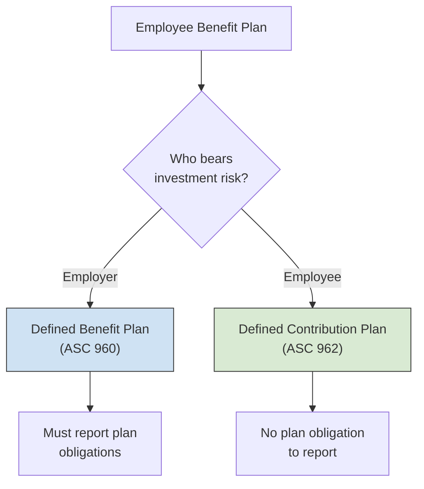
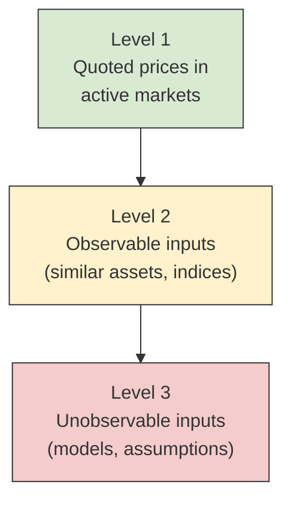

# Financial Statements of Employee Benefit Plans

Employee benefit plans — both **defined benefit** and **defined contribution** — are separate reporting entities that must issue their own financial statements under U.S. GAAP. The primary guidance is found in **ASC 960** (defined benefit pension plans) and **ASC 962** (defined contribution pension plans). The BAR section tests your ability to identify the required financial statements for each plan type, recall note disclosure requirements, and prepare the core statements: the **Statement of Net Assets Available for Benefits** and the **Statement of Changes in Net Assets Available for Benefits**.

:::info[Blueprint Coverage]
This topic maps to **Area II, Group K** of the 2026 CPA Exam Blueprints for **Business Analysis and Reporting (BAR)**. The blueprint expects candidates to:

- **Identify** the required financial statements for a defined benefit pension plan and a defined contribution pension plan.
- **Recall** the disclosure requirements for the notes to the financial statements of a defined benefit pension plan and a defined contribution pension plan.
- **Prepare** a statement of changes in net assets available for benefits for a defined benefit pension plan and a defined contribution pension plan.
- **Prepare** a statement of net assets available for benefits for a defined benefit pension plan and a defined contribution pension plan.
:::

---

## Overview of Applicable Standards

Employee benefit plan financial statements are governed by two primary ASC topics. These are **plan-level** (trust-level) statements — they report on the plan itself, not the sponsoring employer.

| Standard | Applies To | Key Focus |
|----------|-----------|-----------|
| **ASC 960** | Defined benefit pension plans | Net assets available for benefits **plus** accumulated plan benefits (the obligation) |
| **ASC 962** | Defined contribution pension plans | Net assets available for benefits only (no obligation to report) |
| **ASC 965** | Health and welfare benefit plans | Similar framework; not tested on BAR |

:::tip[Exam Tip]
The critical distinction: **defined benefit** plan statements must report the plan's **obligation** (accumulated plan benefits), whereas **defined contribution** plan statements only report the plan's **assets**. This is because in a defined contribution plan, the employer's obligation is satisfied once contributions are made — participants bear investment risk.
:::

---

## Defined Benefit vs. Defined Contribution — Key Differences



| Feature | Defined Benefit (ASC 960) | Defined Contribution (ASC 962) |
|---------|--------------------------|-------------------------------|
| **Benefit promise** | Specified future benefit (e.g., formula based on salary and years of service) | Specified current contribution (e.g., 6% of salary) |
| **Investment risk borne by** | Employer/plan sponsor | Participants |
| **Plan obligation reported?** | Yes — accumulated plan benefits | No |
| **Number of required statements** | 4 (or combined) | 2 |
| **Examples** | Traditional pension plans | 401(k), 403(b), profit-sharing plans |

---

## Required Financial Statements

### Defined Benefit Pension Plans (ASC 960)

ASC 960 requires the following financial statements:

1. **Statement of Net Assets Available for Benefits** — a snapshot of plan assets at the reporting date
2. **Statement of Changes in Net Assets Available for Benefits** — activity during the period
3. **Statement of Accumulated Plan Benefits** — the actuarial present value of all benefits earned to date
4. **Statement of Changes in Accumulated Plan Benefits** — changes in the obligation during the period

:::warning
Statements 3 and 4 relate to the **plan's obligation** — the present value of benefits promised to participants. Do not confuse these with the employer-level pension accounting (ASC 715). ASC 960 is about the plan as a **separate reporting entity**.
:::

### Defined Contribution Pension Plans (ASC 962)

ASC 962 requires only:

1. **Statement of Net Assets Available for Benefits**
2. **Statement of Changes in Net Assets Available for Benefits**

No obligation statement is needed because participants — not the plan — bear the investment risk.

| Statement | Defined Benefit | Defined Contribution |
|-----------|:-:|:-:|
| Statement of Net Assets Available for Benefits | ✓ | ✓ |
| Statement of Changes in Net Assets Available for Benefits | ✓ | ✓ |
| Statement of Accumulated Plan Benefits | ✓ | ✗ |
| Statement of Changes in Accumulated Plan Benefits | ✓ | ✗ |

---

## Measurement of Plan Investments

A foundational principle for both plan types: **investments are reported at fair value** on the reporting date.

| Investment Type | Measurement |
|----------------|-------------|
| Marketable securities (stocks, bonds) | Quoted market prices (Level 1) |
| Real estate | Appraised fair value |
| Insurance contracts (e.g., guaranteed investment contracts) | Contract value (approximates fair value for fully benefit-responsive contracts) |
| Participant loans | Outstanding balance (approximates fair value) |
| Alternative investments (hedge funds, PE) | Net asset value (NAV) as practical expedient |

:::tip[Exam Tip]
The key rule is simple: **plan investments = fair value**. This includes unrealized appreciation and depreciation in the net assets figure. There is no "held-to-maturity" or "amortized cost" exception for plan financial statements — everything is marked to market.
:::

---

## Statement of Net Assets Available for Benefits

This statement is a **balance sheet** for the plan. It presents plan assets minus plan liabilities (other than the benefit obligation) to arrive at **net assets available for benefits**.

### Format and Components

| Line Item | Description |
|-----------|-------------|
| **Investments** | All plan investments at fair value (broken out by type) |
| **Receivables** | Employer contributions receivable, participant contributions receivable, accrued interest/dividends |
| **Cash and cash equivalents** | Operating cash of the plan |
| **Total assets** | Sum of the above |
| **Liabilities** | Accounts payable, accrued expenses, benefits payable |
| **Net assets available for benefits** | Total assets − Liabilities |

### Example — Acme Corp Defined Benefit Pension Plan

**Statement of Net Assets Available for Benefits — December 31, Year 2**

| | Amount |
|---|---:|
| **Assets:** | |
| Investments at fair value: | |
| &emsp;U.S. government securities | \$4,200,000 |
| &emsp;Corporate bonds | 3,100,000 |
| &emsp;Common stocks | 8,500,000 |
| &emsp;Real estate fund | 1,800,000 |
| &emsp;*Total investments* | *17,600,000* |
| Employer contributions receivable | 350,000 |
| Accrued interest and dividends | 125,000 |
| Cash | 75,000 |
| **Total assets** | **18,150,000** |
| | |
| **Liabilities:** | |
| Accrued administrative expenses | 90,000 |
| Benefits payable to participants | 210,000 |
| **Total liabilities** | **300,000** |
| | |
| **Net assets available for benefits** | **\$17,850,000** |

---

## Statement of Changes in Net Assets Available for Benefits

This statement explains **why net assets changed** during the period — similar to a statement of activities.

### Format and Components

| Line Item | Description |
|-----------|-------------|
| **Additions:** | |
| &emsp;Investment income | Interest, dividends, rents |
| &emsp;Net appreciation (depreciation) in fair value | Realized + unrealized gains/losses |
| &emsp;Employer contributions | Amounts contributed by the sponsor |
| &emsp;Participant contributions | Employee deferrals (if applicable) |
| **Total additions** | Sum of all additions |
| **Deductions:** | |
| &emsp;Benefits paid to participants | Lump sums, annuity payments, withdrawals |
| &emsp;Administrative expenses | Trustee fees, audit fees, legal fees |
| **Total deductions** | Sum of all deductions |
| **Net increase (decrease)** | Total additions − Total deductions |
| **Net assets, beginning of year** | Prior year ending balance |
| **Net assets, end of year** | Beginning balance + Net increase (decrease) |

:::warning
**Net appreciation in fair value** combines both realized gains/losses on investments sold during the year **and** unrealized gains/losses from remeasuring investments still held at year-end. These are **not** separated in the statement — they are reported as a single line.
:::

### Example — Acme Corp Defined Benefit Pension Plan

**Statement of Changes in Net Assets Available for Benefits — Year Ended December 31, Year 2**

| | Amount |
|---|---:|
| **Additions:** | |
| Investment income: | |
| &emsp;Interest | \$620,000 |
| &emsp;Dividends | 310,000 |
| &emsp;Net appreciation in fair value of investments | 1,450,000 |
| &emsp;*Total investment income* | *2,380,000* |
| Employer contributions | 1,200,000 |
| Participant contributions | 480,000 |
| **Total additions** | **4,060,000** |
| | |
| **Deductions:** | |
| Benefits paid to participants | 2,850,000 |
| Administrative expenses | 160,000 |
| **Total deductions** | **3,010,000** |
| | |
| **Net increase** | **1,050,000** |
| Net assets available for benefits, beginning of year | 16,800,000 |
| **Net assets available for benefits, end of year** | **\$17,850,000** |

### Verification Formula

$$
\text{Ending Net Assets} = \text{Beginning Net Assets} + \text{Additions} - \text{Deductions}
$$

$$
\$17{,}850{,}000 = \$16{,}800{,}000 + \$4{,}060{,}000 - \$3{,}010{,}000
$$

---

## Statement of Accumulated Plan Benefits (Defined Benefit Only)

This statement reports the **actuarial present value of accumulated plan benefits** — the obligation the plan owes to participants. It is unique to defined benefit plans (ASC 960).

### Components

| Category | Description |
|----------|-------------|
| **Vested benefits — participants currently receiving payments** | Present value of benefits already being paid to retirees |
| **Vested benefits — other participants** | Present value of benefits earned by active and terminated vested employees |
| **Nonvested benefits** | Present value of benefits earned but not yet vested |
| **Total actuarial present value of accumulated plan benefits** | Sum of all three categories |

### Example

**Statement of Accumulated Plan Benefits — December 31, Year 2**

| | Amount |
|---|---:|
| Vested benefits: | |
| &emsp;Participants currently receiving payments | \$8,400,000 |
| &emsp;Other participants | 6,900,000 |
| *Total vested benefits* | *15,300,000* |
| Nonvested benefits | 1,200,000 |
| **Actuarial present value of accumulated plan benefits** | **\$16,500,000** |

:::tip[Exam Tip]
Compare the **accumulated plan benefits** (\$16,500,000) with **net assets available for benefits** (\$17,850,000). In this example, the plan is **overfunded** by \$1,350,000. If accumulated plan benefits exceed net assets, the plan is **underfunded**. The exam may ask you to determine funded status at the plan level.
:::

---

## Statement of Changes in Accumulated Plan Benefits (Defined Benefit Only)

This statement reconciles the beginning and ending obligation.

| Line Item | Amount |
|-----------|---:|
| Actuarial present value of accumulated plan benefits, beginning of year | \$15,800,000 |
| **Increases:** | |
| &emsp;Benefits earned during the period | 900,000 |
| &emsp;Interest (discount rate applied to obligation) | 630,000 |
| &emsp;Changes in actuarial assumptions | 120,000 |
| **Decreases:** | |
| &emsp;Benefits paid | (950,000) |
| **Net increase** | **700,000** |
| **Actuarial present value of accumulated plan benefits, end of year** | **\$16,500,000** |

---

## Defined Contribution Plan Example

### Bright Future 401(k) Plan

**Statement of Net Assets Available for Benefits — December 31, Year 2**

| | Amount |
|---|---:|
| **Assets:** | |
| Investments at fair value: | |
| &emsp;Mutual funds — equity | \$12,400,000 |
| &emsp;Mutual funds — bond | 4,600,000 |
| &emsp;Company stock fund | 2,100,000 |
| &emsp;Stable value fund | 3,200,000 |
| &emsp;Participant loans | 450,000 |
| &emsp;*Total investments* | *22,750,000* |
| Employer contributions receivable | 180,000 |
| Cash | 40,000 |
| **Total assets** | **22,970,000** |
| | |
| **Liabilities:** | |
| Accrued administrative expenses | 70,000 |
| **Total liabilities** | **70,000** |
| | |
| **Net assets available for benefits** | **\$22,900,000** |

**Statement of Changes in Net Assets Available for Benefits — Year Ended December 31, Year 2**

| | Amount |
|---|---:|
| **Additions:** | |
| Investment income: | |
| &emsp;Interest and dividends | \$680,000 |
| &emsp;Net appreciation in fair value of investments | 2,150,000 |
| &emsp;*Total investment income* | *2,830,000* |
| Employer contributions | 1,500,000 |
| Participant contributions | 3,200,000 |
| Rollovers from other plans | 320,000 |
| **Total additions** | **7,850,000** |
| | |
| **Deductions:** | |
| Benefits paid to participants | 4,100,000 |
| Administrative expenses | 150,000 |
| **Total deductions** | **4,250,000** |
| | |
| **Net increase** | **3,600,000** |
| Net assets available for benefits, beginning of year | 19,300,000 |
| **Net assets available for benefits, end of year** | **\$22,900,000** |

:::tip[Exam Tip]
In defined contribution plans, **participant contributions** (employee deferrals) are often a significant addition — much larger relative to employer contributions than in many defined benefit plans. Also note the **rollovers from other plans** line item, which is unique to participant-directed plans.
:::

---

## Recording Contributions — Journal Entry Perspective

While plan-level financial statements don't typically show debits and credits (they report balances and activity), understanding the underlying entries helps with exam preparation.

**Employer contribution received by the plan trust:**

```journal
Dr. Cash[a] 1,200,000
    Cr. Employer Contributions Revenue 1,200,000
```

**Participant payroll deductions received by the plan trust:**

```journal
Dr. Cash[a] 480,000
    Cr. Participant Contributions Revenue 480,000
```

**Purchase of investments by the plan:**

```journal
Dr. Investments[a] 2,000,000
    Cr. Cash[a] 2,000,000
```

**Benefits paid to a retired participant:**

```journal
Dr. Benefits Paid Expense 50,000
    Cr. Cash[a] 50,000
```

**Recognition of net appreciation in fair value:**

```journal
Dr. Investments[a] 1,450,000
    Cr. Net Appreciation in Fair Value of Investments 1,450,000
```

---

## Note Disclosure Requirements

Both plan types require extensive disclosures. The exam frequently tests whether candidates can **recall** what must be disclosed.

### Disclosures Common to Both Plan Types

| Disclosure | Description |
|-----------|-------------|
| **Description of the plan** | Type of plan, participant groups, vesting provisions, contribution requirements |
| **Significant accounting policies** | Basis for investment valuation, income recognition methods |
| **Investment information** | Fair value by category, concentrations exceeding 5% of net assets |
| **Tax status** | Whether the plan has received a favorable IRS determination letter |
| **Related-party transactions** | Transactions with the plan sponsor, trustee, or other parties-in-interest |
| **Plan amendments** | Significant changes adopted during the period |
| **Risks and uncertainties** | Concentrations that could cause a near-term severe impact |

### Additional Disclosures — Defined Benefit Plans (ASC 960)

| Disclosure | Description |
|-----------|-------------|
| **Actuarial present value of accumulated plan benefits** | If not presented as a separate statement, must be disclosed |
| **Significant actuarial assumptions** | Discount rate, retirement age, mortality tables, turnover rates |
| **Changes in assumptions** | Any changes from the prior year and their effects |
| **Funding policy** | How the sponsor determines its contributions |
| **Plan termination priority** | The order in which benefits would be distributed upon plan termination |

### Additional Disclosures — Defined Contribution Plans (ASC 962)

| Disclosure | Description |
|-----------|-------------|
| **Participant-directed investment programs** | How participants can direct their investments among options |
| **Allocation methods** | How employer contributions and forfeitures are allocated to participant accounts |
| **Forfeiture policy** | How nonvested amounts of terminated participants are handled |
| **Significant plan amendments** | Including automatic enrollment features or matching formula changes |

:::warning
A common exam trap: the **IRS determination letter** disclosure. Plans must disclose whether they have received a favorable determination letter or, if not, whether the plan administrator believes the plan is qualified. This applies to **both** defined benefit and defined contribution plans.
:::

---

## Fair Value Hierarchy for Plan Investments

Plan investments follow the same ASC 820 fair value hierarchy used elsewhere in GAAP:



| Level | Plan Investment Examples |
|-------|------------------------|
| **Level 1** | Publicly traded stocks, U.S. Treasury securities, mutual funds with daily NAV |
| **Level 2** | Corporate bonds (priced via matrix pricing), commingled trust funds |
| **Level 3** | Real estate partnerships, private equity, certain insurance contracts |
| **NAV practical expedient** | Hedge funds, collective investment trusts measured at NAV (not categorized in hierarchy) |

---

## Key Differences Summary — Reporting by Plan Type

| Item | Defined Benefit (ASC 960) | Defined Contribution (ASC 962) |
|------|--------------------------|-------------------------------|
| **Required statements** | 4 (net assets, changes in net assets, accumulated benefits, changes in accumulated benefits) | 2 (net assets, changes in net assets) |
| **Obligation reported?** | Yes — actuarial PV of accumulated plan benefits | No |
| **Actuarial assumptions needed?** | Yes (discount rate, mortality, etc.) | No |
| **Investment measurement** | Fair value | Fair value |
| **Participant account balances disclosed?** | Not applicable | Yes — plan must present or disclose individual account information |
| **Funded status** | Can be determined (net assets vs. obligation) | Not applicable (no obligation) |

---

## Practice Problem

**Facts:** The Evergreen Defined Benefit Pension Plan provides the following data for the year ended December 31, Year 3:

| Item | Amount |
|------|---:|
| Net assets available for benefits, January 1 | \$25,000,000 |
| Interest and dividend income | 890,000 |
| Net appreciation in fair value of investments | 1,620,000 |
| Employer contributions | 1,800,000 |
| Participant contributions | 600,000 |
| Benefits paid to participants | 3,400,000 |
| Administrative expenses | 210,000 |

**Required:** Prepare the Statement of Changes in Net Assets Available for Benefits.

**Solution:**

$$
\text{Total Additions} = \$890{,}000 + \$1{,}620{,}000 + \$1{,}800{,}000 + \$600{,}000 = \$4{,}910{,}000
$$

$$
\text{Total Deductions} = \$3{,}400{,}000 + \$210{,}000 = \$3{,}610{,}000
$$

$$
\text{Net Increase} = \$4{,}910{,}000 - \$3{,}610{,}000 = \$1{,}300{,}000
$$

$$
\text{Ending Net Assets} = \$25{,}000{,}000 + \$1{,}300{,}000 = \$26{,}300{,}000
$$

**Statement of Changes in Net Assets Available for Benefits — Year Ended December 31, Year 3**

| | Amount |
|---|---:|
| **Additions:** | |
| &emsp;Interest and dividends | \$890,000 |
| &emsp;Net appreciation in fair value of investments | 1,620,000 |
| &emsp;Employer contributions | 1,800,000 |
| &emsp;Participant contributions | 600,000 |
| **Total additions** | **4,910,000** |
| | |
| **Deductions:** | |
| &emsp;Benefits paid to participants | 3,400,000 |
| &emsp;Administrative expenses | 210,000 |
| **Total deductions** | **3,610,000** |
| | |
| **Net increase** | **1,300,000** |
| Net assets available for benefits, beginning of year | 25,000,000 |
| **Net assets available for benefits, end of year** | **\$26,300,000** |

---

## Summary

| Concept | Key Point |
|---------|-----------|
| **ASC 960** | Governs defined benefit plan financial statements — 4 required statements |
| **ASC 962** | Governs defined contribution plan financial statements — 2 required statements |
| **Investments** | Always reported at **fair value** |
| **Net appreciation** | Combines realized and unrealized gains/losses in one line |
| **Obligation** | Only defined benefit plans report accumulated plan benefits |
| **Disclosures** | Both plan types require description, accounting policies, investments, tax status, and related parties |
| **Funded status** | Net assets available for benefits vs. accumulated plan benefits (DB only) |
