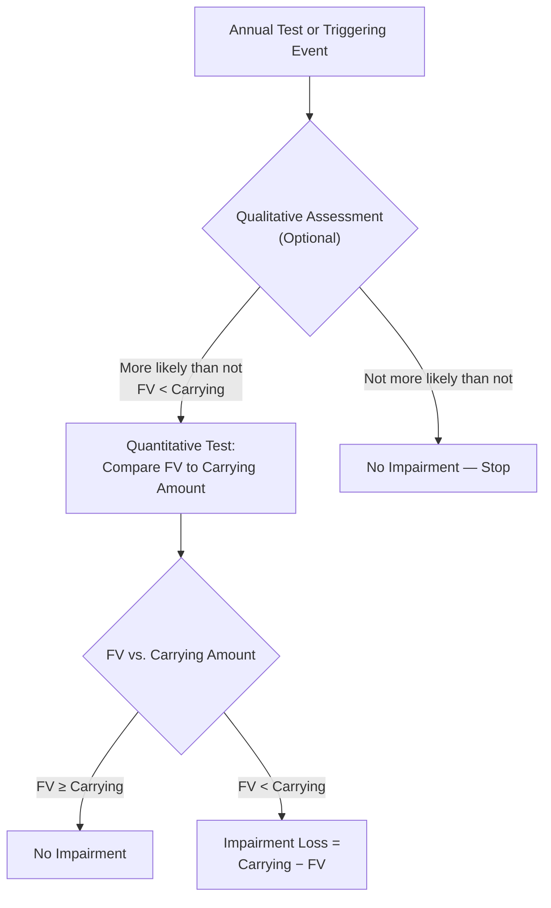
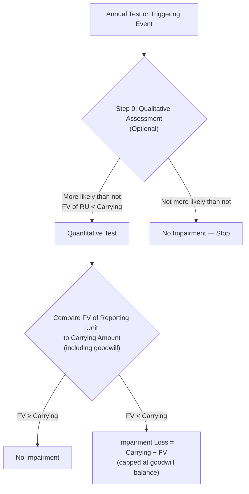

# Indefinite-Lived Intangible Assets and Goodwill

Certain intangible assets have **no foreseeable limit** on their useful life. Rather than being amortized over time, these assets are carried at cost and tested for impairment at least annually. The two most heavily tested categories on the BAR exam are **goodwill** (arising exclusively from business combinations) and **other indefinite-lived intangible assets** such as trademarks and broadcast licenses. Understanding how to recognize, measure, and test these assets for impairment — including both the qualitative and quantitative approaches — is critical for exam success.
:::info[Blueprint Coverage]
This topic maps to **Area II, Group A** of the 2026 CPA Exam Blueprints for **Business Analysis and Reporting (BAR)**. The blueprint expects candidates to:

- **Recall** impairment indicators for goodwill and other indefinite-lived intangible assets.
- **Calculate** the carrying amount of goodwill and other indefinite-lived intangible assets reported in the financial statements (initial and subsequent measurement, including impairment) and prepare journal entries.
  :::

---

## What Are Indefinite-Lived Intangible Assets?

An intangible asset has an **indefinite** useful life when there is **no foreseeable limit** on the period over which it is expected to generate net cash flows for the entity (ASC 350-30-35-4). "Indefinite" does not mean "infinite" — it means management cannot predict when (or if) the asset will cease to provide value.

### Common Examples

| Asset                        | Why Indefinite                                                                                         |
| ---------------------------- | ------------------------------------------------------------------------------------------------------ |
| **Goodwill**                 | No contractual or legal life; represents synergies and going-concern value from a business combination |
| **Trademarks / Trade names** | Renewable at minimal cost; no legal or economic limit                                                  |
| **FCC broadcast licenses**   | Renewable by regulation at negligible cost                                                             |
| **Certain franchises**       | Renewable indefinitely at minimal cost                                                                 |
| **Taxi medallions**          | No expiration (though economic value may change)                                                       |

:::tip[Exam Tip]
If an intangible has a **renewable** legal life and renewal is expected at **minimal cost with no material modifications**, it is typically classified as indefinite-lived.
:::

### Key Accounting Treatment

- **Not amortized** — carried at historical cost (less any impairment losses).
- Tested for impairment **at least annually**, and more frequently if events or changes in circumstances indicate that the asset may be impaired.
- Impairment losses, once recognized, are **never reversed** under U.S. GAAP.

---

## What Is Goodwill?

Goodwill is a **unique** intangible asset that can only arise in a **business combination** (ASC 805). It represents the excess of the consideration transferred over the fair value of the net identifiable assets acquired.

$$
\text{Goodwill} = \text{Consideration Transferred} - \text{Fair Value of Net Identifiable Assets Acquired}
$$

Goodwill captures the value of items that cannot be individually identified or separately recognized, such as:

- Assembled workforce
- Synergies expected from the combination
- Going-concern value
- Future customers not yet under contract
  :::warning
  Internally generated goodwill is **never** capitalized. Only goodwill arising from a business combination is recognized as an asset on the balance sheet.
  :::

---

## Goodwill vs. Other Indefinite-Lived Intangibles

While both goodwill and other indefinite-lived intangibles share the "no amortization" trait, they differ in important ways:
| Feature | Goodwill | Other Indefinite-Lived Intangibles |
|---------|----------|------------------------------------|
| **Source** | Business combination only | Can be purchased individually or in a business combination |
| **Separately identifiable?** | No — residual amount | Yes — arises from contractual/legal rights or is separable |
| **Impairment testing level** | Reporting unit level | Individual asset level |
| **Impairment test** | Compare fair value of reporting unit to its carrying amount | Compare fair value of asset to its carrying amount |
| **Qualitative assessment?** | Yes (optional) | Yes (optional) |
| **Cap on loss** | Limited to the goodwill balance of the reporting unit | Limited to the carrying amount of the individual asset |

---

## Initial Measurement of Goodwill

### Example — Bear Co. Acquires Gies Co.

Bear Co. pays \$5,000,000 to acquire 100% of Gies Co. The fair values of Gies Co.'s identifiable assets and liabilities at the acquisition date are:
| Item | Fair Value |
|------|-----------|
| Current assets | \$1,200,000 |
| Property, plant & equipment | \$2,400,000 |
| Customer relationships (identifiable intangible) | \$600,000 |
| Trade name (identifiable intangible — indefinite life) | \$400,000 |
| **Total identifiable assets** | **\$4,600,000** |
| Current liabilities | (\$800,000) |
| Long-term debt | (\$1,000,000) |
| **Total liabilities assumed** | **(\$1,800,000)** |
| **Fair value of net identifiable assets** | **\$2,800,000** |

$$
\text{Goodwill} = \$5{,}000{,}000 - \$2{,}800{,}000 = \$2{,}200{,}000
$$

```journal
Dr. Current Assets[a] 1,200,000
Dr. Property, Plant & Equipment[a] 2,400,000
Dr. Customer Relationships[a] 600,000
Dr. Trade Name[a] 400,000
Dr. Goodwill[a] 2,200,000
    Cr. Current Liabilities[l] 800,000
    Cr. Long-Term Debt[l] 1,000,000
    Cr. Cash[a] 5,000,000
```

:::tip[Exam Tip]
When the purchase price is **less than** the fair value of net identifiable assets, the difference is recognized as a **bargain purchase gain** in the income statement — not negative goodwill. Always double-check that all assets and liabilities have been properly valued at fair value before recording a bargain purchase.
:::

---

## Initial Measurement of Other Indefinite-Lived Intangibles

Other indefinite-lived intangible assets are recorded at **fair value at acquisition date** when acquired in a business combination, or at **cost** when purchased individually.

### Example — MAS Inc. Purchases a Trademark

MAS Inc. purchases a well-known trademark from an unrelated party for \$750,000, paying \$10,000 in legal fees to complete the transfer.

$$
\text{Trademark Cost} = \$750{,}000 + \$10{,}000 = \$760{,}000
$$

```journal
Dr. Trademark[a] 760,000
    Cr. Cash[a] 760,000
```

The trademark has an indefinite life because MAS Inc. intends to renew the registration indefinitely at negligible cost. It is **not amortized** but will be tested for impairment annually.

## Impairment Indicators

Entities must evaluate whether events or changes in circumstances indicate that an indefinite-lived intangible asset or goodwill may be impaired. Common indicators include:

### Indicators for Goodwill

| Category                          | Examples                                                                                       |
| --------------------------------- | ---------------------------------------------------------------------------------------------- |
| **Macroeconomic**                 | Deterioration in general economic conditions, rising interest rates, increased cost of capital |
| **Industry & market**             | Decline in market-dependent multiples, increased competition, regulatory changes               |
| **Cost factors**                  | Rising raw material costs, labor costs, or other costs that erode margins                      |
| **Financial performance**         | Declining revenues, operating losses, negative cash flows at the reporting unit level          |
| **Entity-specific events**        | Loss of key personnel, loss of a major customer, pending litigation, restructuring plans       |
| **Sustained stock price decline** | Market capitalization drops below book value for a sustained period                            |
| **Reporting unit changes**        | Disposal of a significant portion of a reporting unit, changes in reporting structure          |

### Indicators for Other Indefinite-Lived Intangibles

| Category               | Examples                                                                                                  |
| ---------------------- | --------------------------------------------------------------------------------------------------------- |
| **Legal / regulatory** | Adverse change in legal factors (e.g., loss of legal protection, unfavorable court ruling)                |
| **Competitive**        | Actions by competitors that diminish the value of the asset (e.g., a competing trademark gains dominance) |
| **Obsolescence**       | Technological changes that reduce the relevance of a brand or license                                     |
| **Cost of renewal**    | Evidence that renewal costs will no longer be minimal                                                     |
| **Reduced use**        | Entity reduces or ceases use of the intangible asset                                                      |

:::warning
The presence of one or more indicators does **not** automatically mean the asset is impaired — it means the entity must perform an impairment test. Conversely, the absence of indicators does not exempt the entity from the **annual** impairment test.
:::

---

## Impairment Testing — Other Indefinite-Lived Intangibles (ASC 350-30)

### Overview

Indefinite-lived intangible assets other than goodwill are tested for impairment by comparing the asset's **fair value** to its **carrying amount**. If fair value is less than carrying amount, an impairment loss is recognized.

$$
\text{Impairment Loss} = \text{Carrying Amount} - \text{Fair Value}
$$

### Qualitative Assessment (Optional)

An entity may first perform a **qualitative assessment** to determine whether it is **more likely than not** (greater than 50% likelihood) that the asset's fair value is less than its carrying amount. If the qualitative assessment indicates it is not more likely than not impaired, no quantitative test is required.

### Quantitative Test

If the qualitative screen is skipped or indicates potential impairment, the entity performs a direct comparison:



### Example — Bear Co. Trademark Impairment

Bear Co. holds a trademark with a carrying amount of \$760,000. Due to a competitor's aggressive rebranding campaign, management determines the trademark's fair value has declined to \$580,000.

$$
\text{Impairment Loss} = \$760{,}000 - \$580{,}000 = \$180{,}000
$$

```journal
Dr. Impairment Loss 180,000
    Cr. Trademark[a] 180,000
```

After the impairment, the trademark is carried at its new basis of **\$580,000**. This amount becomes the new carrying value for future impairment testing.

:::tip[Exam Tip]
For indefinite-lived intangibles (other than goodwill), the impairment test is a **one-step** direct comparison of fair value to carrying amount. Do **not** confuse this with the two-step recoverability test used for **finite-lived** long-lived assets under ASC 360.
:::

---

## Impairment Testing — Goodwill (ASC 350-20)

Goodwill impairment is tested at the **reporting unit** level. A reporting unit is an operating segment or one level below an operating segment (a component).

### Step-by-Step Process



### Qualitative Assessment (Step 0 — Optional)

The entity evaluates qualitative factors to determine whether it is more likely than not that the fair value of a reporting unit is less than its carrying amount. Factors to consider include the impairment indicators discussed above.
If the entity concludes it is **not** more likely than not that fair value is less than carrying amount, no further testing is required.

### Quantitative Test

If the qualitative screen is skipped or indicates potential impairment:

1. **Determine the fair value** of the reporting unit (using income, market, or cost approaches).
2. **Compare** the fair value to the reporting unit's carrying amount (including goodwill).
3. If fair value is **less than** carrying amount, recognize an impairment loss equal to the difference, **capped at the goodwill balance** allocated to that reporting unit.

   $$
   \text{Goodwill Impairment Loss} = \min\bigl(\text{Carrying Amount of RU} - \text{Fair Value of RU},\;\text{Goodwill Balance}\bigr)
   $$

   :::warning
   Goodwill can never be written down below **zero**. If the difference between carrying amount and fair value exceeds the goodwill balance, the loss is capped at the goodwill amount. The remaining excess is **not** allocated to other assets under the current simplified approach (post-ASU 2017-04).
   :::

---

## Comprehensive Goodwill Impairment Examples

### Example 1 — Partial Impairment (Gies Co.)

Gies Co. has a single reporting unit with the following amounts at its annual impairment test date:
| Item | Amount |
|------|--------|
| Net identifiable assets (carrying amount) | \$3,500,000 |
| Goodwill | \$1,200,000 |
| **Total carrying amount of reporting unit** | **\$4,700,000** |
| **Fair value of reporting unit** | **\$4,100,000** |
**Step 1 — Calculate the impairment loss:**

$$
\text{Impairment} = \$4{,}700{,}000 - \$4{,}100{,}000 = \$600{,}000
$$

**Step 2 — Apply the cap:**
Since \$600,000 < \$1,200,000 (goodwill balance), the **full** \$600,000 is recognized.

```journal
Dr. Goodwill Impairment Loss 600,000
    Cr. Goodwill[a] 600,000
```

**After impairment:**
| Item | Amount |
|------|--------|
| Net identifiable assets | \$3,500,000 |
| Goodwill (\$1,200,000 − \$600,000) | \$600,000 |
| **Total carrying amount** | **\$4,100,000** |

---

### Example 2 — Impairment Exceeds Goodwill Balance (MAS Inc.)

MAS Inc. has a reporting unit — its consulting division — with the following data:
| Item | Amount |
|------|--------|
| Net identifiable assets (carrying amount) | \$2,000,000 |
| Goodwill | \$300,000 |
| **Total carrying amount of reporting unit** | **\$2,300,000** |
| **Fair value of reporting unit** | **\$1,800,000** |
**Step 1 — Calculate the difference:**

$$
\text{Difference} = \$2{,}300{,}000 - \$1{,}800{,}000 = \$500{,}000
$$

**Step 2 — Apply the cap:**
The difference (\$500,000) **exceeds** the goodwill balance (\$300,000), so the impairment loss is capped at \$300,000.

```journal
Dr. Goodwill Impairment Loss 300,000
    Cr. Goodwill[a] 300,000
```

After this entry, goodwill is **\$0**. The remaining \$200,000 difference does **not** trigger an impairment of other assets (though a separate impairment analysis of other long-lived assets under ASC 360 may be warranted).
:::tip[Exam Tip]
When a question states the fair value of a reporting unit is far below its carrying amount, always check whether the impairment exceeds the goodwill balance. The loss is **capped** — this is a favorite exam trap.
:::

---

### Example 3 — No Impairment (Bear Co.)

Bear Co. has a reporting unit — its tax advisory division — with the following data:
| Item | Amount |
|------|--------|
| Net identifiable assets (carrying amount) | \$6,000,000 |
| Goodwill | \$2,500,000 |
| **Total carrying amount of reporting unit** | **\$8,500,000** |
| **Fair value of reporting unit** | **\$9,200,000** |
Since the fair value (\$9,200,000) **exceeds** the carrying amount (\$8,500,000), **no impairment** is recognized. No journal entry is needed.

---

## Reclassification from Indefinite to Finite Life

If circumstances change and an indefinite-lived intangible is determined to have a **finite** useful life, the entity must:

1. Test the asset for impairment **immediately** using the indefinite-lived model (fair value vs. carrying amount).
2. Reclassify the asset and begin **amortizing** it over its newly estimated useful life.

### Example — MAS Inc. Trademark Reclassification

MAS Inc. previously classified a trademark (carrying amount \$500,000) as indefinite-lived. A new government regulation limits the trademark's remaining useful life to 10 years. The fair value at the assessment date is \$480,000.
**Step 1 — Impairment test (indefinite-lived model):**

$$
\text{Impairment Loss} = \$500{,}000 - \$480{,}000 = \$20{,}000
$$

```journal
Dr. Impairment Loss 20,000
    Cr. Trademark[a] 20,000
```

**Step 2 — Begin amortization over the finite life (10 years):**

$$
\text{Annual Amortization} = \frac{\$480{,}000}{10} = \$48{,}000
$$

```journal
Dr. Amortization Expense 48,000
    Cr. Accumulated Amortization — Trademark[ca] 48,000
```

---

## Disposal of Goodwill

When all or a portion of a reporting unit is disposed of, a proportionate amount of goodwill must be included in the carrying amount of the operation for purposes of determining the gain or loss on disposal.

### Example — Gies Co. Sells Part of a Reporting Unit

Gies Co. has a reporting unit with total goodwill of \$600,000. Gies Co. sells an operation representing 40% of the fair value of the reporting unit for \$1,500,000. The carrying amount of the disposed operation's identifiable net assets is \$1,100,000.
**Goodwill allocated to disposal:**

$$
\text{Allocated Goodwill} = \$600{,}000 \times 40\% = \$240{,}000
$$

**Total carrying amount of disposed operation:**

$$
\$1{,}100{,}000 + \$240{,}000 = \$1{,}340{,}000
$$

**Gain on disposal:**

$$
\text{Gain} = \$1{,}500{,}000 - \$1{,}340{,}000 = \$160{,}000
$$

```journal
Dr. Cash[a] 1,500,000
    Cr. Net Assets Disposed[a] 1,100,000
    Cr. Goodwill[a] 240,000
    Cr. Gain on Disposal 160,000
```

---

## Financial Statement Presentation and Disclosure

| Item                                   | Presentation                                                                                       |
| -------------------------------------- | -------------------------------------------------------------------------------------------------- |
| **Goodwill**                           | Reported as a **separate line item** on the balance sheet                                          |
| **Other indefinite-lived intangibles** | Reported as a separate line or within intangible assets; disclosed by major class                  |
| **Impairment losses**                  | Reported within **operating income** (typically a separate line item)                              |
| **Goodwill by reportable segment**     | Disclosed in the notes, including changes during the period (acquisitions, impairments, disposals) |
| **Annual impairment test timing**      | Disclosed in accounting policy footnotes                                                           |

---

## Summary Comparison

| Feature                   | Goodwill                                  | Other Indefinite-Lived Intangibles      |
| ------------------------- | ----------------------------------------- | --------------------------------------- |
| **Amortization**          | None                                      | None                                    |
| **Impairment frequency**  | At least annually (or triggering event)   | At least annually (or triggering event) |
| **Impairment test level** | Reporting unit                            | Individual asset                        |
| **Qualitative option?**   | Yes                                       | Yes                                     |
| **Quantitative test**     | FV of reporting unit vs. carrying amount  | FV of asset vs. carrying amount         |
| **Loss measurement**      | Carrying amount − FV (capped at goodwill) | Carrying amount − FV                    |
| **Reversal allowed?**     | No                                        | No                                      |
| **Can arise internally?** | No — business combinations only           | No (but can be purchased individually)  |

:::info
**Key takeaway:** Both goodwill and other indefinite-lived intangibles are **never amortized** and are tested for impairment **at least annually**. Goodwill impairment is tested at the **reporting unit** level with a cap equal to the goodwill balance, while other indefinite-lived intangibles are tested at the **individual asset** level by comparing fair value to carrying amount. Both tests offer an optional qualitative screen, and neither allows reversal of recognized impairment losses.
:::
