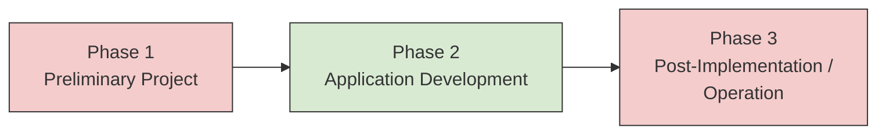
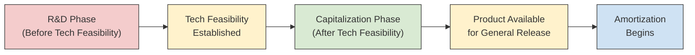

# Internally Developed Software

Companies routinely build software — either for their own operations or to sell to customers. U.S. GAAP draws a sharp line between these two scenarios and prescribes different capitalization rules for each. The BAR exam expects you to know **when** costs move from expense to asset, **which** costs qualify, and **how** to compute amortization once the asset is placed in service. This page covers the two authoritative frameworks: **ASC 350-40** (internal-use software) and **ASC 985-20** (software to be sold, leased, or otherwise marketed).
:::info[Blueprint Coverage]
This topic maps to **Area II, Group B** of the 2026 CPA Exam Blueprints for **Business Analysis and Reporting (BAR)**. The blueprint expects candidates to:

- **Recall** the criteria necessary to capitalize software developed for internal use or software developed for sale in the financial statements.
- **Calculate** capitalized software developed for internal use or software developed for sale to be reported in the financial statements and the related amortization expense.
  :::

---

## Two Frameworks at a Glance

| Feature                    | ASC 350-40 — Internal Use                                         | ASC 985-20 — For Sale / Lease                                  |
| -------------------------- | ----------------------------------------------------------------- | -------------------------------------------------------------- |
| **Scope**                  | Software used internally (back-office, ERP, intranet)             | Software to be sold, leased, or marketed externally            |
| **Capitalization trigger** | When management commits to the project and preliminary stage ends | After **technological feasibility** is established             |
| **Phases**                 | Preliminary → Application Development → Post-Implementation       | Research & planning → After tech feasibility → General release |
| **Amortization method**    | Straight-line over estimated useful life                          | Greater of (a) revenue-based ratio or (b) straight-line        |
| **Impairment model**       | ASC 360 (long-lived assets)                                       | Net realizable value (NRV) test each period                    |

---

## Part 1 — Software Developed for Internal Use (ASC 350-40)

### Scope

ASC 350-40 applies when software is developed or obtained **solely for the entity's internal needs** and there is **no substantive plan** to market the software externally. Common examples include ERP systems, internal accounting platforms, and company intranets.

### The Three Phases

Internal-use software projects move through three distinct phases. The phase determines whether costs are **expensed** or **capitalized**.



| Phase                                   | Activities                                                                                                              | Accounting Treatment    |
| --------------------------------------- | ----------------------------------------------------------------------------------------------------------------------- | ----------------------- |
| **1 — Preliminary Project**             | Conceptual formulation, evaluating alternatives, determining technology, selecting vendors                              | **Expense as incurred** |
| **2 — Application Development**         | Coding, testing, installation of hardware/software, data conversion (to the extent needed for the software to function) | **Capitalize**          |
| **3 — Post-Implementation / Operation** | Training, maintenance, minor bug fixes, ongoing data conversion                                                         | **Expense as incurred** |

:::tip[Exam Tip]
Think of the mnemonic **P-A-P**: **P**reliminary = expense, **A**pplication development = capitalize, **P**ost-implementation = expense. Only the middle phase creates an asset.
:::

### Costs That Are Capitalized (Phase 2)

During the application development stage, the following costs are capitalized:

- External direct costs of materials and services (e.g., third-party consultants, purchased software)
- Payroll and payroll-related costs for employees **directly devoted** to the project
- Interest costs incurred during development (if the software qualifies as a qualifying asset under ASC 835-20)

### Costs That Are Always Expensed

- General and administrative overhead
- Training costs (even if incurred during Phase 2)
- Data conversion costs **unless** the conversion is necessary for the software to be capable of performing its intended function
- Costs of re-engineering business processes
  :::warning
  **Training costs are never capitalized** — even when training occurs simultaneously with the application development stage. This is a frequent exam trap.
  :::

### When to Start and Stop Capitalizing

| Event                                                                                                                              | Action                                    |
| ---------------------------------------------------------------------------------------------------------------------------------- | ----------------------------------------- |
| Management authorizes and commits to funding the project **and** it is probable the project will be completed and used as intended | **Begin** capitalizing (start of Phase 2) |
| The software is **substantially complete and ready for its intended use**                                                          | **Stop** capitalizing (start of Phase 3)  |

---

### Example — Bear Co. Develops an Internal ERP System

Bear Co. incurs the following costs developing a custom ERP system:
| Cost | Amount | Phase |
|------|--------|-------|
| Feasibility study and vendor evaluation | \$50,000 | Preliminary |
| External consultant — coding and configuration | \$400,000 | Application Development |
| Internal programmers' salaries (directly devoted) | \$200,000 | Application Development |
| Testing before go-live | \$80,000 | Application Development |
| Training end-users | \$60,000 | Post-Implementation |
| Post-launch bug fixes and maintenance | \$30,000 | Post-Implementation |
**Capitalized amount:**

$$
\$400{,}000 + \$200{,}000 + \$80{,}000 = \$680{,}000
$$

**Expensed amount:**

$$
\$50{,}000 + \$60{,}000 + \$30{,}000 = \$140{,}000
$$

```journal
Dr. Software — Internal Use[a] 680,000
Dr. Software Development Expense 140,000
    Cr. Cash[a] 820,000
```

---

### Amortization of Internal-Use Software

Once the software is **substantially complete and ready for its intended use**, it is amortized on a **straight-line basis** over its estimated useful life. Residual value is typically **zero** unless a third-party commitment to purchase exists.

$$
\text{Annual Amortization} = \frac{\text{Capitalized Cost} - \text{Residual Value}}{\text{Estimated Useful Life}}
$$

### Example — Bear Co. ERP Amortization

Bear Co.'s ERP system (capitalized at \$680,000) is placed in service on January 1, Year 1. The estimated useful life is 5 years with no residual value.

$$
\text{Annual Amortization} = \frac{\$680{,}000}{5} = \$136{,}000
$$

```journal
Dr. Amortization Expense 136,000
    Cr. Accumulated Amortization — Software[ca] 136,000
```

---

### Impairment of Internal-Use Software

Internal-use software is a **finite-lived intangible asset** and follows the **ASC 360 two-step impairment model** for long-lived assets:

1. **Recoverability test** — Compare the asset's carrying amount to the **undiscounted future cash flows** expected from the asset. If carrying amount exceeds undiscounted cash flows, proceed to Step 2.
2. **Measurement** — Impairment loss equals the amount by which the carrying amount exceeds the asset's **fair value**.
   $$
   \text{Impairment Loss} = \text{Carrying Amount} - \text{Fair Value}
   $$
   :::warning
   Do **not** confuse the internal-use software impairment model (ASC 360 — two-step for finite-lived assets) with the goodwill impairment model (ASC 350-20 — one-step at the reporting-unit level). The exam may test both in the same problem set.
   :::

### Example — Gies Co. Software Impairment

Gies Co. has internal-use software with a carrying amount of \$420,000. Due to a shift in business strategy, the software's expected undiscounted future cash flows are \$350,000 and its fair value is \$300,000.
**Step 1 — Recoverability test:**
Carrying amount (\$420,000) > Undiscounted cash flows (\$350,000) → **impairment exists**.
**Step 2 — Measure the loss:**

$$
\text{Impairment Loss} = \$420{,}000 - \$300{,}000 = \$120{,}000
$$

```journal
Dr. Impairment Loss 120,000
    Cr. Accumulated Amortization — Software[ca] 120,000
```

After the write-down, the software is carried at its new basis of **\$300,000** and amortized over its remaining useful life. The impairment loss is **never reversed** under U.S. GAAP.

### Abandonment

If management decides to **abandon** the software project before it is placed in service, any capitalized costs are written off immediately as a loss.

### Example — MAS Inc. Abandons a Software Project

MAS Inc. capitalized \$250,000 during the application development stage of an internal-use software project. The project is subsequently abandoned.

```journal
Dr. Loss on Abandoned Software 250,000
    Cr. Software — Internal Use[a] 250,000
```

---

## Part 2 — Software Developed for Sale (ASC 985-20)

### Scope

ASC 985-20 applies to software that a company develops (or purchases and modifies) with the intent to **sell, lease, or otherwise market** externally.

### Key Concept — Technological Feasibility

The central milestone under ASC 985-20 is **technological feasibility**. All costs incurred **before** technological feasibility is established are treated as **research and development** and expensed as incurred.
Technological feasibility is established when the entity has completed either:

- A **detailed program design** (for entities using a detailed-design approach), or
- A **working model** that has been tested and confirmed to be complete (for entities using a working-model approach)



| Timing                                                                                      | Accounting Treatment                        |
| ------------------------------------------------------------------------------------------- | ------------------------------------------- |
| **Before** technological feasibility                                                        | **Expense** as R&D (ASC 730)                |
| **After** technological feasibility but **before** product is available for general release | **Capitalize**                              |
| **After** general release                                                                   | Amortization begins; ongoing costs expensed |

:::tip[Exam Tip]
In practice, many companies establish technological feasibility very late in the process (at the working-model stage), which means nearly all costs are expensed as R&D. For the exam, focus on which side of the technological-feasibility line each cost falls on.
:::

### Costs That Are Capitalized (After Tech Feasibility)

- Coding and testing costs
- Costs of producing product masters (documentation, packaging)

### Costs That Are Always Expensed

- All costs before technological feasibility (research and development)
- Costs of **maintenance and customer support** after general release
- Costs of **duplicating** the software for customers (inventory cost, not software cost)

---

### Example — Gies Co. Develops Software for Sale

Gies Co. develops a new tax preparation software product. The following costs are incurred:
| Cost | Amount | Timing |
|------|--------|--------|
| Market research and concept design | \$100,000 | Before tech feasibility |
| Coding — initial prototype and testing | \$300,000 | Before tech feasibility |
| Completion of working model (tech feasibility established) | — | Milestone |
| Coding and testing after working model | \$200,000 | After tech feasibility |
| Production of product masters | \$40,000 | After tech feasibility |
| Product available for general release | — | Milestone |
| Duplication and packaging for customers | \$25,000 | After general release |
| Post-release customer support | \$50,000 | After general release |
**R&D expense (before tech feasibility):**

$$
\$100{,}000 + \$300{,}000 = \$400{,}000
$$

**Capitalized software cost:**

$$
\$200{,}000 + \$40{,}000 = \$240{,}000
$$

**Expensed after general release:**

$$
\$25{,}000 + \$50{,}000 = \$75{,}000
$$

```journal
Dr. Research and Development Expense 400,000
Dr. Capitalized Software Costs[a] 240,000
Dr. Cost of Sales 25,000
Dr. Customer Support Expense 50,000
    Cr. Cash[a] 715,000
```

---

### Amortization of Software for Sale

Once the product is **available for general release** to customers, the capitalized cost is amortized each period using the **greater of**:

1. **Revenue-based ratio** — The ratio of current-period revenue to total expected revenue over the product's life, applied to the capitalized cost.
2. **Straight-line** — Capitalized cost divided by the estimated economic life of the product.
   $$
   \text{Amortization} = \max\!\left(\text{Capitalized Cost} \times \frac{\text{Current Period Revenue}}{\text{Total Expected Revenue}},\;\frac{\text{Capitalized Cost}}{\text{Economic Life}}\right)
   $$

### Example — Gies Co. Software Amortization (Year 1)

Gies Co.'s capitalized software cost is \$240,000. The product has an estimated economic life of 4 years. Total expected revenue over the product's life is \$1,200,000. Year 1 revenue is \$480,000.
**Revenue-based amount:**

$$
\$240{,}000 \times \frac{\$480{,}000}{\$1{,}200{,}000} = \$240{,}000 \times 0.40 = \$96{,}000
$$

**Straight-line amount:**

$$
\frac{\$240{,}000}{4} = \$60{,}000
$$

**Amortization = greater of \$96,000 and \$60,000 = \$96,000**

```journal
Dr. Amortization Expense 96,000
    Cr. Accumulated Amortization — Software[ca] 96,000
```

:::tip[Exam Tip]
The "greater-of" rule ensures that amortization is **at least** the straight-line amount. When a product earns most of its revenue in early years, the revenue-based method will dominate. In later years the straight-line floor kicks in.
:::

---

### Impairment of Software for Sale — NRV Test

At **each balance sheet date**, the entity compares the **unamortized capitalized cost** (carrying amount) to the **net realizable value (NRV)** of the software product. NRV is the estimated future gross revenue from the product less the estimated future costs of completing and disposing of the product.

$$
\text{Write-Down} = \text{Unamortized Cost} - \text{NRV} \quad (\text{if NRV} < \text{Unamortized Cost})
$$

Any write-down is charged to cost of sales or a separate line item and **cannot be reversed**.

### Example — MAS Inc. Software NRV Impairment

MAS Inc. has a software product with an unamortized capitalized cost of \$180,000. Due to a competitor releasing a superior product, MAS Inc. estimates the remaining gross revenue at \$200,000 and the remaining costs to complete and sell at \$90,000.

$$
\text{NRV} = \$200{,}000 - \$90{,}000 = \$110{,}000
$$

$$
\text{Write-Down} = \$180{,}000 - \$110{,}000 = \$70{,}000
$$

```journal
Dr. Loss on Software Write-Down 70,000
    Cr. Capitalized Software Costs[a] 70,000
```

After the write-down, the software is carried at **\$110,000**. This new basis is amortized over the remaining economic life and is **not** written back up.

## Side-by-Side Comparison

| Feature                      | Internal Use (ASC 350-40)                     | For Sale (ASC 985-20)                     |
| ---------------------------- | --------------------------------------------- | ----------------------------------------- |
| **Capitalize starting when** | Application development stage begins          | Technological feasibility is established  |
| **Capitalize ending when**   | Software is ready for intended use            | Product is available for general release  |
| **Amortization method**      | Straight-line                                 | Greater of revenue-based or straight-line |
| **Amortization begins**      | When ready for intended use                   | When available for general release        |
| **Impairment model**         | ASC 360 — recoverability test then fair value | NRV test each period                      |
| **Impairment reversal**      | Not allowed                                   | Not allowed                               |
| **Training costs**           | Always expensed                               | N/A                                       |
| **Costs before threshold**   | Preliminary stage → expensed                  | Before tech feasibility → R&D expense     |

---

## Financial Statement Presentation and Disclosure

| Item                                 | Presentation                                                                           |
| ------------------------------------ | -------------------------------------------------------------------------------------- |
| **Internal-use software**            | Reported within **intangible assets** or **property & equipment** on the balance sheet |
| **Software for sale (capitalized)**  | Reported within **other assets** or as a separate intangible line item                 |
| **Amortization — internal use**      | Classified based on the function the software supports (e.g., SG&A, cost of sales)     |
| **Amortization — for sale**          | Classified as **cost of sales**                                                        |
| **Impairment losses**                | Reported within operating income                                                       |
| **R&D costs (pre-tech-feasibility)** | Expensed and disclosed as R&D                                                          |

---

## Comprehensive Multi-Year Example — Bear Co. Software for Sale

Bear Co. develops a cloud-based auditing tool for sale to accounting firms. The following timeline applies:
| Event | Date |
|-------|------|
| Project begins (concept & planning) | Jan 1, Year 1 |
| Technological feasibility established | Jul 1, Year 1 |
| Product available for general release | Jan 1, Year 2 |

### Cost Summary

| Period                            | Costs Incurred | Treatment   |
| --------------------------------- | -------------- | ----------- |
| Jan 1 – Jun 30, Year 1            | \$500,000      | R&D expense |
| Jul 1 – Dec 31, Year 1            | \$300,000      | Capitalize  |
| Year 2 (post-release maintenance) | \$60,000       | Expense     |

**Capitalized software cost = \$300,000**

### Amortization Data

- Estimated economic life: 3 years
- Expected total revenue: \$900,000

| Year      | Revenue       | Revenue Ratio | Revenue-Based | Straight-Line | Amortization  | Unamortized Balance |
| --------- | ------------- | ------------- | ------------- | ------------- | ------------- | ------------------- |
| 2         | \$450,000     | 50.0%         | \$150,000     | \$100,000     | **\$150,000** | \$150,000           |
| 3         | \$300,000     | 33.3%         | \$100,000     | \$100,000     | **\$100,000** | \$50,000            |
| 4         | \$150,000     | 16.7%         | \$50,000      | \$100,000     | **\$50,000**  | \$0                 |
| **Total** | **\$900,000** |               |               |               | **\$300,000** |                     |

:::warning
Notice that the total amortization (\$350,000) exceeds the capitalized cost (\$300,000) when computed independently. In practice, amortization stops once the asset is fully amortized. Year 4 amortization would be limited to the remaining unamortized balance of **\$50,000**, not \$100,000. Always check the remaining carrying amount before recording amortization.
:::
**Corrected Year 4 entry:**

$$
\text{Year 4 Amortization} = \$300{,}000 - \$150{,}000 - \$100{,}000 = \$50{,}000
$$

```journal
Dr. Amortization Expense 50,000
    Cr. Accumulated Amortization — Software[ca] 50,000
```

---

## Summary

| Question                          | Internal Use (ASC 350-40)                                                       | For Sale (ASC 985-20)                                                       |
| --------------------------------- | ------------------------------------------------------------------------------- | --------------------------------------------------------------------------- |
| **When do I start capitalizing?** | Application development stage begins (management commits, feasibility probable) | Technological feasibility is established (detailed design or working model) |
| **When do I stop capitalizing?**  | Software is substantially complete and ready for intended use                   | Product is available for general release to customers                       |
| **What do I capitalize?**         | Direct external and internal costs during application development               | Coding, testing, and product-master costs after tech feasibility            |
| **How do I amortize?**            | Straight-line over useful life                                                  | Greater of revenue-based ratio or straight-line                             |
| **How do I test for impairment?** | ASC 360 two-step (recoverability then fair value)                               | NRV test each reporting period                                              |
| **Can I reverse impairment?**     | No                                                                              | No                                                                          |

:::info
**Key takeaway:** The critical distinction is **purpose**. If the software is built for the company's own use, follow ASC 350-40 and capitalize during the application development stage. If the software is built to sell, follow ASC 985-20 and capitalize only after technological feasibility. Both frameworks prohibit capitalizing early-stage costs and require impairment testing — but they use different impairment models and different amortization methods.
:::
