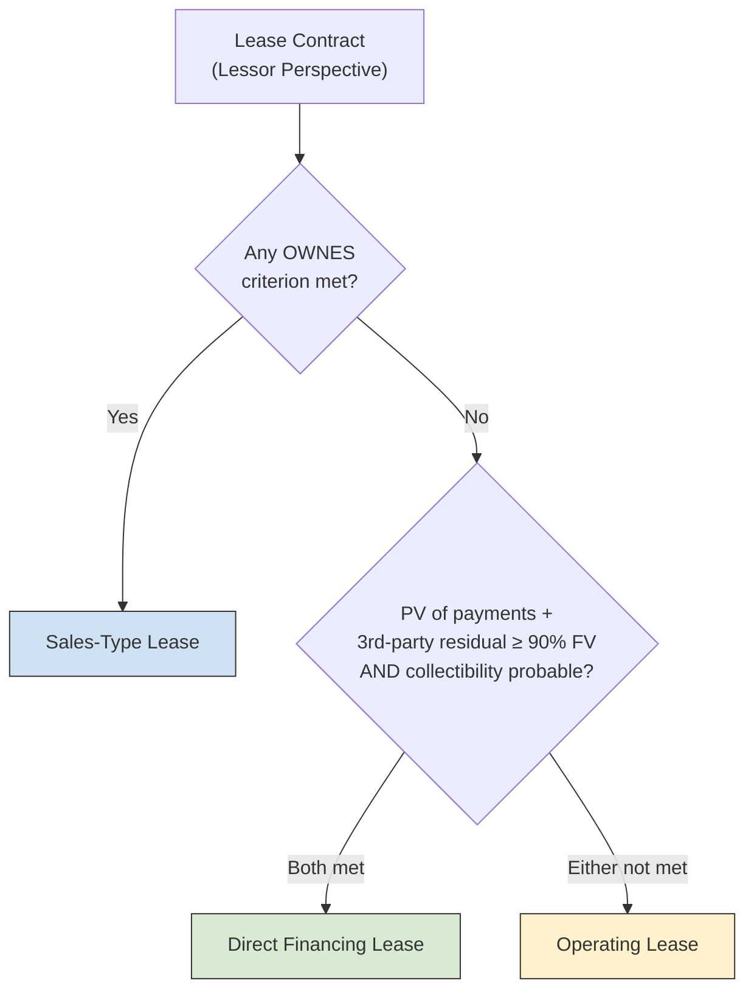
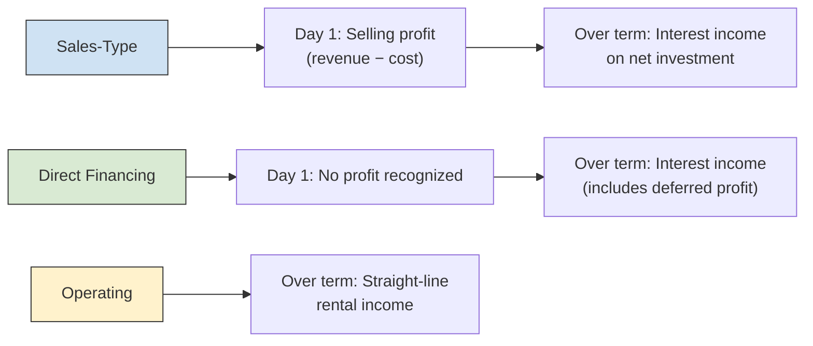
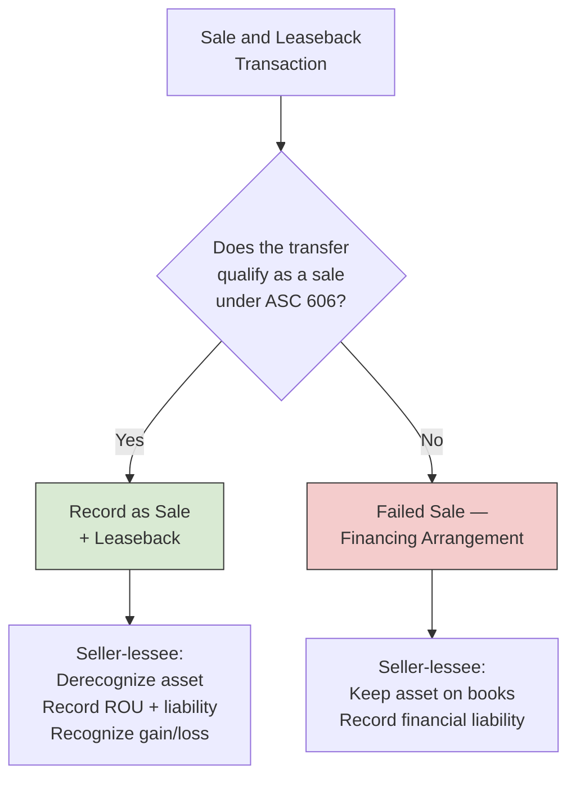

# Leases

The FAR section introduces lessee accounting under ASC 842 — right-of-use assets, lease liabilities, and the distinction between operating and finance leases from the lessee's perspective. The BAR section shifts focus to the **lessor side** of the transaction and to **interpreting complex lease arrangements**. BAR expects you to **classify** leases as sales-type, direct financing, or operating from the lessor's viewpoint, **calculate** the net investment and lease income for each classification, **prepare lessor journal entries**, **account for sale and leaseback transactions** from the seller-lessee's perspective, and **analyze lease agreements** to determine the appropriate accounting treatment.
:::info[Blueprint Coverage]
This topic maps to **Area II, Group I** of the 2026 CPA Exam Blueprints for **Business Analysis and Reporting (BAR)**. The blueprint expects candidates to:

- **Identify** the criteria for classifying a lease arrangement for a lessor.
- **Calculate** the carrying amount of lease-related assets and liabilities and prepare journal entries that a lessor should record.
- **Calculate** the amount of lease income that a lessor should recognize in the income statement.
- **Prepare** journal entries that the seller/lessee should record for a sale and leaseback transaction.
- **Interpret** agreements, contracts, and/or other supporting documentation to determine the appropriate accounting treatment of a leasing arrangement and prepare the journal entries that the lessee should record.
  :::

---

## Lessor Classification Framework

Under ASC 842, a lessor classifies every lease into one of three categories: **sales-type**, **direct financing**, or **operating**. The classification drives how the lessor recognizes income, measures lease-related assets, and presents the underlying asset on its balance sheet.

### Step 1 — Apply the OWNES Criteria

The five criteria are identical to those used for lessee classification. If **any one** is met, the lease is a **sales-type lease** from the lessor's perspective:
| Letter | Criterion | Threshold |
|--------|-----------|-----------|
| **O** | Ownership transfer | Title transfers to lessee by end of lease |
| **W** | Written purchase option | Lessee has option reasonably certain to exercise |
| **N** | Ninety percent | PV of lease payments ≥ 90% of fair value |
| **E** | Economic life | Lease term ≥ 75% of remaining economic life |
| **S** | Specialized asset | No alternative use to lessor at end of lease |

### Step 2 — Direct Financing Test

If **none** of the OWNES criteria are met, apply two additional tests. The lease is a **direct financing lease** if **both** are satisfied:

1. **PV test** — The present value of lease payments **plus** the present value of any residual value guaranteed by a **third party** (not the lessee) ≥ substantially all (90%) of the fair value of the underlying asset.
2. **Collectibility** — It is **probable** that the lessor will collect the lease payments plus any residual value guarantee amount.
   :::warning
   Third-party residual value guarantees (e.g., from an insurance company) are included in the direct financing PV test but are **not** part of the OWNES "N" test. This distinction is a common exam trap — a lease that fails the 90% test under OWNES can still qualify as direct financing when a third-party guarantee is present.
   :::

### Step 3 — Default to Operating

If the lease is **neither** sales-type **nor** direct financing, it is classified as an **operating lease**.



:::tip[Exam Tip]
The **lessee** has two categories (finance and operating). The **lessor** has three. A lease that qualifies as a finance lease for the lessee will be either sales-type or direct financing for the lessor — the OWNES criteria are the same dividing line, but the lessor adds a second classification layer when OWNES is not met.
:::

---

## Sales-Type Lease — Lessor Accounting

A sales-type lease is economically similar to a sale. The lessor **derecognizes** the underlying asset, records a **net investment in the lease**, and recognizes a **selling profit or loss** at commencement if the fair value differs from the carrying amount.

### Initial Measurement

$$
\text{Net Investment in Lease} = \text{Lease Receivable} + \text{Unguaranteed Residual Asset}
$$

Where:

- **Lease receivable** = PV of lease payments and any guaranteed residual value (discounted at the rate implicit in the lease)
- **Unguaranteed residual asset** = PV of the unguaranteed portion of the residual value
  The selling profit or loss at commencement:
  $$
  \text{Selling Profit} = (\text{Lease Receivable} + \text{PV of Guaranteed Residual}) - \text{Carrying Amount of Asset}
  $$
  :::warning
  **Initial direct costs** — If the lessor recognizes a selling profit at commencement, initial direct costs (e.g., commissions) are **expensed immediately**. If there is no selling profit (fair value = carrying amount), initial direct costs are **deferred** and included in the net investment.
  :::

### Example — Bear Co. Sales-Type Lease

Bear Co. manufactures equipment at a cost of **\$72,000** and leases it to Gies Co. on January 1 under the following terms:
| Term | Detail |
|------|--------|
| Fair value of equipment | \$86,590 |
| Cost to manufacture | \$72,000 |
| Lease term | 5 years (= economic life) |
| Annual payment (end of year) | \$20,000 |
| Rate implicit in the lease | 5% |
| Residual value | \$0 |
Because the lease term equals the economic life, the **OWNES "E" criterion** is met → **sales-type lease**.
**Present value of lease payments:**

$$
\text{PV} = \$20{,}000 \times \frac{1 - (1.05)^{-5}}{0.05} = \$20{,}000 \times 4.32948 = \$86{,}590
$$

**Selling profit:**

$$
\text{Selling Profit} = \$86{,}590 - \$72{,}000 = \$14{,}590
$$

**Commencement entry (Bear Co.):**

```journal
Jan 1
Dr. Net Investment in Lease[a] 86,590
    Cr. Equipment[a] 72,000
    Cr. Selling Profit on Lease 14,590
```

### Subsequent Measurement — Interest Income

After commencement, the lessor recognizes **interest income** using the effective interest method:

$$
\text{Interest Income} = \text{Beginning Net Investment} \times \text{Implicit Rate}
$$

**Year 1:**

$$
\text{Interest Income} = \$86{,}590 \times 5\% = \$4{,}330
$$

```journal
Dec 31
Dr. Cash[a] 20,000
    Cr. Interest Income 4,330
    Cr. Net Investment in Lease[a] 15,670
```

### Amortization Schedule

| Year      | Beg. Net Investment | Interest (5%) |       Payment | Reduction | End Net Investment |
| --------- | ------------------: | ------------: | ------------: | --------: | -----------------: |
| 1         |            \$86,590 |       \$4,330 |      \$20,000 |  \$15,670 |           \$70,920 |
| 2         |            \$70,920 |       \$3,546 |      \$20,000 |  \$16,454 |           \$54,466 |
| 3         |            \$54,466 |       \$2,723 |      \$20,000 |  \$17,277 |           \$37,189 |
| 4         |            \$37,189 |       \$1,859 |      \$20,000 |  \$18,141 |           \$19,048 |
| 5         |            \$19,048 |         \$952 |      \$20,000 |  \$19,048 |                \$0 |
| **Total** |                     |  **\$13,410** | **\$100,000** |           |                    |

The total interest income of \$13,410 equals total cash collected (\$100,000) minus the initial net investment (\$86,590).

## Direct Financing Lease — Lessor Accounting

In a direct financing lease, the lessor **derecognizes** the underlying asset and recognizes the **net investment in the lease**, but does **not** recognize any selling profit at commencement. Any difference between the fair value and carrying amount of the asset is deferred and recognized over the lease term as an adjustment to the effective interest rate.
Direct financing leases most commonly arise when:

- The lessor is **not** a manufacturer or dealer (e.g., a leasing company or bank)
- OWNES criteria are not met, but a **third-party residual value guarantee** pushes the present value to ≥ 90% of fair value

### Example — Bear Co. Direct Financing Lease

Bear Co. purchases a delivery truck for **\$50,000** (= fair value) and leases it to MAS Inc. on January 1:
| Term | Detail |
|------|--------|
| Cost and fair value of truck | \$50,000 |
| Economic life | 8 years |
| Lease term | 4 years |
| Annual payment (end of year) | \$10,000 |
| Residual value | \$16,000 (guaranteed by third-party insurer) |
| Rate implicit in the lease | 4% |
**OWNES check:**

- **O** — No ownership transfer ✗
- **W** — No purchase option ✗
- **N** — PV of lease payments = \$10,000 × 3.62990 = \$36,299 → 72.6% of FV < 90% ✗
- **E** — 4 / 8 = 50% < 75% ✗
- **S** — Truck has alternative uses ✗
  **Direct financing test:**
- PV of lease payments: \$36,299
- PV of third-party residual guarantee: \$16,000 × 0.85480 = \$13,677
- Total: \$49,976 → **99.9% of FV ≥ 90%** ✓
- Collectibility is **probable** ✓
- → **Direct financing lease**
  Because carrying amount = fair value, there is no selling profit to defer.
  **Commencement entry (Bear Co.):**

```journal
Jan 1
Dr. Net Investment in Lease[a] 50,000
    Cr. Equipment[a] 50,000
```

### Subsequent Measurement — Interest Income

The lessor applies the effective interest method to the net investment, just as in a sales-type lease:
**Year 1:**

```journal
Dec 31
Dr. Cash[a] 10,000
    Cr. Interest Income 2,000
    Cr. Net Investment in Lease[a] 8,000
```

### Amortization Schedule

| Year      | Beg. Net Investment | Interest (4%) |      Payment | Reduction | End Net Investment |
| --------- | ------------------: | ------------: | -----------: | --------: | -----------------: |
| 1         |            \$50,000 |       \$2,000 |     \$10,000 |   \$8,000 |           \$42,000 |
| 2         |            \$42,000 |       \$1,680 |     \$10,000 |   \$8,320 |           \$33,680 |
| 3         |            \$33,680 |       \$1,347 |     \$10,000 |   \$8,653 |           \$25,027 |
| 4         |            \$25,027 |       \$973\* |     \$10,000 |   \$9,027 |           \$16,000 |
| **Total** |                     |   **\$6,000** | **\$40,000** |           |                    |

\*Year 4 interest adjusted for rounding so the ending balance equals the residual value.
**At lease end — recover the residual asset:**

```journal
Dec 31 (Year 4)
Dr. Equipment[a] 16,000
    Cr. Net Investment in Lease[a] 16,000
```

Total income over the lease = \$6,000 = total cash inflows (\$40,000 payments + \$16,000 residual) minus the initial investment (\$50,000).

## Operating Lease — Lessor Accounting

Under an operating lease, the lessor **continues to recognize** the underlying asset on its balance sheet, **depreciates** it over its useful life, and recognizes **lease income on a straight-line basis** over the lease term.

### Example — MAS Inc. Operating Lease

MAS Inc. owns an office building (cost \$500,000, useful life 25 years, no salvage value) and leases space to Gies Co. on January 1:
| Term | Detail |
|------|--------|
| Cost of building | \$500,000 |
| Useful life | 25 years |
| Lease term | 5 years |
| Annual rent (end of year) | \$45,000 |
| Discount rate | 6% |
**OWNES check:**

- **E** — 5 / 25 = 20% < 75% ✗
- **N** — PV = \$45,000 × 4.21236 = \$189,556 → 37.9% of \$500,000 < 90% ✗
- No other criteria are met
- → **Operating lease**
  **Annual entries (MAS Inc.):**
  Recognize rental income:

```journal
Dec 31
Dr. Cash[a] 45,000
    Cr. Rental Income 45,000
```

Depreciate the building:

```journal
Dec 31
Dr. Depreciation Expense 20,000
    Cr. Accumulated Depreciation[ca] 20,000
```

Annual depreciation = \$500,000 ÷ 25 = \$20,000. The lessor reports net rental margin of \$45,000 − \$20,000 = \$25,000 per year.
:::tip[Exam Tip]
In an operating lease, the lessor's balance sheet still shows the **underlying asset** (net of accumulated depreciation). In a sales-type or direct financing lease, the asset is replaced by a **net investment in the lease** — the underlying asset is derecognized.
:::

---

## Lessor Classification Comparison

| Feature                  | Sales-Type                                  | Direct Financing                                                             | Operating                   |
| ------------------------ | ------------------------------------------- | ---------------------------------------------------------------------------- | --------------------------- |
| **When classified**      | Any OWNES criterion met                     | OWNES not met; PV + 3rd-party guarantee ≥ 90% FV and collectibility probable | Neither of the above        |
| **Underlying asset**     | Derecognized                                | Derecognized                                                                 | Remains on balance sheet    |
| **Net investment**       | Recognized at commencement                  | Recognized at commencement                                                   | Not applicable              |
| **Selling profit**       | Recognized at commencement                  | Deferred (adjusts yield)                                                     | Not applicable              |
| **Income pattern**       | Selling profit upfront + interest over term | Interest income over term (includes deferred profit)                         | Straight-line rental income |
| **Initial direct costs** | Expensed if selling profit exists           | Deferred in net investment                                                   | Deferred over lease term    |

---

## Lease Income Recognition Summary

The pattern of income recognition differs materially across the three classifications:



| Classification       | Day 1 Income                          | Subsequent Income                                                          | Total Income                              |
| -------------------- | ------------------------------------- | -------------------------------------------------------------------------- | ----------------------------------------- |
| **Sales-type**       | Selling profit (FV − carrying amount) | Interest on net investment                                                 | Selling profit + total interest           |
| **Direct financing** | None                                  | Interest on net investment (higher effective rate absorbs deferred profit) | Total interest (includes deferred profit) |
| **Operating**        | None                                  | Straight-line rental income less depreciation                              | Total rent less total depreciation        |

---

## Sale and Leaseback Transactions

A **sale and leaseback** occurs when an entity (the seller-lessee) sells an asset to another party (the buyer-lessor) and simultaneously leases it back. Under ASC 842, the accounting depends on whether the transfer qualifies as a **sale** under ASC 606.

### Does the Transfer Qualify as a Sale?



The transfer **does not** qualify as a sale if the seller-lessee retains control of the asset — for example, through a **repurchase option** that is reasonably certain to be exercised.

### Successful Sale — Seller-Lessee Accounting

When the transfer qualifies as a sale and the transaction is at **fair value**:

1. **Derecognize** the underlying asset
2. **Recognize** the gain or loss on the sale
3. **Record** the leaseback as a normal lessee lease (ROU asset + lease liability)
   $$
   \text{Gain on Sale} = \text{Sale Price (at FV)} - \text{Carrying Amount of Asset}
   $$

### Example — Gies Co. Sale and Leaseback

Gies Co. sells a building to Bear Co. on January 1 and simultaneously leases it back:
| Item | Amount |
|------|--------|
| Carrying amount of building | \$400,000 |
| Sale price (= fair value) | \$600,000 |
| Leaseback term | 10 years |
| Building remaining useful life | 30 years |
| Annual lease payment (end of year) | \$72,000 |
| Gies Co.'s incremental borrowing rate | 6% |
**Step 1 — Confirm the sale qualifies** under ASC 606. Bear Co. obtains title and Gies Co. has no repurchase option → sale is valid.
**Step 2 — Classify the leaseback (lessee perspective):**

- **E** — 10 / 30 = 33% < 75% ✗
- **N** — PV = \$72,000 × 7.36009 = \$529,927 → \$529,927 / \$600,000 = 88.3% < 90% ✗
- No other OWNES criteria met → **Operating lease**
  **Step 3 — Record the sale and leaseback (Gies Co.):**
  $$
  \text{Gain on Sale} = \$600{,}000 - \$400{,}000 = \$200{,}000
  $$
  $$
  \text{Lease Liability} = \$72{,}000 \times \frac{1 - (1.06)^{-10}}{0.06} = \$72{,}000 \times 7.36009 = \$529{,}927
  $$

```journal
Jan 1
Dr. Cash[a] 600,000
    Cr. Building[a] 400,000
    Cr. Gain on Sale of Building 200,000
```

```journal
Jan 1
Dr. Right-of-Use Asset[a] 529,927
    Cr. Lease Liability[l] 529,927
```

**Subsequent annual entry (operating leaseback):**
Straight-line lease expense equals the annual payment for an operating lease:

```journal
Dec 31
Dr. Lease Expense 72,000
    Cr. Cash[a] 72,000
```

### Off-Market Sale and Leaseback

When the sale price or lease payments are **not at fair value**, ASC 842-40 requires adjustments:
| Scenario | Adjustment |
|----------|-----------|
| Sale price **above** fair value | Excess is **not** a gain — record as additional financing (financial liability) |
| Sale price **below** fair value | Deficit is a **prepaid lease** (increases the ROU asset), unless compensated by below-market lease payments |
| Lease payments **above** market | Excess is treated as additional financing from buyer-lessor |
| Lease payments **below** market | Shortfall is treated as prepaid rent from seller-lessee |
:::warning
When the sale price exceeds fair value, the overpayment is **not** part of the gain — it represents additional financing that the buyer-lessor is providing to the seller-lessee. On the exam, always compare the sale price to fair value before calculating the gain.
:::

### Failed Sale — Financing Treatment

If the transfer **does not** qualify as a sale (e.g., the seller-lessee has a repurchase option), neither party records a sale or purchase. The seller-lessee **keeps the asset** on its books and records the proceeds as a **financial liability**:

```journal
Jan 1
Dr. Cash[a] 600,000
    Cr. Financial Liability[l] 600,000
```

Payments under the leaseback are split between interest and principal — they are **not** treated as lease payments. The underlying asset continues to be depreciated by the seller-lessee.

## Interpreting Lease Agreements

The BAR blueprint tests your ability to read a lease agreement and determine the correct accounting treatment. Use this five-step framework:

### Step 1 — Identify the Lease

Confirm the contract conveys the **right to control the use** of an identified asset for a period of time:

- Is there an **identified asset** (explicitly or implicitly specified)?
- Does the customer **direct the use** of the asset and obtain **substantially all economic benefits**?

### Step 2 — Separate Components

Identify **lease components** (right to use an asset) and **non-lease components** (services like maintenance, insurance, or taxes). Allocate consideration based on relative standalone prices — or apply the **practical expedient** to combine all components into a single lease component.

### Step 3 — Determine the Lease Term

$$
\text{Lease Term} = \text{Noncancellable Period} + \text{Renewal Options (reasonably certain)} - \text{Early Termination (reasonably certain to exercise)}
$$

### Step 4 — Identify Lease Payments

Include:

- **Fixed payments** (less any lease incentives received)
- **Variable payments** tied to an index or rate
- **Purchase option** exercise price (if reasonably certain to exercise)
- **Residual value guarantees** (amount the lessee expects to owe)
  Exclude:
- Variable payments based on **usage or performance** (e.g., per-mile charges, percentage of sales) — expensed as incurred

### Step 5 — Classify and Measure

Apply the OWNES criteria to determine finance vs. operating (lessee) or sales-type vs. direct financing vs. operating (lessor). Then measure the lease liability and ROU asset (lessee) or net investment (lessor) using the appropriate discount rate.

### Example — Bear Co. Interprets a Lease Agreement

Bear Co. enters a contract with MAS Inc. to use specialized manufacturing equipment. Key terms extracted from the agreement:
| Contract Term | Detail |
|--------------|--------|
| Equipment description | CNC milling machine, serial #4892 |
| Monthly payment | \$8,000 (equipment) + \$1,200 (maintenance) |
| Initial term | 7 years, noncancellable |
| Renewal option | 3 years at \$9,000/month (Bear Co. is reasonably certain to exercise) |
| Equipment fair value | \$700,000 |
| Equipment economic life | 12 years |
| Ownership at end of lease | Returns to MAS Inc. |
| Purchase option | None |
| Bear Co.'s incremental borrowing rate | 7% |
**Analysis:**
**Step 1:** Identified asset (serial #4892) and Bear Co. directs how the machine is used → **lease exists** ✓
**Step 2:** Lease component = \$8,000/month; non-lease component (maintenance) = \$1,200/month. Bear Co. elects to **separate** the components and uses **\$8,000/month** for the lease measurement.
**Step 3:** Lease term = 7-year initial term + 3-year renewal = **10 years** (renewal is reasonably certain).
**Step 4:** Annual lease payments = \$8,000 × 12 = **\$96,000 per year** for 10 years.
**Step 5 — Classification (lessee perspective):**

- **E** — 10 / 12 = 83.3% **≥ 75%** → met ✓
  Because OWNES "E" is met → **Finance lease**.
  $$
  \text{Lease Liability} = \$96{,}000 \times \frac{1 - (1.07)^{-10}}{0.07} = \$96{,}000 \times 7.02358 = \$674{,}264
  $$

```journal
Jan 1
Dr. Right-of-Use Asset[a] 674,264
    Cr. Lease Liability[l] 674,264
```

**Year 1 entries:**
Interest expense = \$674,264 × 7% = \$47,198

```journal
Dec 31
Dr. Interest Expense 47,198
Dr. Lease Liability[l] 48,802
    Cr. Cash[a] 96,000
```

Amortization of ROU asset (straight-line over the 10-year lease term):

$$
\frac{\$674{,}264}{10} = \$67{,}426
$$

```journal
Dec 31
Dr. Amortization Expense 67,426
    Cr. Right-of-Use Asset[a] 67,426
```

:::tip[Exam Tip]
When interpreting a lease agreement, **read the facts carefully** for renewal and termination options. The phrase "reasonably certain" changes both the lease term and the present value calculation. A lease that appears to be an operating lease over the initial noncancellable term may become a finance lease once reasonably certain renewal periods are included.
:::

---

## Comprehensive Example — Lessor with Multiple Leases

Gies Co. owns three assets and enters into separate lease agreements on January 1. Classify each lease and prepare the commencement journal entries.

### Asset A — Forklift

| Item           | Detail   |
| -------------- | -------- |
| Cost (= FV)    | \$40,000 |
| Economic life  | 6 years  |
| Lease term     | 6 years  |
| Annual payment | \$8,000  |
| Implicit rate  | 5.5%     |

- **OWNES "E"**: 6 / 6 = 100% ≥ 75% → **met**
- Classification: **Sales-type lease**
- No selling profit (cost = FV)
  $$
  \text{PV} = \$8{,}000 \times \frac{1 - (1.055)^{-6}}{0.055} = \$8{,}000 \times 4.99553 = \$39{,}964 \approx \$40{,}000
  $$

```journal
Jan 1
Dr. Net Investment in Lease[a] 40,000
    Cr. Equipment[a] 40,000
```

Year 1 interest income = \$40,000 × 5.5% = \$2,200.

### Asset B — Delivery Van

| Item                           | Detail   |
| ------------------------------ | -------- |
| Cost (= FV)                    | \$60,000 |
| Economic life                  | 10 years |
| Lease term                     | 4 years  |
| Annual payment                 | \$12,000 |
| Third-party residual guarantee | \$18,000 |
| Implicit rate                  | 4%       |

- **OWNES "E"**: 4 / 10 = 40% < 75% ✗
- **OWNES "N"**: PV of payments = \$12,000 × 3.62990 = \$43,559 → 72.6% < 90% ✗
- No other criteria met → OWNES **not met**
  Direct financing test:
- PV of payments + PV of third-party guarantee = \$43,559 + (\$18,000 × 0.85480) = \$43,559 + \$15,386 = \$58,945 → **98.2% ≥ 90%** ✓
- Collectibility probable ✓
- Classification: **Direct financing lease**

```journal
Jan 1
Dr. Net Investment in Lease[a] 60,000
    Cr. Equipment[a] 60,000
```

Year 1 interest income = \$60,000 × 4% = \$2,400.

### Asset C — Office Furniture

| Item           | Detail   |
| -------------- | -------- |
| Cost           | \$30,000 |
| Useful life    | 15 years |
| Lease term     | 3 years  |
| Annual payment | \$4,000  |

- **OWNES "E"**: 3 / 15 = 20% < 75% ✗
- **OWNES "N"**: PV at 5% = \$4,000 × 2.72325 = \$10,893 → 36.3% < 90% ✗
- No other criteria met; no third-party guarantee → direct financing test **not met**
- Classification: **Operating lease**

```journal
Dec 31
Dr. Cash[a] 4,000
    Cr. Rental Income 4,000
Dr. Depreciation Expense 2,000
    Cr. Accumulated Depreciation[ca] 2,000
```

Annual depreciation = \$30,000 ÷ 15 = \$2,000. The underlying asset remains on Gies Co.'s balance sheet.

### Summary of Gies Co. Year 1 Lease Income

| Asset            | Classification   | Day 1 Profit | Year 1 Interest / Rental Income | Year 1 Depreciation |
| ---------------- | ---------------- | -----------: | ------------------------------: | ------------------: |
| A — Forklift     | Sales-type       |          \$0 |                         \$2,200 |                   — |
| B — Delivery van | Direct financing |          \$0 |                         \$2,400 |                   — |
| C — Furniture    | Operating        |            — |                         \$4,000 |           (\$2,000) |
| **Total**        |                  |      **\$0** |                     **\$8,600** |       **(\$2,000)** |

---

## Summary

:::note[Chapter Checklist]

- [ ] Apply the OWNES criteria to classify a lessor's lease as sales-type, direct financing, or operating
- [ ] Recognize selling profit and net investment at commencement for a sales-type lease
- [ ] Defer selling profit for a direct financing lease and recognize it through the effective interest rate
- [ ] Continue recognizing the underlying asset and straight-line rental income for an operating lease
- [ ] Calculate interest income using the effective interest method on the lessor's net investment
- [ ] Determine whether a sale and leaseback qualifies as a sale under ASC 606
- [ ] Record seller-lessee entries for a successful sale and leaseback (gain + ROU asset + lease liability)
- [ ] Adjust for off-market sale and leaseback terms (excess → financing liability; deficit → prepaid rent)
- [ ] Record a failed sale-leaseback as a financing arrangement
- [ ] Interpret lease agreements using the five-step framework: identify → separate → term → payments → classify
      :::
