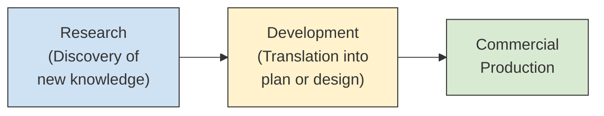
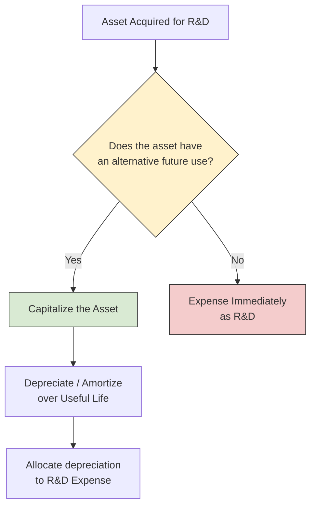

# Research and Development Costs

Companies invest heavily in **research and development (R&D)** to create new products, processes, and technologies. Under U.S. GAAP, the default treatment is straightforward — most R&D costs are **expensed as incurred** (ASC 730). The BAR exam expects you to know **which** costs qualify as R&D, **which** costs are excluded, and **how** to compute the total R&D expense reported on the income statement. Special rules also apply to R&D performed under contract for others and to **in-process R&D** acquired in a business combination.
:::info[Blueprint Coverage]
This topic maps to **Area II, Group E** of the 2026 CPA Exam Blueprints for **Business Analysis and Reporting (BAR)**. The blueprint expects candidates to:

- **Identify** research and development costs and classify the costs as an expense in the financial statements.
- **Calculate** the research and development costs to be reported as an expense in the financial statements.
  :::

---

## ASC 730 at a Glance

ASC 730, _Research and Development_, establishes the core principle: **all R&D costs shall be charged to expense when incurred** unless another GAAP standard provides specific capitalization guidance (e.g., ASC 985-20 for software to be sold or ASC 350-40 for internal-use software).
| Principle | Rule |
|-----------|------|
| **General rule** | Expense R&D costs as incurred |
| **Balance sheet impact** | No R&D asset except for (1) tangible assets with alternative future use, (2) acquired in-process R&D, and (3) capitalized software costs under separate standards |
| **Income statement** | Total R&D expense must be disclosed either on the face of the income statement or in the notes |
| **Scope exclusions** | Extractive industries (e.g., oil & gas exploration), software development (covered by ASC 985-20 and ASC 350-40) |

---

## Research vs. Development — Definitions

Understanding the distinction between research and development is important for exam questions, even though both categories receive the same accounting treatment (expense as incurred).
| Phase | Definition (ASC 730-10-20) |
|-------|---------------------------|
| **Research** | Planned search or critical investigation aimed at the **discovery of new knowledge** with the hope that such knowledge will be useful in developing a new product, service, process, or technique — or in bringing about a significant improvement to an existing one |
| **Development** | Translation of research findings or other knowledge into a **plan or design** for a new product or process, or for a significant improvement to an existing product or process, whether intended for sale or use |



:::tip[Exam Tip]
The exam rarely tests whether a cost is "research" versus "development." What matters is whether the cost falls **within or outside** the scope of ASC 730. Both research and development costs are **expensed** — the distinction is definitional, not accounting.
:::

---

## Costs That ARE R&D

ASC 730-10-25 identifies the following categories of costs that must be included in R&D expense:

### 1. Materials, Equipment, and Facilities

| Situation                                                                   | Treatment                                                                                    |
| --------------------------------------------------------------------------- | -------------------------------------------------------------------------------------------- |
| Materials and supplies consumed in R&D                                      | **Expense** as incurred                                                                      |
| Equipment or facilities acquired for R&D **with no alternative future use** | **Expense** as incurred (the full cost)                                                      |
| Equipment or facilities acquired for R&D **with alternative future use**    | **Capitalize** and depreciate over useful life; depreciation allocated to R&D is R&D expense |

:::warning
Equipment purchased **solely** for a single R&D project with **no alternative future use** must be expensed immediately — even if the equipment has a multi-year physical life. This is a heavily tested point.
:::

### 2. Personnel

- Salaries, wages, and benefits of personnel engaged in R&D activities.
- Includes time spent on design, testing, and experimentation.

### 3. Contracted Services

- Costs of services performed by **others** (third-party contractors, universities, research institutes) on behalf of the reporting entity for its own R&D.
- Expensed as incurred by the entity that contracts the work.

### 4. Indirect Costs

- A reasonable allocation of indirect costs (overhead) that are **clearly related** to R&D activities.
- **General and administrative costs** that are not clearly related to R&D are excluded.

### 5. Intangibles Purchased from Others

- Cost of intangibles (e.g., patents, licenses) purchased from others for use in R&D activities.
- If the intangible has **no alternative future use**, expense immediately.
- If it has an **alternative future use**, capitalize and amortize.

### Summary of the "Alternative Future Use" Rule



:::tip[Exam Tip]
The **alternative future use** test is the single most-tested concept in ASC 730. If the asset can be used in other R&D projects **or** in non-R&D operations, it has alternative future use and should be capitalized.
:::

---

## Costs That Are NOT R&D

Not every cost associated with a new or improved product qualifies as R&D. ASC 730 specifically **excludes** the following:
| Activity | Why It Is NOT R&D |
|----------|-------------------|
| **Routine or periodic quality control testing** during commercial production | Quality control serves ongoing operations, not discovery of new knowledge |
| **Engineering follow-through** in an early phase of commercial production | Represents production start-up, not experimentation |
| **Troubleshooting** during commercial production breakdowns | Maintenance/operations activity |
| **Routine design of tools, jigs, molds, and dies** | Part of the manufacturing process |
| **Adaptation of an existing capability** to a particular customer's requirements as part of a continuing commercial activity | Customization, not new product development |
| **Legal work** on patent applications and litigation | Legal expense, not R&D |
| **Seasonal or other periodic design changes** to existing products | Routine product updates |
| **Routine ongoing efforts** to refine, enrich, or improve the qualities of an existing product | Sustaining engineering, not R&D |
| **Market research and testing** | Selling/marketing activity |
:::warning
**Engineering follow-through** and **adaptation of existing products** are frequent exam distractors. Read the facts carefully — if the work involves a known process being applied to production or a specific customer request, it is **not** R&D.
:::

---

## R&D Performed for Others (Contract R&D)

When an entity performs R&D **under contract for another party**, the accounting depends on the nature of the arrangement:
| Scenario | Accounting by the Performing Entity |
|----------|-------------------------------------|
| **R&D under contract for others** (entity has no rights to the results) | Costs are accounted for as a **contract to perform services** — recognized as an expense matched with contract revenue; **not** reported as R&D expense |
| **Entity-funded R&D** (entity retains all rights) | Expense as R&D under ASC 730 in the normal manner |
| **R&D arrangement with funding parties** (ASC 730-20) | If the entity is **obligated to repay** the funds regardless of R&D outcome, the arrangement is essentially a **borrowing** — record a liability, not R&D expense. If the entity has **no obligation to repay**, expense costs as R&D |
:::tip[Exam Tip]
The key question for contract R&D: **Who bears the risk?** If the entity performing the R&D is obligated to repay the funds regardless of the project's outcome, the arrangement is a liability (financing), not an expense. If the funding party bears the risk of failure, the performing entity records R&D expense.
:::

---

## Acquired In-Process R&D (IPR&D)

When R&D activities are acquired as part of a **business combination** (ASC 805) or as an **individual asset acquisition**, special rules apply:

### Business Combination (ASC 805)

- In-process R&D acquired in a business combination is recognized as a **separate intangible asset** at **fair value** on the acquisition date — even if the project has no alternative future use.
- The asset is classified as an **indefinite-lived intangible** and is **not amortized** until the project is completed or abandoned.
- Upon **completion**, the asset is reclassified as a finite-lived intangible and amortized over its useful life.
- Upon **abandonment**, the remaining carrying amount is written off as an expense.
- While classified as indefinite-lived, the asset is tested for impairment **at least annually** under ASC 350.

### Asset Acquisition (Not a Business Combination)

- R&D assets acquired outside of a business combination that have **no alternative future use** are expensed immediately.
- If they have an alternative future use, they are capitalized and depreciated/amortized.
  | Acquisition Type | Treatment of IPR&D |
  |-----------------|-------------------|
  | **Business combination** | Capitalize at fair value → indefinite-lived intangible → amortize upon completion or write off upon abandonment |
  | **Asset acquisition — no alternative future use** | Expense immediately |
  | **Asset acquisition — alternative future use exists** | Capitalize and amortize |
  :::warning
  Acquired IPR&D in a business combination is **always capitalized** at fair value regardless of whether it has alternative future use. This is a departure from the general ASC 730 rule and a common exam trap.
  :::

---

## Comprehensive Example 1 — Bear Co. R&D Expense Calculation

Bear Co. incurs the following costs during Year 1 related to the development of a new product:
| Cost Item | Amount | R&D? |
|-----------|--------|------|
| Salaries of R&D lab personnel | \$400,000 | Yes |
| Materials consumed in R&D experiments | \$120,000 | Yes |
| Equipment purchased solely for the project (no alternative future use) | \$250,000 | Yes |
| Equipment purchased for R&D that has alternative future use (5-year life, no residual value; used for R&D the full year) | \$300,000 | Depreciation only |
| Fees paid to an outside testing laboratory | \$85,000 | Yes |
| Overhead reasonably allocable to R&D | \$60,000 | Yes |
| Quality control testing during regular production | \$45,000 | No |
| Legal fees for patent application | \$30,000 | No |
**Step 1 — Calculate depreciation on the equipment with alternative future use:**

$$
\text{Annual Depreciation} = \frac{\$300{,}000}{5} = \$60{,}000
$$

**Step 2 — Compute total R&D expense:**
| Component | Amount |
|-----------|--------|
| R&D personnel salaries | \$400,000 |
| Materials consumed | \$120,000 |
| Equipment with no alternative future use | \$250,000 |
| Depreciation on equipment with alternative future use | \$60,000 |
| Outside testing laboratory | \$85,000 |
| Allocable overhead | \$60,000 |
| **Total R&D Expense** | **\$975,000** |
**Step 3 — Record the journal entries:**

```journal
Dr. Research and Development Expense 975,000
    Cr. Cash[a] 915,000
    Cr. Accumulated Depreciation — Equipment[ca] 60,000
```

:::tip[Exam Tip]
Equipment with **no alternative future use** is expensed at its **full cost** in the period acquired. Equipment **with** alternative future use is capitalized and only the **depreciation** portion is included in R&D expense. This single distinction can swing your answer by hundreds of thousands of dollars.
:::

---

## Comprehensive Example 2 — Gies Co. Multiple R&D Projects

Gies Co. has two active R&D projects during Year 2. It also performs contract R&D for a client.
| Cost Item | Project Alpha | Project Beta | Contract R&D |
|-----------|--------------|-------------|--------------|
| Personnel costs | \$200,000 | \$150,000 | \$100,000 |
| Materials consumed | \$50,000 | \$70,000 | \$40,000 |
| Depreciation on shared R&D equipment (allocated) | \$30,000 | \$20,000 | \$10,000 |
| Equipment purchased with no alternative future use | \$80,000 | \$0 | \$0 |
| Allocated overhead | \$15,000 | \$10,000 | \$5,000 |
Contract R&D terms: Gies Co. performs the work for a client who owns the results. Gies Co. has no obligation to repay if the project fails. The contract price is \$200,000.
**Gies Co.'s R&D expense (own projects only):**
| Component | Project Alpha | Project Beta | Total |
|-----------|--------------|-------------|-------|
| Personnel | \$200,000 | \$150,000 | \$350,000 |
| Materials | \$50,000 | \$70,000 | \$120,000 |
| Depreciation (shared equipment) | \$30,000 | \$20,000 | \$50,000 |
| Equipment — no alternative future use | \$80,000 | \$0 | \$80,000 |
| Overhead | \$15,000 | \$10,000 | \$25,000 |
| **Total** | **\$375,000** | **\$250,000** | **\$625,000** |
The contract R&D costs (\$155,000) are **not** reported as R&D expense — they are reported as **cost of contract services** matched against the \$200,000 of revenue.

```journal
Dr. Research and Development Expense 625,000
    Cr. Cash[a] 575,000
    Cr. Accumulated Depreciation — Equipment[ca] 50,000
```

```journal
Dr. Cost of Contract Services 155,000
    Cr. Cash[a] 145,000
    Cr. Accumulated Depreciation — Equipment[ca] 10,000
```

---

## Comprehensive Example 3 — MAS Inc. Acquires In-Process R&D

MAS Inc. acquires 100% of a biotech company in a business combination for \$8,000,000. The fair values of the identifiable net assets at the acquisition date are:
| Item | Fair Value |
|------|-----------|
| Tangible net assets | \$4,500,000 |
| Customer relationships (finite-lived intangible) | \$800,000 |
| In-process R&D (drug in Phase II clinical trials) | \$1,200,000 |
| **Total identifiable net assets** | **\$6,500,000** |
**Step 1 — Calculate goodwill:**

$$
\text{Goodwill} = \$8{,}000{,}000 - \$6{,}500{,}000 = \$1{,}500{,}000
$$

**Step 2 — Record the acquisition:**

```journal
Dr. Tangible Net Assets[a] 4,500,000
Dr. Customer Relationships[a] 800,000
Dr. In-Process R&D[a] 1,200,000
Dr. Goodwill[a] 1,500,000
    Cr. Cash[a] 8,000,000
```

The IPR&D of \$1,200,000 is carried as an **indefinite-lived intangible asset**. It is **not amortized** and is tested for impairment annually until the project is completed or abandoned.
**If the project is completed** and the drug receives regulatory approval, MAS Inc. reclassifies the asset and begins amortization over its estimated useful life (assume 10 years):

$$
\text{Annual Amortization} = \frac{\$1{,}200{,}000}{10} = \$120{,}000
$$

```journal
Dr. Amortization Expense 120,000
    Cr. Accumulated Amortization — IPR&D[ca] 120,000
```

**If the project is abandoned**, the entire carrying amount is written off:

```journal
Dr. Research and Development Expense 1,200,000
    Cr. In-Process R&D[a] 1,200,000
```

---

## Financial Statement Presentation and Disclosure

| Item                                      | Presentation                                                                                                                          |
| ----------------------------------------- | ------------------------------------------------------------------------------------------------------------------------------------- |
| **R&D expense**                           | Disclosed on the face of the income statement or in the notes; must show total R&D costs charged to expense for each period presented |
| **Equipment with alternative future use** | Reported as a tangible asset on the balance sheet; depreciation allocated to R&D included in R&D expense                              |
| **Acquired IPR&D**                        | Reported as a separate intangible asset on the balance sheet until completed or abandoned                                             |
| **Contract R&D costs**                    | Reported as cost of services, **not** as R&D expense                                                                                  |

---

## Quick-Reference Summary

| Question                                                 | Answer                                                  |
| -------------------------------------------------------- | ------------------------------------------------------- |
| **General rule for R&D costs?**                          | Expense as incurred                                     |
| **Equipment with no alternative future use?**            | Expense the full cost immediately                       |
| **Equipment with alternative future use?**               | Capitalize; include depreciation in R&D expense         |
| **Contracted R&D for others (no repayment obligation)?** | Cost of contract services, not R&D expense              |
| **R&D funding arrangement — obligated to repay?**        | Record a liability (financing)                          |
| **IPR&D in a business combination?**                     | Capitalize at fair value as indefinite-lived intangible |
| **IPR&D in an asset acquisition — no alternative use?**  | Expense immediately                                     |
| **Quality control testing during production?**           | Not R&D                                                 |
| **Engineering follow-through?**                          | Not R&D                                                 |
| **Legal fees for patents?**                              | Not R&D                                                 |

:::info
**Key takeaway:** Under ASC 730, virtually all R&D costs are **expensed as incurred**. The main exceptions are (1) tangible assets with **alternative future use** (capitalize and depreciate) and (2) **in-process R&D acquired in a business combination** (capitalize at fair value as an indefinite-lived intangible). On the exam, always apply the alternative-future-use test to each cost item and remember that contract R&D performed for others is reported as cost of services — not R&D expense.
:::
