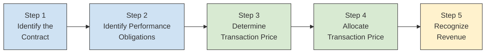
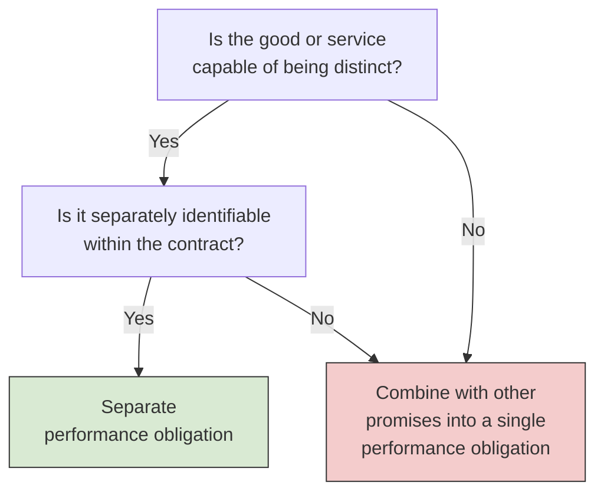
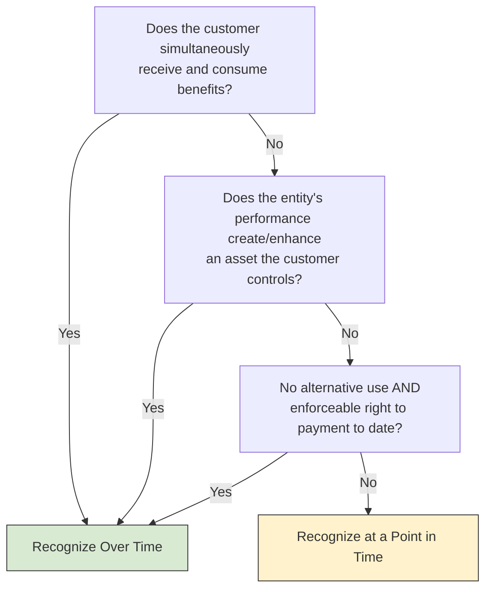
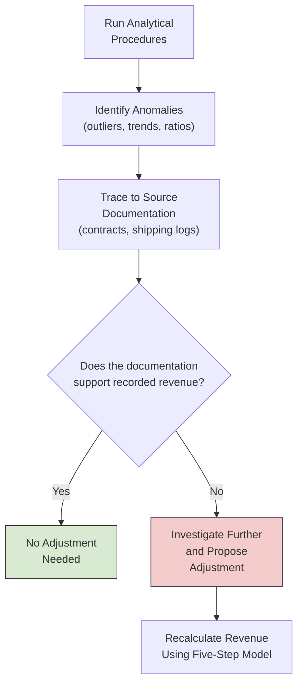

# Revenue Recognition

The FAR section of the CPA exam tests your ability to **apply** the five-step revenue recognition model under ASC 606. The BAR section goes a step further — it asks you to **interpret** contracts, **analyze** supporting documentation, and **use data analytics** to detect discrepancies in how revenue is recognized. Think of BAR as the analytical lens: given a set of facts, can you determine the correct amount and timing of revenue, and can you spot when something looks wrong?
:::info[Blueprint Coverage]
This topic maps to **Area II, Group C** of the 2026 CPA Exam Blueprints for **Business Analysis and Reporting (BAR)**. The blueprint expects candidates to:

- **Interpret** agreements, contracts, and/or other supporting documentation to determine the amount and timing of revenue to be recognized in the financial statements using the five-step model.
- **Interpret** source data and outputs from data analytic techniques (e.g., reports, visualizations) to detect, investigate, and resolve potential discrepancies (e.g., errors, outliers, unexpected contract elements) in the recognition of revenue in the financial statements using the five-step model.
  :::

---

## Five-Step Model Recap

ASC 606 provides a single framework for recognizing revenue from contracts with customers. The BAR exam assumes you already know the five steps — the focus shifts to interpreting real-world contracts through this lens.



| Step                                     | Core Question                              | BAR Analytical Focus                                                        |
| ---------------------------------------- | ------------------------------------------ | --------------------------------------------------------------------------- |
| **1 — Identify the Contract**            | Do all five contract criteria exist?       | Reviewing agreements for missing terms, side letters, or oral modifications |
| **2 — Identify Performance Obligations** | What distinct promises exist?              | Determining whether bundled deliverables are truly distinct                 |
| **3 — Determine Transaction Price**      | How much consideration is expected?        | Estimating variable consideration and applying the constraint               |
| **4 — Allocate Transaction Price**       | How is the price split across obligations? | Selecting the right standalone selling price method                         |
| **5 — Recognize Revenue**                | When does control transfer?                | Interpreting whether recognition is over time or at a point in time         |

:::tip[Exam Tip]
BAR questions rarely ask you to define the five steps. Instead, they present a contract scenario and ask you to **identify the correct revenue amount**, **determine the recognition pattern**, or **explain why a particular treatment is wrong**.
:::

---

## Analyzing Contracts for Performance Obligations

The most heavily tested BAR skill is reading a contract and identifying **how many performance obligations** it contains. The key test is whether a promised good or service is **distinct** — meaning the customer can benefit from it on its own (or with readily available resources) **and** it is separately identifiable within the contract.

### Decision Framework



### Indicators of Separate Identifiability

A promised good or service is **not** separately identifiable (and must be combined) when:

- The entity provides a **significant integration service** using the good or service as an input
- The good or service **significantly modifies or customizes** another promised item
- The goods or services are **highly interdependent or interrelated**

### Example — Bear Co. Software Bundle

Bear Co. sells a software license, implementation services, and two years of post-contract support (PCS) for a total of \$500,000.
| Deliverable | Capable of Being Distinct? | Separately Identifiable? | Conclusion |
|-------------|--------------------------|------------------------|------------|
| Software license | Yes — functions on its own | Yes — no significant customization needed | **Separate obligation** |
| Implementation | Yes — third parties offer similar services | No — significantly customizes the software for Bear Co.'s industry | **Combined with license** |
| PCS (2 years) | Yes — could be purchased separately | Yes — standard support, not interrelated with setup | **Separate obligation** |
**Result:** Two performance obligations — (1) the customized software solution (license + implementation) and (2) PCS.
:::warning
Watch for contracts where implementation services involve **significant customization**. Even though implementation could be purchased from a third party (capable of being distinct), the fact that it substantially modifies the software means it is **not separately identifiable** — and must be combined with the license into a single obligation.
:::

---

## Identifying and Estimating Variable Consideration

Many contracts include consideration that varies based on future events — discounts, rebates, performance bonuses, penalties, or rights of return. The BAR exam tests your ability to **select the right estimation method** and **apply the constraint**.

### Two Estimation Methods

| Method                 | Formula                                       | Best Used When                                         |
| ---------------------- | --------------------------------------------- | ------------------------------------------------------ |
| **Expected value**     | Probability-weighted sum of possible outcomes | Large number of similar contracts (portfolio approach) |
| **Most likely amount** | Single most probable outcome                  | Binary or limited outcomes (e.g., hit-or-miss bonus)   |

### The Constraint on Variable Consideration

Variable consideration is included in the transaction price only to the extent that it is **probable** a **significant reversal** of cumulative revenue will **not** occur when the uncertainty is resolved.
Factors that increase the risk of a significant reversal:

- The amount is highly susceptible to factors **outside the entity's influence**
- The uncertainty is not expected to be resolved for a **long period**
- The entity has **limited experience** with similar contracts
- The contract has a **broad range** of possible outcomes

### Example — Gies Co. Performance Bonus

Gies Co. enters a consulting engagement with MAS Inc. for a base fee of \$200,000. The contract includes a \$50,000 bonus if the project is completed by March 31.
Gies Co. assesses the following:
| Outcome | Probability |
|---------|------------|
| Complete by March 31 (earn \$50,000 bonus) | 75% |
| Complete after March 31 (no bonus) | 25% |
**Expected value method:**

$$
\text{Expected variable consideration} = (\$50{,}000 \times 0.75) + (\$0 \times 0.25) = \$37{,}500
$$

**Most likely amount method:**

$$
\text{Most likely amount} = \$50{,}000 \quad \text{(the outcome with the highest individual probability)}
$$

Because this is a binary outcome (the bonus is either earned or not), the **most likely amount** of \$50,000 is the better estimate. Gies Co. then applies the constraint: given a 75% completion probability and a strong historical track record, it is probable that a significant reversal will not occur. The transaction price is:

$$
\$200{,}000 + \$50{,}000 = \$250{,}000
$$

:::tip[Exam Tip]
When a question involves a **binary outcome** (earn a bonus or don't, pay a penalty or don't), the **most likely amount** is almost always the appropriate method. Use the **expected value** when there is a range of possible amounts across many similar contracts.
:::

---

## Interpreting Timing: Over Time vs. Point in Time

Determining **when** to recognize revenue requires interpreting whether a performance obligation is satisfied **over time** or at a **point in time**. This distinction directly affects the amount reported in each period.

### Over-Time Recognition Criteria

A performance obligation is satisfied over time if **any one** of the following criteria is met:
| Criterion | Interpretation | Typical Example |
|-----------|---------------|-----------------|
| Customer simultaneously **receives and consumes** benefits | Would another entity need to substantially re-perform the work? If no → over time | Cleaning services, monthly IT support |
| Entity's performance creates or enhances an **asset the customer controls** | Does the customer control the work in progress? | Construction on customer-owned land |
| Asset has **no alternative use** to the entity + entity has an **enforceable right to payment** for performance to date | Could the entity redirect the partially completed asset to another customer? | Custom-manufactured equipment built to spec |



### Measuring Progress for Over-Time Obligations

| Method               | Type   | Measure                                | When to Use                                 |
| -------------------- | ------ | -------------------------------------- | ------------------------------------------- |
| Cost-to-cost         | Input  | Costs incurred ÷ Total estimated costs | Costs incurred are proportional to progress |
| Units delivered      | Output | Units delivered ÷ Total units promised | Each unit has roughly equal value           |
| Milestones / surveys | Output | Appraised value of work performed      | Independent measure of value transferred    |

$$
\text{Percentage Complete (Cost-to-Cost)} = \frac{\text{Costs Incurred to Date}}{\text{Total Estimated Costs}}
$$

$$
\text{Revenue to Date} = \text{Transaction Price} \times \text{Percentage Complete}
$$

### Example — MAS Inc. Construction Contract

MAS Inc. enters a fixed-price construction contract with Bear Co. to build a warehouse on Bear Co.'s land for \$3,000,000. Total estimated costs are \$2,400,000. Because the asset is being built on the customer's land (criterion 2), revenue is recognized **over time** using the cost-to-cost method.
| | Year 1 | Year 2 | Year 3 |
|---|---|---|---|
| Cumulative costs incurred | \$720,000 | \$1,800,000 | \$2,400,000 |
| Total estimated costs | \$2,400,000 | \$2,400,000 | \$2,400,000 |
| % Complete | 30% | 75% | 100% |
| Cumulative revenue | \$900,000 | \$2,250,000 | \$3,000,000 |
| Revenue recognized in period | \$900,000 | \$1,350,000 | \$750,000 |
**Year 1 calculations:**

$$
\text{% Complete} = \frac{\$720{,}000}{\$2{,}400{,}000} = 30\%
$$

$$
\text{Revenue (Year 1)} = \$3{,}000{,}000 \times 30\% = \$900{,}000
$$

```journal
Dr. Accounts Receivable[a] 900,000
    Cr. Revenue 900,000
```

```journal
Dr. Construction Expense 720,000
    Cr. Materials, Cash, etc.[a] 720,000
```

**Year 2 calculations:**

$$
\% \text{ Complete} = \frac{\$1{,}800{,}000}{\$2{,}400{,}000} = 75\%
$$

$$
\text{Cumulative Revenue} = \$3{,}000{,}000 \times 75\% = \$2{,}250{,}000
$$

$$
\text{Revenue (Year 2)} = \$2{,}250{,}000 - \$900{,}000 = \$1{,}350{,}000
$$

:::warning
If total estimated costs are revised upward and the contract becomes **unprofitable**, the **entire expected loss** must be recognized immediately — regardless of the percentage complete. This applies to both over-time and point-in-time contracts.
:::

---

## Common Contract Interpretation Scenarios

The BAR exam frequently presents contract excerpts and asks you to determine the correct accounting treatment. Below are scenarios that require careful interpretation.

### Scenario 1 — Multiple-Element Arrangements with Discounts

Bear Co. sells three products in a single contract for a bundled price of \$180,000. Each product can be purchased separately.
| Product | Standalone Selling Price (SSP) |
|---------|-------------------------------|
| Product A | \$80,000 |
| Product B | \$60,000 |
| Product C | \$60,000 |
| **Total SSP** | **\$200,000** |
The \$20,000 discount is allocated proportionally using relative SSP:
| Product | SSP | Ratio | Allocated Price |
|---------|-----|-------|-----------------|
| A | \$80,000 | 40% | \$72,000 |
| B | \$60,000 | 30% | \$54,000 |
| C | \$60,000 | 30% | \$54,000 |
| **Total** | **\$200,000** | **100%** | **\$180,000** |

$$
\text{Allocated Price}_A = \$180{,}000 \times \frac{\$80{,}000}{\$200{,}000} = \$72{,}000
$$

:::tip[Exam Tip]
A discount may be allocated to **fewer than all** performance obligations only if the entity has **observable evidence** that the discount relates entirely to one or more (but not all) of the obligations. Without such evidence, spread the discount proportionally.
:::

---

### Scenario 2 — Contract Modifications

Gies Co. has an existing contract to deliver 100 units of a product to MAS Inc. at \$50 per unit (\$5,000 total). After 60 units have been delivered, the contract is modified to add 40 more units at \$42 per unit.
**Key question:** Is the modification a **separate contract** or an adjustment to the existing one?
A modification is a **separate contract** when **both** conditions are met:

1. The additional goods or services are **distinct**
2. The price reflects the **standalone selling price** of the additional goods
   If the standalone selling price per unit is \$42, the modification is a **separate contract** — the 40 new units are accounted for independently.
   If the standalone selling price is \$50 (meaning \$42 is a discount influenced by the existing arrangement), the modification is **not** a separate contract. The entity must determine the appropriate treatment:
   | Situation | Treatment |
   |-----------|-----------|
   | Remaining goods are distinct from those already transferred | Terminate old contract; create new contract at combined remaining value |
   | Remaining goods are **not** distinct (part of a single obligation) | Cumulative catch-up adjustment in the period of modification |

---

### Scenario 3 — Licenses of Intellectual Property

Bear Co. licenses its proprietary analytics software to Gies Co. The contract includes:

- A three-year software license for \$300,000
- Ongoing updates that significantly change the software's functionality
  **Key question:** Is the license a **right to access** (recognized over time) or a **right to use** (recognized at a point in time)?
  | License Type | Revenue Pattern | When It Applies |
  |-------------|----------------|-----------------|
  | **Right to access** | Over time (ratably) | Entity's ongoing activities **significantly affect** the IP the customer is using |
  | **Right to use** | Point in time (upon transfer) | Customer can use the IP as it exists at the point of transfer; entity's activities do not change it |
  Because Bear Co.'s ongoing updates **significantly change** the software's functionality, this is a **right to access** license. Revenue is recognized ratably over the three-year term:
  $$
  \text{Annual Revenue} = \frac{\$300{,}000}{3} = \$100{,}000
  $$

```journal
Dr. Accounts Receivable[a] 100,000
    Cr. License Revenue 100,000
```

---

### Scenario 4 — Principal vs. Agent Determination

MAS Inc. operates an online marketplace connecting sellers with buyers. For each transaction, MAS Inc. sets the price, holds inventory briefly in its warehouse, and bears the risk of returned goods.
| Indicator | Observation | Points Toward |
|-----------|------------|---------------|
| Controls good before transfer? | Yes — holds inventory | **Principal** |
| Bears inventory risk? | Yes — risk of returns | **Principal** |
| Has pricing discretion? | Yes — sets prices | **Principal** |
MAS Inc. is the **principal** and reports **gross revenue**. If MAS Inc. never took possession and simply facilitated the transaction, it would be an **agent** reporting only its commission as **net revenue**.

$$
\text{Gross Revenue (Principal)} = \text{Full selling price to customer}
$$

$$
\text{Net Revenue (Agent)} = \text{Commission or fee earned}
$$

:::warning
A common exam trap is a company that **briefly holds** goods in transit. Merely touching inventory is not enough to establish control — look for **pricing discretion**, **inventory risk**, and **primary responsibility** for fulfilling the promise to the customer.
:::

---

## Using Data Analytics to Detect Revenue Anomalies

The BAR blueprint specifically tests your ability to **interpret outputs from data analytic techniques** — reports, visualizations, and trend analyses — to find errors or unusual patterns in revenue recognition.

### Common Analytical Techniques

| Technique                              | What It Reveals                                         | Example Application                                                                 |
| -------------------------------------- | ------------------------------------------------------- | ----------------------------------------------------------------------------------- |
| **Trend analysis**                     | Unusual period-over-period changes in revenue           | Revenue spiked 40% in Q4 with no corresponding increase in contracts signed         |
| **Ratio analysis**                     | Disproportionate relationships between accounts         | Days sales outstanding (DSO) jumped while revenue grew, suggesting channel stuffing |
| **Cutoff testing**                     | Revenue recorded in the wrong period                    | Shipments logged on December 31 but not shipped until January 3                     |
| **Contract-to-revenue reconciliation** | Gaps between contract terms and recorded revenue        | Contract specifies milestone billing, but revenue was recognized ratably            |
| **Outlier detection**                  | Individual transactions that fall outside normal ranges | A single invoice accounts for 60% of quarterly revenue                              |

### Key Metrics for Revenue Analysis

$$
\text{Days Sales Outstanding (DSO)} = \frac{\text{Accounts Receivable}}{\text{Revenue}} \times 365
$$

$$
\text{Revenue per Contract} = \frac{\text{Total Revenue}}{\text{Number of Active Contracts}}
$$

$$
\text{Deferred Revenue Ratio} = \frac{\text{Contract Liabilities}}{\text{Total Revenue}}
$$

### Example — Detecting Revenue Anomalies at Gies Co.

A quarterly analytics dashboard for Gies Co. reveals the following:
| Metric | Q1 | Q2 | Q3 | Q4 |
|--------|-----|-----|-----|-----|
| Revenue (\$ thousands) | \$1,200 | \$1,250 | \$1,180 | \$1,890 |
| New contracts signed | 45 | 48 | 42 | 47 |
| DSO (days) | 38 | 40 | 39 | 62 |
| Contract liability balance (\$ thousands) | \$320 | \$310 | \$330 | \$180 |
**Red flags identified:**

1. **Q4 revenue spike** — Revenue increased 60% over Q3, yet new contracts signed remained flat. This could indicate:
   - Premature recognition of revenue from contracts not yet fulfilled
   - Channel stuffing (shipping product to distributors before genuine demand)
   - Improper release of deferred revenue (contract liabilities dropped sharply)
2. **DSO surge** — DSO jumped from ~39 days to 62 days in Q4. Rising receivables relative to revenue suggests customers have not paid, possibly because they have not accepted the goods or services. This may indicate **bill-and-hold** arrangements or **side agreements** granting extended payment terms.
3. **Contract liability decline** — A \$150,000 drop in contract liabilities without a proportional increase in fulfilled obligations suggests revenue may have been recognized **before performance obligations were satisfied**.
   :::tip[Exam Tip]
   When the BAR exam presents a data visualization or report, follow a three-step approach: **(1) Identify the anomaly** — what number or trend stands out? **(2) Hypothesize the cause** — what revenue recognition error could explain it? **(3) Determine the resolution** — what adjustment or investigation is needed?
   :::

### Data-Driven Investigation Workflow



---

## Practical Contract Analysis: Putting It All Together

### Comprehensive Example — Bear Co. Multi-Element Contract

Bear Co. enters a contract with Gies Co. containing the following elements:

- **Custom equipment** built to Gies Co.'s specifications — delivery in 6 months
- **Installation services** — completed over 2 weeks after delivery
- **2-year maintenance agreement** — quarterly on-site inspections
- **Performance bonus** — Bear Co. earns \$40,000 if the equipment achieves a specified output threshold within 90 days of installation
  **Total fixed contract price:** \$620,000

#### Step 1 — Identify the Contract

The agreement is signed by both parties, rights and payment terms are specified, the arrangement has commercial substance, and collection is probable. ✓ Valid contract.

#### Step 2 — Identify Performance Obligations

| Deliverable           | Distinct?                                                                       | Reasoning                                                 | Conclusion              |
| --------------------- | ------------------------------------------------------------------------------- | --------------------------------------------------------- | ----------------------- |
| Custom equipment      | Capable — yes; Separately identifiable — yes (installation is routine)          | Equipment functions without installation services         | **Separate obligation** |
| Installation          | Capable — yes; Separately identifiable — yes (routine, not highly interrelated) | Other vendors could install; no significant customization | **Separate obligation** |
| Maintenance (2 years) | Capable — yes; Separately identifiable — yes                                    | Standard service available from third parties             | **Separate obligation** |

**Three performance obligations** identified.

#### Step 3 — Determine Transaction Price

Fixed consideration: \$620,000
Variable consideration (performance bonus): Bear Co. has manufactured similar equipment for other customers and has met the output threshold in 9 out of 10 prior contracts. Because this is a binary outcome, the **most likely amount** is \$40,000. Given strong historical experience, a significant reversal is not probable. Include the bonus.

$$
\text{Transaction Price} = \$620{,}000 + \$40{,}000 = \$660{,}000
$$

#### Step 4 — Allocate Transaction Price

| Obligation   | SSP           | Ratio    | Allocated Price |
| ------------ | ------------- | -------- | --------------- |
| Equipment    | \$450,000     | 60.0%    | \$396,000       |
| Installation | \$75,000      | 10.0%    | \$66,000        |
| Maintenance  | \$225,000     | 30.0%    | \$198,000       |
| **Total**    | **\$750,000** | **100%** | **\$660,000**   |

$$
\text{Allocated Price (Equipment)} = \$660{,}000 \times \frac{\$450{,}000}{\$750{,}000} = \$396{,}000
$$

Because the \$40,000 variable consideration relates specifically to the equipment's performance and allocating it entirely to equipment is consistent with the overall allocation objective, it is allocated to the equipment obligation.

#### Step 5 — Recognize Revenue

| Obligation   | Timing Criterion                                       | Pattern                                |
| ------------ | ------------------------------------------------------ | -------------------------------------- |
| Equipment    | No alternative use + right to payment to date          | **Over time** (cost-to-cost)           |
| Installation | Customer receives and consumes benefits simultaneously | **Over time** (completed over 2 weeks) |
| Maintenance  | Customer receives and consumes benefits                | **Over time** (ratably over 2 years)   |

**Equipment — at 50% complete (midpoint of construction):**

$$
\text{Revenue} = \$396{,}000 \times 50\% = \$198{,}000
$$

```journal
Dr. Contract Asset[a] 198,000
    Cr. Revenue 198,000
```

**Installation — upon completion:**

```journal
Dr. Accounts Receivable[a] 66,000
    Cr. Revenue 66,000
```

**Maintenance — quarterly recognition (\$198,000 ÷ 8 quarters):**

$$
\text{Quarterly Revenue} = \frac{\$198{,}000}{8} = \$24{,}750
$$

```journal
Dr. Accounts Receivable[a] 24,750
    Cr. Service Revenue 24,750
```

---

## Summary

| BAR Focus Area              | Key Analytical Skill                                                                           |
| --------------------------- | ---------------------------------------------------------------------------------------------- |
| **Contract interpretation** | Read agreements to identify performance obligations, variable terms, and modification triggers |
| **Variable consideration**  | Select expected value vs. most likely amount; apply the constraint                             |
| **Timing of recognition**   | Apply the three over-time criteria; choose the appropriate progress measure                    |
| **License classification**  | Distinguish right-to-access (over time) from right-to-use (point in time)                      |
| **Principal vs. agent**     | Evaluate control indicators to determine gross vs. net reporting                               |
| **Data analytics**          | Interpret trend analyses, ratio anomalies, and outlier reports to detect revenue errors        |
| **Contract modifications**  | Determine whether a modification is a separate contract or an adjustment                       |

:::info
**Key takeaway:** BAR revenue recognition is about **interpretation**, not memorization. You must be able to read a contract, map its terms to the five-step model, and explain _why_ revenue is recognized in a specific amount and at a specific time. Pair this with data analytics — if the numbers on a dashboard don't align with what the contract says, you should be able to identify the discrepancy and propose a resolution.
:::
