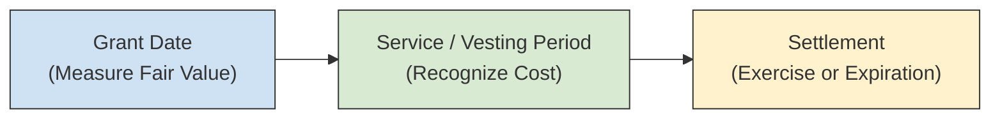
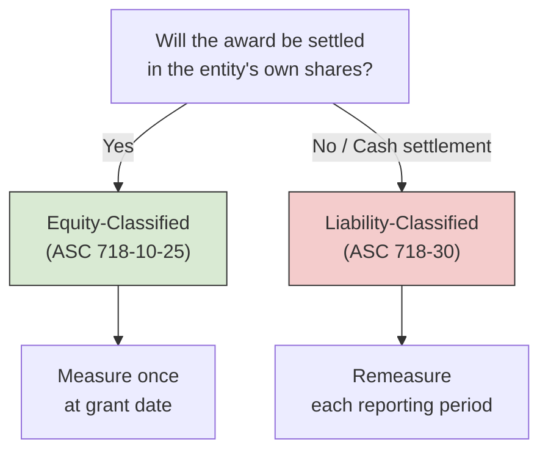
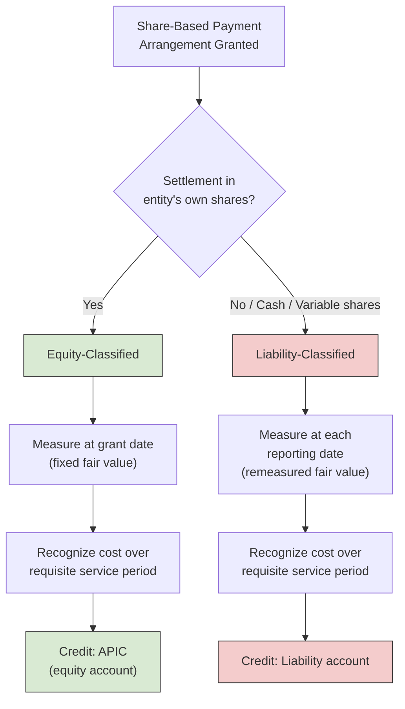

# Stock Compensation (Share-Based Payments)

Share-based payment arrangements are a core topic in both financial reporting and CPA exam testing. Under **ASC 718**, entities that compensate employees (or non-employees) with stock options, restricted stock, or similar instruments must **measure** the award at fair value, **classify** it as equity or a liability, and **recognize** compensation cost over the requisite service period. The BAR section asks you to recall the key concepts — grant date, vesting conditions, valuation inputs — and to prepare journal entries for both equity-classified and liability-classified awards.
:::info[Blueprint Coverage]
This topic maps to **Area II, Group D** of the 2026 CPA Exam Blueprints for **Business Analysis and Reporting (BAR)**. The blueprint expects candidates to:

- **Recall** concepts associated with share-based payment arrangements (e.g., grant date, vesting conditions, inputs to valuation techniques, valuation models).
- **Use** a given fair value measurement of a share-based payment arrangement classified as **equity** to prepare journal entries to recognize compensation cost.
- **Use** given fair value measurements of a share-based payment arrangement classified as a **liability** to prepare journal entries to recognize compensation cost.
  :::

---

## ASC 718 Overview

ASC 718 _Compensation — Stock Compensation_ establishes a single framework: **measure at fair value, recognize over the service period**. The standard applies to all share-based payment transactions in which an entity acquires goods or services by issuing (or offering to issue) its shares, stock options, or other equity instruments.



| Principle                 | Description                                                                                        |
| ------------------------- | -------------------------------------------------------------------------------------------------- |
| **Measurement date**      | Fair value is measured at the **grant date** for equity-classified awards                          |
| **Recognition period**    | Compensation cost is recognized over the **requisite service period** (usually the vesting period) |
| **Classification**        | Awards are classified as **equity** or **liability** based on settlement terms                     |
| **Forfeiture accounting** | Entities may elect to estimate forfeitures or recognize them as they occur                         |

:::tip[Exam Tip]
The BAR exam will **give** you the fair value — you will not need to compute Black-Scholes on the exam. Focus on knowing **what the inputs mean** and how the resulting fair value flows into the journal entries.
:::

---

## Key Terminology

Understanding these terms is critical for interpreting any share-based payment question.
| Term | Definition |
|------|-----------|
| **Grant date** | The date the employer and employee reach a mutual understanding of the key terms; the measurement date for equity awards |
| **Vesting date** | The date the employee satisfies all conditions and earns the right to the award |
| **Requisite service period** | The period over which an employee must provide service to earn the award (typically equals the vesting period) |
| **Exercise price (strike price)** | The price at which the option holder can purchase shares |
| **Fair value** | The amount at which the award could be exchanged between knowledgeable, willing parties |
| **Intrinsic value** | Market price of the stock minus the exercise price (used only in limited cases) |

### Vesting Conditions

ASC 718 distinguishes between conditions that affect whether an employee earns the award and conditions that affect the award after vesting.
| Condition Type | Example | Effect on Accounting |
|---------------|---------|---------------------|
| **Service condition** | Employee must work for 3 years | Recognized over the 3-year service period |
| **Performance condition** | Revenue must exceed \$10 million | Recognized when probable of being achieved; adjust cumulative cost as probability changes |
| **Market condition** | Stock price must reach \$50 | Reflected in the **grant-date fair value** (built into the valuation model); cost is recognized regardless of whether the condition is met |
:::warning
**Performance conditions** are not factored into the grant-date fair value. Instead, compensation cost is recognized only when the performance target is **probable** of being achieved. **Market conditions**, on the other hand, are baked into the fair value from day one — if the market target is never met, the cost already recognized is **not** reversed.
:::

---

## Equity-Classified Awards

An award is classified as **equity** when it will be settled by issuing the entity's own equity instruments (e.g., shares of stock). The most common equity-classified awards are **stock options** and **restricted stock units (RSUs)**.

### Measurement

For equity-classified awards the fair value is measured **once** — at the **grant date** — and is never remeasured.

### Stock Options

A stock option gives the employee the right to purchase a specified number of shares at a fixed exercise price after vesting conditions are met.
**Example — Bear Co. Stock Options**
On January 1, Year 1, Bear Co. grants 10,000 stock options to employees. Key terms:
| Item | Value |
|------|-------|
| Number of options | 10,000 |
| Exercise price | \$25 per share |
| Grant-date fair value per option | \$8 |
| Vesting period | 4 years (cliff vesting) |
| Expected forfeitures | None |

$$
\text{Total Compensation Cost} = 10{,}000 \times \$8 = \$80{,}000
$$

$$
\text{Annual Compensation Expense} = \frac{\$80{,}000}{4} = \$20{,}000
$$

**Year 1 journal entry:**

```journal
Dec 31, Year 1
Dr. Compensation Expense 20,000
    Cr. Additional Paid-In Capital — Stock Options[e] 20,000
```

**Year 2 journal entry (same pattern each year through Year 4):**

```journal
Dec 31, Year 2
Dr. Compensation Expense 20,000
    Cr. Additional Paid-In Capital — Stock Options[e] 20,000
```

**When employees exercise all 10,000 options (after vesting):**
The employees pay the exercise price (\$25 × 10,000 = \$250,000), and the APIC — Stock Options balance is reclassified.

```journal
Dr. Cash[a] 250,000
Dr. Additional Paid-In Capital — Stock Options[e] 80,000
    Cr. Common Stock[e] 10,000
    Cr. Additional Paid-In Capital[e] 320,000
```

**If options expire unexercised:**
No additional compensation cost or reversal is recorded. The APIC — Stock Options balance is simply reclassified to APIC.

```journal
Dr. Additional Paid-In Capital — Stock Options[e] 80,000
    Cr. Additional Paid-In Capital[e] 80,000
```

:::tip[Exam Tip]
For equity-classified awards, the **credit always goes to an equity account** (APIC — Stock Options). The fair value is **fixed at the grant date** and never adjusted, even if the stock price changes dramatically during the vesting period.
:::

---

### Restricted Stock Units (RSUs)

RSUs entitle the employee to receive shares after vesting, with no exercise price (effectively \$0). The grant-date fair value of an RSU is typically equal to the **market price of the stock on the grant date**.
**Example — Gies Co. RSUs**
On January 1, Year 1, Gies Co. grants 5,000 RSUs to an executive. Key terms:
| Item | Value |
|------|-------|
| Number of RSUs | 5,000 |
| Stock price at grant date | \$40 per share |
| Vesting period | 3 years (ratable vesting — 1/3 each year) |

$$
\text{Total Compensation Cost} = 5{,}000 \times \$40 = \$200{,}000
$$

For **ratable (graded) vesting**, each tranche is treated as a separate award. However, many entities elect the **straight-line method** over the longest vesting period when the effect is not materially different.
Using straight-line recognition:

$$
\text{Annual Compensation Expense} = \frac{\$200{,}000}{3} \approx \$66{,}667
$$

```journal
Dec 31, Year 1
Dr. Compensation Expense 66,667
    Cr. Additional Paid-In Capital — RSUs[e] 66,667
```

**When RSUs vest and shares are issued (Year 3):**

```journal
Dr. Additional Paid-In Capital — RSUs[e] 200,000
    Cr. Common Stock[e] 5,000
    Cr. Additional Paid-In Capital[e] 195,000
```

---

## Liability-Classified Awards

An award is classified as a **liability** when the entity is obligated (or may be obligated) to settle in **cash** or other assets rather than equity instruments. Common examples include **stock appreciation rights (SARs)** settled in cash and phantom stock plans.

### Key Differences from Equity Classification

| Feature                           | Equity-Classified                  | Liability-Classified                               |
| --------------------------------- | ---------------------------------- | -------------------------------------------------- |
| **Measurement date**              | Grant date (fixed)                 | Each reporting date (remeasured)                   |
| **Balance sheet credit**          | APIC (equity)                      | Liability                                          |
| **Remeasurement**                 | None                               | Fair value is updated each period until settlement |
| **Effect of stock price changes** | No impact on cost after grant date | Adjusts cumulative compensation cost each period   |



### Example — MAS Inc. Cash-Settled SARs

On January 1, Year 1, MAS Inc. grants 6,000 cash-settled SARs to employees. Key terms:
| Item | Value |
|------|-------|
| Number of SARs | 6,000 |
| Base price | \$30 per share |
| Vesting period | 3 years (cliff vesting) |
| Fair value per SAR at grant date (Jan 1, Yr 1) | \$7 |
| Fair value per SAR at Dec 31, Year 1 | \$9 |
| Fair value per SAR at Dec 31, Year 2 | \$11 |
| Fair value per SAR at Dec 31, Year 3 (vesting date) | \$10 |
Because this is a **liability-classified** award, the fair value is **remeasured** at each reporting date. The cumulative compensation cost at any point is:

$$
\text{Cumulative Cost} = \text{Fair Value per SAR} \times \text{Number of SARs} \times \frac{\text{Service Rendered}}{\text{Total Service Period}}
$$

**Year 1:**

$$
\text{Cumulative Cost (Yr 1)} = \$9 \times 6{,}000 \times \frac{1}{3} = \$18{,}000
$$

```journal
Dec 31, Year 1
Dr. Compensation Expense 18,000
    Cr. SAR Liability[l] 18,000
```

**Year 2:**

$$
\text{Cumulative Cost (Yr 2)} = \$11 \times 6{,}000 \times \frac{2}{3} = \$44{,}000
$$

$$
\text{Year 2 Expense} = \$44{,}000 - \$18{,}000 = \$26{,}000
$$

```journal
Dec 31, Year 2
Dr. Compensation Expense 26,000
    Cr. SAR Liability[l] 26,000
```

**Year 3 (vesting date):**

$$
\text{Cumulative Cost (Yr 3)} = \$10 \times 6{,}000 \times \frac{3}{3} = \$60{,}000
$$

$$
\text{Year 3 Expense} = \$60{,}000 - \$44{,}000 = \$16{,}000
$$

```journal
Dec 31, Year 3
Dr. Compensation Expense 16,000
    Cr. SAR Liability[l] 16,000
```

**Summary table:**
| | Year 1 | Year 2 | Year 3 |
|---|--------|--------|--------|
| Fair value per SAR | \$9 | \$11 | \$10 |
| Fraction vested | 1/3 | 2/3 | 3/3 |
| Cumulative cost | \$18,000 | \$44,000 | \$60,000 |
| Expense recognized in period | \$18,000 | \$26,000 | \$16,000 |
| Liability balance (end of period) | \$18,000 | \$44,000 | \$60,000 |
**When SARs are settled in cash:**

$$
\text{Cash Payment} = (\text{Stock Price} - \text{Base Price}) \times \text{Number of SARs}
$$

Assume the stock price at settlement is \$40:

$$
\text{Cash Payment} = (\$40 - \$30) \times 6{,}000 = \$60{,}000
$$

```journal
Dr. SAR Liability[l] 60,000
    Cr. Cash[a] 60,000
```

:::warning
For liability-classified awards, the **total compensation cost is not known until settlement**. Each period-end remeasurement can **increase or decrease** the cumulative cost. If the fair value drops, the liability decreases and the entity records a **credit to compensation expense** (a reversal of previously recognized cost).
:::

---

## Fair Value Measurement — Black-Scholes Inputs

While the BAR exam will not ask you to compute option fair values from scratch, you must **recall the inputs** to common valuation models and understand how each input affects fair value.

### Black-Scholes-Merton Model Inputs

| Input                       | Description                                                       | Effect on Option Fair Value     |
| --------------------------- | ----------------------------------------------------------------- | ------------------------------- |
| **Stock price**             | Current market price of the underlying stock                      | ↑ Stock price → ↑ Fair value    |
| **Exercise price**          | Price at which the option can be exercised                        | ↑ Exercise price → ↓ Fair value |
| **Expected term**           | Estimated time until exercise (in years)                          | ↑ Expected term → ↑ Fair value  |
| **Risk-free interest rate** | Yield on U.S. Treasury instruments matching the expected term     | ↑ Risk-free rate → ↑ Fair value |
| **Expected volatility**     | Anticipated fluctuation in the stock price over the expected term | ↑ Volatility → ↑ Fair value     |
| **Expected dividends**      | Dividend yield or amount expected during the option's life        | ↑ Dividends → ↓ Fair value      |

:::tip[Exam Tip]
Remember the directional relationships: **higher volatility and longer terms increase** option value (more time and uncertainty = more upside potential), while **higher exercise prices and dividends decrease** option value. These directional effects are commonly tested in conceptual multiple-choice questions.
:::

### Other Valuation Models

| Model                        | Typical Use                                                                                                           |
| ---------------------------- | --------------------------------------------------------------------------------------------------------------------- |
| **Black-Scholes-Merton**     | Plain-vanilla stock options with a single expected exercise date                                                      |
| **Binomial (lattice) model** | Options with complex features — early exercise, vesting tranches, or changing assumptions over time                   |
| **Monte Carlo simulation**   | Awards with market conditions (e.g., total shareholder return targets) where outcomes depend on simulated price paths |

---

## Forfeitures

When employees leave before vesting, their awards are **forfeited**. ASC 718 provides two approaches:
| Approach | How It Works |
|----------|-------------|
| **Estimate forfeitures** at grant date | Reduce the number of awards expected to vest; true up as actuals differ from estimates |
| **Recognize forfeitures as they occur** (accounting policy election) | Record cost assuming all awards will vest; reverse cost in the period of forfeiture |
**Example — Bear Co. Forfeiture True-Up**
Bear Co. granted 10,000 options (fair value \$8 each, 4-year vest). At the end of Year 2, Bear Co. originally estimated 5% total forfeitures (9,500 options expected to vest). During Year 3, actual departures suggest 8% total forfeitures (9,200 options expected to vest).

$$
\text{Revised Total Cost} = 9{,}200 \times \$8 = \$73{,}600
$$

$$
\text{Cumulative Cost through Year 3} = \$73{,}600 \times \frac{3}{4} = \$55{,}200
$$

$$
\text{Previously Recognized (Years 1–2)} = 9{,}500 \times \$8 \times \frac{2}{4} = \$38{,}000
$$

$$
\text{Year 3 Expense} = \$55{,}200 - \$38{,}000 = \$17{,}200
$$

The cumulative catch-up ensures total recognized cost always equals the revised estimate multiplied by the fraction of the service period completed.

## Putting It All Together — Classification Decision Framework



| Step              | Equity Award                        | Liability Award                              |
| ----------------- | ----------------------------------- | -------------------------------------------- |
| **1 — Classify**  | Settlement in shares → Equity       | Settlement in cash → Liability               |
| **2 — Measure**   | Fair value at grant date (fixed)    | Fair value at each reporting date (variable) |
| **3 — Recognize** | Straight-line over service period   | Cumulative cost adjusted each period         |
| **4 — Record**    | Dr. Compensation Expense / Cr. APIC | Dr. Compensation Expense / Cr. Liability     |
| **5 — Settle**    | Reclassify APIC; issue shares       | Debit liability; credit Cash                 |
