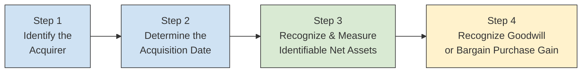
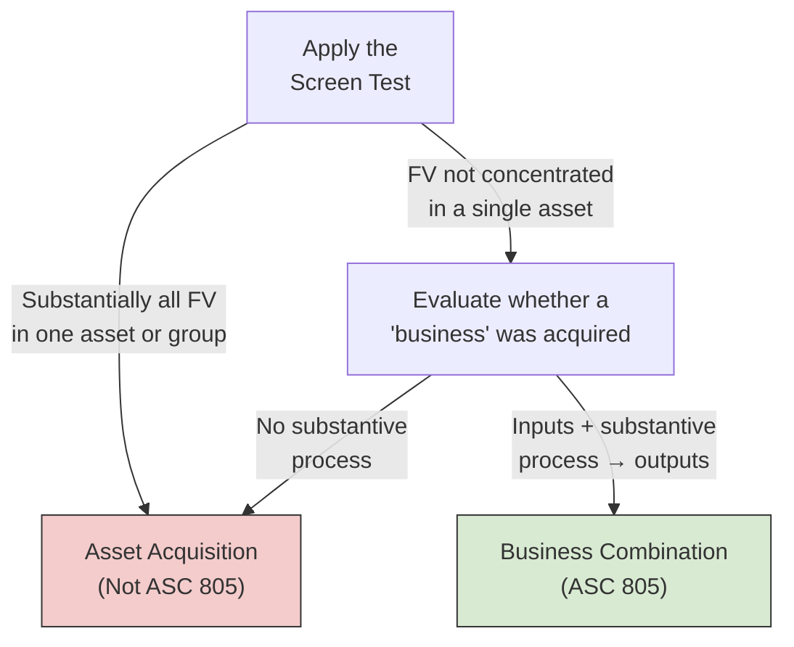
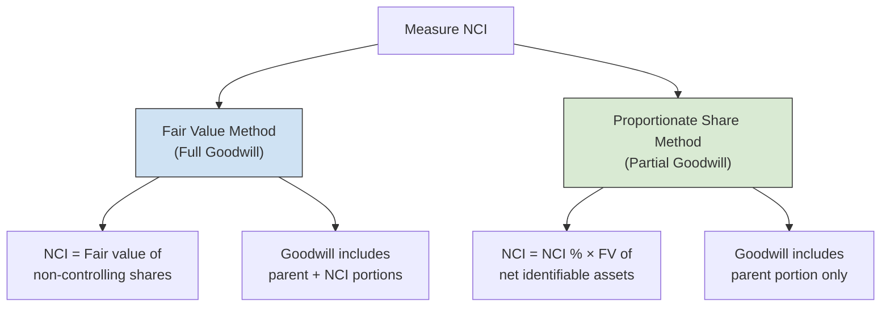
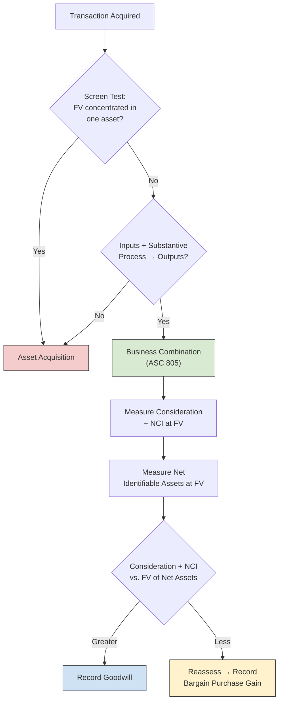

# Business Combinations

The FAR section introduces the acquisition method and the mechanics of consolidation elimination entries. The BAR section goes deeper — it asks you to **distinguish** a business combination from an asset acquisition, **calculate** the total consideration transferred (including contingent consideration and equity instruments), **prepare journal entries** for acquisitions that produce goodwill or a bargain purchase gain, **account for noncontrolling interests** under two measurement approaches, and **apply measurement period adjustments**. In short, BAR expects you to work through the full acquisition from start to finish with analytical precision.
:::info[Blueprint Coverage]
This topic maps to **Area II, Group F** of the 2026 CPA Exam Blueprints for **Business Analysis and Reporting (BAR)**. The blueprint expects candidates to:

- **Recall** concepts associated with the accounting for business combinations (e.g., business vs. asset acquisition, contingent consideration, measurement period adjustments).
- **Prepare** journal entries to record the identifiable net assets acquired in a business combination that results in the recognition of **goodwill** or a **bargain purchase gain**.
- **Prepare** journal entries to record the identifiable net assets acquired in a business combination that includes a **noncontrolling interest**.
- **Calculate** the consideration transferred in a business combination.
  :::

---

## ASC 805 Overview

**ASC 805 — Business Combinations** establishes a single model for accounting for all business combinations: the **acquisition method**. The standard requires the acquirer to measure everything at **fair value** on the acquisition date and to recognize all identifiable assets, liabilities, and any noncontrolling interest — regardless of the percentage acquired.



| Principle                     | Description                                                                                             |
| ----------------------------- | ------------------------------------------------------------------------------------------------------- |
| **Single method**             | All business combinations use the acquisition method (pooling-of-interests is prohibited)               |
| **Fair value measurement**    | Identifiable assets acquired and liabilities assumed are measured at fair value on the acquisition date |
| **Full goodwill**             | Goodwill reflects the full entity value (consideration + NCI − net assets at FV)                        |
| **Expense acquisition costs** | Legal, advisory, and due-diligence fees are expensed as incurred — never capitalized as goodwill        |

---

## Business Combination vs. Asset Acquisition

One of the most important threshold questions is whether a transaction is a **business combination** or an **asset acquisition**. The accounting treatment differs significantly.

### The Screen Test (ASU 2017-01)

ASC 805 includes an optional **concentration test** (sometimes called the "screen test"). If **substantially all** of the fair value of the gross assets acquired is concentrated in a **single identifiable asset or group of similar assets**, the transaction is an **asset acquisition** — not a business combination.



### Key Differences

| Feature                      | Business Combination (ASC 805)                       | Asset Acquisition                                     |
| ---------------------------- | ---------------------------------------------------- | ----------------------------------------------------- |
| **Goodwill**                 | Recognized if consideration + NCI > FV of net assets | **No goodwill** — excess allocated pro-rata to assets |
| **Bargain purchase**         | Gain recognized in earnings                          | **No gain** — discount reduces asset basis pro-rata   |
| **Acquisition costs**        | Expensed as incurred                                 | **Capitalized** as part of the asset cost             |
| **Contingent consideration** | Recognized at FV on acquisition date                 | Not recognized until the contingency is resolved      |
| **Deferred taxes**           | Recognized on fair value adjustments                 | Generally no deferred tax on initial recognition      |
| **In-process R&D**           | Capitalized as an intangible asset                   | Expensed if no alternative future use                 |

:::warning
The screen test is **optional**. An entity can skip it and go straight to evaluating whether the acquired set meets the definition of a business (inputs + substantive process → outputs). However, using the screen test can simplify the analysis significantly.
:::

---

## Acquisition Method — Step by Step

### Step 1: Identify the Acquirer

The acquirer is the entity that **obtains control** of the other entity. In most cases, this is the entity that transfers consideration (cash, stock, or other assets). Factors that help identify the acquirer include:

- Which entity **issues equity** (usually the acquirer)
- Relative **size** of the combining entities (the larger entity is often the acquirer)
- Which entity's **management** dominates the combined entity
- Which entity **initiates** the combination

### Step 2: Determine the Acquisition Date

The acquisition date is the date the acquirer **obtains control** — typically the **closing date** of the transaction. This is the measurement date for all fair values.

### Step 3: Recognize and Measure Identifiable Net Assets

On the acquisition date, the acquirer recognizes:

- All **identifiable tangible assets** at fair value
- All **identifiable intangible assets** that meet the contractual-legal or separability criterion
- All **liabilities assumed** at fair value
- Any **noncontrolling interest**
  Intangible assets must be recognized **separately from goodwill** if they arise from contractual or legal rights, or if they are separable (can be sold, transferred, or licensed independently).
  | Intangible Asset | Recognition Criterion |
  |------------------|-----------------------|
  | Customer relationships | Contractual-legal |
  | Trade names / trademarks | Contractual-legal |
  | Technology patents | Contractual-legal |
  | Non-compete agreements | Contractual-legal |
  | Customer lists | Separability |
  | In-process R&D | Either |

### Step 4: Recognize Goodwill or Bargain Purchase Gain

$$
\text{Goodwill} = \text{Consideration Transferred} + \text{NCI} - \text{Fair Value of Net Identifiable Assets}
$$

If the result is **positive** → recognize **goodwill**.
If the result is **negative** → reassess, then recognize a **bargain purchase gain** in earnings.

---

## Calculating the Consideration Transferred

The consideration transferred is measured at **fair value** on the acquisition date. It can include multiple components:
| Component | Measurement |
|-----------|-------------|
| **Cash** | Face amount |
| **Equity instruments** (shares issued) | Fair value of shares on the acquisition date |
| **Other assets transferred** | Fair value on the acquisition date |
| **Liabilities assumed by acquirer** | Fair value on the acquisition date |
| **Contingent consideration** | Fair value on the acquisition date |
:::tip[Exam Tip]
**Acquisition-related costs** (legal fees, advisory fees, due-diligence costs) are **never** part of the consideration transferred. They are expensed as incurred. The only exception: costs to **issue equity** reduce APIC, and costs to **issue debt** reduce the carrying amount of the debt.
:::

### Example — Bear Co. Acquires Bear Co. (Consideration Calculation)

Bear Co. acquires 100% of Bear Co. on July 1. The terms of the deal are:
| Component | Details | Fair Value |
|-----------|---------|------------|
| Cash paid at closing | Wire transfer | \$500,000 |
| Common shares issued | 20,000 shares × \$30 FV per share | \$600,000 |
| Contingent earn-out | Payable if Bear Co. exceeds revenue targets | \$80,000 |
| Advisory and legal fees | Paid to investment bank | \$45,000 |

$$
\text{Consideration Transferred} = \$500{,}000 + \$600{,}000 + \$80{,}000 = \$1{,}180{,}000
$$

The \$45,000 in advisory fees is **excluded** from consideration and expensed separately:

```journal
Jul 1
Dr. Acquisition Expense 45,000
    Cr. Cash[a] 45,000
```

---

## Goodwill Recognition

Goodwill is the residual — the excess of consideration transferred (plus NCI, if applicable) over the fair value of net identifiable assets acquired. It represents the value of expected synergies, assembled workforce, and other factors not individually identifiable.

$$
\text{Goodwill} = (\text{Consideration} + \text{NCI at FV}) - \text{FV of Net Identifiable Assets}
$$

Key attributes of goodwill:

- **Not amortized** — tested for impairment at least annually at the reporting unit level
- Only recognized in a **business combination** — internally generated goodwill is never capitalized
- **Cannot be negative** — a negative result triggers the bargain purchase analysis

### Example — Bear Co. Acquires 100% of Bear Co.

Continuing the example above, assume Bear Co.'s identifiable net assets at fair value total \$1,050,000 on July 1.
| Item | Amount |
|------|--------|
| Consideration transferred | \$1,180,000 |
| NCI | \$0 (100% acquired) |
| FV of net identifiable assets | \$1,050,000 |

$$
\text{Goodwill} = \$1{,}180{,}000 + \$0 - \$1{,}050{,}000 = \$130{,}000
$$

**Journal entry to record the acquisition:**

```journal
Jul 1
Dr. Identifiable Assets[a] 1,250,000
Dr. Goodwill[a] 130,000
    Cr. Liabilities Assumed[l] 200,000
    Cr. Cash[a] 500,000
    Cr. Common Stock[e] 20,000
    Cr. Additional Paid-In Capital[e] 580,000
    Cr. Contingent Consideration Liability[l] 80,000
```

The identifiable assets of \$1,250,000 minus the liabilities assumed of \$200,000 equals the net identifiable assets of \$1,050,000. The equity credits reflect the 20,000 shares issued at par (assumed \$1 par) plus the excess to APIC.

## Bargain Purchase Gain

A **bargain purchase** occurs when the fair value of the net identifiable assets acquired exceeds the consideration transferred plus any NCI. This can happen in distressed sales, forced liquidations, or when measurement errors exist.

### Required Reassessment

Before recognizing a bargain purchase gain, the acquirer **must**:

1. **Reassess** whether all identifiable assets and liabilities have been properly identified
2. **Review** the procedures used to measure fair values
3. Confirm the excess still exists after reassessment
   If a bargain remains, the **gain is recognized in earnings** on the acquisition date.

### Example — Bear Co. Acquires Polar Inc. (Bargain Purchase)

Bear Co. acquires 100% of Polar Inc. for \$400,000 cash. After a thorough analysis, the identifiable net assets at fair value total \$460,000.
| Item | Amount |
|------|--------|
| Consideration transferred (cash) | \$400,000 |
| FV of net identifiable assets | \$460,000 |

$$
\text{Bargain Purchase Gain} = \$460{,}000 - \$400{,}000 = \$60{,}000
$$

```journal
Jul 1
Dr. Identifiable Assets[a] 560,000
    Cr. Liabilities Assumed[l] 100,000
    Cr. Cash[a] 400,000
    Cr. Gain on Bargain Purchase 60,000
```

:::warning
A bargain purchase gain is rare in practice. When you see one on the exam, always look for the **reassessment step** — the acquirer must confirm that all assets and liabilities have been identified and correctly valued before booking the gain. The gain is reported in **earnings** (not OCI).
:::

---

## Noncontrolling Interest (NCI)

When an acquirer obtains control but acquires **less than 100%** of a subsidiary, the remaining ownership held by outside shareholders is the **noncontrolling interest**. NCI is presented in the **equity section** of the consolidated balance sheet.

### Two Measurement Approaches

ASC 805 permits two methods for measuring NCI on the acquisition date:
| Method | NCI Measurement | Goodwill Calculation |
|--------|----------------|---------------------|
| **Fair value method** (full goodwill) | NCI measured at its **fair value** | Includes goodwill attributable to **both** the parent and NCI |
| **Proportionate share method** (partial goodwill) | NCI = NCI % × FV of net identifiable assets | Includes goodwill attributable to the **parent only** |



:::tip[Exam Tip]
US GAAP (ASC 805) requires the **fair value method** (full goodwill). The proportionate share method is permitted under **IFRS 3** but not US GAAP. However, the CPA exam may test your understanding of both approaches, so know the differences.
:::

### Example — Bear Co. Acquires 80% of Bear Co. with NCI

Bear Co. acquires 80% of Bear Co. on January 1 for \$720,000 cash. The following information is available:
| Item | Amount |
|------|--------|
| Identifiable assets at FV | \$1,100,000 |
| Liabilities assumed at FV | \$250,000 |
| **FV of net identifiable assets** | **\$850,000** |
| Fair value of 20% NCI | \$190,000 |

#### Fair Value Method (Full Goodwill)

$$
\text{Goodwill} = (\$720{,}000 + \$190{,}000) - \$850{,}000 = \$60{,}000
$$

```journal
Jan 1
Dr. Identifiable Assets[a] 1,100,000
Dr. Goodwill[a] 60,000
    Cr. Liabilities Assumed[l] 250,000
    Cr. Cash[a] 720,000
    Cr. Noncontrolling Interest[e] 190,000
```

#### Proportionate Share Method (Partial Goodwill — IFRS)

Under this approach, NCI is measured as its proportionate share of net identifiable assets:

$$
\text{NCI} = 20\% \times \$850{,}000 = \$170{,}000
$$

$$
\text{Goodwill} = (\$720{,}000 + \$170{,}000) - \$850{,}000 = \$40{,}000
$$

```journal
Jan 1
Dr. Identifiable Assets[a] 1,100,000
Dr. Goodwill[a] 40,000
    Cr. Liabilities Assumed[l] 250,000
    Cr. Cash[a] 720,000
    Cr. Noncontrolling Interest[e] 170,000
```

### Side-by-Side Comparison

|                               | Fair Value Method | Proportionate Share Method |
| ----------------------------- | ----------------- | -------------------------- |
| Consideration transferred     | \$720,000         | \$720,000                  |
| NCI                           | \$190,000         | \$170,000                  |
| FV of net identifiable assets | \$850,000         | \$850,000                  |
| **Goodwill**                  | **\$60,000**      | **\$40,000**               |
| Total equity (NCI line)       | \$190,000         | \$170,000                  |

The \$20,000 difference in goodwill (\$60,000 − \$40,000) represents the goodwill attributable to the NCI that is included under the fair value method but excluded under the proportionate share method.

## Contingent Consideration

**Contingent consideration** is an obligation of the acquirer to transfer additional assets or equity to the former owners if specified future conditions are met — such as earn-out provisions tied to post-acquisition revenue or earnings targets.

### Initial Recognition

Contingent consideration is measured at **fair value** on the acquisition date and included in the total consideration transferred, regardless of the probability of the payout.

### Subsequent Measurement

The accounting for changes in contingent consideration depends on its classification:
| Classification | Initial Recognition | Subsequent Changes |
|---------------|--------------------|--------------------|
| **Liability** (most common) | Fair value at acquisition date | Remeasured at fair value each period; changes recognized in **earnings** |
| **Equity** | Fair value at acquisition date | **Not remeasured**; settled within equity |

### Example — Polar Inc. Earn-Out

Bear Co. acquires 100% of Polar Inc. for \$300,000 cash plus a contingent earn-out with a fair value of \$50,000 on the acquisition date. The earn-out requires Bear Co. to pay an additional \$75,000 if Polar Inc. achieves revenue targets within two years.
**At acquisition — record contingent consideration at fair value:**

$$
\text{Total Consideration} = \$300{,}000 + \$50{,}000 = \$350{,}000
$$

Assume net identifiable assets at fair value total \$310,000:

$$
\text{Goodwill} = \$350{,}000 - \$310{,}000 = \$40{,}000
$$

```journal
Jan 1
Dr. Identifiable Assets[a] 410,000
Dr. Goodwill[a] 40,000
    Cr. Liabilities Assumed[l] 100,000
    Cr. Cash[a] 300,000
    Cr. Contingent Consideration Liability[l] 50,000
```

**At December 31 — contingent liability increases to \$65,000:**

$$
\text{Increase} = \$65{,}000 - \$50{,}000 = \$15{,}000
$$

```journal
Dec 31
Dr. Loss on Contingent Consideration 15,000
    Cr. Contingent Consideration Liability[l] 15,000
```

**When the earn-out is settled (paid \$75,000 in Year 2):**

$$
\text{Additional Loss} = \$75{,}000 - \$65{,}000 = \$10{,}000
$$

```journal
Dr. Loss on Contingent Consideration 10,000
Dr. Contingent Consideration Liability[l] 65,000
    Cr. Cash[a] 75,000
```

:::tip[Exam Tip]
Changes in the fair value of **liability-classified** contingent consideration are recognized in **earnings** — they do **not** adjust goodwill. Only measurement period adjustments (for facts existing at the acquisition date) adjust goodwill. Post-acquisition changes in fair value are income statement items.
:::

---

## Measurement Period Adjustments

After the acquisition date, the acquirer may obtain new information about **facts and circumstances that existed as of the acquisition date**. ASC 805 provides a **measurement period** of up to **one year** from the acquisition date to finalize the purchase price allocation.

### Key Rules

| Rule                       | Detail                                                                                                             |
| -------------------------- | ------------------------------------------------------------------------------------------------------------------ |
| **Maximum duration**       | One year from the acquisition date                                                                                 |
| **What qualifies**         | New information about facts that **existed at the acquisition date**                                               |
| **What does NOT qualify**  | Events occurring **after** the acquisition date (these are recognized in current-period earnings)                  |
| **Accounting treatment**   | Adjustments are recorded **retrospectively** — as if the revised amounts had been recorded on the acquisition date |
| **Effect on goodwill**     | Measurement period adjustments increase or decrease goodwill                                                       |
| **Comparative statements** | Prior-period financial statements are restated to reflect the adjustments                                          |

### Example — Bear Co. Measurement Period Adjustment

Bear Co. acquired Bear Co. on January 1 and initially recorded the following:
| Item | Provisional Amount |
|------|-------------------|
| Identifiable assets at FV | \$1,100,000 |
| Liabilities assumed at FV | \$250,000 |
| Net identifiable assets | \$850,000 |
| Consideration transferred | \$720,000 |
| NCI at FV | \$190,000 |
| **Goodwill** | **\$60,000** |
On June 15 (within the measurement period), Bear Co. receives an updated appraisal revealing that a patent included in identifiable assets was undervalued by \$25,000 on the acquisition date.
**Measurement period adjustment:**

$$
\text{Revised Net Identifiable Assets} = \$850{,}000 + \$25{,}000 = \$875{,}000
$$

$$
\text{Revised Goodwill} = (\$720{,}000 + \$190{,}000) - \$875{,}000 = \$35{,}000
$$

```journal
Jun 15
Dr. Patent[a] 25,000
    Cr. Goodwill[a] 25,000
```

If the patent had been **overvalued** by \$25,000:

```journal
Jun 15
Dr. Goodwill[a] 25,000
    Cr. Patent[a] 25,000
```

:::warning
After the measurement period closes (one year from the acquisition date), any adjustments to the purchase price allocation are recognized in **current-period earnings** — they no longer adjust goodwill or prior-period statements. Be sure to check the timeline on exam questions.
:::

---

## Comprehensive Example — Full Acquisition with All Components

Bear Co. acquires 75% of Polar Inc. on April 1. The following information is available:
**Consideration transferred by Bear Co.:**
| Component | Amount |
|-----------|--------|
| Cash | \$450,000 |
| Bear Co. common shares issued (15,000 shares × \$20 FV) | \$300,000 |
| Contingent earn-out (FV at acquisition date) | \$60,000 |
| **Total consideration** | **\$810,000** |
**Acquisition-related costs:** \$30,000 (advisory fees)
**Polar Inc. identifiable net assets at fair value on April 1:**
| Item | Book Value | Fair Value |
|------|-----------|------------|
| Cash | \$80,000 | \$80,000 |
| Accounts receivable | \$120,000 | \$115,000 |
| Inventory | \$200,000 | \$230,000 |
| Property, plant & equipment | \$400,000 | \$520,000 |
| Customer relationships | \$0 | \$75,000 |
| **Total identifiable assets** | **\$800,000** | **\$1,020,000** |
| Accounts payable | \$90,000 | \$90,000 |
| Notes payable | \$150,000 | \$150,000 |
| **Total liabilities** | **\$240,000** | **\$240,000** |
| **Net identifiable assets** | **\$560,000** | **\$780,000** |
**Fair value of 25% NCI:** \$275,000

### Step 1: Calculate Goodwill

$$
\text{Goodwill} = (\text{Consideration} + \text{NCI at FV}) - \text{FV of Net Identifiable Assets}
$$

$$
\text{Goodwill} = (\$810{,}000 + \$275{,}000) - \$780{,}000 = \$305{,}000
$$

### Step 2: Record Acquisition-Related Costs

```journal
Apr 1
Dr. Acquisition Expense 30,000
    Cr. Cash[a] 30,000
```

### Step 3: Record the Business Combination

```journal
Apr 1
Dr. Cash[a] 80,000
Dr. Accounts Receivable[a] 115,000
Dr. Inventory[a] 230,000
Dr. Property, Plant & Equipment[a] 520,000
Dr. Customer Relationships[a] 75,000
Dr. Goodwill[a] 305,000
    Cr. Accounts Payable[l] 90,000
    Cr. Notes Payable[l] 150,000
    Cr. Cash[a] 450,000
    Cr. Common Stock[e] 15,000
    Cr. Additional Paid-In Capital[e] 285,000
    Cr. Contingent Consideration Liability[l] 60,000
    Cr. Noncontrolling Interest[e] 275,000
```

The equity credits assume 15,000 shares at \$1 par value (\$15,000 to Common Stock) with the remainder of the \$300,000 stock consideration going to APIC (\$285,000).

### Step 4: Verify the Entry Balances

|                          | Debits          | Credits         |
| ------------------------ | --------------- | --------------- |
| Identifiable assets      | \$1,020,000     |                 |
| Goodwill                 | \$305,000       |                 |
| Liabilities assumed      |                 | \$240,000       |
| Cash paid                |                 | \$450,000       |
| Stock issued             |                 | \$300,000       |
| Contingent consideration |                 | \$60,000        |
| NCI                      |                 | \$275,000       |
| **Total**                | **\$1,325,000** | **\$1,325,000** |

### Step 5: Measurement Period Adjustment (August 15)

An updated appraisal determines that the PP&E was undervalued by \$40,000 on April 1.

$$
\text{Revised FV of Net Identifiable Assets} = \$780{,}000 + \$40{,}000 = \$820{,}000
$$

$$
\text{Revised Goodwill} = (\$810{,}000 + \$275{,}000) - \$820{,}000 = \$265{,}000
$$

```journal
Aug 15
Dr. Property, Plant & Equipment[a] 40,000
    Cr. Goodwill[a] 40,000
```

### Step 6: Contingent Consideration Remeasurement (December 31)

At year-end, the earn-out liability is remeasured to \$72,000. This is a **post-acquisition change in fair value**, not a measurement period adjustment:

$$
\text{Increase} = \$72{,}000 - \$60{,}000 = \$12{,}000
$$

```journal
Dec 31
Dr. Loss on Contingent Consideration 12,000
    Cr. Contingent Consideration Liability[l] 12,000
```

---

## Summary

| Topic                              | Key Takeaway                                                                                                         |
| ---------------------------------- | -------------------------------------------------------------------------------------------------------------------- |
| **Business vs. asset acquisition** | Use the screen test — if FV is concentrated in one asset, it is an asset acquisition (no goodwill, capitalize costs) |
| **Consideration transferred**      | Cash + FV of stock issued + FV of contingent consideration; exclude acquisition costs                                |
| **Goodwill**                       | Consideration + NCI − FV of net identifiable assets; not amortized; tested for impairment                            |
| **Bargain purchase**               | FV of net assets exceeds consideration + NCI; reassess first, then book gain in earnings                             |
| **NCI — fair value method**        | NCI at FV → full goodwill (US GAAP required)                                                                         |
| **NCI — proportionate share**      | NCI at % of net assets → partial goodwill (IFRS option)                                                              |
| **Contingent consideration**       | Measured at FV on acquisition date; liability remeasured through earnings; equity not remeasured                     |
| **Measurement period**             | Up to 1 year; adjust goodwill retrospectively for acquisition-date facts; post-period changes go to earnings         |
| **Acquisition costs**              | Expensed as incurred (except debt/equity issuance costs follow their own standards)                                  |


