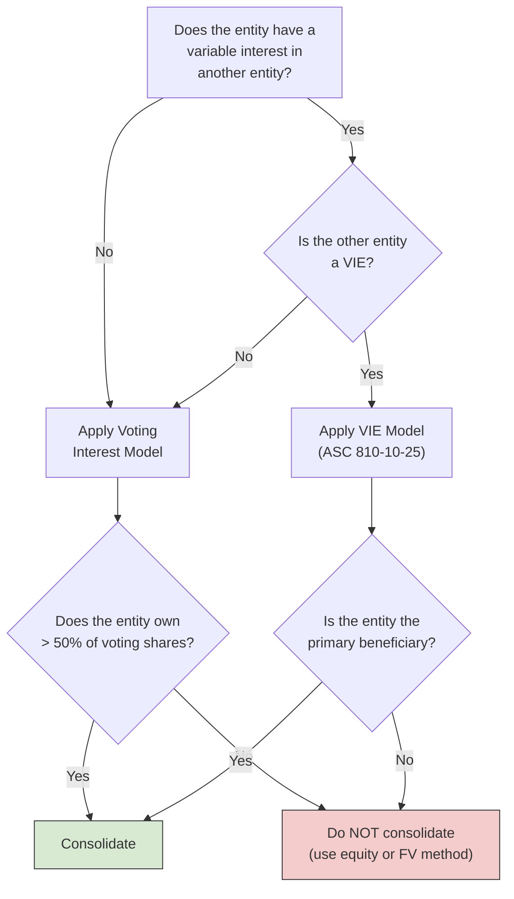
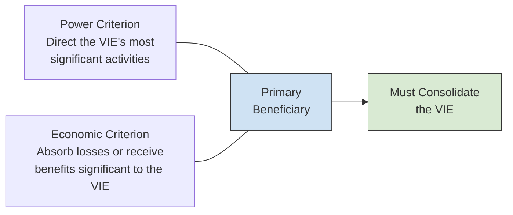
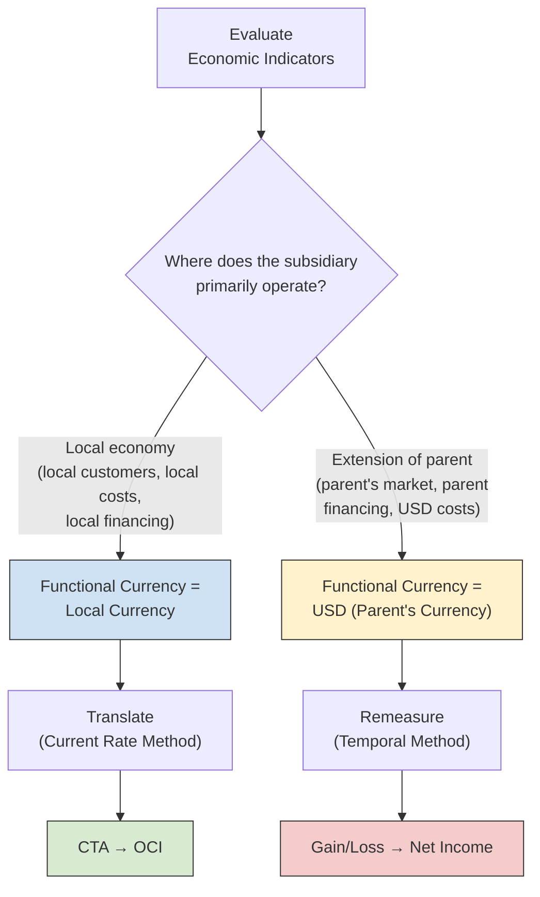

# Consolidated Financial Statements

Consolidated financial statements combine the results of a parent and its subsidiaries into a **single reporting entity**. The BAR section builds on the FAR foundation — instead of simply knowing _that_ consolidation occurs, you must determine _when_ consolidation is required (voting interest model vs. variable interest entity model), identify the functional currency of a foreign subsidiary, translate or remeasure its financial statements into the reporting currency, and present the resulting adjustments correctly in comprehensive income. This chapter ties together ASC 810 (Consolidation) and ASC 830 (Foreign Currency Matters) with the analytical depth expected on the BAR exam.
:::info[Blueprint Coverage]
This topic maps to **Area II, Group G** of the 2026 CPA Exam Blueprints for **Business Analysis and Reporting (BAR)**. The blueprint expects candidates to:

- **Recall** basic consolidation concepts and terms (e.g., controlling interest, noncontrolling interest, primary beneficiary, variable interest entity).
- **Recall** the basic functional currency concepts including the indicators to be considered when determining a subsidiary's functional currency.
- **Calculate** foreign currency translation adjustments (local currency to functional currency and/or functional currency to reporting currency) to prepare consolidated financial statements.
- **Determine** the appropriate presentation of foreign currency translation adjustments in the consolidated statement of comprehensive income.
  :::

---

## ASC 810 — Consolidation Overview

**ASC 810** _Consolidation_ requires a reporting entity to consolidate another entity when it holds a **controlling financial interest**. The standard provides two models for determining whether control exists:



---

## Key Consolidation Concepts and Terms

| Term                               | Definition                                                                                                                                                                                                       |
| ---------------------------------- | ---------------------------------------------------------------------------------------------------------------------------------------------------------------------------------------------------------------- |
| **Controlling financial interest** | The power to direct the activities of another entity, typically through majority voting rights or as the primary beneficiary of a VIE                                                                            |
| **Parent**                         | An entity that holds a controlling financial interest in one or more subsidiaries                                                                                                                                |
| **Subsidiary**                     | An entity controlled by a parent                                                                                                                                                                                 |
| **Noncontrolling interest (NCI)**  | The portion of equity in a subsidiary **not** attributable to the parent; presented in the equity section of the consolidated balance sheet                                                                      |
| **Variable interest entity (VIE)** | An entity in which equity investors lack sufficient equity at risk, decision-making ability, or the right to residual returns/obligation to absorb losses                                                        |
| **Primary beneficiary**            | The entity that (1) has the **power** to direct the VIE's most significant activities, and (2) has the **obligation to absorb losses** or the **right to receive benefits** that could be significant to the VIE |
| **Elimination entries**            | Adjustments that remove intercompany balances and transactions so the consolidated statements present a single economic entity                                                                                   |

:::tip[Exam Tip]
The CPA exam frequently tests whether you can **distinguish** the voting interest model from the VIE model. Always check for a VIE first — the VIE model takes priority over the voting interest model when applicable.
:::

---

## When to Consolidate — Voting Interest Model

Under the **voting interest model**, a parent consolidates a subsidiary when it owns **more than 50%** of the subsidiary's outstanding voting stock. This model is straightforward and applies when the entity is **not** a VIE.
| Ownership Level | Accounting Treatment |
|----------------|---------------------|
| **> 50%** | **Consolidation** — control is presumed |
| **20% – 50%** | Equity method — significant influence is presumed |
| **< 20%** | Fair value method (or equity method if significant influence exists) |

### Consolidation Basics

When consolidation is required under the voting interest model:

1. **Combine** all assets, liabilities, revenues, and expenses of the parent and subsidiary
2. **Eliminate** 100% of intercompany transactions (regardless of ownership percentage)
3. **Present NCI** as a separate component of equity on the consolidated balance sheet
4. **Allocate** consolidated net income between the parent and NCI based on ownership percentages
   :::warning
   Ownership of **exactly 50%** does not presume control under the voting interest model. Control requires ownership of **more than 50%** of the voting shares. A 50-50 joint venture is typically accounted for using the equity method.
   :::

---

## When to Consolidate — Variable Interest Entity (VIE) Model

The VIE model captures situations where **economic control** exists even without majority voting ownership. An entity must evaluate whether it holds a **variable interest** in another entity, and if so, whether that entity qualifies as a VIE.

### What Is a Variable Interest?

A **variable interest** is a contractual, ownership, or other financial interest that changes with changes in the fair value of the entity's net assets. Common examples include:

- Equity investments (even if small)
- Guarantees of the entity's debt
- Subordinated debt instruments
- Lease arrangements with residual value guarantees
- Service contracts with performance-based fees

### VIE Criteria

An entity is a VIE if **any** of the following conditions exist:
| Condition | Description |
|-----------|-------------|
| **Insufficient equity at risk** | Total equity investment at risk is not sufficient to finance the entity's activities without additional subordinated financial support |
| **Lack of decision-making power** | Equity holders as a group lack the power to direct the entity's most significant activities through voting or similar rights |
| **Lack of obligation/right** | Equity holders do not have the obligation to absorb expected losses or the right to receive expected residual returns |

### Identifying the Primary Beneficiary

The entity that must consolidate a VIE is its **primary beneficiary** — the party that meets **both** of the following criteria simultaneously:

$$
\text{Primary Beneficiary} = \text{Power to Direct} + \text{Obligation to Absorb Losses / Right to Receive Benefits}
$$



### Example — Bear Co. and Polar Inc. (VIE Analysis)

Bear Co. holds a 30% equity interest in Polar Inc., a special-purpose entity created to hold a portfolio of receivables. Bear Co. also provides a guarantee covering 80% of Polar Inc.'s debt. Polar Inc. was formed with minimal equity (5% of total assets), and Bear Co.'s management makes all significant decisions about which receivables are purchased and how collections are managed.
**Analysis:**
| VIE Test | Result |
|----------|--------|
| Sufficient equity at risk? | **No** — only 5% of total assets funded by equity |
| Is Polar Inc. a VIE? | **Yes** |
| Does Bear Co. have the power to direct significant activities? | **Yes** — Bear Co. manages receivable purchases and collections |
| Does Bear Co. absorb significant losses? | **Yes** — guarantee covers 80% of debt |
| Is Bear Co. the primary beneficiary? | **Yes** |
**Conclusion:** Bear Co. must consolidate Polar Inc. even though it owns only 30% of the equity.
:::tip[Exam Tip]
On the exam, a VIE question may describe an entity with very little equity and a related party providing guarantees or management services. Look for the **two-prong test**: power to direct + economic exposure. If one party has both, that party is the primary beneficiary and must consolidate.
:::

---

## Noncontrolling Interest (NCI) Presentation

When a parent consolidates a subsidiary that is not wholly owned, the outside shareholders' interest is the **noncontrolling interest**. Under ASC 810:

- NCI is presented as a **separate component of equity** on the consolidated balance sheet (not as a liability or mezzanine item)
- Consolidated **net income** is allocated between the parent and NCI
- The NCI's share of income is presented **on the face** of the consolidated income statement
  | Financial Statement | NCI Presentation |
  |--------------------|-----------------|
  | **Balance sheet** | Separate line in the equity section, distinct from parent's equity |
  | **Income statement** | Net income attributable to NCI shown separately from net income attributable to the parent |
  | **Statement of comprehensive income** | Comprehensive income attributed to both parent and NCI |

### Example — NCI Income Allocation

Bear Co. owns 80% of Bear Co. During the year, Bear Co. reports net income of \$200,000.

$$
\text{NCI Share of Income} = 20\% \times \$200{,}000 = \$40{,}000
$$

$$
\text{Parent Share of Income} = 80\% \times \$200{,}000 = \$160{,}000
$$

The consolidated income statement presents:
| | Amount |
|---|--------|
| Consolidated net income | \$200,000 |
| Less: Net income attributable to NCI | (\$40,000) |
| **Net income attributable to Bear Co.** | **\$160,000** |

---

## Functional Currency — ASC 830

Before translating a foreign subsidiary's financial statements, the parent must determine the subsidiary's **functional currency** — the currency of the primary economic environment in which the subsidiary operates.

### Functional Currency Indicators

ASC 830-10-55 provides several economic indicators to guide the determination:
| Indicator | Functional Currency = Local Currency | Functional Currency = Parent's Currency (USD) |
|-----------|-------------------------------------|----------------------------------------------|
| **Cash flows** | Primarily in local currency; do not directly affect parent's cash flows | Directly related to and readily available for remittance to the parent |
| **Sales prices** | Determined by local competition and local market conditions; not primarily responsive to short-term exchange rate changes | Determined by worldwide competition or international prices; responsive to short-term exchange rate changes |
| **Sales market** | Active local sales market for the subsidiary's products | Sales market is primarily in the parent's country or denominated in the parent's currency |
| **Expenses** | Labor, materials, and other costs are primarily local costs | Production components obtained primarily from the parent's country |
| **Financing** | Financing denominated in local currency; operations generate sufficient cash to service debt | Financing primarily from the parent or denominated in the parent's currency; parent's cash flows needed to service debt |
| **Intercompany transactions** | Low volume of intercompany transactions relative to total activity | High volume of intercompany transactions; extensive interrelationship with parent's operations |



:::warning
No single indicator is determinative. Management must weigh **all** indicators and exercise judgment. When the indicators are mixed, ASC 830 states that the functional currency determination should give priority to the indicators that **best reflect the subsidiary's economic environment**.
:::

### Highly Inflationary Economies

If a subsidiary operates in a **highly inflationary economy** (cumulative inflation of approximately **100% or more** over a 3-year period), the functional currency is automatically deemed to be the **reporting currency (USD)**, regardless of the economic indicators. The **temporal method** (remeasurement) is used.

## Foreign Currency Translation — Current Rate Method

The **current rate method** (also called **translation**) is used when the subsidiary's functional currency is the **local (foreign) currency**. This method preserves the subsidiary's financial relationships as originally reported.

### Exchange Rates Applied

| Financial Statement Item  | Exchange Rate                                      |
| ------------------------- | -------------------------------------------------- |
| **All assets**            | Current rate (balance sheet date)                  |
| **All liabilities**       | Current rate (balance sheet date)                  |
| **Common stock / APIC**   | Historical rate (date issued)                      |
| **Retained earnings**     | Composite of historical rates (built up over time) |
| **Revenues and expenses** | Weighted-average rate for the period               |
| **Dividends declared**    | Historical rate (date declared)                    |

### Cumulative Translation Adjustment (CTA)

Because assets and liabilities are translated at the **current rate** while equity accounts use **historical rates**, a balancing amount arises. This is the **cumulative translation adjustment (CTA)**, reported in **accumulated other comprehensive income (AOCI)** — a component of stockholders' equity.

$$
\text{CTA (period change)} = \text{Net Assets in FC} \times (\text{Current Rate} - \text{Prior Period Rate}) + \text{Translation effects on income and dividends}
$$

:::tip[Exam Tip]
A quick way to think about translation: **everything on the balance sheet** goes at the current rate (except equity accounts, which are historical). **Everything on the income statement** goes at the average rate. The **plug** that makes the balance sheet balance in USD is the CTA, which goes to **OCI** — never to net income.
:::

### Example — Bear Co. Translates Bear Co. (UK Subsidiary)

Bear Co. (a U.S. company) owns 100% of Bear Co., a subsidiary in the United Kingdom. The British pound (£) is Bear Co.'s functional currency. The following data are available for Year 1:
**Exchange rates:**
| Rate | £/$ |
|------|-----|
| Current rate (Dec. 31, Year 1) | \$1.30 |
| Historical rate (date of stock issuance) | \$1.40 |
| Weighted-average rate (Year 1) | \$1.35 |
| Dividends declared rate | \$1.32 |
| Beginning-of-year rate (Jan. 1, Year 1) | \$1.38 |
**Bear Co. trial balance (in £):**
| Account | £ Amount |
|---------|---------|
| Total assets | £800,000 |
| Total liabilities | £300,000 |
| Common stock | £100,000 |
| Beginning retained earnings | £250,000 |
| Revenues | £400,000 |
| Expenses | £320,000 |
| Dividends declared | £30,000 |
**Step 1 — Translate income statement items at the average rate:**

$$
\text{Revenues (USD)} = £400{,}000 \times \$1.35 = \$540{,}000
$$

$$
\text{Expenses (USD)} = £320{,}000 \times \$1.35 = \$432{,}000
$$

$$
\text{Net Income (USD)} = \$540{,}000 - \$432{,}000 = \$108{,}000
$$

**Step 2 — Translate dividends at the historical rate (date declared):**

$$
\text{Dividends (USD)} = £30{,}000 \times \$1.32 = \$39{,}600
$$

**Step 3 — Translate balance sheet items:**
| Account | £ Amount | Rate | USD Amount |
|---------|---------|------|-----------|
| Total assets | £800,000 | 1.30 (current) | \$1,040,000 |
| Total liabilities | £300,000 | 1.30 (current) | \$390,000 |
| Common stock | £100,000 | 1.40 (historical) | \$140,000 |
| Beginning retained earnings | — | (given/prior year) | \$345,000 |
**Step 4 — Compute ending retained earnings:**

$$
\text{Ending RE (USD)} = \$345{,}000 + \$108{,}000 - \$39{,}600 = \$413{,}400
$$

**Step 5 — Compute the CTA (plug):**

$$
\text{Total Equity Required} = \text{Assets} - \text{Liabilities} = \$1{,}040{,}000 - \$390{,}000 = \$650{,}000
$$

$$
\text{Equity Before CTA} = \text{Common Stock} + \text{Ending RE} = \$140{,}000 + \$413{,}400 = \$553{,}400
$$

$$
\text{CTA (cumulative)} = \$650{,}000 - \$553{,}400 = \$96{,}600
$$

The \$96,600 CTA is reported in **AOCI** within the equity section of Bear Co.'s consolidated balance sheet.
**Translated balance sheet summary:**
| Account | USD Amount |
|---------|-----------|
| Total assets | \$1,040,000 |
| Total liabilities | \$390,000 |
| Common stock | \$140,000 |
| Retained earnings | \$413,400 |
| **AOCI — CTA** | **\$96,600** |
| **Total equity** | **\$650,000** |

---

## Foreign Currency Remeasurement — Temporal Method

The **temporal method** (also called **remeasurement**) is used when the subsidiary's functional currency is the **parent's reporting currency (USD)** — meaning the subsidiary is essentially an extension of the parent's operations. It is also used when the subsidiary operates in a highly inflationary economy.

### Exchange Rates Applied

| Financial Statement Item                                              | Exchange Rate                                  |
| --------------------------------------------------------------------- | ---------------------------------------------- |
| **Monetary assets** (cash, receivables, etc.)                         | Current rate                                   |
| **Monetary liabilities** (payables, debt, etc.)                       | Current rate                                   |
| **Nonmonetary assets** (inventory at cost, fixed assets, intangibles) | Historical rate                                |
| **Common stock / APIC**                                               | Historical rate                                |
| **Revenues and most expenses**                                        | Weighted-average rate                          |
| **COGS (from historical-cost inventory)**                             | Historical rate                                |
| **Depreciation and amortization**                                     | Historical rate (matches the underlying asset) |

### Remeasurement Gain or Loss

The remeasurement gain or loss is the **plug** that balances the remeasured trial balance. Unlike translation, this gain or loss is recognized in **net income** — not OCI.

### Key Differences — Translation vs. Remeasurement

| Feature                  | Translation (Current Rate)           | Remeasurement (Temporal)                            |
| ------------------------ | ------------------------------------ | --------------------------------------------------- |
| **When used**            | Functional currency = local currency | Functional currency = USD (or highly inflationary)  |
| **Assets**               | All at current rate                  | Monetary: current; Nonmonetary: historical          |
| **Liabilities**          | All at current rate                  | Monetary: current; Nonmonetary: historical          |
| **Revenues / expenses**  | Average rate                         | Average rate (but COGS, depreciation at historical) |
| **Equity**               | Historical rate                      | Historical rate                                     |
| **Resulting adjustment** | **CTA → OCI**                        | **Gain/loss → Net income**                          |

:::tip[Exam Tip]
**Memory aid:** "**C**urrent rate → **C**TA → O**C**I" and "**T**emporal → **T**o income." If the subsidiary's functional currency is the local currency, use the current rate method and the adjustment flows to OCI. If the functional currency is the USD, use the temporal method and the adjustment flows to net income.
:::

### Example — Bear Co. Remeasures Polar Inc. (Mexican Subsidiary)

Bear Co. owns 100% of Polar Inc., a subsidiary in Mexico. Because Polar Inc.'s operations are an extension of Bear Co. (most sales are to U.S. customers, financing is in USD), Bear Co. has determined that the **USD** is Polar Inc.'s functional currency.
**Exchange rates (Mexican peso — MXN):**
| Rate Description | $/MXN |
|------------------|-------|
| Current rate (Dec. 31) | \$0.055 |
| Historical rate (fixed assets purchased) | \$0.065 |
| Historical rate (inventory purchased) | \$0.060 |
| Historical rate (common stock issued) | \$0.070 |
| Weighted-average rate | \$0.058 |
**Polar Inc. trial balance (in MXN):**
| Account | MXN Amount | Rate | USD Amount |
|---------|-----------|------|-----------|
| Cash | MXN 2,000,000 | 0.055 (current) | \$110,000 |
| Accounts receivable | MXN 3,000,000 | 0.055 (current) | \$165,000 |
| Inventory (at cost) | MXN 4,000,000 | 0.060 (historical) | \$240,000 |
| Fixed assets (net) | MXN 10,000,000 | 0.065 (historical) | \$650,000 |
| **Total assets** | **MXN 19,000,000** | | **\$1,165,000** |
| Accounts payable | MXN 2,500,000 | 0.055 (current) | \$137,500 |
| Long-term debt | MXN 5,000,000 | 0.055 (current) | \$275,000 |
| **Total liabilities** | **MXN 7,500,000** | | **\$412,500** |
| Common stock | MXN 5,000,000 | 0.070 (historical) | \$350,000 |
| Beginning retained earnings | — | (given) | \$320,000 |
**Income statement (MXN):**
| Account | MXN Amount | Rate | USD Amount |
|---------|-----------|------|-----------|
| Revenues | MXN 12,000,000 | 0.058 (average) | \$696,000 |
| COGS | MXN 7,000,000 | 0.060 (historical) | \$420,000 |
| Depreciation | MXN 1,000,000 | 0.065 (historical) | \$65,000 |
| Other expenses | MXN 2,000,000 | 0.058 (average) | \$116,000 |
| **Net income (before remeasurement)** | | | **\$95,000** |
**Compute remeasurement gain/loss (plug):**

$$
\text{Ending RE (before remeasurement)} = \$320{,}000 + \$95{,}000 = \$415{,}000
$$

$$
\text{Total Equity (required)} = \$1{,}165{,}000 - \$412{,}500 = \$752{,}500
$$

$$
\text{Equity Before Plug} = \$350{,}000 + \$415{,}000 = \$765{,}000
$$

$$
\text{Remeasurement Loss} = \$765{,}000 - \$752{,}500 = \$12{,}500
$$

Because equity before the plug (\$765,000) exceeds required equity (\$752,500), the entity has a **remeasurement loss** of \$12,500 — reported in **net income**.

$$
\text{Adjusted Net Income} = \$95{,}000 - \$12{,}500 = \$82{,}500
$$

$$
\text{Ending RE} = \$320{,}000 + \$82{,}500 = \$402{,}500
$$

**Remeasured balance sheet summary:**
| Account | USD Amount |
|---------|-----------|
| Total assets | \$1,165,000 |
| Total liabilities | \$412,500 |
| Common stock | \$350,000 |
| Retained earnings | \$402,500 |
| **Total equity** | **\$752,500** |

---

## CTA Presentation in Comprehensive Income

The **cumulative translation adjustment (CTA)** from the current rate method is a component of **other comprehensive income (OCI)**. It affects the consolidated financial statements as follows:

### Statement of Comprehensive Income

| Line Item                                                                            | Source                    |
| ------------------------------------------------------------------------------------ | ------------------------- |
| Net income                                                                           | Income statement          |
| **Other comprehensive income:**                                                      |                           |
| &nbsp;&nbsp;&nbsp;&nbsp;Foreign currency translation adjustment                      | CTA change for the period |
| &nbsp;&nbsp;&nbsp;&nbsp;(Other OCI items — e.g., unrealized gains on AFS securities) |                           |
| **Comprehensive income**                                                             | Net income + OCI          |

The CTA accumulates in **AOCI** on the balance sheet and remains there until the subsidiary is **sold or substantially liquidated**. Upon disposal, the accumulated CTA is **reclassified out of AOCI** into earnings (a "recycling" entry).

```journal
Dr. AOCI — Cumulative Translation Adjustment[e] 96,600
    Cr. Gain on Disposal of Foreign Subsidiary 96,600
```

:::warning
Remeasurement gains and losses (temporal method) are **not** part of OCI. They go directly to net income. Only the CTA from the **current rate method** flows through OCI. This is a critical distinction the exam will test.
:::

---

## Two-Step Translation (Local → Functional → Reporting)

In some cases, a subsidiary may keep its books in a **local currency** that is different from its **functional currency**, and the functional currency differs from the parent's **reporting currency**. This requires a two-step process:

$$
\text{Local Currency} \xrightarrow{\text{Remeasure (Temporal)}} \text{Functional Currency} \xrightarrow{\text{Translate (Current Rate)}} \text{Reporting Currency}
$$

| Step                               | Method                            | Gain/Loss Treatment        |
| ---------------------------------- | --------------------------------- | -------------------------- |
| **Step 1:** Local → Functional     | Temporal method (remeasurement)   | Gain/loss → **Net income** |
| **Step 2:** Functional → Reporting | Current rate method (translation) | CTA → **OCI**              |

### Example — Bear Co. Subsidiary in Hong Kong

Bear Co. (USD reporting) owns 100% of Bear Co., which operates in Hong Kong and keeps its books in **Hong Kong dollars (HKD)**. Management has determined that Bear Co.'s functional currency is the **Japanese yen (¥)** because its primary economic activities are tied to the Japanese market.

1. **Step 1 — Remeasure** from HKD to ¥ using the **temporal method**. Any remeasurement gain/loss is included in **net income**.
2. **Step 2 — Translate** from ¥ to USD using the **current rate method**. The resulting CTA is reported in **OCI**.
   :::tip[Exam Tip]
   When you see a two-step translation question, always apply **remeasurement first** (local to functional) and then **translation second** (functional to reporting). Remember: remeasurement gains/losses hit income; translation adjustments hit OCI.
   :::

---

## Comprehensive Worked Example

Bear Co. (U.S. parent, USD reporting currency) owns 100% of Bear Co., a UK subsidiary whose functional currency is the **British pound (£)**. On December 31, Year 2, the following information is available:
**Exchange rates:**
| Rate Description | $/£ |
|------------------|-----|
| Beginning of Year 2 (Jan. 1) | \$1.25 |
| End of Year 2 (Dec. 31) | \$1.20 |
| Weighted-average (Year 2) | \$1.22 |
| Historical (stock issuance) | \$1.50 |
| Dividend declaration date | \$1.23 |
**Bear Co. financial data (in £):**
| Account | £ Amount |
|---------|---------|
| Total assets | £1,000,000 |
| Total liabilities | £400,000 |
| Common stock | £200,000 |
| Beginning retained earnings (Year 2) | £300,000 |
| Revenues | £500,000 |
| Expenses | £420,000 |
| Dividends declared | £20,000 |
**Given:** Beginning AOCI — CTA balance = (\$15,000) (debit/loss from prior years). Beginning retained earnings (USD) = \$380,000.

---

**Step 1 — Translate the income statement (average rate):**

$$
\text{Revenues} = £500{,}000 \times \$1.22 = \$610{,}000
$$

$$
\text{Expenses} = £420{,}000 \times \$1.22 = \$512{,}400
$$

$$
\text{Net Income} = \$610{,}000 - \$512{,}400 = \$97{,}600
$$

**Step 2 — Translate dividends (historical rate at declaration):**

$$
\text{Dividends} = £20{,}000 \times \$1.23 = \$24{,}600
$$

**Step 3 — Compute ending retained earnings (USD):**

$$
\text{Ending RE} = \$380{,}000 + \$97{,}600 - \$24{,}600 = \$453{,}000
$$

**Step 4 — Translate the balance sheet:**
| Account | £ Amount | Rate | USD Amount |
|---------|---------|------|-----------|
| Total assets | £1,000,000 | 1.20 (current) | \$1,200,000 |
| Total liabilities | £400,000 | 1.20 (current) | \$480,000 |
| Common stock | £200,000 | 1.50 (historical) | \$300,000 |
| Retained earnings | — | (computed) | \$453,000 |
**Step 5 — Compute the cumulative CTA (plug):**

$$
\text{Required Equity} = \$1{,}200{,}000 - \$480{,}000 = \$720{,}000
$$

$$
\text{Equity Before CTA} = \$300{,}000 + \$453{,}000 = \$753{,}000
$$

$$
\text{Cumulative CTA} = \$720{,}000 - \$753{,}000 = -\$33{,}000
$$

The cumulative CTA is a **negative** (debit) \$33,000, meaning the foreign currency has **weakened** against the USD over the life of the investment.
**Step 6 — Compute the Year 2 CTA change for OCI:**

$$
\text{Year 2 CTA Change} = -\$33{,}000 - (-\$15{,}000) = -\$18{,}000
$$

**Consolidated statement of comprehensive income (partial):**
| | Amount |
|---|--------|
| Net income (attributable to Bear Co.) | \$97,600 |
| **Other comprehensive income (loss):** | |
| &nbsp;&nbsp;&nbsp;&nbsp;Foreign currency translation adjustment | (\$18,000) |
| **Comprehensive income** | **\$79,600** |
**Consolidated balance sheet — equity section:**
| Account | USD Amount |
|---------|-----------|
| Common stock | \$300,000 |
| Retained earnings | \$453,000 |
| AOCI — CTA | (\$33,000) |
| **Total equity** | **\$720,000** |

---

## Summary

| Topic                          | Key Rule                                                                                  |
| ------------------------------ | ----------------------------------------------------------------------------------------- |
| **Voting interest model**      | Consolidate when parent owns > 50% of voting shares                                       |
| **VIE model**                  | Consolidate when entity is primary beneficiary (power + economic interest)                |
| **NCI presentation**           | Separate line in consolidated equity; income allocated based on ownership %               |
| **Functional currency**        | Determined by economic indicators (cash flows, sales prices, expenses, financing)         |
| **Translation (current rate)** | All assets/liabilities at current rate; income at average rate; CTA → OCI                 |
| **Remeasurement (temporal)**   | Monetary at current; nonmonetary at historical; gain/loss → net income                    |
| **Two-step translation**       | Remeasure first (local → functional), then translate (functional → reporting)             |
| **Highly inflationary**        | Cumulative inflation ≥ 100% over 3 years → use temporal method (USD = functional)         |
| **CTA recycling**              | Reclassified from AOCI to earnings upon sale or substantial liquidation of the subsidiary |
