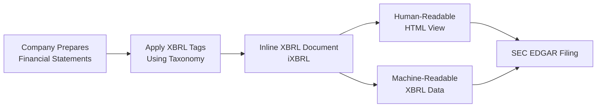
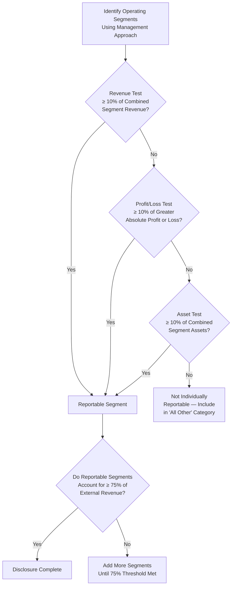

# Public Company Reporting Topics

Public companies in the United States operate under a rigorous reporting framework established by the Securities and Exchange Commission (SEC). This framework ensures that investors, analysts, and other stakeholders receive transparent, comparable, and timely financial information. CPA candidates must understand the key SEC regulations governing financial and non-financial disclosures, the role of XBRL in modern business reporting, and the segment reporting requirements under ASC 280. Together, these topics form a critical knowledge area for the BAR exam.
:::info[Blueprint Coverage]
**Area II – Technical Accounting and Reporting, Group J – Public Company Reporting Topics**

- Recall public company reporting requirements of Regulation S-X and Regulation S-K
- Recall the purpose, objective, and key characteristics of XBRL business reporting
- Recall the criteria used to identify reportable segments
- Recall the financial statement note disclosure requirements for reportable segments
  :::

---

## Regulation S-X: Financial Statement Requirements

Regulation S-X prescribes the **form and content** of financial statements filed with the SEC. It governs the accounting rules for all financial statements included in registration statements, annual reports (Form 10-K), and other filings.

### Key Provisions

| Article    | Coverage                            | Key Requirements                                                |
| ---------- | ----------------------------------- | --------------------------------------------------------------- |
| Article 1  | Definitions                         | Defines key terms used throughout Reg S-X                       |
| Article 2  | Qualifications of accountants       | Independence rules for auditors of SEC registrants              |
| Article 3  | General instructions                | Periods to be covered; comparative statements                   |
| Article 3A | Consolidated statements             | When consolidation is required                                  |
| Article 4  | Rules of general application        | Form, order, and terminology of financial statements            |
| Article 5  | Commercial and industrial companies | Line-item requirements for balance sheets and income statements |
| Article 8  | Smaller reporting companies         | Scaled disclosure accommodations                                |
| Article 11 | Pro forma financial information     | Requirements for pro forma presentations                        |
| Article 12 | Supporting schedules                | Valuation allowances, investments, and other schedules          |

### Periods Covered

Regulation S-X requires the following financial statements in an annual filing:

- **Balance Sheet** — Two most recent fiscal year-ends
- **Income Statement** — Three most recent fiscal years
- **Statement of Cash Flows** — Three most recent fiscal years
- **Statement of Stockholders' Equity** — Three most recent fiscal years
  :::tip[Exam Tip]
  Remember that Reg S-X is about the **financial statements** themselves — think "X = eXact numbers." It dictates the periods presented, specific line items, and required schedules. Reg S-K covers everything else (non-financial disclosures).
  :::

---

## Regulation S-K: Non-Financial Disclosures

Regulation S-K prescribes the **non-financial statement disclosure** requirements for SEC filings. It covers qualitative and descriptive information that gives context to the numbers.

### Major Items

| Item     | Topic                      | Description                                                                           |
| -------- | -------------------------- | ------------------------------------------------------------------------------------- |
| Item 101 | Description of Business    | Nature of business, principal products/services, competitive conditions               |
| Item 103 | Legal Proceedings          | Material pending legal proceedings                                                    |
| Item 105 | Risk Factors               | Material risks that make an investment speculative or risky                           |
| Item 201 | Market Information         | Market price of common equity, dividends                                              |
| Item 303 | MD&A                       | Management's Discussion and Analysis of Financial Condition and Results of Operations |
| Item 402 | Executive Compensation     | Compensation of named executive officers and directors                                |
| Item 404 | Related-Party Transactions | Transactions with related persons                                                     |
| Item 407 | Corporate Governance       | Board independence, audit committee financial expert                                  |

### MD&A (Item 303) Highlights

Management's Discussion and Analysis is one of the most heavily tested Reg S-K topics. MD&A requires management to discuss:

- **Liquidity** — Known trends, demands, commitments, or uncertainties affecting liquidity
- **Capital resources** — Material commitments for capital expenditures
- **Results of operations** — Revenue/expense trends and known uncertainties
- **Critical accounting estimates** — Estimates with high uncertainty and material impact
- **Off-balance-sheet arrangements** — Obligations not on the face of the financial statements
  :::warning
  Do not confuse MD&A under Reg S-K (SEC requirement for public companies) with MD&A under GASB (required supplementary information for state and local governments). They serve similar purposes but arise from entirely different authoritative frameworks.
  :::

---

## Regulation S-X vs. Regulation S-K

| Feature        | Regulation S-X                                     | Regulation S-K                                         |
| -------------- | -------------------------------------------------- | ------------------------------------------------------ |
| **Focus**      | Financial statements                               | Non-financial disclosures                              |
| **Content**    | Form, content, and periods of financial statements | Business description, risk factors, MD&A, compensation |
| **Applies to** | Financial data in SEC filings                      | Qualitative/descriptive portions of SEC filings        |
| **Mnemonic**   | "X = eXact numbers"                                | "K = Knowledge / Kontext"                              |

---

## XBRL Business Reporting

### Purpose and Objective

eXtensible Business Reporting Language (**XBRL**) is an open, XML-based standard for communicating business and financial data electronically. The SEC requires public companies to submit financial statements tagged in XBRL to improve the **accessibility, comparability, and analysis** of financial data.
Key objectives of XBRL include:

- **Standardization** — Provide a uniform format for financial data across all filers
- **Machine readability** — Enable automated extraction and analysis of financial information
- **Transparency** — Improve the quality and timeliness of information available to investors
- **Cost reduction** — Reduce manual data entry and re-keying errors

### Inline XBRL (iXBRL)

The SEC currently requires **Inline XBRL (iXBRL)**, which embeds XBRL tags directly within an HTML document. This means a single filing is both human-readable (viewable in a browser) and machine-readable (parseable by software) — eliminating the need for separate XBRL instance documents.

### XBRL Taxonomy

An XBRL **taxonomy** is a dictionary of standardized elements (tags) that represent financial concepts. The SEC uses the **US GAAP Financial Reporting Taxonomy**, which is maintained by the FASB.
| Taxonomy Component | Description |
|-------------------|-------------|
| **Elements** | Individual financial concepts (e.g., "Revenue," "Total Assets") |
| **Labels** | Human-readable names for each element |
| **References** | Links to authoritative literature (e.g., ASC references) |
| **Calculations** | Mathematical relationships between elements |
| **Presentation** | Hierarchical ordering for display |
| **Dimensions** | Axes for disaggregating data (e.g., by segment, geography) |
Companies may create **extension elements** when the standard taxonomy does not include a concept specific to their reporting. However, filers should use standard taxonomy elements whenever possible to maintain comparability.
:::tip[Exam Tip]
For the CPA exam, remember three key XBRL facts: (1) it is **XML-based**, (2) the SEC requires **Inline XBRL** so filings are both human- and machine-readable in a single document, and (3) the taxonomy is based on **US GAAP** and maintained by the FASB.
:::

---

## Segment Reporting (ASC 280)

ASC 280, _Segment Reporting_, requires public entities to disclose information about their **reportable operating segments** in annual and interim financial statements. The objective is to provide information about the different business activities and economic environments in which an entity operates.

### The Management Approach

ASC 280 uses the **management approach**, meaning segments are identified based on how the company's **chief operating decision maker (CODM)** organizes the entity internally for making operating decisions and assessing performance.

### Defining an Operating Segment

An operating segment is a component of a public entity that:

1. **Engages in business activities** from which it may earn revenues and incur expenses (including intersegment transactions)
2. **Whose operating results are regularly reviewed** by the CODM to make resource allocation decisions and assess performance
3. **For which discrete financial information is available**
   :::warning
   Not every component of an entity qualifies as an operating segment. A corporate headquarters that does not earn revenue and is not evaluated as a profit center typically does **not** meet the definition of an operating segment.
   :::

---

### Identifying Reportable Segments: Quantitative Thresholds

Once operating segments are identified, the entity must apply **three 10% quantitative threshold tests** to determine which segments are individually reportable.
An operating segment is reportable if it meets **any one** of the following tests:
| Test | Measure | Threshold |
|------|---------|-----------|
| **Revenue test** | Segment revenue (external + intersegment) | ≥ 10% of combined revenue of **all** operating segments |
| **Profit or loss test** | Absolute amount of segment profit or loss | ≥ 10% of the greater (in absolute amount) of: (a) combined profit of all profitable segments, or (b) combined loss of all loss segments |
| **Asset test** | Segment assets | ≥ 10% of combined assets of **all** operating segments |

### The 75% External Revenue Test

After applying the 10% tests, the entity must verify that reportable segments together account for at least **75% of total consolidated external revenue**. If not, additional segments must be identified as reportable until the 75% threshold is met — even if those segments do not individually pass any 10% test.

### Practical Example: Bear Co.

Bear Co. has five operating segments. Total combined segment revenue (including intersegment) is **$1,000,000**. The combined profit of all profitable segments is **$200,000**, and the combined loss of all loss segments is **$(150,000)**. Total combined segment assets are **$5,000,000**.
| Segment | Revenue | Profit (Loss) | Assets |
|---------|---------|--------------|--------|
| Segment A | $400,000 | $120,000 | $2,000,000 |
| Segment B | $250,000 | $60,000 | $1,500,000 |
| Segment C | $180,000 | $20,000 | $800,000 |
| Segment D | $120,000 | $(150,000) | $500,000 |
| Segment E | $50,000 | $(10,000) | $200,000 |
| **Total** | **$1,000,000** | **$40,000** | **$5,000,000** |
**Threshold calculations:**

- Revenue threshold: 10% × $1,000,000 = **$100,000**
- Profit/loss threshold: Greater of |$200,000| or |$(150,000)| = $200,000 → 10% = **$20,000**
- Asset threshold: 10% × $5,000,000 = **$500,000**
  | Segment | Revenue Test (≥ $100K) | Profit/Loss Test (≥ $20K) | Asset Test (≥ $500K) | Reportable? |
  |---------|:---:|:---:|:---:|:---:|
  | A | ✅ $400K | ✅ $120K | ✅ $2,000K | **Yes** |
  | B | ✅ $250K | ✅ $60K | ✅ $1,500K | **Yes** |
  | C | ✅ $180K | ✅ $20K | ✅ $800K | **Yes** |
  | D | ✅ $120K | ✅ $150K loss | ✅ $500K | **Yes** |
  | E | ❌ $50K | ❌ $10K loss | ❌ $200K | **No** |
  Segment E does not meet any 10% test and would be included in the **"All Other"** category.

---

### Aggregation Criteria

Two or more operating segments may be aggregated into a single reportable segment if they have **similar economic characteristics** and are similar in **all** of the following:

1. Nature of products and services
2. Nature of the production processes
3. Type or class of customer
4. Methods used to distribute products or provide services
5. Nature of the regulatory environment (if applicable)

### Example: Bear Co.

Bear Co. has two operating segments — East Region and West Region — that both sell commercial insurance products to mid-market businesses through independent agents, subject to the same state regulatory frameworks, and have similar profit margins. Because they share similar economic characteristics **and** meet all five similarity criteria, Bear Co. may aggregate them into a single "Commercial Insurance" reportable segment.

### Required Segment Disclosures

ASC 280 requires the following disclosures for each reportable segment:
| Disclosure Category | Required Information |
|--------------------|--------------------|
| **General information** | Factors used to identify segments; types of products and services |
| **Profit or loss** | Revenues (external and intersegment), interest revenue, interest expense, depreciation/amortization, significant non-cash items, income tax expense or benefit, and other significant items regularly provided to the CODM |
| **Assets** | Total segment assets |
| **Reconciliations** | Reconciliation of total segment revenues, profit or loss, and assets to consolidated totals |
| **Entity-wide disclosures** | (1) Products and services revenue, (2) geographic information (revenues and long-lived assets), (3) major customer information (any single customer ≥ 10% of total revenue) |

### Example: Polar Inc.

Polar Inc. operates three reportable segments: Software, Consulting, and Hardware. In its annual report, Polar Inc. must disclose:

- Revenue, profit, and assets for each of the three segments
- A reconciliation showing how segment totals tie to the consolidated income statement and balance sheet
- Entity-wide disclosure that 12% of total revenue comes from a single government customer (since it exceeds 10%, the existence and segment must be disclosed — though the customer need not be named)
  :::tip[Exam Tip]
  The **75% rule** and the **10% tests** are the most frequently tested quantitative thresholds. Also remember that the profit/loss test uses the **greater absolute value** of combined profits vs. combined losses — not net income. A common exam trap is using net profit instead of comparing the absolute values separately.
  :::

---

## Practical Limits on Segments

ASC 280 provides a practical limit: once the number of reportable segments exceeds **10**, the entity should consider whether further disaggregation is useful. This is a guideline, not a hard rule — but the FASB noted that exceeding 10 segments may make disclosures overly complex.

## Summary

| Topic                 | Key Takeaway                                                                               |
| --------------------- | ------------------------------------------------------------------------------------------ |
| **Regulation S-X**    | Governs the form, content, and periods of financial statements in SEC filings              |
| **Regulation S-K**    | Governs non-financial disclosures: business description, risk factors, MD&A, compensation  |
| **XBRL**              | XML-based standard for machine-readable financial reporting; SEC requires Inline XBRL      |
| **Operating segment** | Component reviewed by the CODM with discrete financial information and business activities |
| **10% tests**         | Revenue, profit/loss (absolute), and assets — meet **any one** to be reportable            |
| **75% test**          | Reportable segments must cover ≥ 75% of consolidated external revenue                      |
| **Aggregation**       | Requires similar economics **and** all five qualitative similarity criteria                |
| **Major customer**    | Disclose if a single customer provides ≥ 10% of total entity revenue                       |
