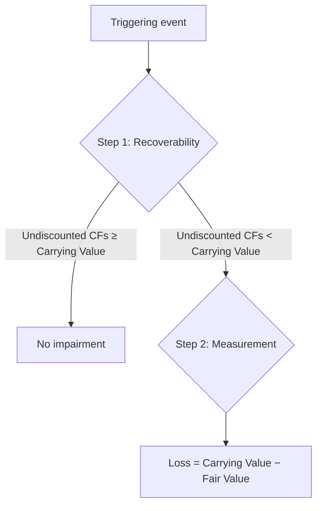
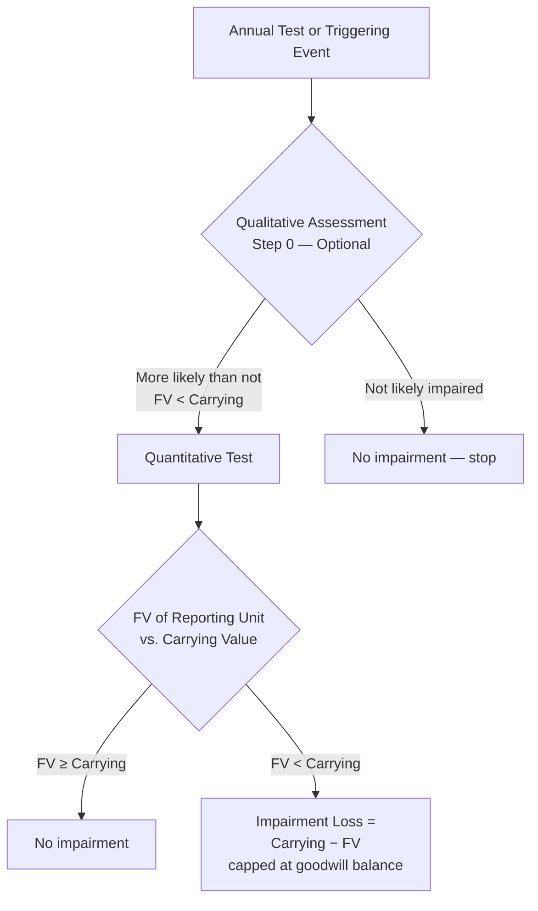

# Intangible Assets

Intangible assets are **long-lived assets without physical substance** that represent legal rights or competitive advantages. Unlike PP&E, you cannot touch an intangible — but its value to the business can be enormous. Accounting treatment depends on whether the intangible has a **finite** or **indefinite** useful life.

## Types of Intangible Assets

| Intangible                 | Description                                                                                   | Typical Life                     |
| -------------------------- | --------------------------------------------------------------------------------------------- | -------------------------------- |
| **Patent**                 | Exclusive right to manufacture, use, or sell an invention                                     | Legal: 20 years                  |
| **Copyright**              | Exclusive right to reproduce and sell artistic or literary works                              | Legal: creator's life + 70 years |
| **Trademark / Trade name** | Symbol, word, or phrase identifying a product or company                                      | Indefinite (renewable)           |
| **Goodwill**               | Excess of purchase price over fair value of net identifiable assets in a business combination | Indefinite                       |
| **Franchise**              | Right granted to operate a business under a franchisor's brand                                | Per contract term                |

:::info

The CPA exam focuses on how each type is **measured**, **amortized** (or not), and **tested for impairment**.

:::

## Purchased vs. Internally Developed Intangibles

| Source                                                          | Treatment                                                                |
| --------------------------------------------------------------- | ------------------------------------------------------------------------ |
| **Purchased** (from a third party or in a business combination) | Capitalize at cost (or fair value in a combination)                      |
| **Internally developed**                                        | Generally **expensed as incurred** — R&D, advertising, employee training |

:::warning

Under U.S. GAAP, internally generated **goodwill**, **brands**, and **customer lists** are **never** capitalized. Only purchased intangibles are recognized as assets.

:::

### Example — Bear Co. Purchases a Patent

Bear Co. acquires a patent from an independent inventor for \$120,000 and pays \$5,000 in legal fees to register the patent.

```journal
Dr. Patent                           125,000
    Cr. Cash                             125,000
```

The \$125,000 total cost is amortized over the **shorter** of the patent's remaining legal life or its expected economic life.

## Finite Life Intangibles — Amortization

Finite life intangibles are amortized on a **straight-line basis** (unless another pattern better reflects consumption of benefits) over the **shorter of**:

$$
\text{Amortization Period} = \min(\text{Economic Life},\; \text{Legal Life})
$$

### Example — Gies Co.

Gies Co. purchases a patent with 16 years remaining on its legal life. Gies estimates the technology will be useful for only 8 years.

$$
\text{Annual Amortization} = \frac{\$125{,}000}{8} = \$15{,}625
$$

```journal
Dr. Amortization expense             15,625
    Cr. Accumulated amortization — patent  15,625
```

:::tip

Unlike PP&E, intangibles typically have **no salvage value** — the entire cost is amortized.

:::

## Impairment of Finite Life Intangibles

Finite life intangibles follow the **same two-step test** as PP&E under ASC 360:



**Example — MAS Inc.**
MAS Inc. holds a patent with a carrying value of \$80,000. Due to a competitor's breakthrough, expected undiscounted future cash flows are \$60,000 and fair value is \$45,000.

- **Step 1:** \$60,000 < \$80,000 → impaired
- **Step 2:** Loss = \$80,000 − \$45,000 = **\$35,000**

```journal
Dr. Impairment loss                   35,000
    Cr. Accumulated amortization — patent  35,000
```

:::danger

Under U.S. GAAP, impairment losses on intangibles held for use are **never reversed**.

:::

## Indefinite Life Intangibles

Certain intangibles have **no foreseeable limit** on the period over which they generate cash flows:

- **Goodwill** — arises only in business combinations
- **Certain trademarks** — when the entity intends (and has the ability) to renew indefinitely
- **FCC broadcast licenses** — renewable at negligible cost
  Indefinite life intangibles are **not amortized**. Instead, they are tested for impairment **at least annually** (or when a triggering event occurs).

## Goodwill — Recognition and Impairment

### Recognition

Goodwill arises in a **business combination** when the purchase price exceeds the fair value of the net identifiable assets acquired.

$$
\text{Goodwill} = \text{Purchase Price} - \text{Fair Value of Net Identifiable Assets}
$$

**Example — Kingfisher Industries acquires BIF Partners:**
| Item | Amount |
|------|--------|
| Purchase price | \$2,000,000 |
| Fair value of identifiable assets | \$2,800,000 |
| Fair value of liabilities assumed | (\$1,200,000) |
| Fair value of net identifiable assets | \$1,600,000 |
| **Goodwill** | **\$400,000** |

```journal
Dr. Identifiable assets           2,800,000
Dr. Goodwill                        400,000
    Cr. Liabilities assumed           1,200,000
    Cr. Cash                          2,000,000
```

### Goodwill Impairment Testing (ASC 350)

Goodwill is tested at the **reporting unit** level. An entity may first perform an **optional qualitative assessment** (Step 0) to determine whether quantitative testing is necessary.



**Quantitative one-step test:**

$$
\text{Impairment Loss} = \text{Carrying Value of RU} - \text{Fair Value of RU}
$$

The loss is **capped** at the amount of goodwill allocated to the reporting unit — goodwill cannot go below zero.

### Example — Illini Entertainment

Illini Entertainment's streaming division (reporting unit) has:

- Carrying value: \$5,000,000 (including goodwill of \$800,000)
- Fair value: \$4,500,000
  $$
  \text{Impairment} = \$5{,}000{,}000 - \$4{,}500{,}000 = \$500{,}000
  $$
  Since \$500,000 < \$800,000 (goodwill balance), the full \$500,000 is recognized as a goodwill impairment loss.

```journal
Dr. Goodwill impairment loss         500,000
    Cr. Goodwill                         500,000
```

:::warning

Goodwill impairment losses are **never reversed** under U.S. GAAP.

:::

## Purchased Software

Software purchased or licensed from a third party for internal use or for sale is recognized as an **intangible asset** and amortized over the shorter of its legal or economic useful life.

### Software Developed for Sale or Lease

Under ASC 985-20, costs are accounted for in stages:
| Phase | Treatment |
|-------|-----------|
| **Before technological feasibility** | Expense as R&D |
| **After technological feasibility, before available for sale** | **Capitalize** |
| **Production and customer support** | Expense (inventory costs, maintenance) |
Amortization of capitalized software costs is the **greater of**:

1. Straight-line over economic life, or
2. Revenue-based ratio (current revenue ÷ total expected revenue)

### Example — Illini Security

Illini Security capitalizes \$300,000 in software development costs after establishing technological feasibility. The software has an estimated economic life of 3 years and is expected to generate total revenue of \$1,500,000. Year 1 revenue is \$600,000.

- Straight-line: \$300,000 ÷ 3 = **\$100,000**
- Revenue-based: (\$600,000 ÷ \$1,500,000) × \$300,000 = **\$120,000**
  Amortization = greater of the two = **\$120,000**.

```journal
Dr. Amortization expense            120,000
    Cr. Accumulated amortization — software  120,000
```

## Cloud Computing Arrangements (CCA)

Under ASU 2018-15, a customer in a **hosting arrangement** that is a service contract (i.e., the customer does **not** control the software) capitalizes certain implementation costs.
| Phase | Treatment |
|-------|-----------|
| **Preliminary project stage** | Expense |
| **Application development stage** | **Capitalize** |
| **Post-implementation stage** | Expense |
Capitalized costs are presented as a **prepaid asset** (not an intangible) and amortized over the term of the hosting arrangement.

:::note

This treatment mirrors the guidance for **internal-use software** (ASC 350-40) — the three-stage model is identical.

:::

## Franchise Accounting — Franchisee

When a franchisee pays an initial franchise fee, the cost is recognized as an **intangible asset** at the **present value** of the payments and amortized over the period of expected benefit.

### Example — Bear Co. (Franchisee)

Bear Co. acquires a franchise from a national chain. The initial fee is \$50,000, payable \$10,000 at signing and \$10,000 per year for four years. The appropriate discount rate is 8%.

$$
\text{PV of annuity} = \$10{,}000 \times \text{PV factor}_{4, 8\%} = \$10{,}000 \times 3.3121 = \$33{,}121
$$

$$
\text{Total franchise cost} = \$10{,}000 + \$33{,}121 = \$43{,}121
$$

```journal
Dr. Franchise intangible asset        43,121
Dr. Discount on note payable           6,879
    Cr. Cash                              10,000
    Cr. Note payable                      40,000
```

The franchise asset is amortized over the **franchise agreement term** (e.g., 20 years):

$$
\text{Annual amortization} = \frac{\$43{,}121}{20} = \$2{,}156
$$

```journal
Dr. Amortization expense              2,156
    Cr. Accumulated amortization — franchise  2,156
```

## Start-Up Costs

Under ASC 720, start-up costs (including organization costs) are **expensed as incurred** for financial reporting purposes.
**Example — BIF Partners incurs \$25,000 in organization costs:**

```journal
Dr. Start-up costs expense            25,000
    Cr. Cash                              25,000
```

:::tip

Start-up costs are **amortized over 15 years** for **tax** purposes — but for financial accounting (which the FAR exam tests), they are expensed immediately.

:::

## Research and Development (R&D) Costs

Under ASC 730, R&D costs are **expensed as incurred**. This includes:

- Salaries of R&D personnel
- Materials and supplies consumed in R&D
- Depreciation on R&D equipment (if no alternative future use)
- Contract R&D services
- Reasonable allocation of indirect costs

### Exceptions to Immediate Expensing

| Exception                                              | Treatment                                                                   |
| ------------------------------------------------------ | --------------------------------------------------------------------------- |
| R&D equipment with **alternative future use**          | Capitalize and depreciate                                                   |
| Software development (after technological feasibility) | Capitalize per ASC 985-20                                                   |
| R&D acquired in a **business combination**             | Capitalize at fair value; if no alternative future use, expense immediately |

**Example — MAS Inc. R&D activities:**

```journal
Dr. Research and development expense  150,000
    Cr. Cash                              90,000
    Cr. Accumulated depreciation — equip.  30,000
    Cr. Accrued liabilities               30,000
```

:::warning

**Materials, equipment, and facilities** acquired for R&D with **no alternative future use** are expensed at acquisition — they are not capitalized as assets.

:::

## Crypto Assets

A **crypto asset** (such as Bitcoin or Ethereum) represents a digital value or right recorded on a distributed ledger (blockchain). Under ASC 350-60, crypto assets are classified as **intangible assets** because they are not cash, financial instruments, or tangible property.

### Classification

Crypto assets are treated as **indefinite-lived intangible assets** when all of the following conditions are met:

1. The asset meets the definition of an intangible asset under ASC 350
2. The asset does **not** provide the holder with enforceable rights to or claims on underlying goods, services, or other assets
3. The asset is created or resides on a distributed ledger based on blockchain or similar technology
4. The asset is secured through cryptography
5. The asset is fungible
6. The asset is **not** created or issued by the reporting entity or its related parties

### Measurement

When the conditions above are met, crypto assets are measured at **fair value each reporting period**, with changes in fair value recognized in **net income**.

**Example:** Bear Co. holds 5 BTC purchased at \$30,000 each. At year-end, the fair value is \$35,000 per BTC.

$$
\text{Unrealized gain} = 5 \times (\$35{,}000 - \$30{,}000) = \$25{,}000
$$

```journal
Dec 31
Dr. Crypto assets[a] 25,000
    Cr. Unrealized gain on crypto assets 25,000
```

:::tip[Exam Tip]

Under ASC 350-60, qualifying crypto assets are marked to fair value each period — unlike traditional indefinite-lived intangibles, which are tested for impairment only when indicators exist. If the crypto asset does **not** meet all of the conditions above (e.g., it is an NFT and therefore not fungible), it follows the standard indefinite-lived intangible impairment model.

:::

---

## Summary

| Category                                    | Amortization                   | Impairment Test                            |
| ------------------------------------------- | ------------------------------ | ------------------------------------------ |
| Finite life intangible                      | Shorter of legal/economic life | Two-step (same as PP&E)                    |
| Indefinite life intangible (excl. goodwill) | None                           | Compare carrying value to FV annually      |
| Goodwill                                    | None                           | Qualitative screen → one-step quantitative |
| R&D costs                                   | N/A — expensed immediately     | N/A                                        |
| Start-up costs                              | N/A — expensed immediately     | N/A                                        |
| Capitalized software (for sale)             | Greater of SL or revenue-based | NRV floor test                             |
| Crypto assets (qualifying)                  | None — fair value through NI   | N/A (mark-to-market each period)           |

:::info

**Key takeaway:** The most important distinction is between **finite** and **indefinite** life intangibles — it determines whether you amortize and which impairment model applies. Qualifying crypto assets are a special case: they are indefinite-lived intangibles measured at fair value through net income each period.

:::
