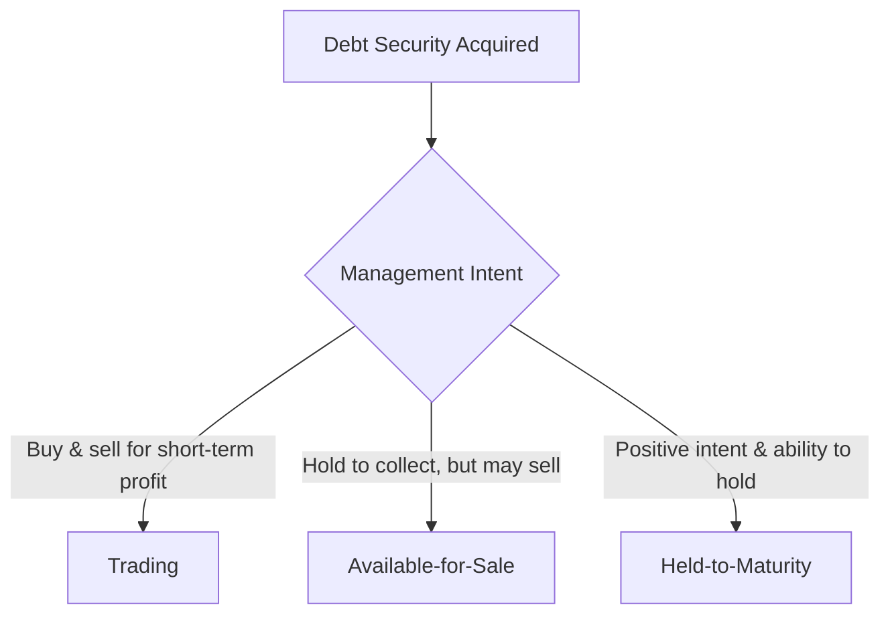

# Investments

This chapter covers the accounting for financial instruments, including **debt securities**, **equity securities**, and **equity method investments**. Classification drives measurement — understanding which category an investment falls into is essential to determining its balance-sheet value and income-statement impact.

## Financial Instruments Overview

A **financial instrument** is any contract that creates a financial asset for one entity and a financial liability (or equity instrument) for another.
| Category | Examples |
|----------|---------|
| **Financial assets** | Cash, receivables, debt securities, equity securities |
| **Financial liabilities** | Accounts payable, bonds payable, notes payable |

## Debt Securities

Debt securities are instruments representing a creditor relationship (e.g., government bonds, corporate bonds, notes receivable). Under ASC 320, debt investments are classified into **three categories** based on management's intent and ability.



### Trading Securities

- Reported at **fair value** on the balance sheet.
- **Unrealized gains and losses** are recognized in **net income** each period.
- Classified as **current assets**.
  **Example — Bear Co. purchases bonds for trading purposes:**

```journal
Dr. Investment in trading securities   50,000
    Cr. Cash                               50,000
```

**Year-end — fair value increases to \$53,000:**

```journal
Dr. Investment in trading securities    3,000
    Cr. Unrealized gain — net income        3,000
```

### Available-for-Sale (AFS) Securities

- Reported at **fair value** on the balance sheet.
- Under the **CECL model** (ASC 326), **credit losses** are recognized through an allowance charged to net income.
- **Non-credit-related** unrealized gains and losses are reported in **other comprehensive income (OCI)** — part of the "PUFI" mnemonic (**P**ension adjustments, **U**nrealized gains/losses on AFS, **F**oreign currency translation, effective cash flow hedg**I**ng).
  **Example — Gies Co. purchases AFS bonds at par (\$100,000):**

```journal
Dr. Investment in AFS securities      100,000
    Cr. Cash                              100,000
```

**Year-end — fair value drops to \$92,000; \$5,000 attributed to credit loss:**

```journal
Dr. Credit loss expense                 5,000
    Cr. Allowance for credit losses — AFS   5,000
Dr. OCI — Unrealized loss on AFS       3,000
    Cr. Investment in AFS securities        3,000
```

:::tip
The total decline is \$8,000. The credit portion (\$5,000) flows through the **income statement**; the remaining \$3,000 flows through **OCI** on the balance sheet.
:::

### Held-to-Maturity (HTM) Securities

- Reported at **amortized cost** on the balance sheet.
- Purchased at a premium or discount — the difference is amortized over the life of the security using the **effective interest method**.
- Under CECL, an **allowance for credit losses** is established if collection of all amounts due is not expected.
- Classified as **noncurrent assets** (unless maturing within one year).
  **Example — MAS Inc. purchases a \$100,000, 5-year, 6% bond at \$95,735 (effective rate 7%):**

```journal
Dr. Investment in HTM securities       95,735
    Cr. Cash                               95,735
```

**First interest receipt and discount amortization:**

$$
\text{Interest revenue} = \$95{,}735 \times 7\% = \$6{,}701
$$

$$
\text{Discount amortization} = \$6{,}701 - (\$100{,}000 \times 6\%) = \$701
$$

```journal
Dr. Cash                               6,000
Dr. Investment in HTM securities          701
    Cr. Interest revenue                    6,701
```

### Debt Securities Summary

| Feature                 | Trading    | AFS                                   | HTM                               |
| ----------------------- | ---------- | ------------------------------------- | --------------------------------- |
| Balance sheet           | Fair value | Fair value                            | Amortized cost                    |
| Unrealized gains/losses | Net income | OCI (non-credit); Net income (credit) | N/A (allowance for credit losses) |
| Classification          | Current    | Current or noncurrent                 | Noncurrent (unless < 1 yr)        |

:::warning
Reclassification **out of** HTM is rare and may "taint" the entire HTM portfolio — the CPA exam tests whether specific scenarios justify reclassification.
:::

## Equity Securities

Under ASC 321, equity securities (stocks) that do **not** give the investor significant influence or control are generally measured at **fair value through net income (FVTNI)**.

### Fair Value Through Net Income (Default)

```journal
Dr. Investment in equity securities   30,000
    Cr. Cash                              30,000
```

**Year-end — fair value rises to \$34,000:**

```journal
Dr. Investment in equity securities    4,000
    Cr. Unrealized gain — net income       4,000
```

### Practicability Exception

For equity securities **without readily determinable fair values**, an entity may elect to measure at:

$$
\text{Cost} \pm \text{Observable Price Changes} - \text{Impairment}
$$

:::info
This election is made **per investment** and applies when fair value is not readily determinable (e.g., private company stock).
:::

### Realized Gains and Losses

When equity securities are sold, the gain or loss equals the difference between the selling price and the carrying amount (which already reflects prior fair-value adjustments).
**BIF Partners sells equity securities (carrying value \$34,000) for \$37,000:**

```journal
Dr. Cash                              37,000
    Cr. Investment in equity securities    34,000
    Cr. Gain on sale of investments         3,000
```

## Equity Method Investments (20–50% Ownership)

When an investor holds **20–50%** of the voting stock of an investee, a **rebuttable presumption** of **significant influence** exists. The investor applies the **equity method** under ASC 323.

### Core Mechanics


1. **Initial investment** recorded at cost.
2. **Pick up** the investor's proportional share of the investee's **net income** (or loss).
3. **Reduce** the investment for **dividends received** (return of investment, not income).

### Basic Journal Entries — Kingfisher Industries

Kingfisher Industries acquires 30% of Illini Security for \$600,000. During the year, Illini Security reports net income of \$200,000 and pays dividends of \$50,000.
**Acquisition:**

```journal
Dr. Investment in Illini Security     600,000
    Cr. Cash                              600,000
```

**Share of net income (30% × \$200,000):**

```journal
Dr. Investment in Illini Security      60,000
    Cr. Equity in earnings of investee     60,000
```

**Dividends received (30% × \$50,000):**

```journal
Dr. Cash                              15,000
    Cr. Investment in Illini Security      15,000
```

**Ending carrying value:**

$$
\$600{,}000 + \$60{,}000 - \$15{,}000 = \$645{,}000
$$

### Excess of Cost Over Book Value

When the purchase price exceeds the investor's share of the investee's **book value**, the excess is allocated:

1. **To identifiable assets** — based on the difference between fair market value (FMV) and book value of the investee's assets.
2. **Remaining excess → Goodwill.**
   | Item | Treatment |
   |------|-----------|
   | Fixed assets (FMV > BV) | Amortize excess depreciation over remaining useful life |
   | Land (FMV > BV) | **Not amortized** (indefinite life) |
   | Goodwill | **Not amortized**; tested for impairment |
   **Example — Excess allocation:**
   Kingfisher pays \$600,000 for 30% of Illini Security. Illini's book value is \$1,500,000 (investor's share: \$450,000). Illini's building has a FMV \$200,000 above book value (remaining life: 10 years).
   | Component | Amount |
   |-----------|--------|
   | Cost | \$600,000 |
   | Share of book value (30% × \$1,500,000) | (\$450,000) |
   | **Total excess** | **\$150,000** |
   | Allocated to building (30% × \$200,000) | (\$60,000) |
   | **Goodwill** | **\$90,000** |
   **Annual excess depreciation adjustment (building: \$60,000 ÷ 10 years):**

```journal
Dr. Equity in earnings of investee     6,000
    Cr. Investment in Illini Security      6,000
```

:::tip
This adjustment **reduces** the investor's equity earnings each year — it represents additional depreciation the investee's books do not reflect.
:::

## Fair Value vs. Equity Method Comparison

| Feature            | Fair Value (FVTNI)           | Equity Method                  |
| ------------------ | ---------------------------- | ------------------------------ |
| Ownership level    | < 20% (typically)            | 20–50%                         |
| Balance sheet      | Fair value                   | Cost ± earnings ± dividends    |
| Income recognition | Unrealized G/L in net income | Share of investee's net income |
| Dividends          | Dividend income              | Reduce carrying value          |
| Goodwill           | Not applicable               | May arise on purchase          |

## Transition to the Equity Method

When an investor's ownership **increases** to the 20–50% range (e.g., through additional share purchases), the equity method is applied **prospectively** from the date significant influence is achieved.
If the investment was previously classified as **AFS**, any **unrealized holding gains or losses** accumulated in OCI are recognized in income at the date of transition.
**Example — Bear Co. increases its stake from 15% to 25%:**

```journal
Dr. Investment in investee (new shares)   200,000
    Cr. Cash                                  200,000
Dr. AOCI — Unrealized gain on AFS          12,000
    Cr. Gain on reclassification of investment  12,000
```

:::note
From this point forward, Bear Co. records its share of the investee's earnings and reduces the investment for dividends — **fair value adjustments cease**.
:::

## Disclosure Requirements

Under U.S. GAAP, entities must disclose:

- **Concentrations of credit risk** — including the nature and maximum exposure
- **Methods and assumptions** used to estimate fair values
- **Significant terms** of financial instruments (maturity, interest rates, collateral)
- **Unrealized gains and losses** on AFS securities in the notes or financial statements
  :::warning
  Concentrations of credit risk must be disclosed regardless of whether a loss has occurred — the potential for loss is sufficient to trigger the requirement.
  :::

## Summary

| Investment Type        | Measurement                 | Income Effect                                     |
| ---------------------- | --------------------------- | ------------------------------------------------- |
| Trading debt           | Fair value                  | Unrealized G/L → Net income                       |
| AFS debt               | Fair value                  | Credit losses → Net income; Other → OCI           |
| HTM debt               | Amortized cost              | Interest revenue; Credit loss allowance           |
| Equity (default)       | FVTNI                       | Unrealized G/L → Net income                       |
| Equity (no fair value) | Cost ± observable changes   | Adjust for observable transactions and impairment |
| Equity method (20–50%) | Cost ± earnings − dividends | Share of investee net income                      |
