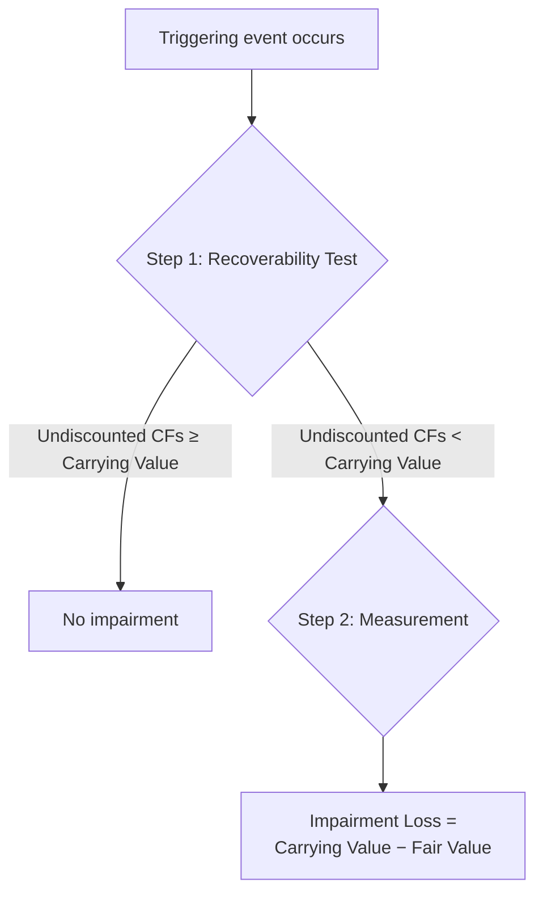

# Property, Plant, and Equipment (PP&E)

Property, plant, and equipment are **tangible, long-lived assets** used in operations that are subject to depreciation (except land). Under U.S. GAAP, PP&E is carried at **historical cost** less accumulated depreciation and any impairment losses.

## Characteristics of PP&E

An asset qualifies as PP&E when it meets **all four** criteria:

1. **Used in operations** — not held for investment or resale
2. **Has physical substance** — distinguishes PP&E from intangible assets
3. **Long-term** — useful life exceeds one year or one operating cycle
4. **Subject to depreciation** — except land, which has an unlimited useful life

## Initial Measurement — Historical Cost

PP&E is recorded at the **total cost to acquire and prepare the asset for its intended use**:
| Cost Component | Examples |
|----------------|----------|
| Purchase price | Invoice amount less trade discounts |
| Directly attributable costs | Freight, installation, testing, legal fees |
| Site preparation | Grading, draining, clearing |
| Asset retirement obligations | PV of future restoration costs (debit asset, credit liability) |

:::info

Interest costs incurred during construction of qualifying assets are **capitalized** — see the Constructed Assets section below.

:::

## Donated Fixed Assets

When a company **receives** a donated asset, the asset is recorded at **fair value** on the date of donation, with a corresponding credit to **revenue** (contribution revenue).
**Example — Bear Co. receives a building from a local government:**

```journal
Dr. Building                      500,000
    Cr. Contribution revenue          500,000
```

:::note

Under ASC 958, not-for-profit entities may record the credit as a contribution — the principle is the same: fair value at date of receipt.

:::

## Land

Land is recorded at **all costs to acquire and prepare it for its intended use**:

- Purchase price
- Closing costs (title search, legal fees, recording fees)
- Existing liens or back taxes assumed
- Grading, clearing, draining, landscaping (permanent improvements)
- Demolition of old structures (net of salvage proceeds)

  :::warning
  Land is **never depreciated** because it has an unlimited useful life.
  :::

### Land Improvements

**Land improvements** — parking lots, fences, lighting, irrigation systems — **are** depreciated because they have finite useful lives.

```journal
Dr. Land improvements             80,000
    Cr. Cash                          80,000
```

## Basket (Lump-Sum) Purchase

When multiple assets are acquired in a single transaction, the total cost is **allocated based on relative fair values**.

### Example — Gies Co.

Gies Co. pays \$900,000 for land, a building, and equipment. Independent appraisals:
| Asset | Appraised Value | Proportion | Allocated Cost |
|-------|----------------|------------|----------------|
| Land | \$400,000 | 40% | \$360,000 |
| Building | \$500,000 | 50% | \$450,000 |
| Equipment | \$100,000 | 10% | \$90,000 |
| **Total** | **\$1,000,000** | **100%** | **\$900,000** |

```journal
Dr. Land                         360,000
Dr. Building                     450,000
Dr. Equipment                     90,000
    Cr. Cash                         900,000
```

## Equipment — Repairs and Maintenance

| Type                                     | Accounting Treatment                                         | Effect                                   |
| ---------------------------------------- | ------------------------------------------------------------ | ---------------------------------------- |
| **Ordinary repairs**                     | Expense as incurred                                          | Maintains the asset in normal condition  |
| **Extraordinary repairs / Improvements** | Capitalize (add to asset or reduce accumulated depreciation) | Extends useful life or increases utility |

**Ordinary repair — MAS Inc.:**

```journal
Dr. Repairs and maintenance expense   2,500
    Cr. Cash                              2,500
```

**Extraordinary repair extending useful life — MAS Inc.:**

```journal
Dr. Equipment                         15,000
    Cr. Cash                              15,000
```

## Constructed Assets — Capitalized Interest

When a company constructs an asset for its **own use**, interest costs on borrowings are capitalized during the construction period.

### Steps to Compute Capitalized Interest

1. **Compute weighted-average accumulated expenditures (WAAE)** — weight each expenditure by the fraction of the year it was outstanding.
2. **Multiply WAAE by the interest rate:**
   - First, apply the rate on any **specific** construction borrowing.
   - If WAAE exceeds the specific borrowing, apply the **weighted-average rate** of other outstanding debt to the excess.
3. **Cap:** Capitalized interest can **never exceed** actual interest incurred during the period.

### Example — BIF Partners

BIF Partners begins constructing a warehouse on January 1. Expenditures during the year:
| Date | Amount | Months Outstanding | Weight | Weighted Amount |
|------|--------|-------------------|--------|-----------------|
| Jan 1 | \$200,000 | 12/12 | 1.00 | \$200,000 |
| Jul 1 | \$300,000 | 6/12 | 0.50 | \$150,000 |
| Oct 1 | \$100,000 | 3/12 | 0.25 | \$25,000 |
| **WAAE** | | | | **\$375,000** |
BIF has a 10% construction loan of \$250,000 and other debt at a weighted-average rate of 8%.

$$
\text{Capitalized interest} = (\$250{,}000 \times 10\%) + (\$125{,}000 \times 8\%) = \$25{,}000 + \$10{,}000 = \$35{,}000
$$

```journal
Dr. Building under construction    35,000
    Cr. Interest payable               35,000
```

:::tip

The remaining interest incurred on other debt is **expensed** — only the portion tied to WAAE is capitalized.

:::

## Depreciation Methods

Depreciation **systematically allocates** the depreciable base of a tangible asset over its useful life.

$$
\text{Depreciable Base} = \text{Cost} - \text{Salvage Value}
$$

### Straight-Line (SL)

$$
\text{Annual Depreciation} = \frac{\text{Cost} - \text{Salvage Value}}{\text{Useful Life}}
$$

### Sum-of-the-Years'-Digits (SYD)

$$
\text{SYD Denominator} = \frac{n(n+1)}{2}
$$

Year $k$ depreciation:

$$
\text{Depreciation}_k = \frac{n - k + 1}{\text{SYD}} \times (\text{Cost} - \text{Salvage Value})
$$

### Declining Balance (DB)

$$
\text{DB Rate} = \frac{1}{\text{Useful Life}} \times \text{Multiplier}
$$

Common multiplier: 2× for **double-declining balance (DDB)**. Apply the rate to the **book value** (not depreciable base). Do **not** subtract salvage value when computing annual depreciation, but never depreciate below salvage value.

### Units of Production

$$
\text{Depreciation} = \frac{\text{Cost} - \text{Salvage Value}}{\text{Total Estimated Units}} \times \text{Units Produced}
$$

### Depreciation Example — Kingfisher Industries

Kingfisher Industries purchases equipment for \$100,000 with a \$10,000 salvage value and a 5-year useful life.
| Year | Straight-Line | SYD | DDB |
|------|--------------|-----|-----|
| 1 | \$18,000 | \$30,000 | \$40,000 |
| 2 | \$18,000 | \$24,000 | \$24,000 |
| 3 | \$18,000 | \$18,000 | \$14,400 |
| 4 | \$18,000 | \$12,000 | \$1,600 |
| 5 | \$18,000 | \$6,000 | \$0 |
| **Total** | **\$90,000** | **\$90,000** | **\$80,000** |

:::note

Under DDB, Year 4 is limited to \$1,600 so the book value doesn't fall below the \$10,000 salvage value. Year 5 has zero depreciation.

:::

## Component vs. Composite / Group Depreciation

### Component Depreciation

Each **significant component** of an asset is depreciated separately (common under IFRS, permitted under GAAP).

### Composite / Group Depreciation

Multiple assets are depreciated using a single **composite rate**:

$$
\text{Composite Rate} = \frac{\text{Total Annual Depreciation}}{\text{Total Cost}}
$$

$$
\text{Composite Life} = \frac{\text{Total Depreciable Base}}{\text{Total Annual Depreciation}}
$$

:::warning

Under composite depreciation, **no gain or loss** is recognized on the disposal of individual assets. The difference between proceeds and cost is debited or credited to accumulated depreciation.

:::

## Disposals

### Sale of an Asset

**Illini Security sells equipment (cost \$50,000, accumulated depreciation \$35,000) for \$20,000:**

```journal
Dr. Cash                          20,000
Dr. Accumulated depreciation      35,000
    Cr. Equipment                     50,000
    Cr. Gain on sale of equipment      5,000
```

### Write-Off (Fully Depreciated, No Proceeds)

```journal
Dr. Accumulated depreciation      50,000
    Cr. Equipment                     50,000
```

### Involuntary Conversion

If an asset is destroyed and insurance proceeds exceed book value, a **gain** is recognized.

```journal
Dr. Cash (insurance proceeds)     60,000
Dr. Accumulated depreciation      35,000
    Cr. Equipment                     50,000
    Cr. Gain on involuntary conversion 45,000
```

## Depletion — Wasting Assets

Natural resources (oil, gas, minerals, timber) are subject to **depletion** using the units-of-production method:

$$
\text{Depletion per Unit} = \frac{\text{Cost} + \text{Development Costs} + \text{Restoration Costs} - \text{Residual Value}}{\text{Total Estimated Units}}
$$

**Example — Bear Co. mining operation:**
Bear Co. pays \$5,000,000 for mineral rights, incurs \$500,000 in development costs, and estimates restoration costs of \$300,000 (PV). Estimated recoverable units: 2,000,000 tons. During Year 1, Bear Co. extracts 250,000 tons.

$$
\text{Depletion per ton} = \frac{\$5{,}000{,}000 + \$500{,}000 + \$300{,}000}{2{,}000{,}000} = \$2.90
$$

$$
\text{Year 1 Depletion} = 250{,}000 \times \$2.90 = \$725{,}000
$$

```journal
Dr. Depletion expense            725,000
    Cr. Accumulated depletion        725,000
```

## Impairment of Long-Lived Assets

Under ASC 360, long-lived assets are tested for impairment whenever events or circumstances indicate that the carrying amount may not be recoverable.

### Assets Held for Use — Two-Step Test



**Step 1 — Recoverability Test:** Compare the asset's carrying value to the sum of its **undiscounted** expected future cash flows.
**Step 2 — Measurement:** If impaired, write the asset down to **fair value**. The loss equals carrying value minus fair value.

### Example — Illini Entertainment

Illini Entertainment owns a theme park ride with a carrying value of \$800,000. Due to declining attendance, the company estimates undiscounted future cash flows of \$600,000 and a fair value of \$500,000.

- **Step 1:** \$600,000 < \$800,000 → asset is impaired.
- **Step 2:** Loss = \$800,000 − \$500,000 = **\$300,000**

```journal
Dr. Impairment loss              300,000
    Cr. Accumulated depreciation     300,000
```

:::danger

For assets **held for use**, impairment losses are **never reversed** under U.S. GAAP — even if fair value later increases.

:::

### Assets Held for Disposal

Assets reclassified as **held for sale** are measured at the **lower of carrying value or fair value less costs to sell**. Key differences from held-for-use:
| Feature | Held for Use | Held for Disposal |
|---------|-------------|-------------------|
| Depreciation | Continues | **Ceases** |
| Measurement | Fair value | Fair value **less costs to sell** |
| Subsequent recovery | Not permitted | **Permitted** (up to cumulative loss recognized) |

:::info

**Held for disposal** assets can have impairment losses **reversed** if fair value recovers — but only up to the original carrying amount at the date of reclassification.

:::

## Summary

| Topic                          | Key Rule                                        |
| ------------------------------ | ----------------------------------------------- |
| Initial measurement            | Historical cost (all costs to ready for use)    |
| Land                           | Never depreciated                               |
| Basket purchase                | Allocate by relative fair value                 |
| Capitalized interest           | WAAE × interest rate; capped at actual interest |
| Ordinary repairs               | Expense                                         |
| Extraordinary repairs          | Capitalize                                      |
| Impairment (held for use)      | Two-step test; no reversal                      |
| Impairment (held for disposal) | FV less costs to sell; reversal allowed         |
| Depletion                      | Units-of-production method                      |
