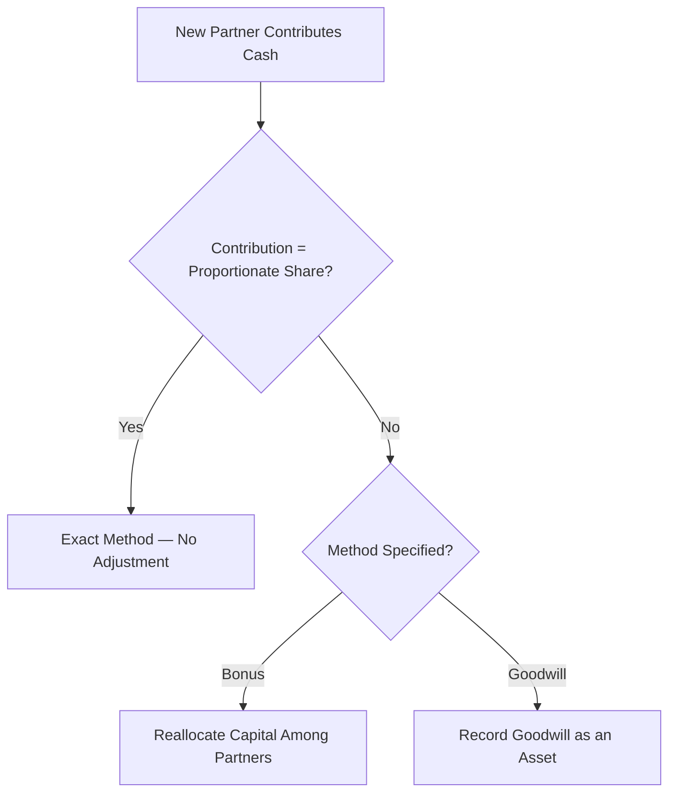
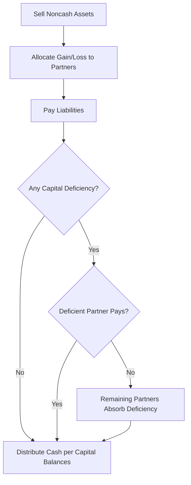

# Partnership Accounting

## Overview

A **partnership** is an association of two or more persons who carry on a business as co-owners for profit. Unlike corporations, partnerships are **not separate taxable entities** — income and losses pass through to the individual partners, who report them on their personal tax returns. The partnership itself files an informational return (Form 1065) but pays no federal income tax.

Each partner has a **capital account** that tracks their ownership interest in the partnership's net assets. The capital account increases with contributions and allocated income, and decreases with withdrawals (drawings) and allocated losses.

$$\text{Ending Capital} = \text{Beginning Capital} + \text{Contributions} + \text{Share of Income} - \text{Drawings} - \text{Share of Losses}$$

| Feature | Partnership | Corporation |
|---|---|---|
| **Taxation** | Pass-through (no entity-level tax) | Taxed at entity level (C-corp) or pass-through (S-corp) |
| **Ownership tracking** | Capital accounts | Stockholders' equity (stock + APIC + retained earnings) |
| **Life** | Limited (dissolves on withdrawal/death) | Perpetual |
| **Liability** | General partners have unlimited liability | Shareholders have limited liability |

:::tip[Exam Tip]

The CPA exam frequently tests the **bonus** and **goodwill** methods for admitting or withdrawing a partner. Know how to compute the required journal entries for each method.

:::

---

## Formation of a Partnership

When a partnership is formed, each partner's contribution is recorded at **fair value**. If a partner contributes assets subject to a liability assumed by the partnership, the partner's capital account is credited for the net amount (fair value of assets minus the liability assumed).

**Example:** Bear and Gies form BIF Partners. Bear contributes cash of \$80,000. Gies contributes equipment with a fair value of \$120,000 and a remaining mortgage of \$20,000, which the partnership assumes.

```journal
Dr. Cash[a] 80,000
    Cr. Bear, Capital[e] 80,000
```

```journal
Dr. Equipment[a] 120,000
    Cr. Mortgage Payable[l] 20,000
    Cr. Gies, Capital[e] 100,000
```

After formation, the total partnership capital is \$180,000 (Bear \$80,000 + Gies \$100,000).

---

## Admission of a Partner

A new partner may be admitted by (1) purchasing an interest directly from an existing partner, or (2) contributing assets to the partnership. When a new partner invests assets into the partnership, three outcomes are possible depending on the relationship between the amount contributed and the implied ownership share.

### Exact Method

The new partner contributes an amount **exactly equal** to their proportionate share of the partnership's net assets after the contribution. No bonus or goodwill is recorded.

**Example:** BIF Partners has total capital of \$200,000 (Bear \$100,000, Gies \$100,000). Kingfisher contributes \$100,000 for a one-third interest.

$$\text{Total capital after admission} = \$200{,}000 + \$100{,}000 = \$300{,}000$$

$$\text{Kingfisher's one-third interest} = \$300{,}000 \times \tfrac{1}{3} = \$100{,}000$$

Because the contribution equals the proportionate share, no adjustment is needed:

```journal
Dr. Cash[a] 100,000
    Cr. Kingfisher, Capital[e] 100,000
```

### Bonus Method

When the new partner's contribution **differs** from their proportionate share of the post-admission net assets, the difference is treated as a **bonus** — an adjustment among partners' capital accounts. No new asset (such as goodwill) is created.

#### Bonus to Existing Partners

If the new partner contributes **more** than the book value of their ownership share, the excess is a bonus allocated to the existing partners in their profit-and-loss ratio.

**Example:** BIF Partners has total capital of \$200,000 (Bear \$120,000, Gies \$80,000; they share profits equally). MAS contributes \$160,000 for a 25% interest.

$$\text{Total capital after admission} = \$200{,}000 + \$160{,}000 = \$360{,}000$$

$$\text{MAS's 25\% share} = \$360{,}000 \times 0.25 = \$90{,}000$$

$$\text{Bonus to existing partners} = \$160{,}000 - \$90{,}000 = \$70{,}000$$

The \$70,000 bonus is split equally between Bear and Gies (\$35,000 each):

```journal
Dr. Cash[a] 160,000
    Cr. MAS, Capital[e] 90,000
    Cr. Bear, Capital[e] 35,000
    Cr. Gies, Capital[e] 35,000
```

#### Bonus to New Partner

If the new partner contributes **less** than their proportionate share, the existing partners give up part of their capital as a bonus to the incoming partner.

**Example:** BIF Partners has total capital of \$200,000 (Bear \$120,000, Gies \$80,000; profits shared equally). Illini Entertainment contributes \$40,000 for a 25% interest.

$$\text{Total capital after admission} = \$200{,}000 + \$40{,}000 = \$240{,}000$$

$$\text{Illini Entertainment's 25\% share} = \$240{,}000 \times 0.25 = \$60{,}000$$

$$\text{Bonus from existing partners} = \$60{,}000 - \$40{,}000 = \$20{,}000$$

The \$20,000 is deducted from Bear and Gies equally (\$10,000 each):

```journal
Dr. Cash[a] 40,000
Dr. Bear, Capital[e] 10,000
Dr. Gies, Capital[e] 10,000
    Cr. Illini Entertainment, Capital[e] 60,000
```

### Goodwill Method

Under the goodwill method, the difference between the contribution and the proportionate share is recorded as **goodwill** — an intangible asset on the partnership's balance sheet. This method creates a new asset rather than reallocating existing capital.

#### Goodwill to Existing Partners

If the new partner pays more than the book value of their ownership share, the excess implies that the existing partnership is worth more than its recorded net assets. Goodwill is attributed to the **existing partners**.

**Example:** BIF Partners has total capital of \$200,000 (Bear \$120,000, Gies \$80,000; profits shared equally). Kingfisher contributes \$150,000 for a 25% interest.

If Kingfisher's \$150,000 buys 25%, the implied total value of the partnership is:

$$\text{Implied Total Value} = \frac{\$150{,}000}{0.25} = \$600{,}000$$

$$\text{Goodwill to existing partners} = \$600{,}000 - \$200{,}000 - \$150{,}000 = \$250{,}000$$

The goodwill is allocated to Bear and Gies equally (\$125,000 each):

```journal
Dr. Goodwill[a] 250,000
    Cr. Bear, Capital[e] 125,000
    Cr. Gies, Capital[e] 125,000
```

```journal
Dr. Cash[a] 150,000
    Cr. Kingfisher, Capital[e] 150,000
```

After these entries: Bear \$245,000 + Gies \$205,000 + Kingfisher \$150,000 = \$600,000. Kingfisher's share is \$150,000 / \$600,000 = 25%. ✓

#### Goodwill to New Partner

If the new partner contributes **less** than their proportionate share of existing net assets, goodwill may be attributed to the **new partner** (reflecting expertise, reputation, or a client base they bring).

**Example:** BIF Partners has total capital of \$300,000 (Bear \$180,000, Gies \$120,000). Illini Security contributes \$60,000 for a 25% interest.

$$\text{Illini Security's 25\% share} = (\$300{,}000 + \$60{,}000) \times 0.25 = \$90{,}000$$

$$\text{Goodwill to new partner} = \$90{,}000 - \$60{,}000 = \$30{,}000$$

```journal
Dr. Cash[a] 60,000
Dr. Goodwill[a] 30,000
    Cr. Illini Security, Capital[e] 90,000
```

:::info[Bonus vs. Goodwill — How to Choose]

The exam problem will specify which method to use, or the partnership agreement will dictate it. The **bonus method** is more conservative because total partnership assets equal the sum of tangible assets contributed. The **goodwill method** increases total assets by recording an intangible.

:::

### Admission Methods — Summary



---

## Profit and Loss Distribution

Partners share profits and losses according to their **partnership agreement**. The agreement may allocate income using any combination of:

- **Salary allowances** — fixed amounts to compensate partners for services
- **Interest on capital balances** — a return on invested capital
- **Residual ratio** — the remaining profit (or loss) split by an agreed ratio

:::tip[Exam Tip]

If the partnership agreement is **silent** on how to divide profits and losses, partners share **equally** — regardless of capital balances, time devoted to the business, or any other factor.

:::

### Example — Multi-Step Allocation

Bear, Gies, and Kingfisher are partners in Illini Community Foundation with the following agreement:

| Item | Bear | Gies | Kingfisher |
|---|---|---|---|
| Salary allowance | \$40,000 | \$30,000 | \$20,000 |
| Interest on beginning capital (10%) | 10% of \$200,000 | 10% of \$150,000 | 10% of \$100,000 |
| Residual ratio | 40% | 35% | 25% |

Net income for the year is **\$170,000**. Beginning capital balances are Bear \$200,000, Gies \$150,000, Kingfisher \$100,000.

| Step | Bear | Gies | Kingfisher | Total |
|---|---|---|---|---|
| Salary allowances | \$40,000 | \$30,000 | \$20,000 | \$90,000 |
| Interest (10% of capital) | \$20,000 | \$15,000 | \$10,000 | \$45,000 |
| Subtotal allocated | \$60,000 | \$45,000 | \$30,000 | \$135,000 |
| Remainder (\$170,000 − \$135,000 = \$35,000) | \$14,000 | \$12,250 | \$8,750 | \$35,000 |
| **Total share of income** | **\$74,000** | **\$57,250** | **\$38,750** | **\$170,000** |

```journal
Dec 31
Dr. Income Summary 170,000
    Cr. Bear, Capital[e] 74,000
    Cr. Gies, Capital[e] 57,250
    Cr. Kingfisher, Capital[e] 38,750
```

:::note

Salary and interest allowances are **not expenses** of the partnership — they are simply steps in the allocation of profit. They are allocated in full even if net income is less than the total allowances. If that happens, the residual ratio portion will be a **negative** amount distributed to each partner.

:::

---

## Withdrawal of a Partner

When a partner withdraws, the partnership pays the departing partner from partnership assets. If the payment differs from the partner's capital balance, the difference is handled using either the **bonus method** or the **goodwill method**.

### Bonus Method — Withdrawal

**Example:** MAS Inc. withdraws from a three-partner firm. Capital balances are Bear \$100,000, Gies \$80,000, MAS \$70,000. The partnership pays MAS \$85,000. Bear and Gies share profits equally.

MAS receives \$15,000 more than their capital balance. This bonus comes from the remaining partners:

```journal
Dr. MAS, Capital[e] 70,000
Dr. Bear, Capital[e] 7,500
Dr. Gies, Capital[e] 7,500
    Cr. Cash[a] 85,000
```

If instead MAS accepted only \$60,000, the remaining partners receive a bonus:

```journal
Dr. MAS, Capital[e] 70,000
    Cr. Cash[a] 60,000
    Cr. Bear, Capital[e] 5,000
    Cr. Gies, Capital[e] 5,000
```

### Goodwill Method — Withdrawal

**Example:** Same facts — MAS withdraws and receives \$85,000; their capital balance is \$70,000. Under the goodwill method, the \$15,000 excess implies the partnership has unrecorded goodwill.

If MAS holds a one-third interest, the implied total goodwill is:

$$\text{Implied Goodwill} = \frac{\$15{,}000}{1/3} = \$45{,}000$$

```journal
Dr. Goodwill[a] 45,000
    Cr. Bear, Capital[e] 15,000
    Cr. Gies, Capital[e] 15,000
    Cr. MAS, Capital[e] 15,000
```

Now MAS's capital is \$85,000. Pay the withdrawing partner:

```journal
Dr. MAS, Capital[e] 85,000
    Cr. Cash[a] 85,000
```

---

## Liquidation of a Partnership

Liquidation is the process of **winding down** the partnership — selling assets, paying liabilities, and distributing the remaining cash to partners. The steps are:

1. **Sell noncash assets** (called "realization") and recognize gains or losses.
2. **Allocate gains or losses** on realization to partners per the profit-and-loss ratio.
3. **Pay partnership liabilities** to outside creditors.
4. **Distribute remaining cash** to partners based on their **capital account balances** (not the profit-and-loss ratio).

:::tip[Exam Tip]

Cash is distributed to partners based on **capital balances**, not the profit-and-loss ratio. This is one of the most commonly tested distinctions in partnership liquidation.

:::

### Simple Liquidation Example

Bear, Gies, and Kingfisher decide to liquidate BIF Partners. They share profits and losses 50:30:20. Pre-liquidation balances:

| Account | Amount |
|---|---|
| Cash | \$30,000 |
| Noncash Assets | \$270,000 |
| Liabilities | \$60,000 |
| Bear, Capital | \$120,000 |
| Gies, Capital | \$72,000 |
| Kingfisher, Capital | \$48,000 |

The noncash assets are sold for \$180,000, resulting in a loss of \$90,000.

**Step 1 — Record the sale and allocate the loss:**

```journal
Dr. Cash[a] 180,000
Dr. Bear, Capital[e] 45,000
Dr. Gies, Capital[e] 27,000
Dr. Kingfisher, Capital[e] 18,000
    Cr. Noncash Assets[a] 270,000
```

**Step 2 — Pay liabilities:**

```journal
Dr. Liabilities[l] 60,000
    Cr. Cash[a] 60,000
```

**Step 3 — Distribute remaining cash to partners:**

$$\text{Remaining cash} = \$30{,}000 + \$180{,}000 - \$60{,}000 = \$150{,}000$$

| Partner | Original Capital | Loss Allocation | Ending Capital |
|---|---|---|---|
| Bear | \$120,000 | (\$45,000) | \$75,000 |
| Gies | \$72,000 | (\$27,000) | \$45,000 |
| Kingfisher | \$48,000 | (\$18,000) | \$30,000 |
| **Total** | **\$240,000** | **(\$90,000)** | **\$150,000** |

```journal
Dr. Bear, Capital[e] 75,000
Dr. Gies, Capital[e] 45,000
Dr. Kingfisher, Capital[e] 30,000
    Cr. Cash[a] 150,000
```

### Capital Deficiency

A **capital deficiency** occurs when a partner's capital account has a **debit balance** after allocating realization losses. That partner owes the deficiency to the partnership.

**Example:** Same facts, but noncash assets sell for only \$60,000 — a loss of \$210,000.

| Partner | Original Capital | Loss (50:30:20) | Ending Capital |
|---|---|---|---|
| Bear | \$120,000 | (\$105,000) | \$15,000 |
| Gies | \$72,000 | (\$63,000) | \$9,000 |
| Kingfisher | \$48,000 | (\$42,000) | **(\$6,000)** |

Kingfisher has a \$6,000 **deficiency**. Two outcomes are possible:

#### Scenario A — Deficient Partner Pays

Kingfisher contributes \$6,000 to eliminate the deficiency:

```journal
Dr. Cash[a] 6,000
    Cr. Kingfisher, Capital[e] 6,000
```

All capital balances are now positive (Bear \$15,000, Gies \$9,000, Kingfisher \$0). Total cash available is \$36,000 (\$30,000 + \$60,000 − \$60,000 + \$6,000). Distribute to Bear and Gies:

```journal
Dr. Bear, Capital[e] 15,000
Dr. Gies, Capital[e] 9,000
    Cr. Cash[a] 24,000
```

The remaining \$12,000 of cash was used to pay liabilities earlier. Total cash distributed to partners: \$24,000. ✓

#### Scenario B — Deficient Partner Cannot Pay

If Kingfisher **cannot pay** the deficiency, Bear and Gies absorb it in their **relative profit-and-loss ratio** (50:30, which simplifies to 5:3):

- Bear absorbs: \$6,000 × 5/8 = \$3,750
- Gies absorbs: \$6,000 × 3/8 = \$2,250

```journal
Dr. Bear, Capital[e] 3,750
Dr. Gies, Capital[e] 2,250
    Cr. Kingfisher, Capital[e] 6,000
```

Updated capital balances: Bear \$11,250; Gies \$6,750; Kingfisher \$0. Cash available is \$30,000 (\$30,000 + \$60,000 − \$60,000). Distribute:

| Partner | Final Capital | Cash Received |
|---|---|---|
| Bear | \$11,250 | \$11,250 |
| Gies | \$6,750 | \$6,750 |
| Kingfisher | \$0 | \$0 |

```journal
Dr. Bear, Capital[e] 11,250
Dr. Gies, Capital[e] 6,750
    Cr. Cash[a] 18,000
```

The remaining \$12,000 of cash was used to pay liabilities. Total capital balances match cash distributed: \$11,250 + \$6,750 = \$18,000. ✓

---

## Liquidation Process — Visual Summary



---

:::note[Chapter Checklist]

- [ ] I can explain why partnerships are pass-through entities for tax purposes
- [ ] I can record the formation of a partnership with assets contributed at fair value, net of liabilities assumed
- [ ] I can apply the **exact method** when a new partner's contribution equals their proportionate share
- [ ] I can apply the **bonus method** for admitting a new partner (bonus to existing or to new partner)
- [ ] I can apply the **goodwill method** for admitting a new partner (goodwill to existing or to new partner)
- [ ] I can allocate partnership profits and losses using salary allowances, interest on capital, and a residual ratio
- [ ] I know that in the absence of an agreement, partners share profits and losses **equally**
- [ ] I can record the withdrawal of a partner using both the bonus and goodwill methods
- [ ] I can walk through a full partnership liquidation — sell assets, allocate gains/losses, pay liabilities, distribute cash
- [ ] I can handle a **capital deficiency** — partner pays it or remaining partners absorb it
- [ ] I understand that final cash distributions are based on **capital balances**, not the profit-and-loss ratio

:::
