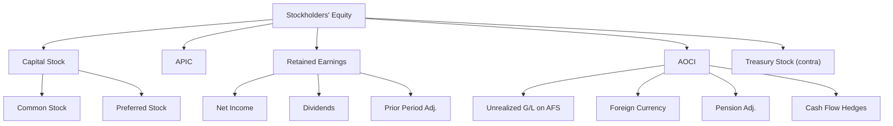

# Stockholders' Equity

## Overview

Stockholders' equity represents the **residual interest** in the assets of a corporation after deducting all liabilities. It is the owners' claim on the company's net assets. On the balance sheet, equity is reported in five major components:
$$\text{Stockholders' Equity} = \text{Capital Stock} + \text{APIC} + \text{Retained Earnings} + \text{AOCI} - \text{Treasury Stock}$$
| Component | Description |
|---|---|
| **Capital Stock** | Par or stated value of issued shares (common and preferred) |
| **Additional Paid-in Capital (APIC)** | Amounts received in excess of par value on stock issuances |
| **Retained Earnings** | Cumulative net income less cumulative dividends and other adjustments |
| **Accumulated Other Comprehensive Income (AOCI)** | Cumulative OCI items (unrealized gains/losses on AFS securities, foreign currency translation, pension adjustments, cash flow hedges) |
| **Treasury Stock** | Cost (or par value) of the company's own shares that have been reacquired |

:::info

Equity is also called **net assets**, **shareholders' equity**, or **owners' equity**. For partnerships and sole proprietorships, different terminology is used, but the concept is the same.

:::

---

## Common Stock

### Properties and Rights

Common stock represents the basic **ownership interest** in a corporation. Common stockholders typically have the following rights:

1. **Voting rights** — elect the board of directors and vote on major corporate actions
2. **Dividend rights** — share in distributions of earnings when declared by the board
3. **Liquidation rights** — receive a proportionate share of remaining assets after all claims are satisfied
4. **Preemptive rights** — the right to maintain proportionate ownership when new shares are issued (not always granted)

### Issuance of Common Stock

When a corporation issues common stock, it records the par value in the **Common Stock** account and any excess in **Additional Paid-in Capital (APIC)**.
**Example:** Bear Co. issues 10,000 shares of \$2 par value common stock at \$25 per share:

```journal
Dr. Cash                        250,000
    Cr. Common Stock                20,000
    Cr. Additional Paid-in Capital  230,000
```

### Issuance for Non-Cash Consideration

When stock is issued for property or services, the transaction is recorded at the **fair value of the consideration received** or the **fair value of the stock issued**, whichever is more readily determinable.
**Example:** Gies Co. issues 5,000 shares of \$1 par common stock (market price \$30/share) in exchange for a building with an appraised value of \$145,000:

```journal
Dr. Building                    150,000
    Cr. Common Stock                5,000
    Cr. Additional Paid-in Capital  145,000
```

The stock's fair value (\$150,000) is used because it is more readily determinable than the building's appraised value.

### No-Par Stock

Some states allow issuance of **no-par stock**. If no-par stock has a **stated value**, it is treated like par value. If there is no stated value, the entire proceeds are credited to Common Stock.
**Example:** MAS Inc. issues 1,000 shares of no-par common stock (no stated value) at \$40 per share:

```journal
Dr. Cash                        40,000
    Cr. Common Stock                40,000
```

---

## Preferred Stock

Preferred stock carries **preferential rights** over common stock, typically related to dividends and liquidation. Key variations include:

### Types of Preferred Stock

| Type                       | Feature                                                                                                      |
| -------------------------- | ------------------------------------------------------------------------------------------------------------ |
| **Cumulative**             | Unpaid dividends accumulate as **dividends in arrears** and must be paid before any common dividends         |
| **Non-cumulative**         | Unpaid dividends do not accumulate; skipped dividends are lost forever                                       |
| **Participating**          | After receiving its stated dividend, preferred stock shares in additional dividends with common stock        |
| **Convertible**            | Can be exchanged for common stock at a predetermined conversion ratio                                        |
| **Callable**               | The corporation can redeem the stock at a specified call price                                               |
| **Mandatorily Redeemable** | Must be redeemed at a specified date or upon a specified event — classified as a **liability** under ASC 480 |

:::danger[Mandatorily Redeemable Preferred Stock]

Under ASC 480, mandatorily redeemable financial instruments are classified as **liabilities**, not equity. This is a frequently tested distinction. Dividends on mandatorily redeemable preferred stock are reported as **interest expense**.

:::

### Issuance of Preferred Stock

**Example:** BIF Partners issues 2,000 shares of \$100 par, 6% cumulative preferred stock at \$108 per share:

```journal
Dr. Cash                        216,000
    Cr. Preferred Stock             200,000
    Cr. Additional Paid-in Capital—Preferred  16,000
```

### Conversion of Preferred to Common

When convertible preferred stock is converted, the **book value method** is used (no gain or loss is recognized):
**Example:** Kingfisher Industries converts 1,000 shares of \$50 par preferred stock (originally issued at \$55/share, APIC of \$5,000) into 4,000 shares of \$5 par common stock:

```journal
Dr. Preferred Stock             50,000
Dr. APIC—Preferred              5,000
    Cr. Common Stock                20,000
    Cr. APIC—Common                 35,000
```

### Dividends in Arrears

Dividends in arrears on cumulative preferred stock are **not a liability** until declared. However, they must be **disclosed** in the notes to the financial statements.

## Book Value Per Share

**Book value per share** measures the net assets attributable to each share of common stock:
$$\text{Book Value per Share} = \frac{\text{Total Stockholders' Equity} - \text{Preferred Stock Equity}}{\text{Common Shares Outstanding}}$$
Where **Preferred Stock Equity** includes the par (or call/liquidation) value of preferred stock plus any dividends in arrears on cumulative preferred stock.
**Example:** Illini Entertainment reports:
| Item | Amount |
|---|---|
| Total stockholders' equity | \$1,200,000 |
| Preferred stock (1,000 shares, \$100 par, 8% cumulative, callable at \$105) | \$100,000 |
| Dividends in arrears (2 years) | \$16,000 |
| Common shares outstanding | 50,000 |
$$\text{Preferred Stock Equity} = (1{,}000 \times \$105) + \$16{,}000 = \$121{,}000$$
$$\text{Book Value per Share} = \frac{\$1{,}200{,}000 - \$121{,}000}{50{,}000} = \$21.58$$

:::tip

When preferred stock is callable, use the **call price** (not par) to compute preferred stock equity. If not callable, use **par value** or **liquidation value** as appropriate.

:::

---

## Additional Paid-in Capital (APIC)

APIC arises from several sources beyond the initial stock issuance:

- Excess of issue price over par/stated value on stock issuances
- Treasury stock transactions (under both cost and par value methods)
- Stock-based compensation
- Conversion of preferred stock to common stock
- Retirement of treasury stock (sometimes)
- Donated capital
  APIC is **never debited below zero**. If a transaction would reduce APIC below zero, the excess is charged to **Retained Earnings**.

---

## Retained Earnings

Retained earnings represent the **cumulative net income** of the corporation since inception, less cumulative **dividends** declared, plus or minus **prior period adjustments**.
$$\text{Ending RE} = \text{Beginning RE} + \text{Net Income} - \text{Dividends Declared} \pm \text{Prior Period Adjustments}$$

### Prior Period Adjustments

Prior period adjustments arise from the **correction of errors** in previously issued financial statements. They are reported as adjustments to the **beginning balance** of retained earnings (net of tax) in the period the error is discovered.
**Example:** Bear Co. discovers in Year 3 that it failed to record \$30,000 of depreciation expense in Year 1. The tax rate is 25%.

```journal
Dr. Retained Earnings           22,500
Dr. Deferred Tax Asset           7,500
    Cr. Accumulated Depreciation    30,000
```

The retained earnings adjustment is \$30,000 × (1 − 0.25) = \$22,500.

### Appropriated Retained Earnings

The board of directors may **appropriate** (restrict) a portion of retained earnings for a specific purpose (e.g., future plant expansion). Appropriated retained earnings are still part of total retained earnings—they are simply segregated to signal that those earnings are not available for dividends.

:::note

Appropriations of retained earnings do **not** set aside cash or any other asset. They are merely a reclassification within equity.

:::

### Quasi-Reorganizations

A quasi-reorganization allows a corporation to **eliminate a deficit in retained earnings** without going through formal bankruptcy. The process involves:

1. Revalue assets to fair value (write-downs reduce retained earnings; write-ups are generally not permitted to exceed fair value)
2. Eliminate the retained earnings deficit by reducing APIC (or other paid-in capital)
3. The retained earnings balance is reset to **zero** and dated for 3–10 years

---

## Treasury Stock

Treasury stock consists of a corporation's own shares that have been **issued and subsequently reacquired** but not retired. Treasury stock is reported as a **contra-equity** account (a deduction from total stockholders' equity).

:::warning

Treasury shares are **not** outstanding shares. They have no voting rights, no dividend rights, and are not included in EPS calculations.

:::

### Cost Method

Under the cost method, treasury stock is recorded at the **reacquisition cost**. This is the more common method.

#### Purchase of Treasury Stock

**Example:** Gies Co. reacquires 1,000 shares of its own \$5 par common stock at \$35 per share:

```journal
Dr. Treasury Stock              35,000
    Cr. Cash                        35,000
```

#### Reissuance Above Cost

Gies Co. later reissues 400 of the treasury shares at \$40 per share:

```journal
Dr. Cash                        16,000
    Cr. Treasury Stock              14,000
    Cr. APIC—Treasury Stock         2,000
```

#### Reissuance Below Cost

Gies Co. reissues the remaining 600 shares at \$30 per share:

```journal
Dr. Cash                        18,000
Dr. APIC—Treasury Stock         2,000
Dr. Retained Earnings           1,000
    Cr. Treasury Stock              21,000
```

The \$5,000 total deficit (\$35 − \$30 = \$5 × 600 shares) is first absorbed by any existing APIC—Treasury Stock (\$2,000 from the prior transaction), with the remainder (\$3,000) charged to Retained Earnings.

:::tip[Cost Method Rule]

When reissuing treasury stock **below cost**, first reduce APIC—Treasury Stock to zero, then charge any remaining amount to **Retained Earnings**. Never debit APIC—Treasury Stock below zero.

:::

#### Retirement of Treasury Stock (Cost Method)

If Gies Co. decides to **retire** 200 of its treasury shares (originally issued at \$5 par, \$20 APIC per share, reacquired at \$35):

```journal
Dr. Common Stock                1,000
Dr. APIC—Common                 4,000
Dr. Retained Earnings           2,000
    Cr. Treasury Stock              7,000
```

- Common Stock: 200 × \$5 par = \$1,000
- APIC: 200 × \$20 = \$4,000
- Treasury Stock: 200 × \$35 cost = \$7,000
- The excess cost (\$7,000 − \$1,000 − \$4,000 = \$2,000) is charged to Retained Earnings

### Par Value Method

Under the par value method, treasury stock is recorded at **par value** when reacquired, with separate treatment of APIC.

#### Purchase of Treasury Stock (Par Value Method)

**Example:** MAS Inc. reacquires 500 shares of its own \$10 par common stock (originally issued at \$28/share) at \$32 per share:

```journal
Dr. Treasury Stock              5,000
Dr. APIC—Common                 9,000
Dr. Retained Earnings           2,000
    Cr. Cash                        16,000
```

- Treasury Stock: 500 × \$10 par = \$5,000
- APIC removed: 500 × (\$28 − \$10) = \$9,000
- Excess of cost over original issue price: 500 × (\$32 − \$28) = \$2,000 → Retained Earnings

#### Reissuance (Par Value Method)

Reissuance under the par value method is treated like a **new issuance**:
MAS Inc. reissues 300 of the treasury shares at \$36 per share:

```journal
Dr. Cash                        10,800
    Cr. Treasury Stock              3,000
    Cr. APIC—Common                 7,800
```

### Cost Method vs. Par Value Method Summary

| Feature                    | Cost Method               | Par Value Method               |
| -------------------------- | ------------------------- | ------------------------------ |
| Treasury stock recorded at | Reacquisition cost        | Par value                      |
| APIC affected at purchase? | No                        | Yes—original APIC removed      |
| Total equity at purchase   | Same under both methods   | Same under both methods        |
| Presentation               | Single contra-equity line | Treasury stock + adjusted APIC |

---

## Donated Shares

When shares are **donated back** to the corporation (e.g., by a major stockholder), the transaction is recorded as a **memo entry only** under modern GAAP—no journal entry is required because no assets are exchanged. The shares become treasury shares.
If donated shares are subsequently resold, the proceeds are credited to **APIC—Donated Capital**.
**Example:** A major shareholder of Illini Security donates 500 shares back to the company. Illini Security later sells them for \$20 per share:

```journal
Dr. Cash                        10,000
    Cr. APIC—Donated Capital        10,000
```

---

## Stock Subscriptions

A **stock subscription** is a contract in which an investor agrees to purchase shares at a future date and pay in installments. Until fully paid, the shares are not issued.
**Example:** Kingfisher Industries receives subscriptions for 2,000 shares of \$5 par common stock at \$22 per share. A 50% down payment is received:

```journal
Subscription date:
Dr. Stock Subscriptions Receivable   44,000
    Cr. Common Stock Subscribed          10,000
    Cr. APIC—Common                      34,000
Receipt of down payment:
Dr. Cash                              22,000
    Cr. Stock Subscriptions Receivable    22,000
Upon final payment and share issuance:
Dr. Cash                              22,000
    Cr. Stock Subscriptions Receivable    22,000
Dr. Common Stock Subscribed           10,000
    Cr. Common Stock                      10,000
```

:::warning[Balance Sheet Classification]

Stock Subscriptions Receivable is typically reported as a **contra-equity** account (a deduction from stockholders' equity) unless collection is reasonably assured, in which case it may be reported as a current asset. SEC registrants must report it as contra-equity.

:::

---

## Stock Rights and Warrants

**Stock rights** (or warrants) give existing shareholders the right to purchase additional shares at a specified price. From the issuing corporation's perspective:

- **Issuance of rights**: Usually no journal entry (memo entry only)
- **Exercise of rights**: Treated as a regular stock issuance at the exercise price
- **Expiration of rights**: No journal entry

---

## Distributions to Shareholders

### Cash Dividends

Cash dividends are the most common form of distribution. Three key dates:
| Date | Event | Journal Entry? |
|---|---|---|
| **Declaration date** | Board declares the dividend; a liability is created | Yes |
| **Record date** | Determines which shareholders receive the dividend | No |
| **Payment date** | Cash is distributed to shareholders | Yes |
**Example:** On March 1, Bear Co. declares a \$2.00 per share cash dividend on 50,000 shares outstanding, payable April 15 to shareholders of record on March 20:

```journal
March 1 (declaration):
Dr. Retained Earnings (or Dividends Declared)  100,000
    Cr. Dividends Payable                           100,000
April 15 (payment):
Dr. Dividends Payable           100,000
    Cr. Cash                        100,000
```

### Property Dividends

A **property dividend** is a distribution of non-cash assets. The asset distributed is **remeasured to fair value** on the declaration date, with any gain or loss recognized in income.
**Example:** Illini Entertainment declares a property dividend, distributing investments with a carrying value of \$60,000 and a fair value of \$75,000:

```journal
Declaration date — remeasure to fair value:
Dr. Investments                 15,000
    Cr. Gain on Appreciation of Investments  15,000
Declaration date — record the dividend:
Dr. Retained Earnings           75,000
    Cr. Property Dividends Payable   75,000
Payment date — distribute the property:
Dr. Property Dividends Payable  75,000
    Cr. Investments                  75,000
```

:::tip

Property dividends are always recorded at **fair value** on the declaration date. Don't forget to recognize the gain or loss on remeasurement.

:::

### Stock Dividends

A **stock dividend** is a distribution of additional shares to existing shareholders. No assets leave the corporation—it is a reclassification within equity.

#### Small Stock Dividend (≤ 20–25%)

Recorded at the **fair market value** of the shares distributed:
**Example:** BIF Partners has 100,000 shares outstanding (par \$1, market price \$30). It declares a 10% stock dividend (10,000 new shares):

```journal
Dr. Retained Earnings           300,000
    Cr. Common Stock Dividend Distributable  10,000
    Cr. APIC—Common                          290,000
```

When the shares are distributed:

```journal
Dr. Common Stock Dividend Distributable  10,000
    Cr. Common Stock                         10,000
```

:::note

**Common Stock Dividend Distributable** is reported in the **equity section** of the balance sheet (not as a liability) between the declaration date and the distribution date.

:::

#### Large Stock Dividend (> 20–25%)

Recorded at **par value** only:
**Example:** BIF Partners declares a 50% stock dividend (50,000 new shares, \$1 par):

```journal
Dr. Retained Earnings           50,000
    Cr. Common Stock Dividend Distributable  50,000
```

### Stock Splits

A **stock split** increases the number of shares outstanding and proportionally decreases the par value per share. **No journal entry is required**—only a memo entry.
**Example:** MAS Inc. has 100,000 shares of \$10 par common stock outstanding. After a 2-for-1 stock split:

- Shares outstanding: 200,000
- Par value per share: \$5
- Total par value: unchanged at \$1,000,000
  | | Before Split | After Split |
  |---|---|---|
  | Shares outstanding | 100,000 | 200,000 |
  | Par value per share | \$10 | \$5 |
  | Total par value | \$1,000,000 | \$1,000,000 |

  :::warning[Stock Dividend vs. Stock Split]
  A **small stock dividend** transfers fair value from retained earnings to paid-in capital. A **large stock dividend** transfers par value. A **stock split** changes shares and par value but makes no transfer at all. These distinctions are heavily tested.
  :::

### Comparison of Distribution Types

| Type                            | Assets Leave? | Retained Earnings Impact           | Shares Change? | Par Value Change? |
| ------------------------------- | ------------- | ---------------------------------- | -------------- | ----------------- |
| Cash dividend                   | Yes           | Decrease (FV of cash)              | No             | No                |
| Property dividend               | Yes           | Decrease (FV of property)          | No             | No                |
| Small stock dividend (≤ 20–25%) | No            | Decrease (FMV of new shares)       | Increase       | No                |
| Large stock dividend (> 20–25%) | No            | Decrease (par value of new shares) | Increase       | No                |
| Stock split                     | No            | No change                          | Increase       | Decrease          |

---

## Preferred Stock Dividend Allocation

When both preferred and common stock are outstanding, dividends are allocated to preferred stockholders first.
**Example:** Gies Co. has:

- 10,000 shares of \$100 par, 6% cumulative preferred stock
- 200,000 shares of \$1 par common stock
- Dividends in arrears: 2 years
- Total dividends declared in Year 3: \$200,000
  | Allocation | Preferred | Common |
  |---|---|---|
  | Arrears (2 years × \$60,000) | \$120,000 | — |
  | Current year preference | \$60,000 | — |
  | Remainder (\$200,000 − \$180,000) | — | \$20,000 |
  | **Total** | **\$180,000** | **\$20,000** |

---

## Noncontrolling Interest (NCI)

When a parent company consolidates a subsidiary that is not wholly owned, the portion of the subsidiary's equity attributable to **outside shareholders** is reported as **noncontrolling interest** in the consolidated balance sheet.
NCI is presented **within stockholders' equity**, but separately from the parent's equity. It is adjusted each period for the noncontrolling interest's share of the subsidiary's net income and dividends.
**Example:** Bear Co. owns 80% of Kingfisher Industries. Kingfisher reports net income of \$100,000 and declares dividends of \$30,000:

```journal
NCI share of net income (20% × $100,000):
Dr. Income Attributable to NCI   20,000
    Cr. Noncontrolling Interest      20,000
NCI share of dividends (20% × $30,000):
Dr. Noncontrolling Interest      6,000
    Cr. Dividends Payable—NCI        6,000
```

---

## Stock Issuance to Nonemployees

When stock is issued to **nonemployees** for goods or services, the transaction is measured at the **fair value of the consideration received** or the **fair value of the equity instruments issued**, whichever is more reliably measurable (ASC 718/505).
**Example:** Illini Security issues 500 shares of \$1 par common stock (market price \$40/share) to an attorney for legal services with a billed value of \$19,000:

```journal
Dr. Legal Expense               20,000
    Cr. Common Stock                500
    Cr. APIC—Common                 19,500
```

The fair value of the stock (\$20,000) is used because publicly traded stock prices are more reliably determinable than the billed amount for services.

## Comprehensive Equity Transaction Summary



---

## Key Formulas

| Formula                                 | Expression                                                                             |
| --------------------------------------- | -------------------------------------------------------------------------------------- |
| **Total Stockholders' Equity**          | $$\text{Assets} - \text{Liabilities}$$                                                 |
| **Retained Earnings (ending)**          | $$\text{Beg. RE} + \text{NI} - \text{Dividends} \pm \text{Prior Period Adj.}$$         |
| **Book Value per Common Share**         | $$\frac{\text{Total SE} - \text{Preferred Equity}}{\text{Common Shares Outstanding}}$$ |
| **Small Stock Dividend (RE reduction)** | $$\text{Shares Issued} \times \text{FMV per share}$$                                   |
| **Large Stock Dividend (RE reduction)** | $$\text{Shares Issued} \times \text{Par Value per share}$$                             |

---

## Summary

| Topic                                | Key Rule                                                |
| ------------------------------------ | ------------------------------------------------------- |
| Common stock issuance                | Credit par to Common Stock, excess to APIC              |
| Preferred stock—mandatory redemption | Classify as **liability**                               |
| Cumulative preferred arrears         | Disclose in notes; not a liability until declared       |
| Treasury stock—cost method           | Record at reacquisition cost; single contra-equity line |
| Treasury stock—par value method      | Record at par; remove original APIC at purchase         |
| Small stock dividend                 | Record at **FMV**; debit Retained Earnings              |
| Large stock dividend                 | Record at **par value**; debit Retained Earnings        |
| Stock split                          | Memo entry only; par value decreases, shares increase   |
| Property dividend                    | Remeasure to **fair value**; recognize gain or loss     |
| Noncontrolling interest              | Report in equity, separate from parent's equity         |
