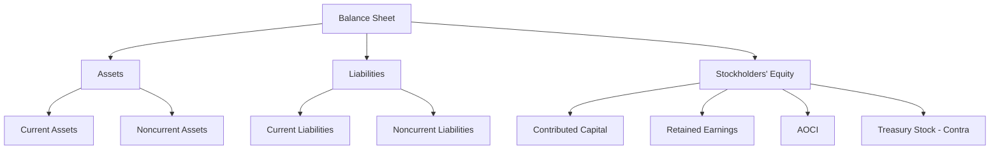
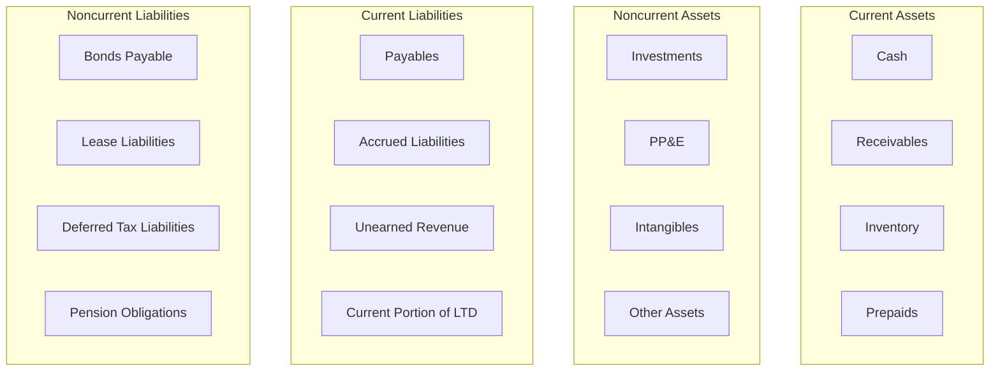

# Balance Sheet / Statement of Financial Position

The **balance sheet** (also called the **statement of financial position**) reports an entity's **assets**, **liabilities**, and **stockholders' equity** at a specific **point in time**. It is the only financial statement that represents a snapshot rather than a period of activity.

$$
\text{Assets} = \text{Liabilities} + \text{Stockholders' Equity}
$$

:::info Key Concept

The balance sheet answers: _What does the company own, what does it owe, and what is the residual interest of the owners — right now?_

:::
---

## Classified vs. Unclassified Balance Sheet

| Type             | Description                                                                     | Used By                                                |
| ---------------- | ------------------------------------------------------------------------------- | ------------------------------------------------------ |
| **Classified**   | Separates assets and liabilities into **current** and **noncurrent** categories | Most commercial and industrial entities                |
| **Unclassified** | Does not distinguish between current and noncurrent                             | Financial institutions, certain specialized industries |

:::tip Exam Tip

The CPA exam overwhelmingly tests the **classified** balance sheet. Know the current/noncurrent distinction cold.

:::
---

## Liquidity-Based Presentation

Some entities (particularly financial institutions) present assets and liabilities in **order of liquidity** rather than using current/noncurrent classifications. Under IFRS, a liquidity-based presentation is permitted when it provides more reliable and relevant information.
Under U.S. GAAP, the classified format is the norm for general-purpose financial statements.

---

## Assets

Assets are **probable future economic benefits** obtained or controlled by the entity as a result of past transactions or events.

### Current Assets

Current assets are expected to be **converted to cash, sold, or consumed within one year** (or the operating cycle, if longer). They are presented in order of **liquidity**.
| Category | Examples |
|---|---|
| **Cash and cash equivalents** | Bank balances, money market funds, T-bills with original maturity ≤ 3 months |
| **Short-term investments** | Trading securities, AFS securities expected to be sold within one year |
| **Accounts receivable** | Trade receivables (net of allowance for doubtful accounts) |
| **Inventories** | Raw materials, work-in-process, finished goods |
| **Prepaid expenses** | Prepaid insurance, prepaid rent |
| **Other current assets** | Current portion of notes receivable, income tax receivable |
**Example — Bear Co. current assets section:**
| Bear Co. — Current Assets | Dec. 31 |
|---|---:|
| Cash and cash equivalents | \$85,000 |
| Short-term investments | 40,000 |
| Accounts receivable, net of \$12,000 allowance | 188,000 |
| Inventories | 220,000 |
| Prepaid expenses | 15,000 |
| **Total current assets** | **\$548,000** |

### Investments and Funds

Noncurrent investments include:

- Equity method investments
- Held-to-maturity debt securities
- AFS debt securities not expected to be sold within one year
- Sinking funds, cash surrender value of life insurance
- Investments in unconsolidated subsidiaries

### Property, Plant, and Equipment (PP&E)

Tangible, long-lived assets used in operations, reported at **cost less accumulated depreciation**.

```journal
Dr. Equipment                    150,000
    Cr. Cash                         150,000
```

| Item           |            Cost |    Accum. Depr. |             Net |
| -------------- | --------------: | --------------: | --------------: |
| Land           |       \$200,000 |               — |       \$200,000 |
| Buildings      |         800,000 |       (240,000) |         560,000 |
| Equipment      |         350,000 |       (105,000) |         245,000 |
| **Total PP&E** | **\$1,350,000** | **(\$345,000)** | **\$1,005,000** |

:::note

Land is **not depreciated**. It has an indefinite useful life.

:::
### Intangible Assets

Assets that lack physical substance but provide future economic benefits.
| Intangible | Finite or Indefinite Life | Treatment |
|---|---|---|
| Patents | Finite | Amortize over useful life (not to exceed legal life) |
| Copyrights | Finite | Amortize over useful life |
| Trademarks | Indefinite | Do not amortize; test for impairment annually |
| Goodwill | Indefinite | Do not amortize; test for impairment annually |
| Customer lists | Finite | Amortize over useful life |
| Franchise agreements | Depends on terms | Amortize if finite; impairment test if indefinite |

### Other Noncurrent Assets

- Deferred tax assets (noncurrent)
- Long-term prepaid expenses
- Operating lease right-of-use assets

---

## Liabilities

Liabilities are **probable future sacrifices of economic benefits** arising from present obligations to transfer assets or provide services as a result of past transactions.

### Current Liabilities

Obligations expected to be settled within **one year** (or the operating cycle, if longer).
| Category | Examples |
|---|---|
| **Accounts payable** | Trade payables to suppliers |
| **Accrued liabilities** | Wages payable, interest payable, taxes payable |
| **Unearned revenue** | Customer deposits, gift card liabilities |
| **Short-term notes payable** | Bank lines of credit, commercial paper |
| **Current portion of long-term debt** | Principal payments due within one year |
| **Dividends payable** | Declared but unpaid dividends |
:::warning

A liability is classified as **current** even if it will be refinanced after the balance sheet date, **unless** a noncurrent refinancing agreement was completed **before** the balance sheet date (and other criteria are met under ASC 470-10).

:::
**Example — Gies Co. records accrued wages:**

```journal
Dr. Wages expense            45,000
    Cr. Wages payable            45,000
```

### Noncurrent Liabilities

Obligations not due within the next year.
| Category | Examples |
|---|---|
| **Long-term notes and bonds payable** | Bonds payable (net of discount/premium), mortgage notes |
| **Lease liabilities** | Noncurrent portion of finance and operating lease obligations |
| **Deferred tax liabilities** | Temporary differences creating future taxable amounts |
| **Pension and postretirement obligations** | Net defined benefit liability |

---

## Stockholders' Equity

The residual interest in assets after deducting liabilities. The equity section typically includes:
| Component | Description |
|---|---|
| **Common stock** | Par value of shares issued |
| **Preferred stock** | Par value of preferred shares issued |
| **Additional paid-in capital (APIC)** | Amount received above par value on stock issuances |
| **Retained earnings** | Cumulative net income less cumulative dividends |
| **Accumulated other comprehensive income (AOCI)** | Cumulative OCI items (PUFI) |
| **Treasury stock** | Cost of shares reacquired by the entity (contra equity) |
| **Noncontrolling interest** | Minority interest in consolidated subsidiaries |
**Example — MAS Inc. issues 10,000 shares of \$1 par common stock at \$15 per share:**

```journal
Dr. Cash                150,000
    Cr. Common stock         10,000
    Cr. APIC               140,000
```

**Example equity section:**
| MAS Inc. — Stockholders' Equity | Dec. 31 |
|---|---:|
| Preferred stock, \$100 par, 1,000 shares issued | \$100,000 |
| Common stock, \$1 par, 50,000 shares issued | 50,000 |
| Additional paid-in capital | 600,000 |
| Retained earnings | 425,000 |
| Accumulated other comprehensive income | 18,000 |
| Less: Treasury stock (2,000 shares at cost) | (30,000) |
| **Total stockholders' equity** | **\$1,163,000** |

---

## Working Capital

:::info Definition

**Working capital** (also called net working capital) measures the entity's short-term liquidity.

:::
$$
\text{Working Capital} = \text{Current Assets} - \text{Current Liabilities}
$$

$$
\text{Current Ratio} = \frac{\text{Current Assets}}{\text{Current Liabilities}}
$$

**Example — Kingfisher Industries:**

- Current assets: \$548,000
- Current liabilities: \$310,000
  $$
  \text{Working Capital} = \$548{,}000 - \$310{,}000 = \$238{,}000
  $$
  $$
  \text{Current Ratio} = \frac{\$548{,}000}{\$310{,}000} = 1.77
  $$
  :::tip Exam Tip
  A current ratio above 1.0 means the company has more current assets than current liabilities. Banks and creditors use this ratio extensively in credit analysis.
  :::

---

## Balance Sheet Format

Two common formats:

### Account Format (Horizontal)

Assets on the **left**, liabilities and equity on the **right** — mirrors the accounting equation.

### Report Format (Vertical)

Lists assets **first**, then liabilities, then equity — top to bottom. This is the most common format in practice.



---

## Disclosure Requirements

The balance sheet alone cannot convey all necessary information. Required disclosures include:

1. **Accounting policies** — methods used for inventory, depreciation, revenue recognition
2. **Contingencies** — pending litigation, guarantees
3. **Contractual obligations** — future minimum lease payments, purchase commitments
4. **Fair value information** — for financial instruments
5. **Related party transactions** — transactions with affiliates, officers, directors
6. **Subsequent events** — material events occurring after the balance sheet date but before financial statement issuance
   :::warning
   Certain items may require **parenthetical disclosures** on the face of the balance sheet (e.g., allowance for doubtful accounts, accumulated depreciation, par value of stock, number of shares authorized/issued/outstanding).
   :::

---

## Common Balance Sheet Classifications — Quick Reference



---

:::danger Common Exam Pitfalls

1. Classifying **AFS securities** as current or noncurrent depends on management's **intent to sell** within one year — not the maturity date.
2. Forgetting that **treasury stock** is a **contra equity** account (deducted from equity, not added).
3. **Goodwill** is never amortized under U.S. GAAP — only tested for impairment.
4. **Sinking fund assets** are noncurrent even though they are cash — they are restricted for a specific purpose.
5. A declared but **unpaid dividend** is a current liability — the declaration creates the obligation.
   :::

---

## Practice Problem

Illini Security reports the following balances at December 31:
| Account | Amount |
|---|---:|
| Cash | \$60,000 |
| Accounts receivable | 150,000 |
| Allowance for doubtful accounts | (8,000) |
| Inventory | 200,000 |
| Prepaid insurance | 12,000 |
| Land | 180,000 |
| Building | 500,000 |
| Accumulated depreciation — building | (100,000) |
| Equipment | 220,000 |
| Accumulated depreciation — equipment | (55,000) |
| Goodwill | 90,000 |
| Accounts payable | 85,000 |
| Wages payable | 22,000 |
| Bonds payable (due in 5 years) | 300,000 |
| Common stock (\$1 par) | 40,000 |
| APIC | 360,000 |
| Retained earnings | 380,000 |
| AOCI | 12,000 |
| Treasury stock | (50,000) |
**Required:** (a) Calculate total current assets. (b) Calculate working capital. (c) Calculate total stockholders' equity.

<details>
<summary>Solution</summary>
**(a) Total current assets:**
\$60,000 + \$150,000 − \$8,000 + \$200,000 + \$12,000 = **\$414,000**
**(b) Working capital:**
Current liabilities = \$85,000 + \$22,000 = \$107,000
Working capital = \$414,000 − \$107,000 = **\$307,000**
**(c) Total stockholders' equity:**
\$40,000 + \$360,000 + \$380,000 + \$12,000 − \$50,000 = **\$742,000**
**Verification:** Total assets = \$414,000 + \$180,000 + \$400,000 + \$165,000 + \$90,000 = \$1,249,000
Total liabilities + equity = \$107,000 + \$300,000 + \$742,000 + non-current = \$1,149,000 ✓ (Adjusting for the building net: \$500,000 − \$100,000 = \$400,000 and equipment net: \$220,000 − \$55,000 = \$165,000, total assets = \$1,249,000 and total L+E = \$107,000 + \$300,000 + \$742,000 = \$1,149,000 + \$90,000 goodwill already in assets = needs recheck — all noncurrent assets are \$835,000, total assets = \$1,249,000, total L+E = \$1,249,000 ✓)
</details>
