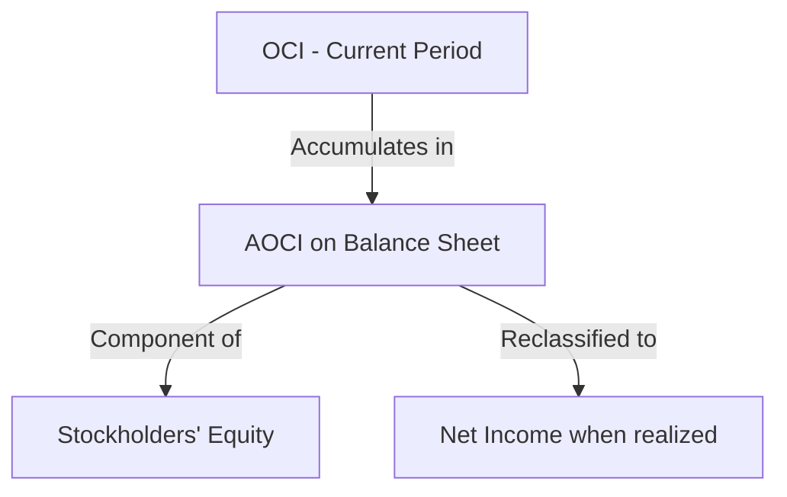
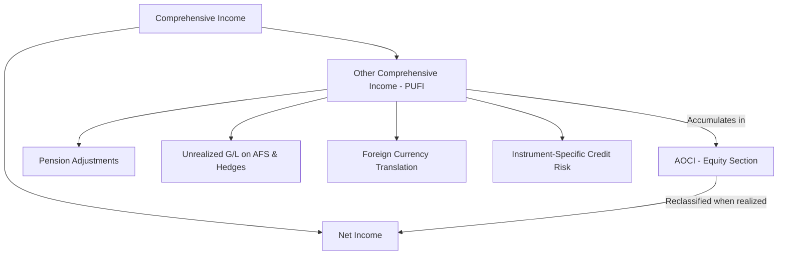

# Statement of Comprehensive Income

**Comprehensive income** measures _all changes in equity from nonowner sources_ during a period. It is broader than net income because it captures items that bypass the income statement and flow directly into equity.

$$
\text{Comprehensive Income} = \text{Net Income} + \text{Other Comprehensive Income (OCI)}
$$

:::info[Key Concept]

Think of comprehensive income as the **complete picture** of an entity's performance. Net income tells you what happened on the income statement; OCI captures additional economic events that GAAP does not want running through net income.

:::

---

## Other Comprehensive Income (OCI)

OCI includes items that are recognized in equity but **excluded from net income**. These items are considered unrealized or temporary and are "parked" in equity until they are realized or reclassified.

### The PUFI Mnemonic

:::tip[Exam Tip — PUFI]

Use **PUFI** to remember the four categories of Other Comprehensive Income:
| Letter | Component |
|--------|-----------|
| **P** | **P**ension adjustments (prior service cost and net actuarial gains/losses) |
| **U** | **U**nrealized gains and losses on AFS debt securities and effective portion of cash flow hedges |
| **F** | **F**oreign currency translation adjustments |
| **I** | **I**nstrument-specific credit risk (changes in fair value of a liability under the fair value option attributable to instrument-specific credit risk) |

:::

### Detailed Breakdown

#### P — Pension Adjustments

When an employer sponsors a defined benefit pension plan, certain items are initially recognized in OCI rather than pension expense:

- **Prior service cost** — arises from plan amendments (amortized from OCI to pension expense over future service periods)
- **Net actuarial gains and losses** — differences between expected and actual plan performance (amortized using the corridor approach)

```journal
Dr. Other comprehensive income — pension adjustment    45,000
    Cr. Projected benefit obligation                       45,000
```

#### U — Unrealized Gains/Losses on AFS Debt Securities and Hedges

**Available-for-sale (AFS) debt securities** are reported at fair value, with unrealized gains and losses recorded in OCI (not net income).
**Example — Bear Co. holds AFS debt securities:**

- Amortized cost: \$200,000
- Fair value at year-end: \$215,000

```journal
Dr. Fair value adjustment — AFS securities    15,000
    Cr. OCI — Unrealized gain on AFS securities   15,000
```

For **cash flow hedges**, the effective portion of the change in the hedging instrument's fair value is recorded in OCI until the hedged transaction affects earnings.

:::note

**Equity securities** (with readily determinable fair values) are measured at fair value through **net income** under ASC 321 — they do NOT go through OCI.

:::

#### F — Foreign Currency Translation Adjustments

When a foreign subsidiary's financial statements are **translated** from the functional currency to the reporting currency (using the current rate method), the resulting translation adjustment is reported in OCI.

$$
\text{Translation Adjustment} = \text{Net Assets} \times (\text{Current Rate} - \text{Historical Rates Used})
$$

```journal
Dr. OCI — Foreign currency translation adjustment    32,000
    Cr. Cumulative translation adjustment                 32,000
```

:::warning

Do not confuse **translation** (OCI) with **remeasurement** (net income). Translation uses the current rate method when the subsidiary's functional currency is its local currency. Remeasurement uses the temporal method when the functional currency is the parent's currency.

:::

#### I — Instrument-Specific Credit Risk

When an entity elects the **fair value option** for a financial liability, changes in fair value attributable to the entity's own credit risk are reported in OCI rather than net income (ASC 825).

## Accumulated Other Comprehensive Income (AOCI)

**AOCI** is the cumulative balance of all OCI items. It is reported as a separate component of **stockholders' equity** on the balance sheet.



**Example — Gies Co. AOCI rollforward:**
| Component | Beginning AOCI | Current OCI | Reclassification | Ending AOCI |
|---|---:|---:|---:|---:|
| AFS unrealized gains | \$12,000 | \$8,000 | (\$3,000) | \$17,000 |
| Pension adjustments | (25,000) | (10,000) | 5,000 | (30,000) |
| Translation adjustments | 18,000 | (6,000) | — | 12,000 |
| **Total AOCI** | **\$5,000** | **(\$8,000)** | **\$2,000** | **(\$1,000)** |

---

## Presentation Approaches

GAAP provides **two options** for presenting comprehensive income:

### Option 1: Single Continuous Statement

Combines the income statement and comprehensive income into one statement.
| Illini Entertainment | Year Ended Dec. 31 |
|---|---:|
| Revenues | \$900,000 |
| Expenses | (650,000) |
| **Net income** | **\$250,000** |
| **Other comprehensive income:** | |
| &emsp;Unrealized gain on AFS debt securities (net of \$5,000 tax) | 15,000 |
| &emsp;Foreign currency translation loss (net of \$3,000 tax benefit) | (9,000) |
| &emsp;Pension adjustment (net of \$2,000 tax benefit) | (6,000) |
| **Total other comprehensive income** | **\$0** |
| **Comprehensive income** | **\$250,000** |

### Option 2: Two Separate Statements

1. A traditional **income statement** ending with net income
2. A separate **statement of comprehensive income** that begins with net income and adds OCI items
   | Statement of Comprehensive Income | Amount |
   |---|---:|
   | **Net income** | **\$250,000** |
   | **Other comprehensive income:** | |
   | &emsp;Unrealized gain on AFS debt securities (net of tax) | 15,000 |
   | &emsp;Foreign currency translation loss (net of tax) | (9,000) |
   | &emsp;Pension adjustment (net of tax) | (6,000) |
   | **Total other comprehensive income** | **\$0** |
   | **Comprehensive income** | **\$250,000** |

   :::warning
   OCI items may **not** be presented solely in the statement of changes in stockholders' equity. They must appear in either a single continuous statement or a separate statement of comprehensive income.
   :::

---

## Tax Reporting Options

Each OCI component can be reported using one of two approaches:
| Approach | Description |
|---|---|
| **Net of tax** | Each OCI item is shown after deducting its individual tax effect |
| **Before tax with aggregate tax** | All OCI items shown at gross amounts, with a single total tax line |
**Net-of-tax example:**

- Unrealized gain on AFS debt securities: \$20,000 pretax, 25% tax rate
- Reported as: \$20,000 − \$5,000 = **\$15,000 net of tax**
  **Before-tax with aggregate example:**
  | Item | Amount |
  |---|---:|
  | Unrealized gain on AFS securities | \$20,000 |
  | Translation loss | (12,000) |
  | Pension adjustment | (8,000) |
  | Total OCI before tax | \$0 |
  | Tax effect | 0 |
  | **Total OCI net of tax** | **\$0** |

---

## Reclassification Adjustments

When an OCI item is **realized**, it is **reclassified** (removed) from AOCI and recognized in net income. This prevents double counting.

### Example — BIF Partners Sells AFS Debt Securities

BIF Partners previously recorded an unrealized gain of \$10,000 in OCI. In the current year, the securities are sold for a realized gain of \$10,000.
**Step 1: Record the sale (net income)**

```journal
Dr. Cash                                  110,000
    Cr. AFS debt securities                   100,000
    Cr. Realized gain on sale of securities    10,000
```

**Step 2: Reclassify from AOCI (remove from OCI)**

```journal
Dr. OCI — Reclassification adjustment    10,000
    Cr. AOCI — Unrealized gain on AFS        10,000
```

:::info

The reclassification ensures the gain is counted **only once** — in net income when realized — and removed from the cumulative OCI balance.

:::

---

## Journal Entry Summary

### Recording OCI Items

```journal
Dr. AFS debt securities — fair value adjustment    15,000
    Cr. OCI — Unrealized gain on AFS securities        15,000
```

### Tax Effect on OCI

```journal
Dr. OCI — Tax effect    3,750
    Cr. Deferred tax liability    3,750
```

### Reclassification to Net Income

```journal
Dr. AOCI — Unrealized gain    15,000
    Cr. Reclassification adjustment — OCI    15,000
```

---

## Comprehensive Income vs. Net Income

| Feature                      | Net Income | Comprehensive Income        |
| ---------------------------- | ---------- | --------------------------- |
| Includes operating results   | ✅         | ✅                          |
| Includes OCI items           | ❌         | ✅                          |
| Reported on income statement | ✅         | ✅ (combined or separate)   |
| Affects retained earnings    | ✅         | Only the net income portion |
| Affects AOCI                 | ❌         | OCI portion goes to AOCI    |

---

## Summary



:::danger[Common Exam Pitfalls]

1. Including **equity security** fair value changes in OCI — those go through **net income**.
2. Forgetting to **reclassify** OCI items when realized — double counting results.
3. Confusing foreign currency **translation** (OCI) with **transaction** gains/losses (net income).
4. Reporting OCI only in the equity statement — a separate presentation is **required**.
5. Forgetting the **I** in PUFI — instrument-specific credit risk is a newer addition.
   :::

---

## Practice Problem

MAS Inc. reports the following for the year ended December 31:

- Net income: \$400,000
- Unrealized loss on AFS debt securities (pretax): \$20,000
- Foreign currency translation gain: \$35,000 (no tax effect — indefinite reinvestment)
- Prior service cost from pension plan amendment (pretax): \$50,000
- Tax rate: 25%
**Required:** Calculate comprehensive income.
<details>
<summary>Solution</summary>
| Item | Pretax | Tax Effect | Net of Tax |
|---|---:|---:|---:|
| Net income | | | \$400,000 |
| Unrealized loss on AFS | (\$20,000) | \$5,000 | (\$15,000) |
| Translation gain | \$35,000 | — | \$35,000 |
| Prior service cost | (\$50,000) | \$12,500 | (\$37,500) |
| **Comprehensive income** | | | **\$382,500** |
</details>
