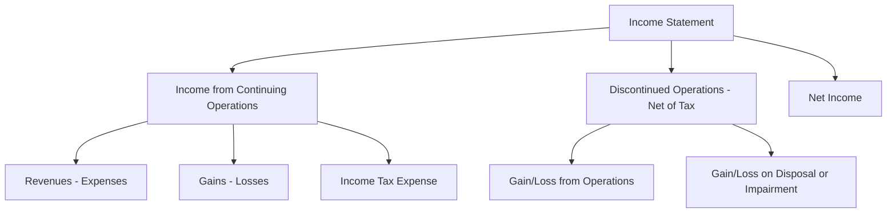

# Income Statement

The **income statement** (also called the **statement of operations** or **profit and loss statement**) reports an entity's financial performance over a period of time. It summarizes revenues, expenses, gains, and losses, ultimately arriving at **net income** or **net loss**.

:::info[Key Concept]

The income statement answers: _How much did the company earn (or lose) during this period?_ It is an accrual-basis statement—revenues are recognized when earned, and expenses when incurred, regardless of cash flow timing.

:::

---

## Core Components

### Revenues and Expenses

- **Revenues** arise from an entity's _ongoing major or central operations_ (e.g., sales revenue, service revenue, interest revenue for a bank).
- **Expenses** are outflows or depletions of assets (or incurrences of liabilities) from delivering goods, rendering services, or carrying out other activities that constitute the entity's ongoing operations.

### Gains and Losses

- **Gains** are increases in equity from _peripheral or incidental_ transactions (e.g., gain on sale of equipment).
- **Losses** are decreases in equity from peripheral or incidental transactions (e.g., loss from a lawsuit, loss on disposal of assets).

:::tip[Exam Tip]

Revenues and expenses relate to the **core business**. Gains and losses relate to **peripheral** activities. The distinction matters for income statement classification.

:::

### Expired vs. Unexpired Costs

| Term               | Definition                                                                                  | Example                                                |
| ------------------ | ------------------------------------------------------------------------------------------- | ------------------------------------------------------ |
| **Unexpired cost** | A cost that has future economic benefit — reported as an **asset** on the balance sheet     | Prepaid insurance, inventory, PP&E                     |
| **Expired cost**   | A cost whose benefit has been consumed — reported as an **expense** on the income statement | Cost of goods sold, depreciation expense, rent expense |

When a cost _expires_, it moves from the balance sheet to the income statement.

---

## Gross vs. Net Reporting

:::warning[Important Distinction]

**Revenues and expenses** are reported at **gross** amounts. **Gains and losses** are reported at **net** amounts (proceeds minus carrying value).

:::

**Example — Bear Co. sells equipment:**

- Original cost: \$50,000
- Accumulated depreciation: \$30,000
- Sale price: \$25,000

$$
\text{Gain} = \$25{,}000 - (\$50{,}000 - \$30{,}000) = \$5{,}000
$$

The income statement reports the **net gain of \$5,000**, not gross proceeds of \$25,000.

```journal
Dr. Cash                          25,000
Dr. Accumulated depreciation      30,000
    Cr. Equipment                     50,000
    Cr. Gain on sale of equipment      5,000
```

---

## Income Statement Formats

### Single-Step Income Statement

Groups all revenues and gains together, then subtracts all expenses and losses in a single step.

|                                |        Amount |
| ------------------------------ | ------------: |
| **Revenues and Gains**         |               |
| Sales revenue                  |     \$500,000 |
| Interest revenue               |        10,000 |
| Gain on sale of equipment      |         5,000 |
| **Total revenues and gains**   | **\$515,000** |
| **Expenses and Losses**        |               |
| Cost of goods sold             |     (300,000) |
| Selling expenses               |      (50,000) |
| Administrative expenses        |      (40,000) |
| Interest expense               |      (15,000) |
| Loss on lawsuit                |       (8,000) |
| **Total expenses and losses**  | **(413,000)** |
| **Income before income taxes** | **\$102,000** |
| Income tax expense             |      (30,600) |
| **Net income**                 |  **\$71,400** |

### Multiple-Step Income Statement

Separates operating and nonoperating activities, providing subtotals such as **gross profit** and **operating income**.

|                                       |        Amount |
| ------------------------------------- | ------------: |
| Sales revenue                         |     \$500,000 |
| Less: Cost of goods sold              |     (300,000) |
| **Gross profit**                      | **\$200,000** |
| Operating expenses:                   |               |
| &emsp;Selling expenses                |      (50,000) |
| &emsp;Administrative expenses         |      (40,000) |
| **Operating income**                  | **\$110,000** |
| Other revenues and gains:             |               |
| &emsp;Interest revenue                |        10,000 |
| &emsp;Gain on sale of equipment       |         5,000 |
| Other expenses and losses:            |               |
| &emsp;Interest expense                |      (15,000) |
| &emsp;Loss on lawsuit                 |       (8,000) |
| **Income before income taxes**        | **\$102,000** |
| Income tax expense                    |      (30,600) |
| **Income from continuing operations** |  **\$71,400** |

:::tip[Exam Tip]

The multiple-step format is tested more frequently. Know the order: **Sales → COGS → Gross Profit → Operating Expenses → Operating Income → Other Items → Income from Continuing Operations → Discontinued Operations → Net Income**.

:::

---

## Income from Continuing Operations

This is the bottom line of regular, recurring business activities **before** any discontinued operations. It includes:

1. Operating revenues and expenses
2. Nonoperating items (interest, gains/losses on asset disposals)
3. Income tax expense on continuing operations

---

## Discontinued Operations

:::warning[Critical Topic]

Discontinued operations are reported **separately**, **net of tax**, **below** income from continuing operations. This is one of the most heavily tested income statement topics on the CPA exam.

:::

### What Qualifies?

A component qualifies as a discontinued operation when it represents a **strategic shift** that has (or will have) a major effect on the entity's operations and financial results. Examples include:

- Disposal of a major line of business
- Disposal of a major geographical area
- Disposal of a major equity method investment

### Held-for-Sale Classification

A component is classified as **held for sale** when **all** of the following criteria are met:

1. Management commits to a plan to sell
2. The component is available for immediate sale in its present condition
3. An active program to locate a buyer has been initiated
4. The sale is probable and expected within **one year**
5. The component is being actively marketed at a reasonable price
6. It is unlikely that significant changes will be made to the plan

### Reporting Discontinued Operations

Two amounts are reported (net of tax) on the face of the income statement:

1. **Gain or loss from operations** of the discontinued component (revenue minus expenses during the period)
2. **Gain or loss on disposal** (or expected disposal) of the component

### Impairment Loss — Held for Sale

When classified as held for sale, the component is measured at the **lower of carrying amount or fair value less costs to sell**.

**Example — Gies Co. discontinues its consulting division:**

- Carrying amount of division's net assets: \$800,000
- Fair value less costs to sell: \$650,000
- Operating loss of the division during the year: \$120,000
- Tax rate: 25%

$$
\text{Impairment loss} = \$800{,}000 - \$650{,}000 = \$150{,}000
$$

```journal
Dr. Loss on impairment — discontinued operations    150,000
    Cr. Net assets of discontinued component            150,000
```

**Income statement presentation (below income from continuing operations):**

|                                                                                      |        Amount |
| ------------------------------------------------------------------------------------ | ------------: |
| Income from continuing operations                                                    |     \$500,000 |
| **Discontinued operations (net of tax):**                                            |               |
| &emsp;Loss from operations of discontinued division (\$120,000 less tax of \$30,000) |      (90,000) |
| &emsp;Impairment loss on discontinued division (\$150,000 less tax of \$37,500)      |     (112,500) |
| **Net income**                                                                       | **\$297,500** |

### Subsequent Fair Value Increases

If the fair value of a held-for-sale component **increases** after an impairment write-down, the entity may **reverse the loss** up to the cumulative amount previously recognized. The reversal is reported in discontinued operations, net of tax.

```journal
Dr. Net assets of discontinued component    60,000
    Cr. Gain on recovery — discontinued operations    60,000
```

:::note

The reversal cannot exceed the total impairment loss previously recognized. You cannot write the asset **above** its original carrying amount before impairment.

:::

---

## Foreign Currency Transactions

When an entity enters transactions denominated in a **foreign currency**, exchange rate fluctuations create gains and losses.

### Recording at the Spot Rate

Transactions are initially recorded at the **spot exchange rate** on the transaction date.

**Example — MAS Inc. purchases inventory from a French supplier for €100,000 when the spot rate is \$1.10/€:**

$$
\text{Payable in USD} = 100{,}000 \text{ EUR} \times \$1.10 = \$110{,}000
$$

```journal
Dr. Inventory              110,000
    Cr. Accounts payable       110,000
```

### Year-End Adjustment (Remeasurement)

At the balance sheet date, **monetary items** (receivables, payables) denominated in a foreign currency are remeasured at the **current spot rate**. The resulting gain or loss is reported in **net income**.

**If the spot rate at year-end is \$1.15/€:**

$$
\text{New payable} = 100{,}000 \text{ EUR} \times \$1.15 = \$115{,}000
$$

$$
\text{Exchange loss} = \$115{,}000 - \$110{,}000 = \$5{,}000
$$

```journal
Dr. Foreign currency transaction loss    5,000
    Cr. Accounts payable                    5,000
```

:::tip[Exam Tip]

A **weakening U.S. dollar** (higher exchange rate) means foreign-currency **payables cost more** (loss) and foreign-currency **receivables are worth more** (gain). Think: "Owe more = loss; Collect more = gain."

:::

### Settlement

When the transaction is settled, any additional exchange difference is recognized.

**If the spot rate at settlement is \$1.12/€:**

$$
\text{Payable at settlement} = 100{,}000 \text{ EUR} \times \$1.12 = \$112{,}000
$$

$$
\text{Exchange gain (from year-end)} = \$115{,}000 - \$112{,}000 = \$3{,}000
$$

```journal
Dr. Accounts payable                    115,000
    Cr. Cash                                112,000
    Cr. Foreign currency transaction gain     3,000
```

---

## Summary



:::danger[Common Exam Pitfalls]

1. Reporting gains **gross** instead of **net** — always net gains/losses.
2. Forgetting to report discontinued operations **net of tax**.
3. Mixing up foreign currency gains and losses — remember the direction of the rate change relative to whether you hold a receivable or payable.
4. Reversing impairment on held-for-sale components **above** the original carrying amount.
   :::

---

## Practice Problem

Kingfisher Industries reports the following for the year ended December 31:

- Sales revenue: \$1,200,000
- Cost of goods sold: \$720,000
- Operating expenses: \$180,000
- Interest expense: \$25,000
- Gain on sale of investments: \$15,000
- Loss from operations of discontinued segment (pre-tax): \$60,000
- Gain on disposal of discontinued segment (pre-tax): \$40,000
- Tax rate: 25%

**Required:** Prepare a multiple-step income statement.

<details>
<summary>Solution</summary>

| Kingfisher Industries                       |        Amount |
| ------------------------------------------- | ------------: |
| Sales revenue                               |   \$1,200,000 |
| Cost of goods sold                          |     (720,000) |
| **Gross profit**                            | **\$480,000** |
| Operating expenses                          |     (180,000) |
| **Operating income**                        | **\$300,000** |
| Interest expense                            |      (25,000) |
| Gain on sale of investments                 |        15,000 |
| **Income before income taxes**              | **\$290,000** |
| Income tax expense (25%)                    |      (72,500) |
| **Income from continuing operations**       | **\$217,500** |
| **Discontinued operations (net of tax):**   |               |
| &emsp;Loss from operations (\$60,000 × 75%) |      (45,000) |
| &emsp;Gain on disposal (\$40,000 × 75%)     |        30,000 |
| **Net income**                              | **\$202,500** |

</details>
