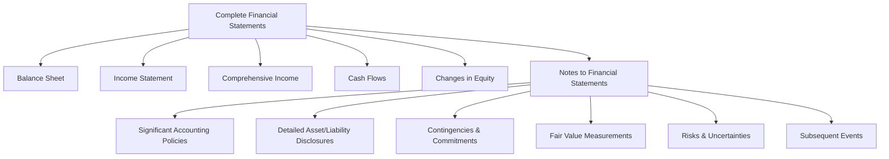

# Notes to Financial Statements

The **notes to financial statements** (also called **footnotes** or **disclosures**) are an integral part of a complete set of financial statements. They provide additional detail, context, and explanations that cannot be conveyed by the numbers alone on the face of the financial statements.

:::info[Key Concept]

Financial statements and their notes are **inseparable**. An auditor's opinion covers both the financial statements and the notes. Information in the notes is considered equally authoritative to amounts on the face of the statements.

:::

---

## Structure of the Notes

Notes are typically organized in the following order:

1. **Summary of significant accounting policies** (always Note 1)
2. Detailed disclosures for major balance sheet and income statement items
3. Commitments and contingencies
4. Related party transactions
5. Subsequent events
6. Other required disclosures

---

## Note 1: Summary of Significant Accounting Policies

This is **always the first note** and describes the accounting methods and principles the entity uses. It allows users to understand _how_ the numbers were prepared.

### Required Disclosures

| Policy Area                  | What to Disclose                                                      |
| ---------------------------- | --------------------------------------------------------------------- |
| **Basis of presentation**    | Consolidation principles, fiscal year-end                             |
| **Revenue recognition**      | Performance obligations, timing, variable consideration               |
| **Inventory**                | Valuation method (FIFO, LIFO, weighted average), lower of cost or NRV |
| **Depreciation**             | Methods (straight-line, declining balance), useful lives              |
| **Income taxes**             | Deferred tax methodology, uncertain tax positions                     |
| **Financial instruments**    | Classification, measurement, fair value methods                       |
| **Leases**                   | Classification criteria, discount rate approach                       |
| **Intangible assets**        | Amortization methods, useful lives                                    |
| **Stock-based compensation** | Valuation model (Black-Scholes, lattice), assumptions                 |
| **Foreign currency**         | Functional currency determination, translation method                 |

:::tip[Exam Tip]

The summary of significant accounting policies discloses the **methods chosen** when GAAP permits alternatives. If GAAP mandates only one method, no disclosure of the "choice" is necessary — but the policy is often disclosed anyway for user convenience.

:::

### Example Note Disclosure

> **Note 1 — Summary of Significant Accounting Policies**
>
> _Inventory:_ Bear Co. values inventory at the lower of cost or net realizable value. Cost is determined using the first-in, first-out (FIFO) method.
>
> _Property, Plant, and Equipment:_ PP&E is recorded at historical cost and depreciated using the straight-line method over estimated useful lives of 5 to 40 years. Land is not depreciated.
>
> _Revenue Recognition:_ Revenue is recognized when control of goods or services transfers to the customer, in accordance with ASC 606. The Company identifies performance obligations, determines the transaction price, allocates the price, and recognizes revenue upon satisfaction of each obligation.

---

## Remaining Notes — Major Topics

### Inventory Disclosures

Entities must disclose:

- Inventory composition (raw materials, WIP, finished goods)
- Costing method
- Any LIFO reserve (if LIFO is used)
- Write-downs to net realizable value
  **Example — Polar Co.:**
  > **Note 3 — Inventories**
  >
  > Inventories consist of the following at December 31:
  >
  > | Component             |        Amount |
  > | --------------------- | ------------: |
  > | Raw materials         |      \$85,000 |
  > | Work-in-process       |       120,000 |
  > | Finished goods        |       195,000 |
  > | **Total inventories** | **\$400,000** |
  >
  > During the year, the Company recognized a write-down of \$15,000 to reduce finished goods inventory to net realizable value, recorded in cost of goods sold.

### Property, Plant, and Equipment

Required disclosures include:

- Balances by major class
- Depreciation methods and useful lives
- Accumulated depreciation
- Depreciation expense for the period
  **Example — Grizzly Inc.:**
  > **Note 4 — Property, Plant, and Equipment**
  >
  > | Asset Class | Useful Life |            Cost |    Accum. Depr. |             Net |
  > | ----------- | ----------- | --------------: | --------------: | --------------: |
  > | Buildings   | 30 years    |     \$1,200,000 |     (\$400,000) |       \$800,000 |
  > | Equipment   | 5–10 years  |         650,000 |       (260,000) |         390,000 |
  > | Vehicles    | 5 years     |         180,000 |       (108,000) |          72,000 |
  > | Land        | N/A         |         300,000 |               — |         300,000 |
  > | **Total**   |             | **\$2,330,000** | **(\$768,000)** | **\$1,562,000** |
  >
  > Depreciation expense was \$155,000 for the year ended December 31.

### Fair Value Measurements

ASC 820 requires disclosure of the **fair value hierarchy** for assets and liabilities measured at fair value:
| Level | Inputs | Description |
|---|---|---|
| **Level 1** | Quoted prices | Unadjusted quoted prices in active markets for identical assets/liabilities |
| **Level 2** | Observable inputs | Quoted prices for similar items, or observable inputs (interest rates, yield curves) |
| **Level 3** | Unobservable inputs | Entity's own assumptions and models |
**Example disclosure:**

> |                          |   Level 1 |   Level 2 |  Level 3 |     Total |
> | ------------------------ | --------: | --------: | -------: | --------: |
> | Trading securities       | \$150,000 |         — |        — | \$150,000 |
> | AFS debt securities      |         — | \$200,000 |        — | \$200,000 |
> | Contingent consideration |         — |         — | \$45,000 |  \$45,000 |
>

> :::warning
> Transfers between levels of the fair value hierarchy must be disclosed, along with the reasons for the transfer.
> :::

### Contingencies

A **contingency** is an existing condition involving uncertainty about a possible gain or loss that will be resolved by a future event.
| Likelihood | Loss Treatment | Gain Treatment |
|---|---|---|
| **Probable** (likely) | Accrue if estimable; disclose | Disclose only (do not accrue) |
| **Reasonably possible** | Disclose only | Disclose only |
| **Remote** | No disclosure required (exception: guarantees) | No disclosure required |
**Example — Panda Industries:**

> **Note 8 — Contingencies**
>
> The Company is a defendant in a lawsuit filed by a former supplier alleging breach of contract and seeking damages of \$500,000. Management, in consultation with legal counsel, believes the likelihood of an unfavorable outcome is reasonably possible. No accrual has been made, but an unfavorable resolution could result in a loss of up to \$500,000.

```journal
Dr. No entry required (reasonably possible — disclose only)
```

**If the loss were probable and estimable at \$350,000:**

```journal
Dr. Loss from litigation         350,000
    Cr. Estimated liability from litigation    350,000
```

:::note

**Gain contingencies** are almost never accrued. They are disclosed only when realization is probable — and even then, wording must avoid misleading implications that the gain is certain.

:::

### Pension and Postretirement Benefits

Defined benefit plan disclosures include:

- Projected benefit obligation (PBO) and plan assets
- Components of net periodic pension cost
- Assumptions (discount rate, expected return on plan assets, rate of compensation increase)
- Amounts in AOCI (prior service cost, net actuarial loss)
  **Example — Sloth Security:**
  > **Note 9 — Pension Benefits**
  >
  > | Component                         |          Amount |
  > | --------------------------------- | --------------: |
  > | Projected benefit obligation      |   (\$2,400,000) |
  > | Fair value of plan assets         |       2,100,000 |
  > | **Funded status (net liability)** | **(\$300,000)** |
  >
  > Net periodic pension cost for the year included service cost of \$180,000, interest cost of \$120,000, expected return on plan assets of (\$105,000), and amortization of prior service cost of \$15,000.

### Segment Reporting

ASC 280 requires disclosure of financial information about an entity's **operating segments** — components that engage in business activities, have discrete financial information, and are regularly reviewed by the chief operating decision maker (CODM).
Required disclosures per segment:

- Revenue (external and intersegment)
- Profit or loss
- Total assets
- Depreciation and amortization
- Capital expenditures

---

## Risks and Uncertainties (ASC 275)

### Nature of Operations

Describe what the entity does — its principal markets, industry, and types of revenue-generating activities.

> Bear Co. is a manufacturer and distributor of consumer electronics products, primarily operating in the United States and Canada.

### Use of Estimates

:::info[Required Disclosure]

All financial statements prepared in conformity with GAAP must include a disclosure stating that the preparation of financial statements requires management to make estimates and assumptions that affect reported amounts.

:::

> The preparation of financial statements in conformity with accounting principles generally accepted in the United States requires management to make estimates and assumptions that affect the reported amounts of assets and liabilities and disclosure of contingent assets and liabilities at the date of the financial statements and the reported amounts of revenues and expenses during the reporting period. Actual results could differ from those estimates.

### Significant Estimates

When it is **reasonably possible** that an estimate will change **materially** in the near term, the entity must disclose the nature of the uncertainty.
Examples of significant estimates:

- Allowance for doubtful accounts
- Inventory obsolescence reserves
- Warranty obligations
- Useful lives of long-lived assets
- Valuation allowances for deferred tax assets
- Fair value of financial instruments (Level 3)
- Litigation accruals

### Concentrations

Entities must disclose **concentrations** that could create vulnerability if the concentrated element were disrupted:
| Type of Concentration | Example |
|---|---|
| **Revenue concentration** | One customer represents 40% of revenue |
| **Supplier concentration** | Single-source supplier for key component |
| **Geographic concentration** | All operations in one region subject to natural disaster |
| **Labor concentration** | 60% of workforce covered by a single union contract |
| **Credit concentration** | Major receivable from one customer |
**Example — Kodiak Partners:**

> **Note 11 — Concentrations**
>
> Approximately 35% of the Company's revenue for the year ended December 31 was derived from a single customer, Cub Entertainment. As of December 31, the accounts receivable balance due from this customer was \$420,000. The loss of this customer would have a material adverse effect on the Company's operations.

---

## Subsequent Events (ASC 855)

Subsequent events are events or transactions that occur **after the balance sheet date** but **before the financial statements are issued** (or available to be issued).

### Two Types

| Type                       | Description                                                                              | Accounting Treatment                      |
| -------------------------- | ---------------------------------------------------------------------------------------- | ----------------------------------------- |
| **Recognized** (Type 1)    | Provides additional evidence about conditions that **existed at** the balance sheet date | **Adjust** the financial statements       |
| **Nonrecognized** (Type 2) | Provides evidence about conditions that **arose after** the balance sheet date           | **Disclose** in the notes (do not adjust) |

:::tip[Exam Tip — Type 1 vs. Type 2]

Ask: _Did the condition exist at the balance sheet date?_

- **Yes** → Recognized event → Adjust the statements
- **No** → Nonrecognized event → Disclose only
  :::

### Examples

**Type 1 — Recognized (adjust):**

- Settlement of litigation where the underlying event occurred before year-end
- Customer bankruptcy confirming a receivable was uncollectible at year-end
- Discovery of an error in the financial statements
  **Type 2 — Nonrecognized (disclose):**
- Fire destroying a warehouse in January (condition arose after year-end)
- Business combination completed after year-end
- Issuance of debt or equity after year-end
- Loss from a natural disaster after year-end
  **Example — Panda Industries (Type 1):**
  A lawsuit filed against the Company in November was settled on February 10 (before financial statement issuance) for \$200,000. At year-end, the Company had accrued \$150,000.

```journal
Dr. Loss from litigation        50,000
    Cr. Estimated liability from litigation    50,000
```

The accrual is adjusted from \$150,000 to \$200,000 because the settlement provides evidence about conditions at the balance sheet date.
**Example — Grizzly Inc. (Type 2):**
On January 25 (before financial statement issuance), a fire destroyed the Company's main distribution warehouse. The estimated loss is \$2,000,000. Because the fire occurred **after** the balance sheet date, no adjustment is made to the December 31 financial statements. The event is disclosed in the notes:

> **Note 14 — Subsequent Events**
>
> On January 25, a fire destroyed the Company's main distribution warehouse. The estimated uninsured loss is approximately \$2,000,000. The Company is currently assessing the full impact and working with its insurance carrier on the claim.

---

## Complete Set of Financial Statements

For reference, a **complete set** of financial statements under U.S. GAAP includes:

1. Balance sheet (statement of financial position)
2. Income statement (statement of operations)
3. Statement of comprehensive income (may be combined with income statement)
4. Statement of cash flows
5. Statement of changes in stockholders' equity
6. **Notes to financial statements**



---

## Summary of Key Disclosure Requirements

| Topic               | Key Disclosure                                            |
| ------------------- | --------------------------------------------------------- |
| Accounting policies | Methods chosen when GAAP permits alternatives             |
| Inventory           | Composition, method, write-downs                          |
| PP&E                | Cost, accumulated depreciation, useful lives, methods     |
| Fair value          | Hierarchy levels, valuation techniques                    |
| Contingencies       | Nature, estimated loss, likelihood assessment             |
| Pensions            | PBO, plan assets, funded status, assumptions              |
| Segments            | Revenue, profit, assets by operating segment              |
| Estimates           | Nature of significant estimates with material uncertainty |
| Concentrations      | Customer, supplier, geographic, labor, credit risks       |
| Subsequent events   | Type 1 (adjust) vs. Type 2 (disclose)                     |

---

:::danger[Common Exam Pitfalls]

1. **Accruing gain contingencies** — gains are almost never accrued; only disclosed when probable.
2. Confusing **recognized** (Type 1) and **nonrecognized** (Type 2) subsequent events — ask whether the condition existed at year-end.
3. Omitting the **use of estimates** disclosure — it is required for all GAAP financial statements.
4. Thinking notes are **optional** — they are an integral, required part of financial statements.
5. Not disclosing **concentrations** that create material vulnerability.
6. Classifying a **remote** contingent loss as requiring disclosure — remote losses generally need no disclosure (except for guarantees).
   :::

---

## Practice Problem

Cub Entertainment has the following situations at its December 31 year-end (financial statements will be issued on March 15):

1. A lawsuit filed against the company in October has a probable unfavorable outcome. Legal counsel estimates the loss at \$100,000 to \$300,000, with \$180,000 being the best estimate.
2. One customer accounts for 45% of revenue.
3. On February 1, the company acquired a competitor for \$5,000,000.
4. On January 20, a customer declared bankruptcy. The receivable of \$75,000 was outstanding at December 31 and is now uncollectible.
**Required:** For each item, state whether to accrue, disclose, or both.
<details>
<summary>Solution</summary>
5. **Accrue \$180,000 and disclose.** The loss is probable and the best estimate within the range is \$180,000. If no best estimate existed, accrue the **minimum** of the range (\$100,000) and disclose the range.

```journal
Dr. Loss from litigation         180,000
    Cr. Estimated liability from litigation    180,000
```

2. **Disclose** the customer concentration. No accrual needed — this is a risk disclosure under ASC 275.
3. **Disclose only (Type 2 subsequent event).** The acquisition occurred after the balance sheet date and reflects conditions that arose after year-end. Disclose the nature of the transaction and estimated financial effect.
4. **Adjust (Type 1 subsequent event).** The customer's financial difficulties existed at year-end; the bankruptcy confirms the receivable was impaired at December 31.

```journal
Dr. Bad debt expense             75,000
    Cr. Allowance for doubtful accounts    75,000
```

(Or write off directly against the receivable if no allowance method is used.)

</details>
