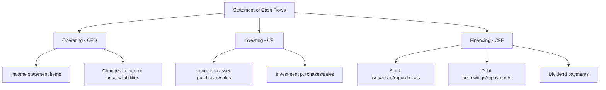
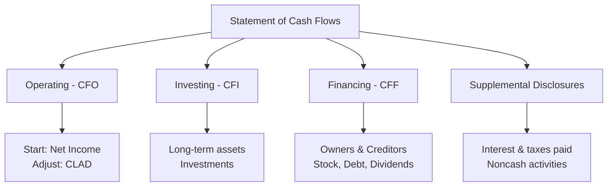

# Statement of Cash Flows

The **statement of cash flows** reports all cash inflows and outflows during a period, classified into three categories: **operating**, **investing**, and **financing** activities. It reconciles the beginning and ending cash balances and answers: _Where did cash come from, and where did it go?_

:::info[Key Concept]

The statement of cash flows bridges the accrual-basis income statement to actual cash movements. An entity can report strong net income but still face a cash crisis — or vice versa.

:::

---

## Cash and Cash Equivalents

**Cash** includes currency on hand and demand deposits.
**Cash equivalents** are short-term, highly liquid investments that are:

- Readily convertible to known amounts of cash
- So near maturity that they present **insignificant risk** of value changes
- Original maturity of **three months or less** from the date of purchase

  :::tip[Exam Tip — Three-Month Rule]
  A 6-month Treasury bill purchased with 2 months remaining is **not** a cash equivalent (original maturity > 3 months). A 90-day certificate of deposit **is** a cash equivalent.
  :::

  | Cash Equivalent? | Instrument | Reason |
  |---|---|---|
  | ✅ | 60-day T-bill | Original maturity ≤ 3 months |
  | ✅ | Money market fund | Readily convertible, negligible risk |
  | ❌ | 6-month CD | Original maturity > 3 months |
  | ❌ | Equity securities | Not "near maturity" — subject to price risk |

---

## Three Sections of the Statement

### Operating Activities (CFO)

Cash flows from the entity's **principal revenue-producing activities**. These generally involve income statement items and changes in current assets and current liabilities.
**Cash inflows:**

- Cash received from customers
- Interest and dividends received
- Insurance proceeds from operations
  **Cash outflows:**
- Cash paid to suppliers and employees
- Cash paid for interest
- Cash paid for income taxes
- Cash paid for operating expenses

  :::warning[Important Classifications]
  Under U.S. GAAP:
- **Interest paid** → Operating (even though it relates to financing)
- **Interest received** → Operating
- **Dividends received** → Operating
- **Dividends paid** → **Financing** (not operating!)
- **Income taxes paid** → Operating (unless directly attributable to investing/financing)
  :::

### Investing Activities (CFI)

Cash flows from acquiring and disposing of **long-term assets** and other investments not classified as cash equivalents.
**Cash inflows:**

- Sale of PP&E
- Sale of investments (debt and equity securities)
- Collection of loan principal (notes receivable)
- Sale of a business unit
  **Cash outflows:**
- Purchase of PP&E
- Purchase of investments
- Making loans to other entities (notes receivable)
- Acquisition of a business

### Financing Activities (CFF)

Cash flows from transactions with **owners** and **creditors** that affect long-term capital structure.
**Cash inflows:**

- Issuance of common or preferred stock
- Issuance of bonds or long-term notes payable
- Borrowings from banks (long-term)
  **Cash outflows:**
- Repurchase of treasury stock
- Payment of cash dividends
- Repayment of long-term debt principal
- Payment of finance lease principal



---

## Indirect Method (Most Common)

The indirect method starts with **net income** and adjusts for noncash items and changes in operating assets and liabilities. This is the method most commonly used in practice and most commonly tested.

### The CLAD Framework

:::tip[CLAD Mnemonic]

Use **CLAD** to remember the adjustments from net income to cash from operations:
| Letter | Adjustment | Direction |
|---|---|---|
| **C** | **C**urrent asset/liability changes | See rules below |
| **L** | **L**osses add back / Gains subtract | Reverse direction |
| **A** | **A**mortization, depreciation, depletion | Add back |
| **D** | **D**eferred items (deferred tax, deferred revenue changes) | Adjust accordingly |

:::

### Current Asset and Liability Changes

| Change                                                          | Effect on Cash from Operations |
| --------------------------------------------------------------- | ------------------------------ |
| Current asset **increases** (e.g., AR goes up)                  | **Subtract** (used cash)       |
| Current asset **decreases** (e.g., inventory goes down)         | **Add** (freed up cash)        |
| Current liability **increases** (e.g., AP goes up)              | **Add** (conserved cash)       |
| Current liability **decreases** (e.g., wages payable goes down) | **Subtract** (used cash)       |

:::tip[Exam Tip]

Think of it this way: If a current **asset** increased, the company spent cash to build up that asset — so subtract. If a current **liability** increased, the company held onto cash by not paying — so add.

:::

### Losses and Gains

Gains and losses from investing/financing activities (e.g., gain on sale of equipment) are removed from operating activities because the **total** cash from the transaction is classified elsewhere.

- **Add back losses** (they reduced net income but didn't use operating cash)
- **Subtract gains** (they increased net income but the cash is in investing)

### Depreciation, Amortization, Depletion

These are **noncash expenses** that reduced net income. Add them back to convert from accrual to cash basis.

## Indirect Method Example

**Bear Co.** reports the following for the year ended December 31:
| Item | Amount |
|---|---:|
| Net income | \$180,000 |
| Depreciation expense | 45,000 |
| Amortization of patent | 5,000 |
| Gain on sale of equipment | (12,000) |
| Loss on sale of investment | 8,000 |
| Increase in accounts receivable | (25,000) |
| Decrease in inventory | 15,000 |
| Increase in accounts payable | 10,000 |
| Decrease in wages payable | (3,000) |
| Increase in deferred tax liability | 7,000 |
**Cash flows from operating activities — Indirect method:**
| Bear Co. — Operating Activities | Amount |
|---|---:|
| Net income | \$180,000 |
| **Adjustments:** | |
| &emsp;Depreciation expense | 45,000 |
| &emsp;Amortization of patent | 5,000 |
| &emsp;Gain on sale of equipment | (12,000) |
| &emsp;Loss on sale of investment | 8,000 |
| &emsp;Increase in accounts receivable | (25,000) |
| &emsp;Decrease in inventory | 15,000 |
| &emsp;Increase in accounts payable | 10,000 |
| &emsp;Decrease in wages payable | (3,000) |
| &emsp;Increase in deferred tax liability | 7,000 |
| **Net cash provided by operating activities** | **\$230,000** |

---

## Direct Method

The direct method reports **actual cash receipts and payments** from operating activities. It provides more detailed information but is rarely used in practice.
| Bear Co. — Operating Activities (Direct Method) | Amount |
|---|---:|
| Cash received from customers | \$975,000 |
| Cash paid to suppliers | (580,000) |
| Cash paid to employees | (210,000) |
| Cash paid for interest | (25,000) |
| Cash paid for income taxes | (55,000) |
| **Net cash provided by operating activities** | **\$105,000** |

### Converting Accrual to Cash (Direct Method Formulas)

$$
\text{Cash from Customers} = \text{Revenue} - \Delta\text{AR} + \Delta\text{Unearned Revenue}
$$

$$
\text{Cash to Suppliers} = \text{COGS} + \Delta\text{Inventory} - \Delta\text{AP}
$$

$$
\text{Cash for Operating Expenses} = \text{OpEx} + \Delta\text{Prepaids} - \Delta\text{Accrued Liabilities}
$$

:::note

If the direct method is used, a **reconciliation** of net income to cash from operations (essentially the indirect method) must be presented in a supplemental schedule.

:::

---

## Complete Statement Example

**Polar Co. — Statement of Cash Flows (Year Ended December 31)**
| | Amount |
|---|---:|
| **Cash flows from operating activities:** | |
| Net income | \$250,000 |
| Depreciation expense | 60,000 |
| Loss on sale of equipment | 5,000 |
| Increase in accounts receivable | (30,000) |
| Decrease in prepaid expenses | 4,000 |
| Increase in accounts payable | 18,000 |
| Decrease in income tax payable | (6,000) |
| **Net cash from operating activities** | **\$301,000** |
| | |
| **Cash flows from investing activities:** | |
| Purchase of equipment | (120,000) |
| Proceeds from sale of equipment | 15,000 |
| Purchase of AFS securities | (50,000) |
| **Net cash used in investing activities** | **(\$155,000)** |
| | |
| **Cash flows from financing activities:** | |
| Proceeds from issuance of common stock | 75,000 |
| Repayment of long-term note payable | (40,000) |
| Payment of cash dividends | (60,000) |
| Purchase of treasury stock | (25,000) |
| **Net cash used in financing activities** | **(\$50,000)** |
| | |
| **Net increase in cash and cash equivalents** | **\$96,000** |
| Cash and cash equivalents, beginning of year | 84,000 |
| **Cash and cash equivalents, end of year** | **\$180,000** |

---

## Supplemental Disclosures

Even when using the indirect method, certain items must be **separately disclosed**:

### Required Supplemental Information

| Disclosure                 | Reason                                                     |
| -------------------------- | ---------------------------------------------------------- |
| Cash paid for interest     | Interest is in operating, but users want the actual amount |
| Cash paid for income taxes | Same — actual cash flow matters for analysis               |

### Noncash Investing and Financing Activities

Significant noncash transactions must be disclosed either in a supplemental schedule or in the notes. These transactions are **excluded** from the statement of cash flows because no cash changed hands.
**Common examples:**

- Conversion of bonds to common stock
- Acquisition of assets through capital (finance) lease
- Issuance of stock for land or other assets
- Exchange of noncash assets
  **Example — Grizzly Inc. acquires land by issuing stock:**

```journal
Dr. Land                    200,000
    Cr. Common stock             10,000
    Cr. APIC                    190,000
```

This transaction would appear as a noncash investing/financing disclosure:

> _Supplemental schedule of noncash investing and financing activities: The Company acquired land valued at \$200,000 by issuing 10,000 shares of common stock._

---

## Classification of Specific Items

:::warning[Frequently Tested Classifications]

| Transaction | Section |
|---|---|
| Cash received from customers | **Operating** |
| Interest paid | **Operating** |
| Interest received | **Operating** |
| Dividends received | **Operating** |
| Income taxes paid | **Operating** |
| **Dividends paid** | **Financing** |
| Purchase of PP&E | **Investing** |
| Sale of investment | **Investing** |
| Proceeds from issuing stock | **Financing** |
| Repayment of debt principal | **Financing** |
| Purchase of treasury stock | **Financing** |
| Payment of finance lease principal | **Financing** |
| Payment of operating lease principal | **Operating** |
| Insurance proceeds (operating claim) | **Operating** |
| Insurance proceeds (from PP&E destruction) | **Investing** |

:::

---

## Journal Entry Connections

Understanding journal entries helps classify cash flows correctly.
**Example — Kodiak Partners purchases equipment for cash:**

```journal
Dr. Equipment        80,000
    Cr. Cash             80,000
```

→ **Investing activity** — cash outflow of \$80,000
**Example — Kodiak Partners issues bonds:**

```journal
Dr. Cash             500,000
    Cr. Bonds payable    500,000
```

→ **Financing activity** — cash inflow of \$500,000
**Example — Kodiak Partners pays dividends:**

```journal
Dr. Dividends payable    30,000
    Cr. Cash                  30,000
```

→ **Financing activity** — cash outflow of \$30,000
**Example — Kodiak Partners collects on notes receivable:**

```journal
Dr. Cash             25,000
    Cr. Notes receivable    25,000
```

→ **Investing activity** — cash inflow of \$25,000 (principal collection)

## Summary



:::danger[Common Exam Pitfalls]

1. Classifying **dividends paid** as operating — they are **financing**.
2. Classifying **interest paid** as financing — it is **operating** under U.S. GAAP.
3. Forgetting to **remove gains** from operating activities (the cash is already in investing).
4. Including **noncash transactions** in the statement — they go in supplemental disclosures.
5. Confusing the direction of current asset/liability changes — increases in assets **subtract**; increases in liabilities **add**.
6. Treating **depreciation** as a cash inflow — it is merely an add-back of a noncash expense.
   :::

---

## Practice Problem

Cub Entertainment provides the following data for the year:

- Net income: \$320,000
- Depreciation: \$75,000
- Gain on sale of building: \$40,000
- Proceeds from sale of building: \$190,000
- Purchase of equipment: \$250,000
- Issuance of common stock: \$100,000
- Repayment of bonds payable: \$150,000
- Dividends paid: \$80,000
- Increase in accounts receivable: \$35,000
- Decrease in accounts payable: \$20,000
- Conversion of preferred stock to common stock: \$50,000
**Required:** Prepare the statement of cash flows using the indirect method.
<details>
<summary>Solution</summary>
| Cub Entertainment — Statement of Cash Flows | Amount |
|---|---:|
| **Operating activities:** | |
| Net income | \$320,000 |
| Depreciation | 75,000 |
| Gain on sale of building | (40,000) |
| Increase in accounts receivable | (35,000) |
| Decrease in accounts payable | (20,000) |
| **Net cash from operating** | **\$300,000** |
| **Investing activities:** | |
| Proceeds from sale of building | 190,000 |
| Purchase of equipment | (250,000) |
| **Net cash used in investing** | **(\$60,000)** |
| **Financing activities:** | |
| Issuance of common stock | 100,000 |
| Repayment of bonds payable | (150,000) |
| Dividends paid | (80,000) |
| **Net cash used in financing** | **(\$130,000)** |
| **Net increase in cash** | **\$110,000** |
**Noncash disclosure:** Conversion of \$50,000 preferred stock to common stock.
</details>
