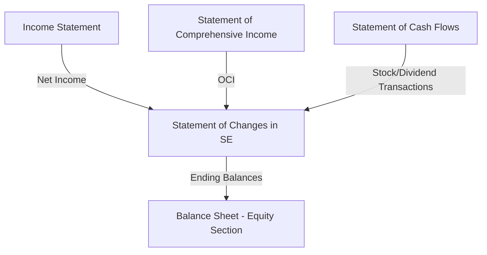

# Statement of Changes in Stockholders' Equity

The **statement of changes in stockholders' equity** (also called the **statement of shareholders' equity**) reconciles the beginning and ending balances of each component of equity for the reporting period. It provides a comprehensive view of all transactions that affected owners' equity.

:::info[Key Concept]

While the balance sheet shows equity at a point in time and the income statement shows one period's earnings, this statement ties them together — showing _how_ equity moved from the beginning to the end of the period.

:::

---

## Purpose and Importance

This statement answers several critical questions:

1. How much did the company earn and retain vs. distribute as dividends?
2. Did the company issue or repurchase stock?
3. What happened to accumulated other comprehensive income?
4. What is the overall change in each equity component?

   :::tip[Exam Tip]
   Under U.S. GAAP, the statement of changes in stockholders' equity is a **required** financial statement. It cannot be replaced by a statement of retained earnings alone.
   :::

---

## Components of Stockholders' Equity

| Component                                         | Description                                                                                  |
| ------------------------------------------------- | -------------------------------------------------------------------------------------------- |
| **Common stock**                                  | Par value × shares issued                                                                    |
| **Preferred stock**                               | Par value × preferred shares issued                                                          |
| **Additional paid-in capital (APIC)**             | Excess over par from stock issuances, stock option exercises, and other capital transactions |
| **Retained earnings**                             | Cumulative net income less cumulative dividends declared                                     |
| **Accumulated other comprehensive income (AOCI)** | Cumulative PUFI items                                                                        |
| **Treasury stock**                                | Cost of reacquired shares (contra equity)                                                    |
| **Noncontrolling interest**                       | Equity attributable to minority owners in consolidated subsidiaries                          |

---

## Items That Affect Equity

### Increases to Equity

| Transaction                             | Components Affected                         |
| --------------------------------------- | ------------------------------------------- |
| Net income                              | Retained earnings ↑                         |
| Other comprehensive income (positive)   | AOCI ↑                                      |
| Issuance of common stock                | Common stock ↑, APIC ↑                      |
| Issuance of preferred stock             | Preferred stock ↑, APIC ↑                   |
| Exercise of stock options               | Common stock ↑, APIC ↑ (net effect)         |
| Reissuance of treasury stock above cost | Treasury stock ↓ (contra decreases), APIC ↑ |

### Decreases to Equity

| Transaction                                | Components Affected                                                  |
| ------------------------------------------ | -------------------------------------------------------------------- |
| Net loss                                   | Retained earnings ↓                                                  |
| Other comprehensive loss                   | AOCI ↓                                                               |
| Dividends declared (cash or property)      | Retained earnings ↓                                                  |
| Purchase of treasury stock                 | Treasury stock ↑ (contra increases, equity decreases)                |
| Stock dividends declared                   | Retained earnings ↓, Common stock ↑, APIC ↑ (net zero equity effect) |
| Prior period adjustment (error correction) | Retained earnings adjusted (restate beginning balance)               |

---

## Journal Entry Examples

### Stock Issuance

**Bear Co. issues 5,000 shares of \$2 par common stock at \$18 per share:**

```journal
Dr. Cash                   90,000
    Cr. Common stock           10,000
    Cr. APIC                   80,000
```

### Cash Dividend Declaration and Payment

**Bear Co. declares a \$1.50 per share cash dividend on 50,000 shares outstanding:**

```journal
Dr. Retained earnings      75,000
    Cr. Dividends payable      75,000
```

```journal
Dr. Dividends payable      75,000
    Cr. Cash                   75,000
```

### Treasury Stock Purchase (Cost Method)

**Bear Co. repurchases 2,000 shares at \$20 per share:**

```journal
Dr. Treasury stock         40,000
    Cr. Cash                   40,000
```

### Stock Dividend (Small — Less Than 20-25%)

**Gies Co. declares a 10% stock dividend on 100,000 shares outstanding. Market price is \$25; par value is \$1:**

- New shares issued: 100,000 × 10% = 10,000 shares
- Recorded at **market value** for small stock dividends

```journal
Dr. Retained earnings      250,000
    Cr. Common stock            10,000
    Cr. APIC                   240,000
```

:::note

A small stock dividend (< 20-25%) is recorded at **fair market value**. A large stock dividend (≥ 20-25%) is recorded at **par value**. Stock splits require no journal entry — only a memo entry.

:::

### Prior Period Adjustment

**MAS Inc. discovers it understated depreciation expense by \$30,000 in the prior year (tax rate 25%):**

```journal
Dr. Retained earnings (prior period adjustment)    22,500
Dr. Deferred tax asset                              7,500
    Cr. Accumulated depreciation                       30,000
```

## This adjustment is shown as a restatement of the **beginning balance** of retained earnings.

## Format and Presentation

The statement is typically presented in a **columnar format**, with each equity component as a column and each transaction as a row.

### Example Statement — Kingfisher Industries

**Statement of Changes in Stockholders' Equity — Year Ended December 31**
| | Common Stock | APIC | Retained Earnings | AOCI | Treasury Stock | Total |
|---|---:|---:|---:|---:|---:|---:|
| **Balance, Jan. 1** | \$50,000 | \$400,000 | \$320,000 | \$15,000 | (\$30,000) | **\$755,000** |
| Net income | — | — | 180,000 | — | — | 180,000 |
| Other comprehensive income | — | — | — | 12,000 | — | 12,000 |
| Stock issuance (3,000 shares) | 3,000 | 42,000 | — | — | — | 45,000 |
| Cash dividends declared | — | — | (60,000) | — | — | (60,000) |
| Treasury stock purchased | — | — | — | — | (20,000) | (20,000) |
| **Balance, Dec. 31** | **\$53,000** | **\$442,000** | **\$440,000** | **\$27,000** | **(\$50,000)** | **\$912,000** |

---

## Retained Earnings Reconciliation

The retained earnings column can be thought of as its own mini-statement:

$$
\text{Ending RE} = \text{Beginning RE} + \text{Net Income} - \text{Dividends Declared} \pm \text{Prior Period Adjustments}
$$

**Example — Illini Security:**
| Retained Earnings Reconciliation | Amount |
|---|---:|
| Beginning retained earnings (as previously reported) | \$500,000 |
| Prior period adjustment — error correction (net of tax) | (22,500) |
| **Beginning retained earnings (as restated)** | **\$477,500** |
| Add: Net income | 200,000 |
| Less: Cash dividends declared | (50,000) |
| Less: Stock dividends declared | (100,000) |
| **Ending retained earnings** | **\$527,500** |

---

## AOCI Rollforward

The AOCI column tracks cumulative other comprehensive income items:
| AOCI Rollforward | Amount |
|---|---:|
| Beginning AOCI | \$15,000 |
| Unrealized gain on AFS debt securities (net of tax) | 8,000 |
| Foreign currency translation loss (net of tax) | (4,000) |
| Pension adjustment (net of tax) | (3,000) |
| Reclassification to net income (net of tax) | (2,000) |
| **Ending AOCI** | **\$14,000** |

---

## Comprehensive Example with All Components

**BIF Partners — Statement of Changes in Stockholders' Equity**
| | Preferred Stock | Common Stock | APIC | Retained Earnings | AOCI | Treasury Stock | Total |
|---|---:|---:|---:|---:|---:|---:|---:|
| **Jan. 1 balance** | \$100,000 | \$25,000 | \$275,000 | \$410,000 | \$8,000 | (\$15,000) | **\$803,000** |
| Net income | — | — | — | 195,000 | — | — | 195,000 |
| OCI — AFS gain | — | — | — | — | 11,000 | — | 11,000 |
| OCI — Translation loss | — | — | — | — | (5,000) | — | (5,000) |
| Issuance of common | — | 5,000 | 70,000 | — | — | — | 75,000 |
| Cash dividends | — | — | — | (40,000) | — | — | (40,000) |
| Preferred dividends | — | — | — | (8,000) | — | — | (8,000) |
| Treasury stock purchased | — | — | — | — | — | (25,000) | (25,000) |
| **Dec. 31 balance** | **\$100,000** | **\$30,000** | **\$345,000** | **\$557,000** | **\$14,000** | **(\$40,000)** | **\$1,006,000** |

---

## Relationship to Other Statements



:::warning

The statement of changes in stockholders' equity is the **linking statement** — it connects the period statements (income, comprehensive income, cash flows) to the point-in-time balance sheet.

:::

---

## Noncontrolling Interest

For consolidated financial statements, the **noncontrolling interest (NCI)** is presented as a separate component of equity. Changes in NCI are shown as an additional column.
| | ... | NCI | Total Equity |
|---|---:|---:|---:|
| **Beginning balance** | ... | \$45,000 | ... |
| Net income attributable to NCI | ... | 12,000 | ... |
| OCI attributable to NCI | ... | 2,000 | ... |
| Dividends to NCI | ... | (5,000) | ... |
| **Ending balance** | ... | **\$54,000** | ... |

---

:::danger[Common Exam Pitfalls]

1. Confusing **dividends declared** (reduces RE when declared) with **dividends paid** (cash flow event). RE is reduced at **declaration**, not payment.
2. Forgetting that a **stock split** does not require a journal entry or change to total equity — only par value per share and shares outstanding change.
3. Recording large stock dividends at **market value** instead of **par value**.
4. Failing to present **prior period adjustments** as a restatement of beginning retained earnings rather than in current-period income.
5. Omitting the **AOCI** column — it is a required component of the equity statement.
   :::

---

## Practice Problem

Illini Entertainment provides the following information for the year ended December 31:

- Beginning common stock (\$1 par): \$40,000
- Beginning APIC: \$360,000
- Beginning retained earnings: \$280,000
- Beginning AOCI: \$10,000
- Beginning treasury stock: (\$20,000)
- Net income: \$150,000
- OCI — Unrealized gain on AFS (net of tax): \$7,000
- OCI — Translation loss (net of tax): (\$3,000)
- Cash dividends declared: \$45,000
- Issued 5,000 shares at \$22 per share
- Purchased 1,000 shares of treasury stock at \$19 per share
**Required:** Prepare the statement of changes in stockholders' equity and calculate ending total equity.
<details>
<summary>Solution</summary>
| | Common Stock | APIC | Retained Earnings | AOCI | Treasury Stock | Total |
|---|---:|---:|---:|---:|---:|---:|
| **Beginning** | \$40,000 | \$360,000 | \$280,000 | \$10,000 | (\$20,000) | **\$670,000** |
| Net income | — | — | 150,000 | — | — | 150,000 |
| OCI — AFS gain | — | — | — | 7,000 | — | 7,000 |
| OCI — Translation loss | — | — | — | (3,000) | — | (3,000) |
| Stock issuance | 5,000 | 105,000 | — | — | — | 110,000 |
| Cash dividends | — | — | (45,000) | — | — | (45,000) |
| Treasury stock | — | — | — | — | (19,000) | (19,000) |
| **Ending** | **\$45,000** | **\$465,000** | **\$385,000** | **\$14,000** | **(\$39,000)** | **\$870,000** |
</details>
