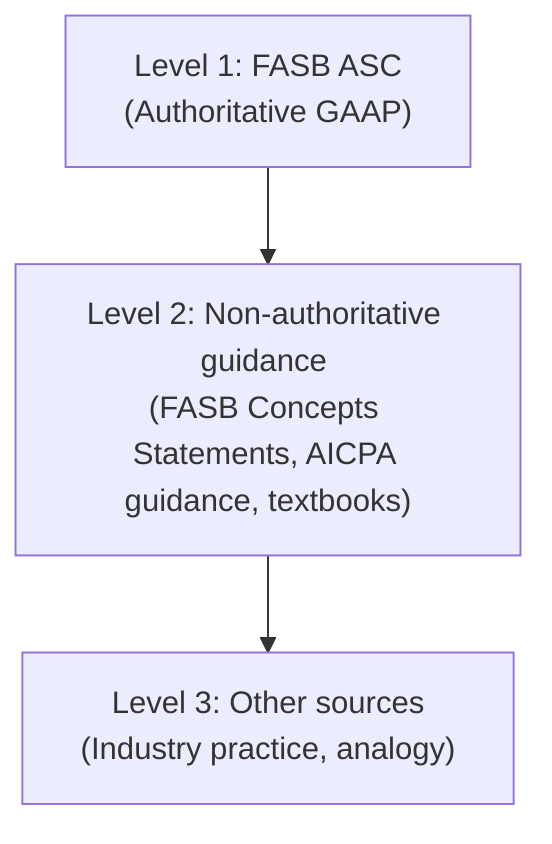

# Introduction to FAR

## What Is FAR?

The **Financial Accounting and Reporting (FAR)** section of the CPA Exam evaluates a candidate's knowledge of the accounting standards, principles, and frameworks used to prepare and analyze financial statements. Of the four CPA Exam sections, FAR is widely regarded as the most content-heavy and technically demanding.

:::info[Exam Structure]

FAR is one of four sections of the Uniform CPA Examination, alongside AUD (Auditing and Attestation), REG (Taxation and Regulation), and ISC/TCP/BAR (discipline sections). You must pass all sections within a rolling 30-month window.

:::

---

## Key Content Areas

The FAR blueprint—published by the AICPA—organizes tested material into several broad areas:
| Content Area | Description | Approximate Weight |
|---|---|---|
| **Conceptual Framework & Standards** | GAAP hierarchy, FASB framework, qualitative characteristics | 10–20% |
| **Financial Statement Accounts** | Assets, liabilities, equity, revenue, expenses | 25–35% |
| **Transactions & Events** | Leases, bonds, contingencies, stock compensation, pensions | 20–30% |
| **State & Local Governments** | Fund accounting, government-wide statements, GASB standards | 10–20% |
| **Not-for-Profit Entities** | Contributions, net asset classifications, NFP reporting | 5–10% |
| **SEC & IFRS Differences** | Key differences from U.S. GAAP, SEC reporting requirements | 5–10% |

:::warning[Content Weights May Shift]

The AICPA periodically updates the CPA Exam blueprint. Always verify the latest version at **aicpa.org** before finalizing your study plan.

:::

---

## Financial Reporting Standards

### U.S. GAAP and the FASB

U.S. Generally Accepted Accounting Principles (**GAAP**) are the authoritative standards that govern financial reporting for non-governmental entities in the United States. The **Financial Accounting Standards Board (FASB)** is the primary standard-setter.
The FASB issues guidance through the **Accounting Standards Codification (ASC)**, which organizes all authoritative GAAP into a single, searchable system. When studying FAR, you will frequently reference ASC topics such as:

- **ASC 606** – Revenue from Contracts with Customers
- **ASC 842** – Leases
- **ASC 350** – Intangibles—Goodwill and Other
- **ASC 820** – Fair Value Measurement
- **ASC 450** – Contingencies

### The GAAP Hierarchy

The GAAP hierarchy determines which sources of guidance are authoritative:



:::tip[Exam Tip]

For the CPA Exam, always apply **authoritative GAAP (ASC)** unless the question explicitly states otherwise (e.g., IFRS or cash basis).

:::

### The SEC

The **Securities and Exchange Commission (SEC)** has legal authority over financial reporting for publicly traded companies. While the SEC generally defers to the FASB for standard-setting, it issues its own rules through:

- **Regulation S-X** – Form and content of financial statements
- **Regulation S-K** – Non-financial disclosures
- **Staff Accounting Bulletins (SABs)** – Interpretive guidance

### IFRS and the IASB

The **International Accounting Standards Board (IASB)** issues **International Financial Reporting Standards (IFRS)**. While the CPA Exam primarily tests U.S. GAAP, you should be aware of key differences between GAAP and IFRS, particularly in areas such as:

- Inventory (LIFO is prohibited under IFRS)
- Development costs (can be capitalized under IFRS if criteria are met)
- Revaluation of long-lived assets (permitted under IFRS)
- Component depreciation (required under IFRS)

---

## Study Tips and Approach

### 1. Build a Strong Foundation First

Start with the conceptual framework and financial statement elements before diving into complex topics like leases or pensions. Understanding _why_ a rule exists makes it far easier to remember.

### 2. Master Journal Entries

FAR is fundamentally about the **accounting equation**: Assets = Liabilities + Equity. Nearly every topic comes back to journal entries. Practice writing them by hand.
For example, if Bear Co. issues 10,000 shares of \$1 par common stock at \$15 per share:

```journal
Dr. Cash                      150,000
    Cr. Common Stock              10,000
    Cr. Additional Paid-in Capital 140,000
```

### 3. Use Active Recall and Spaced Repetition

Passive reading is not enough. After studying a topic:

- Close the book and write down everything you remember
- Revisit the topic 1 day, 3 days, and 7 days later
- Use flashcards for key definitions and formulas

### 4. Practice Under Exam Conditions

Time yourself on practice problems. The CPA Exam includes multiple-choice questions (MCQs) and task-based simulations (TBSs). Both formats require speed and accuracy.

### 5. Focus on High-Weight Topics

Allocate study time proportional to exam weight. Spending three weeks on governmental accounting while ignoring revenue recognition would be a strategic error.

:::note

Government and not-for-profit topics feel unfamiliar to most candidates, but they are very testable. Budget adequate time for these areas even though the weight is lower.

:::

---

## How This Textbook Is Organized

This textbook follows a logical progression designed to build your knowledge systematically:
| Part | Topics |
|---|---|
| **Part 1: Foundation** | Conceptual framework, financial statement elements, general-purpose financial statements |
| **Part 2: Assets** | Cash, receivables, inventory, PP&E, intangibles, investments |
| **Part 3: Liabilities** | Current liabilities, long-term debt, bonds, leases, contingencies, pensions |
| **Part 4: Equity** | Common and preferred stock, retained earnings, treasury stock, dividends, stock compensation |
| **Part 5: Revenue & Expenses** | ASC 606 revenue recognition, expense recognition, income taxes |
| **Part 6: Financial Statement Presentation** | Income statement, balance sheet, statement of cash flows, comprehensive income, EPS |
| **Part 7: Special Topics** | Business combinations, consolidations, foreign currency, derivatives, fair value |
| **Part 8: Government & NFP** | Fund accounting, government-wide statements, GASB standards, NFP reporting |

:::tip[Navigation]

Use the sidebar to jump to any topic. Each chapter includes learning objectives, worked examples, journal entries, and practice questions.

:::

---

## Conventions Used in This Textbook

Throughout this textbook, you will encounter several recurring conventions:

- **Journal entries** appear in `journal` code blocks with debits listed first and credits indented
- **Dollar amounts** are shown with the \$ symbol (e.g., \$50,000)
- **Math formulas** use KaTeX notation: $$\text{Net Income} = \text{Revenue} - \text{Expenses}$$
- **Company names** in examples include Bear Co., Gies Co., MAS Inc., BIF Partners, Kingfisher Industries, Illini Entertainment, and Illini Security
- **Admonitions** highlight tips, warnings, and important notes using colored callout boxes

  :::danger[Common Pitfall]
  Many candidates underestimate FAR because they "already know accounting." The CPA Exam tests nuance—specific rules, exceptions, and edge cases that go well beyond introductory coursework. Treat every topic with fresh eyes.
  :::

---

## Let's Get Started

Turn to the next section—**Conceptual Framework for Financial Reporting**—to begin building the foundation that every other FAR topic rests upon.
