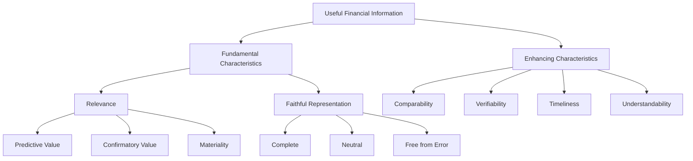
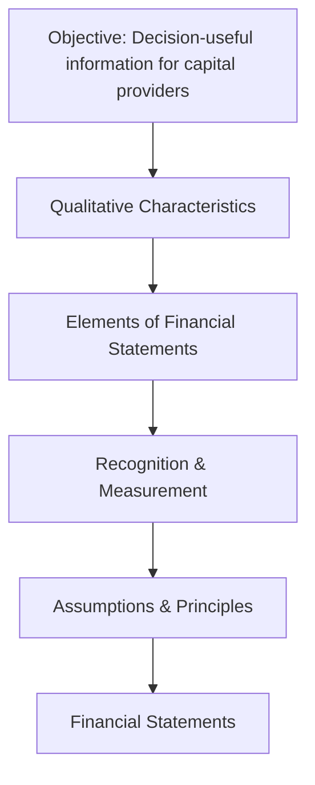

# Conceptual Framework for Financial Reporting

## Overview

The **FASB Conceptual Framework** is a coherent system of interrelated objectives and fundamental concepts that guides the development of accounting standards and the preparation of financial statements. Think of it as the "constitution" of financial reporting—it does not prescribe specific rules, but it provides the foundation upon which all specific standards (ASC topics) are built.
The framework is articulated primarily through **Statements of Financial Accounting Concepts (SFACs)**:
| SFAC | Title | Status |
|---|---|---|
| SFAC No. 5 | Recognition and Measurement in Financial Statements | Active |
| SFAC No. 6 | Elements of Financial Statements | Active |
| SFAC No. 7 | Using Cash Flow Information and Present Value in Accounting Measurements | Active |
| SFAC No. 8 | Conceptual Framework for Financial Reporting | Active (superseded SFAC 1 & 2) |
:::info
SFACs are **not** authoritative GAAP. They are non-authoritative guidance that helps the FASB develop standards and helps preparers reason through situations where no specific standard exists.
:::

---

## Objective of General-Purpose Financial Reporting (SFAC No. 8, Chapter 1)

The primary objective of general-purpose financial reporting is to provide **financial information about the reporting entity that is useful to existing and potential investors, lenders, and other creditors** in making decisions about providing resources to the entity.
These decision-makers need information to assess:

1. **Future net cash inflows** to the entity
2. **Management's stewardship** of the entity's economic resources
3. The entity's **economic resources and claims** against it (financial position)
4. **Changes** in economic resources and claims (financial performance)
   :::tip Exam Tip
   The objective focuses on **decision-usefulness** for **capital providers** (investors and creditors)—not managers, regulators, or the general public. This is a frequently tested concept.
   :::

### Example

Gies Co. is considering whether to extend a \$500,000 line of credit to Kingfisher Industries. Gies Co. will review Kingfisher's financial statements to evaluate:

- Whether Kingfisher has sufficient assets to cover its existing obligations
- Whether Kingfisher's revenue trends suggest the ability to repay
- Whether Kingfisher's cash flow from operations is positive and stable
  This is precisely the kind of decision the conceptual framework is designed to support.

---

## Qualitative Characteristics of Useful Financial Information (SFAC No. 8, Chapter 3)

For financial information to be useful, it must possess certain **qualitative characteristics**. These are organized into two tiers:

### Fundamental Characteristics

These are **required** for information to be useful. Both must be present.

#### 1. Relevance

Information is relevant if it is capable of making a difference in a decision. Relevant information has:

- **Predictive value** – helps users form expectations about future outcomes
- **Confirmatory value** – provides feedback about prior evaluations
- **Materiality** – information is material if omitting or misstating it could influence decisions (entity-specific threshold)
  $$\text{Relevance} = \text{Predictive Value} + \text{Confirmatory Value}$$
  :::note Materiality
  Materiality is an entity-specific aspect of relevance. There is no universal dollar threshold. What is material for a small company like BIF Partners may be immaterial for a Fortune 500 corporation.
  :::

#### 2. Faithful Representation

Information faithfully represents economic phenomena when it is:

- **Complete** – includes all information necessary for the user to understand the phenomenon
- **Neutral** – free from bias in selection or presentation
- **Free from error** – no errors or omissions in the description of the phenomenon (does not require perfect precision—estimates are acceptable if properly described)
  :::warning
  "Faithful representation" replaced the older term "reliability" in SFAC No. 8. The exam uses the newer terminology.
  :::

### Enhancing Characteristics

These **improve** the usefulness of information that is already relevant and faithfully represented:
| Characteristic | Description |
|---|---|
| **Comparability** | Users can identify similarities and differences between entities or periods |
| **Verifiability** | Different knowledgeable observers could reach consensus that the information is faithfully represented |
| **Timeliness** | Information is available to decision-makers before it loses its capacity to influence decisions |
| **Understandability** | Information is classified, characterized, and presented clearly and concisely |



### The Cost Constraint

## The **cost constraint** (also called the cost-benefit constraint) is a pervasive consideration: the benefits of reporting financial information should justify the costs incurred to provide it. This is not a qualitative characteristic—it is a constraint on useful reporting.

## Elements of Financial Statements (SFAC No. 6)

SFAC No. 6 defines **ten elements** of financial statements. These are the building blocks from which all financial statements are constructed.

### Balance Sheet Elements (Stock Concepts)

| Element                 | Definition                                                                                                                  |
| ----------------------- | --------------------------------------------------------------------------------------------------------------------------- |
| **Assets**              | Probable future economic benefits obtained or controlled by an entity as a result of past transactions or events            |
| **Liabilities**         | Probable future sacrifices of economic benefits arising from present obligations as a result of past transactions or events |
| **Equity (Net Assets)** | The residual interest in the assets after deducting liabilities: $$\text{Equity} = \text{Assets} - \text{Liabilities}$$     |

### Income Statement Elements (Flow Concepts)

| Element      | Definition                                                                                                                                                                                                  |
| ------------ | ----------------------------------------------------------------------------------------------------------------------------------------------------------------------------------------------------------- |
| **Revenues** | Inflows or enhancements of assets (or settlements of liabilities) from delivering goods, rendering services, or other activities that constitute the entity's ongoing major or central operations           |
| **Expenses** | Outflows or using up of assets (or incurrences of liabilities) from delivering goods, rendering services, or carrying out other activities that constitute the entity's ongoing major or central operations |
| **Gains**    | Increases in equity from peripheral or incidental transactions (not from revenues or investments by owners)                                                                                                 |
| **Losses**   | Decreases in equity from peripheral or incidental transactions (not from expenses or distributions to owners)                                                                                               |

### Other Elements

| Element                     | Definition                                                                                                                                                                                                                                        |
| --------------------------- | ------------------------------------------------------------------------------------------------------------------------------------------------------------------------------------------------------------------------------------------------- |
| **Comprehensive Income**    | The change in equity during a period from non-owner sources. Includes net income plus other comprehensive income (OCI) items such as unrealized gains/losses on AFS securities, foreign currency translation adjustments, and pension adjustments |
| **Investments by Owners**   | Increases in equity from transfers of assets to the entity by owners                                                                                                                                                                              |
| **Distributions to Owners** | Decreases in equity from transfers of assets from the entity to owners (dividends)                                                                                                                                                                |

:::tip Revenue vs. Gain
**Revenue** arises from an entity's _central_ operations. **Gains** arise from _peripheral_ transactions. For Bear Co. (a retail company), selling merchandise generates **revenue**. Selling a delivery truck at a profit generates a **gain**. The underlying event (an increase in net assets) is similar, but the classification depends on the nature of the entity's operations.
:::

---

## Recognition and Measurement Concepts

### Recognition Criteria

An item should be **recognized** (recorded in the financial statements) when it meets all four criteria:

1. It meets the **definition** of a financial statement element
2. It has a relevant **attribute** that can be measured with sufficient reliability
3. The information is **relevant** — capable of making a difference in user decisions
4. The information is **faithfully represented** — reliable enough to be depended upon

### Measurement Attributes

GAAP uses several measurement attributes depending on the type of asset or liability:
| Attribute | Description | Example |
|---|---|---|
| **Historical cost** | Original transaction price | PP&E at acquisition cost |
| **Current cost (replacement cost)** | Cost to acquire an equivalent asset today | Inventory under LCM/LCNRV |
| **Current market value (fair value)** | Price in an orderly transaction between market participants | Trading securities |
| **Net realizable value (NRV)** | Expected selling price less costs to complete and sell | Accounts receivable (net of allowance) |
| **Present value of future cash flows** | Discounted value of expected cash flows | Long-term notes receivable, bonds |
:::info
Fair value measurement (ASC 820) uses a three-level hierarchy: Level 1 (quoted prices in active markets), Level 2 (observable inputs), and Level 3 (unobservable inputs). Level 1 is most reliable; Level 3 requires the most judgment.
:::

---

## Underlying Assumptions

Four foundational assumptions underlie all financial reporting under GAAP:

### 1. Economic Entity Assumption

The activities of the business are **separate and distinct** from the activities of its owners and other entities. Bear Co.'s financial statements do not include the personal expenses of its CEO.

### 2. Going Concern Assumption

The entity will continue to operate for the **foreseeable future**—long enough to carry out its existing commitments. This assumption justifies reporting assets at cost rather than liquidation value.
:::danger
If there is **substantial doubt** about an entity's ability to continue as a going concern, management must evaluate whether its plans can mitigate that doubt. Disclosure is required under ASC 205-40 regardless of mitigation.
:::

### 3. Monetary Unit Assumption

Financial statements are expressed in a **stable monetary unit** (e.g., U.S. dollars). This assumption ignores the effects of inflation and deflation—a \$100,000 building purchased in 2000 is reported at \$100,000 on the balance sheet even if its purchasing power has changed.

### 4. Periodicity (Time Period) Assumption

## The economic life of a business can be divided into **artificial time periods** (months, quarters, years) for reporting purposes. This assumption enables interim and annual financial reporting.

## Principles of Financial Reporting

### 1. Historical Cost Principle (Measurement Principle)

Assets and liabilities are initially recorded at their **original transaction price**. However, GAAP increasingly permits or requires fair value measurement for certain items (e.g., trading securities, derivatives).
**Example:** MAS Inc. purchases equipment for \$80,000. The equipment is recorded at \$80,000 regardless of its appraised market value:

```journal
Dr. Equipment                  80,000
    Cr. Cash                       80,000
```

### 2. Revenue Recognition Principle (ASC 606)

Revenue is recognized when (or as) the entity satisfies a **performance obligation** by transferring a promised good or service to a customer. The five-step model:

1. Identify the contract with a customer
2. Identify the performance obligations in the contract
3. Determine the transaction price
4. Allocate the transaction price to performance obligations
5. Recognize revenue when (or as) each performance obligation is satisfied
   **Example:** Illini Entertainment sells a \$120 annual streaming subscription on July 1. Revenue is recognized at \$10 per month as the service is delivered:

```journal
July 1 — Cash received
Dr. Cash                       120
    Cr. Unearned Revenue           120
July 31 — One month of service delivered
Dr. Unearned Revenue           10
    Cr. Service Revenue            10
```

### 3. Expense Recognition (Matching) Principle

Expenses are recognized in the **same period** as the related revenue. This ensures that the income statement reflects the true cost of generating revenue during a period.
Three approaches to matching:
| Approach | When Used | Example |
|---|---|---|
| **Direct association (cause & effect)** | A direct link exists between the cost and revenue | Cost of goods sold matched to sales revenue |
| **Systematic and rational allocation** | The cost benefits multiple periods | Depreciation of equipment over its useful life |
| **Immediate recognition** | The cost has no future benefit or cannot be reliably allocated | Advertising expense, CEO salary |

### 4. Full Disclosure Principle

Financial statements should include all information necessary to **prevent them from being misleading**. Disclosure is provided through:

- The face of the financial statements
- Notes (footnotes) to the financial statements
- Supplementary information and schedules
  :::note
  Notes to the financial statements are an **integral part** of the statements—not optional appendices. The first note typically describes significant accounting policies (ASC 235).
  :::

---

## Accrual Basis vs. Cash Basis Accounting

### Accrual Basis (GAAP)

Under the accrual basis, transactions are recognized when the **economic event occurs**, regardless of when cash changes hands:

- **Revenue** is recognized when the performance obligation is satisfied
- **Expenses** are recognized when incurred (when the benefit is consumed or the obligation arises)

### Cash Basis (Non-GAAP)

Under the cash basis, transactions are recognized only when **cash is received or paid**:

- Revenue is recognized when cash is received
- Expenses are recognized when cash is paid
  :::warning
  The cash basis is **not** GAAP. The CPA Exam assumes accrual basis unless explicitly stated otherwise. However, you may be asked to convert between cash and accrual basis—a very common exam question.
  :::

### Conversion Example

Illini Security reported \$300,000 of cash collected from customers during the year. Additional information:
| Item | Beginning of Year | End of Year |
|---|---|---|
| Accounts Receivable | \$40,000 | \$55,000 |
| Unearned Revenue | \$10,000 | \$6,000 |
**Accrual-basis revenue:**
$$\text{Revenue} = \text{Cash Collected} + \Delta\text{AR} + \Delta\text{Unearned Revenue (decrease)}$$
$$\text{Revenue} = \$300{,}000 + (\$55{,}000 - \$40{,}000) - (\$6{,}000 - \$10{,}000)$$
$$\text{Revenue} = \$300{,}000 + \$15{,}000 + \$4{,}000 = \$319{,}000$$
The increase in accounts receivable means revenue was earned but not yet collected (\$15,000 more). The decrease in unearned revenue means previously collected cash was earned this period (\$4,000 more).

---

## Putting It All Together

The conceptual framework creates a logical hierarchy:



:::tip Key Takeaway
When you encounter an unfamiliar accounting question on the exam, return to first principles: Does the item meet the definition of an element? Can it be measured reliably? Is the information relevant? The conceptual framework is your fallback reasoning tool.
:::

---

## Summary

| Concept                   | Key Points                                                                                                                           |
| ------------------------- | ------------------------------------------------------------------------------------------------------------------------------------ |
| **Objective**             | Provide decision-useful information to investors, lenders, and creditors                                                             |
| **Fundamental qualities** | Relevance (predictive + confirmatory value) and faithful representation (complete, neutral, free from error)                         |
| **Enhancing qualities**   | Comparability, verifiability, timeliness, understandability                                                                          |
| **Elements**              | Assets, liabilities, equity, revenues, expenses, gains, losses, comprehensive income, investments by owners, distributions to owners |
| **Assumptions**           | Economic entity, going concern, monetary unit, periodicity                                                                           |
| **Principles**            | Historical cost, revenue recognition, matching, full disclosure                                                                      |
| **Constraint**            | Cost-benefit                                                                                                                         |
| **Basis**                 | Accrual basis is GAAP; cash basis is not                                                                                             |
