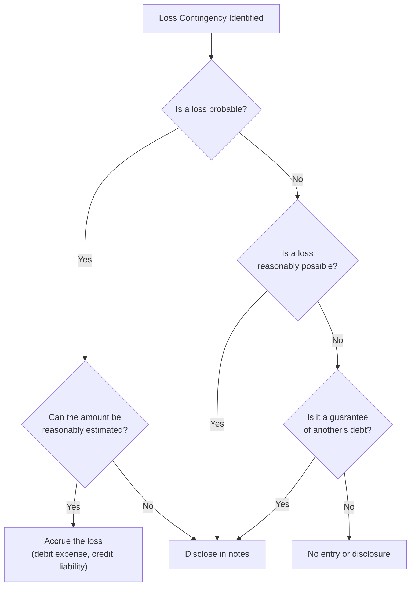

import Tabs from '@theme/Tabs';
import TabItem from '@theme/TabItem';

# Current Liabilities and Contingencies

## Module 1 — Payables and Accrued Liabilities

### Liabilities Defined

Under ASC 405 and the FASB Conceptual Framework, a **liability** is a present obligation arising from past events whose settlement requires a probable future sacrifice of economic benefits. Three essential characteristics define a liability:

1. A **present obligation** to transfer assets or provide services
2. The obligation is **unavoidable** — it results from a past transaction or event
3. The transaction or event creating the obligation has **already occurred**

:::info

On the CPA exam, look for all three characteristics: (1) a **present obligation**, (2) arising from a **past transaction**, that (3) will result in a **probable future sacrifice** of economic benefits. If any element is missing, no liability exists.

:::

---

### Current vs. Non-Current Classification

A liability is classified as **current** if it is expected to be settled within **one year** or the **operating cycle**, whichever is longer. All other obligations are classified as non-current.

| Classification | Criteria | Examples |
|---|---|---|
| **Current** | Due within 1 year or operating cycle | Accounts payable, accrued wages, current portion of long-term debt |
| **Non-current** | Due beyond 1 year or operating cycle | Bonds payable, long-term notes, lease obligations |

:::warning

If a company violates a long-term debt covenant at the balance sheet date and the lender has **not** waived the violation before the financial statements are issued, the **entire** long-term debt must be reclassified as current — even if the lender grants a waiver afterward.

:::

---

### Trade Accounts Payable

Trade accounts payable arise from purchasing goods or services on credit. When a vendor offers cash discount terms (e.g., 2/10, n/30), the buyer may record the payable using the **gross method** or the **net method**.

<Tabs>
<TabItem value="gross" label="Gross Method" default>

Under the gross method, the payable is initially recorded at the **full invoice price**. The discount is recognized only if payment is made within the discount period.

Bear Co. purchases inventory for \$50,000 with terms 2/10, n/30:

**At purchase:**
```journal
Dr. Inventory[a] 50,000
    Cr. Accounts payable[l] 50,000
```

**If paid within 10 days (discount taken):**
```journal
Dr. Accounts payable[l] 50,000
    Cr. Cash[a] 49,000
    Cr. Purchase discounts 1,000
```

**If paid after 10 days (discount lapsed):**
```journal
Dr. Accounts payable[l] 50,000
    Cr. Cash[a] 50,000
```

</TabItem>
<TabItem value="net" label="Net Method">

Under the net method, the payable is initially recorded at the **net amount** (invoice less discount). If the company fails to pay within the discount window, the extra cost is recorded as **purchase discounts lost** — a financing expense.

Bear Co. purchases inventory for \$50,000 with terms 2/10, n/30:

**At purchase (recorded net of 2% discount):**
```journal
Dr. Inventory[a] 49,000
    Cr. Accounts payable[l] 49,000
```

**If paid within 10 days:**
```journal
Dr. Accounts payable[l] 49,000
    Cr. Cash[a] 49,000
```

**If paid after 10 days (discount lost):**
```journal
Dr. Accounts payable[l] 49,000
Dr. Purchase discounts lost 1,000
    Cr. Cash[a] 50,000
```

</TabItem>
</Tabs>

:::tip[Exam Tip]

The **net method** is considered theoretically superior because it treats lost discounts as a **financing cost**, which more accurately reflects the economic reality. However, the **gross method** is more common in practice.

:::

---

### Trade Notes Payable

A **trade note payable** is a formal written promise to pay a specified amount on a definite date. Unlike accounts payable, notes payable carry an explicit **stated interest rate** and a defined maturity.

Polar Co. issues a 6-month, 9%, \$80,000 note payable to a supplier on October 1:

```journal
Oct 1
Dr. Inventory[a] 80,000
    Cr. Notes payable[l] 80,000
```

At December 31, Polar Co. accrues 3 months of interest:

$$
\text{Interest} = \$80{,}000 \times 9\% \times \frac{3}{12} = \$1{,}800
$$

```journal
Dec 31
Dr. Interest expense 1,800
    Cr. Interest payable[l] 1,800
```

At maturity (April 1), Polar Co. pays the note plus the remaining 3 months of interest:

```journal
Apr 1
Dr. Notes payable[l] 80,000
Dr. Interest payable[l] 1,800
Dr. Interest expense 1,800
    Cr. Cash[a] 83,600
```

---

### Interest Payable Accruals

Interest payable must be accrued at each reporting date for any outstanding obligation. The general formula is:

$$
\text{Accrued Interest} = \text{Principal} \times \text{Annual Rate} \times \frac{\text{Months Outstanding}}{12}
$$

:::note

Even when interest is paid semiannually or annually, the company must accrue interest from the last payment date through the balance sheet date under the **matching principle**.

:::

---

### Current Portion of Long-Term Debt

The portion of any long-term obligation that is due within the next 12 months must be reclassified as a **current liability** on the balance sheet.

Grizzly Inc. has a \$300,000 term loan requiring annual principal payments of \$60,000. At year-end, the balance sheet presentation is:

| Line Item | Amount |
|---|---|
| Current portion of long-term debt | \$60,000 |
| Long-term debt (net of current portion) | \$240,000 |

:::tip[Exam Tip]

An exception exists for short-term obligations expected to be **refinanced** on a long-term basis. If the company has the **intent and ability** to refinance (demonstrated by a refinancing agreement or actual refinancing before the statements are issued), the obligation may remain classified as non-current.

:::

---

### Accrued Liabilities

Accrued liabilities represent expenses that have been **incurred** but not yet **paid**. Common accruals include wages, utilities, and rent.

Kodiak Partners has a biweekly payroll of \$140,000. The pay period ends on Friday, January 3, but the fiscal year ends on Tuesday, December 31. Three of the ten working days in the pay period fall in the old year:

$$
\text{Accrued wages} = \$140{,}000 \times \frac{3}{10} = \$42{,}000
$$

```journal
Dec 31
Dr. Wages expense 42,000
    Cr. Wages payable[l] 42,000
```

When the payroll is paid on January 3:

```journal
Jan 3
Dr. Wages payable[l] 42,000
Dr. Wages expense 98,000
    Cr. Cash[a] 140,000
```

---

### Taxes Payable

Companies accrue several categories of taxes. Each is recorded as a current liability until remitted.

#### Property Taxes

Property taxes are typically assessed by local governments for the fiscal year. They should be accrued **ratably over the fiscal year** to which they relate.

Panda Industries receives a \$24,000 property tax assessment for the calendar year. Monthly accrual:

$$
\frac{\$24{,}000}{12} = \$2{,}000 \text{ per month}
$$

```journal
Jan 31
Dr. Property tax expense 2,000
    Cr. Property taxes payable[l] 2,000
```

#### Sales Taxes

Sales taxes collected from customers are held **in trust** and are never revenue to the seller — they are a liability from the moment of collection.

Cub Entertainment collects \$5,300 from a customer on a \$5,000 sale with 6% sales tax:

```journal
Dr. Cash[a] 5,300
    Cr. Sales revenue 5,000
    Cr. Sales taxes payable[l] 300
```

#### Income Taxes

Estimated income tax liabilities are accrued based on pretax income adjusted for permanent and temporary differences. This topic is covered in depth in the income taxes chapter, but the basic current liability entry is:

```journal
Dec 31
Dr. Income tax expense 75,000
    Cr. Income taxes payable[l] 75,000
```

---

### Payroll Taxes and Deductions

Payroll accounting requires careful distinction between **employer** payroll taxes and **employee** withholdings.

| Category | Paid By | Examples |
|---|---|---|
| **Employee withholdings** | Deducted from employee pay | Federal/state income tax, employee FICA, health insurance premiums |
| **Employer taxes** | Additional cost to employer | Employer FICA match, FUTA, SUTA |

Sloth Security has monthly gross payroll of \$200,000. Withholdings and employer taxes are:

| Item | Employee Portion | Employer Portion |
|---|---|---|
| FICA (Social Security 6.2% + Medicare 1.45%) | \$15,300 | \$15,300 |
| Federal income tax withheld | \$30,000 | — |
| State income tax withheld | \$8,000 | — |
| FUTA (0.6%) | — | \$1,200 |
| SUTA (2.0%) | — | \$4,000 |

**Record gross payroll and employee withholdings:**

```journal
Dr. Wages expense 200,000
    Cr. FICA taxes payable[l] 15,300
    Cr. Federal income taxes withheld[l] 30,000
    Cr. State income taxes withheld[l] 8,000
    Cr. Cash[a] 146,700
```

**Record employer payroll taxes:**

```journal
Dr. Payroll tax expense 20,500
    Cr. FICA taxes payable[l] 15,300
    Cr. FUTA taxes payable[l] 1,200
    Cr. SUTA taxes payable[l] 4,000
```

:::warning

Employee withholdings are **not** an expense to the employer — they are part of gross wages already expensed. The employer simply acts as an agent to remit these amounts to the government. Only the **employer's matching share** of FICA, FUTA, and SUTA creates additional payroll tax expense.

:::

---

### Compensated Absences (Vacation and Sick Pay)

Under ASC 710-10, a liability for **compensated absences** (vacation, sick leave) is accrued when all four conditions are met:

1. The obligation relates to services **already rendered**
2. The rights **vest** or **accumulate**
3. Payment is **probable**
4. The amount is **reasonably estimable**

:::info

- **Vested** rights: The employer must pay even if the employee terminates.
- **Accumulated** rights: Unused days carry forward to future periods.
- **Sick pay** that accumulates but does not vest need **not** be accrued (optional accrual is permitted).

:::

Bear Co. grants employees 10 vacation days per year that vest on December 31. At year-end, 50 employees have earned but unused vacation worth an average of \$240 per day:

$$
\text{Accrual} = 50 \text{ employees} \times 10 \text{ days} \times \$240 = \$120{,}000
$$

```journal
Dec 31
Dr. Vacation expense 120,000
    Cr. Vacation liability[l] 120,000
```

---

### Self-Insurance

Some companies choose to self-insure rather than purchase insurance from a third party. Under GAAP, a company **cannot** accrue a liability for self-insured risks before a loss occurs. The rationale is that no past event has given rise to a present obligation — the company is simply assuming future risk.

:::caution

A common exam trap: self-insurance is **not** a recognized liability until an actual loss event occurs. You cannot accrue for hurricanes, lawsuits, or equipment breakdowns that have not yet happened, regardless of how probable they seem.

:::

Once a loss event occurs (e.g., a fire destroys self-insured inventory), the company records the loss:

```journal
Dr. Fire loss 250,000
    Cr. Inventory[a] 250,000
```

---

### Exit or Disposal Activities (ASC 420)

Under ASC 420, costs associated with an **exit or disposal activity** are recognized as a liability when incurred — not when the company commits to an exit plan.

#### Key Cost Categories

| Cost Type | Recognition Point |
|---|---|
| **Involuntary termination benefits** (one-time) | When the plan is communicated to employees and they are not required to render future service |
| **Contract termination costs** | At the cease-use date (when the company stops using the right conveyed by the contract) |
| **Other associated costs** (relocation, consolidation) | When incurred |

Grizzly Inc. announces a plant closure on November 15 and communicates a one-time termination package of \$500,000 to affected employees who will be terminated on December 31. No future service is required:

```journal
Nov 15
Dr. Restructuring expense 500,000
    Cr. Restructuring liability[l] 500,000
```

Grizzly Inc. also has a non-cancelable operating lease on the plant with 24 months remaining at \$10,000/month. The cease-use date is December 31. At the cease-use date, the remaining obligation (net of estimated sublease rentals) is recognized:

$$
\text{Liability} = (24 \times \$10{,}000) - \text{Expected sublease income}
$$

:::note

Under ASC 420, if termination benefits require employees to render service beyond a **minimum retention period** (more than 60 days), the cost is recognized **ratably** over the future service period rather than immediately.

:::

---

### Asset Retirement Obligations (ASC 410-20)

An **asset retirement obligation (ARO)** is a legal obligation to dismantle, remove, or remediate a long-lived asset upon retirement. The obligation is recognized at **fair value** when incurred, with a corresponding increase to the carrying amount of the related asset (called the **asset retirement cost**, or ARC).

#### Initial Recognition

The ARO is measured at the **present value** of the estimated future retirement cost:

$$
\text{ARO (initial)} = \frac{\text{Estimated Future Cost}}{(1 + r)^n}
$$

Panda Industries installs an offshore oil platform on January 1, Year 1. The estimated removal cost in 20 years is \$5,000,000, and the credit-adjusted risk-free rate is 6%:

$$
\text{ARO} = \frac{\$5{,}000{,}000}{(1.06)^{20}} = \$1{,}559{,}023
$$

```journal
Jan 1, Year 1
Dr. Oil platform (ARC)[a] 1,559,023
    Cr. Asset retirement obligation[l] 1,559,023
```

#### Subsequent Measurement

After initial recognition, two things happen each period:

| Item | Treatment |
|---|---|
| **ARO liability** | Increases via **accretion expense** (interest on the growing obligation) |
| **ARC (asset)** | Decreases via **depreciation** over the asset's useful life |

**Year 1 accretion expense:**

$$
\text{Accretion} = \$1{,}559{,}023 \times 6\% = \$93{,}541
$$

```journal
Dec 31, Year 1
Dr. Accretion expense 93,541
    Cr. Asset retirement obligation[l] 93,541
```

**Year 1 depreciation of ARC** (straight-line over 20 years):

$$
\text{Depreciation} = \frac{\$1{,}559{,}023}{20} = \$77{,}951
$$

```journal
Dec 31, Year 1
Dr. Depreciation expense 77,951
    Cr. Accumulated depreciation — oil platform[ca] 77,951
```

:::tip[Exam Tip]

Over time, the ARO liability **grows** via accretion until it reaches the full estimated removal cost at the end of the asset's useful life. The ARC component of the asset is **fully depreciated** over the same period. When the asset is retired, any difference between the ARO liability and the actual settlement cost is a **gain or loss on settlement**.

:::

---

## Module 2 — Contingencies and Commitments

### Contingencies Defined

A **contingency** is an existing condition, situation, or set of circumstances involving uncertainty about a possible **gain** or **loss** that will be resolved when one or more future events occur or fail to occur (ASC 450).

Key distinction: the **condition already exists** at the balance sheet date — only the **outcome** is uncertain.

---

### Three Likelihood Categories

The accounting treatment for contingencies depends on the **likelihood** of the future event:

| Likelihood | Definition | Loss Treatment | Gain Treatment |
|---|---|---|---|
| **Probable** | Likely to occur | Accrue if estimable; disclose | **Disclose only** — never accrue |
| **Reasonably possible** | More than remote but less than probable | Disclose only | Disclose only |
| **Remote** | Slight chance of occurring | Generally ignore | Ignore |

:::warning

**Gain contingencies are never accrued** — doing so would recognize revenue before it is realized. Even if a gain is deemed probable, the company may only disclose it in the notes. This is an application of **conservatism**.

:::

---

### Loss Contingencies — Accrual and Disclosure

A loss contingency is **accrued** (recognized as a liability and expense) when **both** conditions are met:

1. It is **probable** that a liability has been incurred as of the balance sheet date
2. The amount of the loss can be **reasonably estimated**

If only one condition is met, the contingency is **disclosed** in the notes but not accrued.

#### When a Range of Estimates Exists

| Scenario | Amount to Accrue |
|---|---|
| Single best estimate within the range | The **best estimate** |
| No best estimate identifiable | The **minimum** of the range |

:::info

Under IFRS (IAS 37), when no best estimate exists within a range, the **midpoint** is accrued. Under U.S. GAAP, the **minimum** is accrued. This is a common exam comparison.

:::

#### Example — Lawsuit

Kodiak Partners is the defendant in a lawsuit as of December 31, Year 1. Legal counsel advises that a loss is **probable**, and estimates the loss between \$200,000 and \$500,000 with no amount more likely than another.

Under U.S. GAAP, accrue the minimum:

```journal
Dec 31, Year 1
Dr. Litigation loss 200,000
    Cr. Litigation liability[l] 200,000
```

Kodiak Partners must also **disclose** in the notes the nature of the lawsuit and the possible additional exposure of up to \$300,000 above the accrued amount.

#### Example — Reasonably Possible

Cub Entertainment is involved in patent infringement litigation. Legal counsel advises a loss is **reasonably possible** in the range of \$100,000 to \$400,000.

- **No journal entry** is recorded
- The nature of the contingency and the range of possible loss are **disclosed in the notes**

#### Example — Remote

Bear Co. is named in a frivolous lawsuit. Legal counsel deems the likelihood of loss as **remote**.

- **No journal entry** and generally **no disclosure** required

:::caution

**Exception for remote contingencies:** Guarantees of the indebtedness of others must be **disclosed** even when the likelihood of loss is remote. This includes loan guarantees and standby letters of credit.

:::

---

### Gain Contingencies

Gain contingencies are subject to a stricter standard than loss contingencies:

| Likelihood | Treatment |
|---|---|
| **Probable** | Disclose in notes — do **not** accrue |
| **Reasonably possible** | Disclose in notes |
| **Remote** | No disclosure required |

Polar Co. files a lawsuit against a competitor for patent infringement and expects a favorable outcome. Even though legal counsel considers a gain **probable**, Polar Co. may only disclose the expected gain in the notes:

> *"The Company is the plaintiff in a patent infringement action. While the outcome cannot be determined with certainty, management believes a favorable resolution is probable."*

The gain is recognized only when **realized** — typically when a court judgment is rendered or a settlement is finalized.

---

### Premiums and Warranties

Product warranties and premium offers are accounted for as **loss contingencies** under ASC 450 because the obligation arises from a past event (the sale), a loss is probable, and the amount can be reasonably estimated.

#### Warranty Expense Accrual

<Tabs>
<TabItem value="expense" label="Expense Warranty (Accrual)" default>

Under the **expense warranty approach** (also called the accrual approach), the estimated warranty cost is recognized as an expense in the **same period as the sale** (matching principle).

Panda Industries sells 1,000 units at \$500 each during Year 1. Historical data indicates that 5% of units will require warranty service at an average cost of \$60 per unit:

$$
\text{Estimated warranty cost} = 1{,}000 \times 5\% \times \$60 = \$3{,}000
$$

```journal
Dec 31, Year 1
Dr. Warranty expense 3,000
    Cr. Warranty liability[l] 3,000
```

During Year 2, Panda spends \$2,400 on actual warranty repairs:

```journal
Year 2
Dr. Warranty liability[l] 2,400
    Cr. Parts inventory[a] 1,600
    Cr. Wages payable[l] 800
```

</TabItem>
<TabItem value="sales" label="Sales Warranty (Deferred Revenue)">

When a warranty is sold **separately** (an extended warranty), the revenue is **deferred** and recognized over the warranty period because it represents a separate performance obligation under ASC 606.

Cub Entertainment sells a 2-year extended warranty for \$600:

```journal
At sale
Dr. Cash[a] 600
    Cr. Unearned warranty revenue[l] 600
```

Revenue recognized at the end of Year 1:

```journal
Dec 31, Year 1
Dr. Unearned warranty revenue[l] 300
    Cr. Warranty revenue 300
```

Actual warranty costs incurred in Year 1 are expensed as incurred:

```journal
Year 1
Dr. Warranty expense 180
    Cr. Cash[a] 180
```

</TabItem>
</Tabs>

#### Premium Offers

Premium offers (e.g., "send in 3 box tops and receive a free toy") create a liability similar to a warranty. The company estimates how many premiums will be redeemed and accrues accordingly.

Bear Co. sells cereal and offers a toy (cost \$2 each) for every 5 box tops returned. During Year 1, Bear Co. sells 100,000 boxes and estimates that 60% of box tops will be redeemed:

$$
\text{Expected redemptions} = 100{,}000 \times 60\% = 60{,}000 \text{ box tops}
$$

$$
\text{Premiums expected} = \frac{60{,}000}{5} = 12{,}000 \text{ toys}
$$

$$
\text{Premium expense} = 12{,}000 \times \$2 = \$24{,}000
$$

Bear Co. purchases 15,000 toys and distributes 8,000 during Year 1:

**Purchase of premiums inventory:**
```journal
Dr. Premiums inventory[a] 30,000
    Cr. Cash[a] 30,000
```

**Premiums distributed (8,000 toys × \$2):**
```journal
Dr. Premium expense 16,000
    Cr. Premiums inventory[a] 16,000
```

**Year-end accrual for remaining expected redemptions (12,000 − 8,000 = 4,000 toys × \$2):**
```journal
Dec 31
Dr. Premium expense 8,000
    Cr. Estimated premium liability[l] 8,000
```

---

### Summary — Decision Framework for Contingencies

The following decision tree summarizes the accounting treatment for loss contingencies:



:::tip[Final Exam Reminders]

- **Losses**: Probable + estimable → accrue. Range with no best estimate → accrue **minimum** (GAAP) or **midpoint** (IFRS).
- **Gains**: Never accrue — disclose only when probable or reasonably possible.
- **Warranties**: Accrue at point of sale using historical estimates (matching principle).
- **AROs**: Recognized at present value; accrete the liability and depreciate the ARC each period.
- **Exit activities**: Recognize when **incurred**, not when the plan is approved.
- **Self-insurance**: No accrual until an actual loss event occurs.

:::
