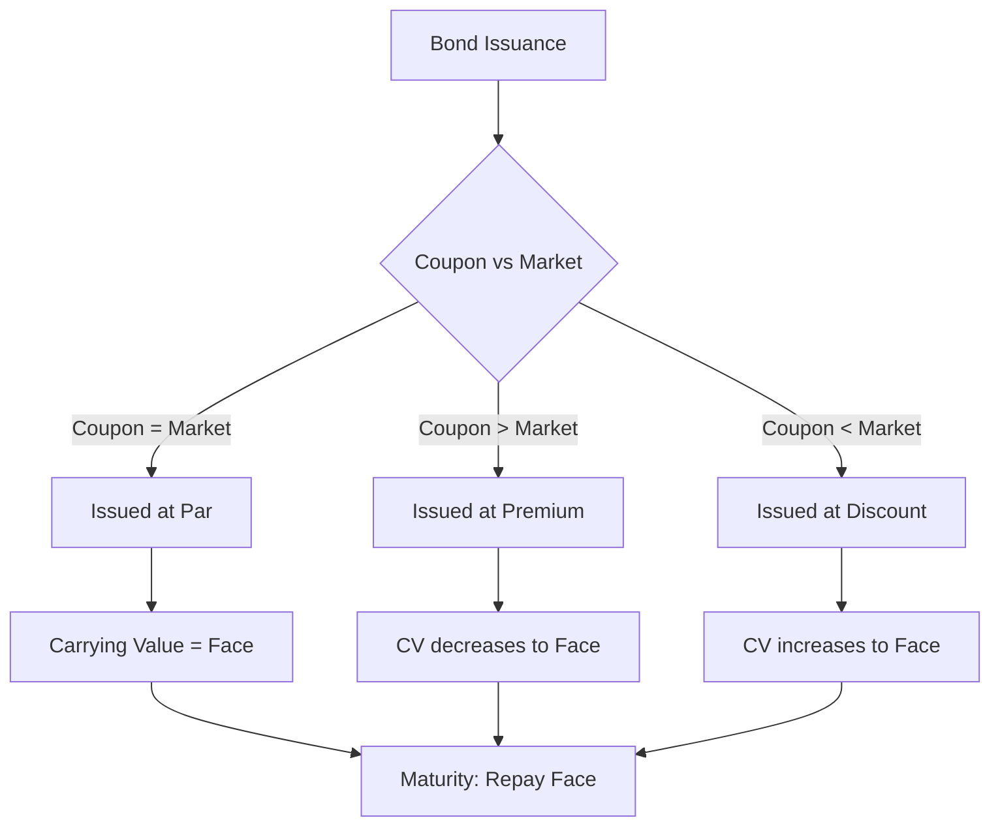

# Long-Term Liabilities & Bonds Payable

## Time Value of Money Overview

The time value of money (TVM) is the principle that a dollar received today is worth more than a dollar received in the future because of its earning potential. Two fundamental calculations underpin long-term liability accounting:

$$
\text{Present Value of a Single Sum} = \frac{FV}{(1 + r)^n}
$$

$$
\text{Present Value of an Ordinary Annuity} = PMT \times \frac{1 - (1 + r)^{-n}}{r}
$$

Where:

- $FV$ = future value
- $PMT$ = periodic payment
- $r$ = interest rate per period
- $n$ = number of periods

  :::info
  Bond pricing combines both formulas: the PV of the face value (single sum) plus the PV of the interest payments (annuity).
  :::

---

## Long-Term Liabilities Defined

## A **long-term liability** is an obligation not expected to be settled within one year or the operating cycle. Examples include bonds payable, long-term notes payable, lease obligations, and pension liabilities.

## Notes Payable at Present Value

Long-term notes payable are recorded at the **present value** of future cash flows using the market rate of interest at issuance.
Bear Co. issues a 3-year, \$100,000 note at 8% annual interest when the market rate is also 8%:

$$
\text{PV} = \$100{,}000 \times \frac{1}{(1.08)^3} + \$8{,}000 \times \frac{1 - (1.08)^{-3}}{0.08} = \$100{,}000
$$

When stated rate equals market rate, the note is issued at face value.

```journal
Dr. Cash                      100,000
    Cr. Notes payable                 100,000
```

### Noninterest-Bearing Notes

A **noninterest-bearing note** carries no stated interest rate. The market rate must be **imputed** to determine the present value. The difference between face value and PV is recorded as a **discount**.
Gies Co. issues a 2-year, \$50,000 noninterest-bearing note when the market rate is 10%:

$$
\text{PV} = \frac{\$50{,}000}{(1.10)^2} = \$41{,}322
$$

```journal
Dr. Cash                       41,322
Dr. Discount on notes payable   8,678
    Cr. Notes payable                  50,000
```

Interest expense in Year 1: \$41,322 × 10% = \$4,132

```journal
Dr. Interest expense            4,132
    Cr. Discount on notes payable       4,132
```

---

## Debt Covenants and Technical Default

Debt agreements often include **covenants** — restrictions such as maintaining a minimum current ratio or limiting dividend payments. Violation of a covenant constitutes a **technical default**.

:::warning

If a long-term debt covenant is violated at the balance sheet date and the lender has not waived the violation, the entire debt must be **reclassified as a current liability** — even if the lender later grants a waiver.

:::

An exception exists if the lender provides a waiver **before** the financial statements are issued (or available to be issued), and the company is expected to cure the violation within a specified grace period.

---

## Bonds Payable — Introduction

A **bond** is a formal debt instrument in which the issuer promises to pay the holder:

1. The **face (par) value** at maturity
2. Periodic **interest payments** (coupons) at the stated rate

### Types of Bonds

| Type            | Description                                   |
| --------------- | --------------------------------------------- |
| **Debenture**   | Unsecured; backed only by issuer's credit     |
| **Secured**     | Backed by specific collateral                 |
| **Convertible** | Can be converted into common stock            |
| **Callable**    | Issuer can retire early at a call price       |
| **Zero-coupon** | No periodic interest; issued at deep discount |

---

## Bond Terminology

| Term                          | Meaning                                         |
| ----------------------------- | ----------------------------------------------- |
| Face value                    | Par amount, typically \$1,000 per bond          |
| Coupon (stated) rate          | Rate used to compute periodic cash interest     |
| Effective (market/yield) rate | Rate investors demand; used for PV calculations |
| Maturity date                 | Date the face value is repaid                   |

The relationship between the coupon rate and the effective rate determines pricing:
| Coupon vs. Market | Issued At | Carrying Value |
|---|---|---|
| Coupon = Market | **Par** | Face value |
| Coupon > Market | **Premium** | Above face value |
| Coupon < Market | **Discount** | Below face value |

---

## Bond Pricing

MAS Inc. issues \$500,000 of 5-year, 8% bonds (semiannual payments) when the market rate is 10%.

- Semiannual coupon: \$500,000 × 8% ÷ 2 = \$20,000
- Periods: 5 × 2 = 10
- Market rate per period: 10% ÷ 2 = 5%
  $$
  \text{PV of face} = \frac{\$500{,}000}{(1.05)^{10}} = \$306{,}957
  $$
  $$
  \text{PV of annuity} = \$20{,}000 \times \frac{1 - (1.05)^{-10}}{0.05} = \$154{,}434
  $$
  $$
  \text{Issue price} = \$306{,}957 + \$154{,}434 = \$461{,}391
  $$
  The bond is issued at a **discount** of \$38,609.

```journal
Dr. Cash                      461,391
Dr. Discount on bonds payable  38,609
    Cr. Bonds payable                 500,000
```

---

## Carrying Value

$$
\text{Carrying Value} = \text{Face Value} - \text{Unamortized Discount}
$$

or

$$
\text{Carrying Value} = \text{Face Value} + \text{Unamortized Premium}
$$

## Over time, carrying value moves toward face value as the discount or premium is amortized.

## Bond Issue Costs

Under current GAAP (ASU 2015-03), bond issue costs are presented as a **direct deduction** from the carrying amount of the bond (similar to a discount), not as a deferred asset.

```journal
Dr. Discount on bonds payable  12,000
    Cr. Cash                           12,000
```

## These costs are amortized over the life of the bond using the effective interest method.

## Amortization Methods

### Straight-Line Method

Allocates equal discount or premium amortization each period. Permitted only if results are **not materially different** from the effective interest method.

$$
\text{Amortization per period} = \frac{\text{Total Discount (or Premium)}}{\text{Number of Periods}}
$$

Using MAS Inc.'s discount of \$38,609 over 10 periods:

$$
\text{Per period} = \frac{\$38{,}609}{10} = \$3{,}861
$$

```journal
Dr. Interest expense           23,861
    Cr. Discount on bonds payable       3,861
    Cr. Cash                           20,000
```

### Effective Interest Method (Required by GAAP)

This method produces a **constant interest rate** each period.

$$
\text{Interest Expense} = \text{Carrying Value} \times \text{Market Rate per Period}
$$

$$
\text{Amortization} = \text{Interest Expense} - \text{Cash Interest Paid}
$$

**Period 1 for MAS Inc.:**

$$
\text{Interest Expense} = \$461{,}391 \times 5\% = \$23{,}070
$$

$$
\text{Amortization} = \$23{,}070 - \$20{,}000 = \$3{,}070
$$

```journal
Dr. Interest expense           23,070
    Cr. Discount on bonds payable       3,070
    Cr. Cash                           20,000
```

New carrying value = \$461,391 + \$3,070 = \$464,461.

:::tip[Exam Tip]

For a **discount**, interest expense **increases** each period because the carrying value grows. For a **premium**, interest expense **decreases** because carrying value shrinks.

:::

---

## Bonds Issued Between Interest Dates

When bonds are issued between interest payment dates, the buyer pays the issuer **accrued interest** from the last interest date to the issue date.
BIF Partners issues \$200,000 of 6% bonds (semiannual, Jan 1 and Jul 1) at par on March 1:
Accrued interest: \$200,000 × 6% × 2/12 = \$2,000

```journal
Dr. Cash                      202,000
    Cr. Bonds payable                 200,000
    Cr. Interest payable                2,000
```

On July 1, BIF Partners pays full semiannual interest of \$6,000:

```journal
Dr. Interest payable            2,000
Dr. Interest expense            4,000
    Cr. Cash                            6,000
```

---

## Year-End Accrual

If the fiscal year-end does not coincide with an interest payment date, interest must be accrued.
Bear Co. has \$300,000 of 8% bonds (semiannual, Apr 1 and Oct 1) with a December 31 year-end. Accrued interest for Oct 1 – Dec 31 (3 months):

$$
\$300{,}000 \times 8\% \times \frac{3}{12} = \$6{,}000
$$

```journal
Dr. Interest expense            6,000
    Cr. Interest payable                6,000
```

---

## Troubled Debt Restructuring

A **troubled debt restructuring (TDR)** occurs when a creditor grants a concession to a debtor in financial difficulty that it would not otherwise consider.

### Debtor: Transfer of Assets

Kingfisher Industries settles a \$500,000 note by transferring land with a book value of \$300,000 and fair value of \$350,000:

```journal
Dr. Notes payable             500,000
    Cr. Land                          300,000
    Cr. Gain on disposition of land    50,000
    Cr. Gain on restructuring         150,000
```

### Debtor: Equity Transfer

If equity is issued instead, the shares are recorded at fair value, and the difference from the carrying amount of the debt is a restructuring gain.

### Modification of Terms

When terms are modified (lower rate, extended maturity, reduced principal), the debtor compares the **total future cash flows** under the new terms to the **carrying amount** of the debt:

- If future cash flows **exceed** carrying amount → no gain recognized; adjust effective interest rate prospectively
- If future cash flows are **less than** carrying amount → recognize gain for the difference; no future interest expense

### Creditor Impairment

The creditor measures the impairment as:

$$
\text{Impairment Loss} = \text{Carrying Amount} - \text{PV of Expected Future Cash Flows}
$$

## The PV is calculated using the **original effective interest rate** of the loan.

## Extinguishment / Retirement of Debt

When bonds are retired before maturity (called or repurchased on the open market), the difference between the **reacquisition price** and the **net carrying amount** is a gain or loss.

$$
\text{Gain (Loss)} = \text{Net Carrying Amount} - \text{Reacquisition Price}
$$

Illini Entertainment retires \$100,000 face value bonds (carrying value \$97,200) at 102:
Reacquisition price = \$100,000 × 102% = \$102,000

```journal
Dr. Bonds payable             100,000
    Cr. Discount on bonds payable       2,800
    Cr. Cash                          102,000
    Dr. Loss on extinguishment          4,800
```

Corrected entry:

```journal
Dr. Bonds payable             100,000
Dr. Loss on extinguishment      4,800
    Cr. Discount on bonds payable       2,800
    Cr. Cash                          102,000
```

:::note

The gain or loss on extinguishment is reported in **income from continuing operations**, not as an extraordinary item (ASU 2015-01 eliminated extraordinary item classification).

:::

---

## Summary



:::note[Chapter Checklist]

- [ ] Calculate PV for notes and bonds using TVM formulas
- [ ] Distinguish premium from discount issuances
- [ ] Apply straight-line and effective interest amortization
- [ ] Record bonds issued between interest dates and year-end accruals
- [ ] Account for troubled debt restructurings from debtor and creditor perspectives
- [ ] Calculate gain or loss on early extinguishment of debt
      :::
