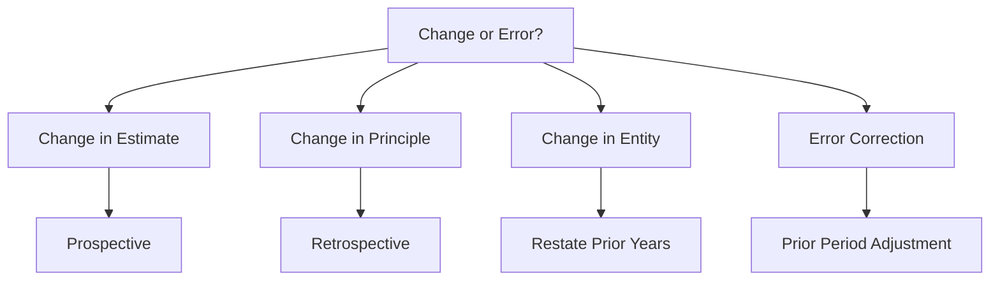

# Accounting Changes and Error Corrections

## Overview

ASC 250 governs how entities account for changes in accounting estimates, changes in accounting principles, changes in reporting entity, and corrections of errors. The treatment depends on the type of change.



---

## Changes in Accounting Estimate

A **change in estimate** results from new information, experience, or changed circumstances. Common examples include:

- Useful life of a depreciable asset
- Salvage value
- Allowance for doubtful accounts
- Warranty obligations
- Inventory obsolescence

### Treatment: Prospective

Changes in estimate are applied **prospectively** — in the current period and future periods. No retroactive adjustments are made.
**Example:** Bear Co. purchased equipment for \$120,000 with a \$0 salvage value and 10-year useful life (straight-line). After 4 years, Bear Co. revises the total useful life to 8 years.
Accumulated depreciation after 4 years:

$$
\frac{\$120{,}000}{10} \times 4 = \$48{,}000
$$

Remaining book value:

$$
\$120{,}000 - \$48{,}000 = \$72{,}000
$$

New annual depreciation for remaining 4 years (8 − 4):

$$
\frac{\$72{,}000}{4} = \$18{,}000
$$

```journal
Dr. Depreciation expense       18,000
    Cr. Accumulated depreciation        18,000
```

:::tip[Exam Tip]

A **change in depreciation method** (e.g., from double-declining balance to straight-line) is treated as a **change in estimate inseparable from a change in principle** and is accounted for **prospectively** — just like a change in estimate.

:::

---

## Changes in Accounting Principle

A **change in principle** occurs when an entity adopts a generally accepted accounting principle different from one previously used. Examples include:

- Changing from FIFO to weighted-average inventory
- Changing from cost model to revaluation model (if permitted)
- Adopting a new FASB standard that requires a change

### Treatment: Retrospective Application

Changes in principle are applied **retrospectively** by:

1. Adjusting the **beginning balance of retained earnings** for the earliest period presented (cumulative effect, net of tax)
2. Restating prior-period financial statements as if the new principle had always been used
3. Disclosing the nature and reason for the change
   **Example:** Gies Co. changes from FIFO to weighted-average for inventory on January 1, Year 3. The cumulative effect on prior years (net of tax) is a \$25,000 decrease in retained earnings.

```journal
Dr. Retained earnings          25,000
    Cr. Inventory                      25,000
```

The Year 1 and Year 2 financial statements (if presented comparatively) are restated using weighted-average.

:::warning[Exception — LIFO]

A change **to** LIFO from another method is an exception. It is impractical to retrospectively determine LIFO layers. Therefore, the beginning inventory in the year of change becomes the **first LIFO layer**, and no cumulative adjustment is made.

:::

### Indirect Effects

Indirect effects (such as changes in profit-sharing or royalty payments due to the principle change) are recognized in the period of change and disclosed but **not** reflected in retrospective restatement.

## Changes in Reporting Entity

A **change in entity** occurs when the reporting entity differs from the entity in prior periods. Examples include:

- Presenting consolidated statements instead of individual statements
- Changing the subsidiaries included in consolidation

### Treatment: Restate Prior Years

All prior-period financial statements presented are **restated** to reflect the new reporting entity, as if the current entity structure had always existed.

## Error Corrections

An **error** in previously issued financial statements may result from:

- Mathematical mistakes
- Mistakes in applying GAAP
- Oversight or misuse of facts
- Changing from a non-GAAP method to GAAP (treated as error correction, not change in principle)

### Treatment: Prior Period Adjustment

Errors are corrected through a **prior period adjustment** to the beginning balance of retained earnings (net of tax) in the earliest period presented.
**Example:** MAS Inc. discovers in Year 3 that it failed to record \$40,000 of depreciation expense in Year 1. The tax rate is 21%.
After-tax effect: \$40,000 × (1 − 0.21) = \$31,600

```journal
Dr. Retained earnings          31,600
Dr. Deferred tax asset          8,400
    Cr. Accumulated depreciation        40,000
```

:::danger

Changing from a **non-GAAP** method (e.g., cash basis) to a **GAAP** method (accrual basis) is treated as an **error correction**, not a change in principle.

:::

---

## Summary of Treatments

| Type                                       | Treatment               | Restate Priors? |
| ------------------------------------------ | ----------------------- | --------------- |
| Change in estimate                         | Prospective             | No              |
| Change in estimate/principle (inseparable) | Prospective             | No              |
| Change in principle                        | Retrospective           | Yes             |
| Change in entity                           | Restate                 | Yes             |
| Error correction                           | Prior period adjustment | Yes             |

---

## Adjusting Journal Entries

Adjusting entries are made at the **end of the accounting period** to ensure revenues and expenses are recorded in the correct period. There are strict rules:

:::info[Adjusting Entry Rules]

1. **Never involve cash** — cash entries are recorded when cash changes hands
2. Always involve **one income statement account** and **one balance sheet account**
3. Made at **year-end** (or period-end) before financial statements are prepared
   :::

### Four Types of Adjustments

#### 1. Accrued Revenue (Revenue Earned, Not Yet Received)

BIF Partners earned \$8,000 of consulting fees in December but will not bill until January:

```journal
Dr. Accounts receivable         8,000
    Cr. Consulting revenue              8,000
```

#### 2. Accrued Expense (Expense Incurred, Not Yet Paid)

Kingfisher Industries owes employees \$12,000 for work performed in the last week of December:

```journal
Dr. Wages expense              12,000
    Cr. Wages payable                  12,000
```

#### 3. Deferred Revenue (Revenue Received, Not Yet Earned)

Illini Entertainment received \$36,000 on October 1 for a 12-month subscription. At December 31, 3 months have been earned:
Original entry on October 1:

```journal
Dr. Cash                       36,000
    Cr. Unearned revenue               36,000
```

Adjusting entry on December 31 (\$36,000 × 3/12 = \$9,000):

```journal
Dr. Unearned revenue            9,000
    Cr. Subscription revenue            9,000
```

#### 4. Deferred Expense (Expense Paid, Not Yet Incurred)

Bear Co. paid \$24,000 on July 1 for a 12-month insurance policy. At December 31, 6 months have expired:
Original entry on July 1:

```journal
Dr. Prepaid insurance          24,000
    Cr. Cash                           24,000
```

Adjusting entry on December 31 (\$24,000 × 6/12 = \$12,000):

```journal
Dr. Insurance expense          12,000
    Cr. Prepaid insurance              12,000
```

---

## Correcting Entries vs. Adjusting Entries

| Feature        | Adjusting Entry         | Correcting Entry               |
| -------------- | ----------------------- | ------------------------------ |
| Timing         | End of period           | Anytime an error is discovered |
| Cash involved? | Never                   | May involve cash               |
| Purpose        | Match revenues/expenses | Fix mistakes                   |
| Accounts       | One IS + one BS         | Any combination                |

**Example of a correcting entry:** Gies Co. incorrectly debited Equipment \$5,000 for a repair expense:

```journal
Dr. Repairs expense             5,000
    Cr. Equipment                       5,000
```

---

## Statement of Retained Earnings — Error Correction Presentation

When a prior period error is corrected, the retained earnings statement shows:
| Line | Amount |
|---|---|
| Beginning retained earnings (as previously reported) | \$500,000 |
| Prior period adjustment (net of tax) | (\$31,600) |
| **Beginning retained earnings (as restated)** | **\$468,400** |
| Net income | \$120,000 |
| Dividends | (\$30,000) |
| **Ending retained earnings** | **\$558,400** |

---

## Disclosures

For all accounting changes and error corrections, entities must disclose:

- Nature and reason for the change
- Method of applying the change
- Effect on income from continuing operations, net income, and EPS
- Cumulative effect on retained earnings (for retrospective changes)

  :::note[Chapter Checklist]
- [ ] Classify changes as estimate, principle, entity, or error
- [ ] Apply prospective treatment for changes in estimate
- [ ] Apply retrospective treatment for changes in principle
- [ ] Recognize the LIFO exception
- [ ] Record prior period adjustments for error corrections (net of tax)
- [ ] Master the four types of adjusting entries
- [ ] Distinguish adjusting entries from correcting entries
      :::
