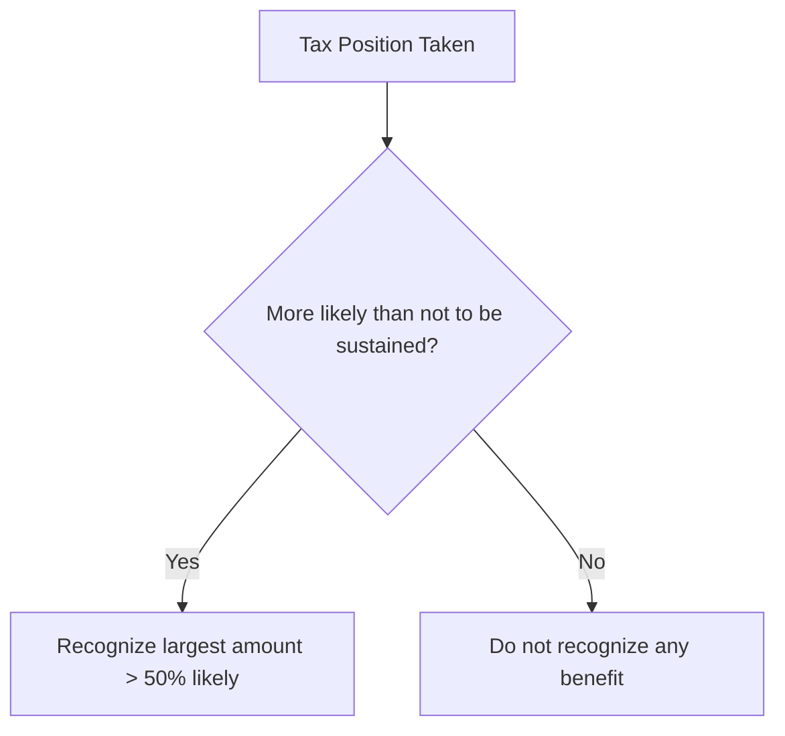

# Accounting for Income Taxes

## GAAP vs. Tax Differences

Financial accounting (GAAP) and tax accounting (IRC) have different rules for recognizing revenues and expenses. These differences create variations between **book income** (pretax financial income) and **taxable income**.

$$
\text{Taxable Income} = \text{Pretax Financial Income} \pm \text{Permanent Differences} \pm \text{Temporary Differences}
$$

---

## Permanent vs. Temporary Differences

### Permanent Differences

Permanent differences **never reverse**. They affect either book income or taxable income, but not both. They do not create deferred taxes.
| Example | Effect |
|---|---|
| Municipal bond interest | Book income ↑, not taxable |
| Life insurance premiums (company-owned) | Book expense ↑, not deductible |
| Fines and penalties | Book expense ↑, not deductible |
| Life insurance proceeds (company-owned) | Book income ↑, not taxable |

### Temporary Differences

Temporary differences **will reverse** in future periods, creating deferred tax assets or liabilities.
| Example | Book vs. Tax | Creates |
|---|---|---|
| Depreciation (SL vs. MACRS) | Book expense < Tax deduction now | **DTL** |
| Estimated warranty liability | Book expense now > Tax deduction later | **DTA** |
| Bad debt expense (allowance method) | Book expense now > Tax deduction later | **DTA** |
| Prepaid rent (received in advance) | Book income later < Taxable now | **DTA** |
| Installment sales | Book income now > Taxable later | **DTL** |

:::info[Key Principle]

- **Future taxable amounts** → Deferred Tax Liability (DTL)
- **Future deductible amounts** → Deferred Tax Asset (DTA)
  :::

---

## Computing Tax Expense

Total income tax expense has two components:

$$
\text{Total Tax Expense} = \text{Current Tax Expense (CTE)} + \text{Deferred Tax Expense (DTE)}
$$

### Current Tax Expense

$$
\text{CTE} = \text{Taxable Income} \times \text{Enacted Tax Rate}
$$

### Deferred Tax Expense

$$
\text{DTE} = \Delta DTL - \Delta DTA
$$

Where $\Delta$ represents the change in the balance during the period.

## DTL and DTA Calculations

### Deferred Tax Liability Example

Bear Co. purchases equipment for \$100,000. Book depreciation is straight-line over 5 years (\$20,000/year). Tax depreciation uses MACRS with Year 1 deduction of \$33,000. The enacted tax rate is 21%.
| | Book | Tax | Difference |
|---|---|---|---|
| Year 1 depreciation | \$20,000 | \$33,000 | \$13,000 |
The \$13,000 excess tax deduction means Bear Co. will pay **more tax in the future** when the depreciation reverses.

$$
\text{DTL} = \$13{,}000 \times 21\% = \$2{,}730
$$

```journal
Dr. Income tax expense          2,730
    Cr. Deferred tax liability          2,730
```

### Deferred Tax Asset Example

Polar Co. records an estimated warranty liability of \$50,000. For tax purposes, warranty costs are deductible only when paid. The tax rate is 21%.

$$
\text{DTA} = \$50{,}000 \times 21\% = \$10{,}500
$$

```journal
Dr. Deferred tax asset         10,500
    Cr. Income tax expense             10,500
```

### Bad Debt Example

Grizzly Inc. uses the allowance method and records bad debt expense of \$30,000. For tax purposes, bad debts are deductible only when written off (direct write-off method). None were written off this year.

$$
\text{DTA} = \$30{,}000 \times 21\% = \$6{,}300
$$

```journal
Dr. Deferred tax asset          6,300
    Cr. Income tax expense              6,300
```

---

## Comprehensive Example

Panda Industries has pretax financial income of \$500,000. The following differences exist:
| Item | Amount | Type |
|---|---|---|
| Municipal bond interest | \$20,000 | Permanent |
| Excess tax depreciation | \$40,000 | Temporary (DTL) |
| Warranty accrual (not yet paid) | \$15,000 | Temporary (DTA) |
**Step 1 — Taxable income:**

$$
\$500{,}000 - \$20{,}000 - \$40{,}000 + \$15{,}000 = \$455{,}000
$$

**Step 2 — Current tax expense:**

$$
\$455{,}000 \times 21\% = \$95{,}550
$$

**Step 3 — Deferred taxes:**

$$
\text{DTL increase} = \$40{,}000 \times 21\% = \$8{,}400
$$

$$
\text{DTA increase} = \$15{,}000 \times 21\% = \$3{,}150
$$

**Step 4 — Total tax expense:**

$$
\$95{,}550 + \$8{,}400 - \$3{,}150 = \$100{,}800
$$

Verification: (\$500,000 − \$20,000) × 21% = \$100,800 ✓

```journal
Dr. Income tax expense        100,800
    Cr. Income tax payable             95,550
    Cr. Deferred tax liability          8,400
    Dr. Deferred tax asset              3,150
```

Corrected entry:

```journal
Dr. Income tax expense        100,800
Dr. Deferred tax asset          3,150
    Cr. Income tax payable             95,550
    Cr. Deferred tax liability          8,400
```

---

## Valuation Allowance

A **valuation allowance** reduces the DTA to the amount that is **more likely than not** (greater than 50% probability) to be realized.

:::warning

If it is more likely than not that **some or all** of the DTA will not be realized, a valuation allowance must be established.

:::

Factors suggesting a valuation allowance is needed:

- History of operating losses
- Losses expected in the near future
- Expiring carryforwards
- Lack of future taxable income sources
  Kodiak Partners has a DTA of \$60,000 but determines that only \$40,000 is more likely than not to be realized:

```journal
Dr. Income tax expense         20,000
    Cr. Valuation allowance            20,000
```

The DTA is presented net: \$60,000 − \$20,000 = \$40,000.

## Enacted Tax Rate Changes

Deferred tax balances are adjusted when **enacted** tax rates change. The adjustment is recognized in income from continuing operations in the **period of enactment**.

$$
\text{Adjustment} = \text{Temporary Difference Balance} \times (\text{New Rate} - \text{Old Rate})
$$

Bear Co. has a cumulative temporary difference of \$200,000 creating a DTL. The rate changes from 35% to 21%:

$$
\text{Old DTL} = \$200{,}000 \times 35\% = \$70{,}000
$$

$$
\text{New DTL} = \$200{,}000 \times 21\% = \$42{,}000
$$

$$
\text{Reduction} = \$70{,}000 - \$42{,}000 = \$28{,}000
$$

```journal
Dr. Deferred tax liability     28,000
    Cr. Income tax expense             28,000
```

---

## Net Operating Losses (NOL)

### NOL Rules by Period

| Period of Loss          | Carryback        | Carryforward                                |
| ----------------------- | ---------------- | ------------------------------------------- |
| Tax years before 2018   | 2 years back     | 20 years forward                            |
| 2018 – 2020 (CARES Act) | 5 years back     | Indefinite, 80% limit                       |
| 2021 and later          | **No carryback** | Indefinite, **80% of taxable income** limit |

:::tip[Exam Tip]

For losses arising in 2021 and later, the NOL carryforward can offset only **80%** of taxable income in any given year. The remaining 20% is taxable.

:::

**Example:** Sloth Security has a 2024 NOL of \$100,000 and taxable income of \$150,000 in 2025:

$$
\text{Usable NOL} = \$150{,}000 \times 80\% = \$120{,}000 \text{ (but only \$100,000 available)}
$$

$$
\text{Taxable income after NOL} = \$150{,}000 - \$100{,}000 = \$50{,}000
$$

When the NOL is generated, a DTA is recognized:

```journal
Dr. Deferred tax asset         21,000
    Cr. Income tax benefit             21,000
```

When utilized:

```journal
Dr. Income tax expense         21,000
    Cr. Deferred tax asset             21,000
```

---

## Uncertain Tax Positions

Under ASC 740-10, a tax position is recognized only if it is **more likely than not** (>50%) to be sustained upon examination. The amount recognized is the **largest amount** that is greater than 50% likely to be realized upon settlement.



---

## Balance Sheet Presentation

Under current GAAP (ASU 2015-17), **all** deferred tax assets and liabilities are classified as **noncurrent** on the balance sheet. DTAs and DTLs of the same tax jurisdiction are netted.
| Component | Classification |
|---|---|
| Income tax payable | Current liability |
| Deferred tax asset | Noncurrent asset |
| Deferred tax liability | Noncurrent liability |

---

## Investee Undistributed Earnings

When an investor uses the equity method, the investor's share of investee earnings creates book income, but dividends create taxable income. The undistributed earnings create a temporary difference and a DTL.

$$
\text{DTL} = \text{Undistributed Earnings} \times \text{Tax Rate}
$$

:::note

An exception exists if the investor can demonstrate the undistributed earnings will be reinvested indefinitely (the "indefinite reversal" criterion).

:::

---

## Summary

:::note[Chapter Checklist]

- [ ] Distinguish permanent from temporary differences
- [ ] Calculate current tax expense from taxable income
- [ ] Determine DTL and DTA from temporary differences
- [ ] Apply the more-likely-than-not test for the valuation allowance
- [ ] Adjust deferred taxes for enacted rate changes
- [ ] Apply NOL carryback/carryforward rules by time period
- [ ] Evaluate uncertain tax positions using the two-step approach
- [ ] Present all deferred taxes as noncurrent
      :::
